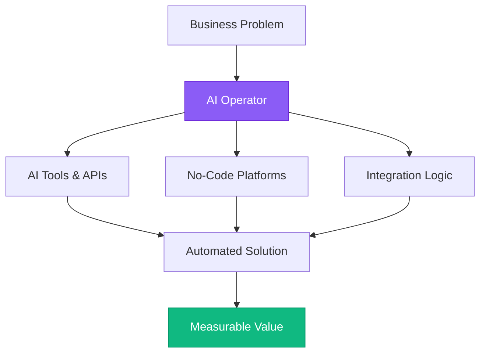
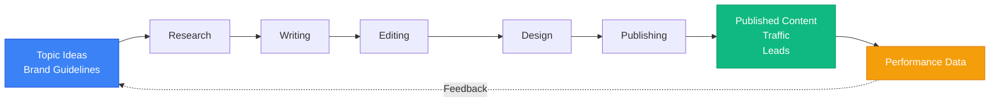
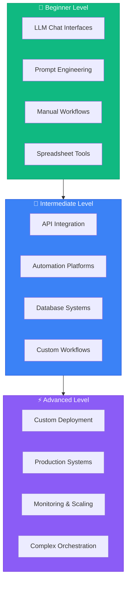

# Foundations of a Modern AI Operator

## Introduction

Welcome to your journey into becoming an AI Operator! This isn't about becoming a data scientist or machine learning engineer—it's about understanding how to leverage AI systems to solve real business problems, automate workflows, and create value at scale.

An AI Operator is someone who:
- Understands how AI systems work at a practical level
- Can identify opportunities for AI automation
- Builds and manages AI-powered workflows
- Bridges the gap between technical and business teams
- Creates measurable value using existing AI tools and platforms

This module establishes the foundational mindset and knowledge you'll build upon throughout this roadmap.

## What is an AI Operator?

### The Role Defined

An AI Operator is distinct from traditional tech roles. You're not writing neural networks from scratch—you're orchestrating existing AI capabilities to solve problems.



**Key Responsibilities:**
- **Systems Thinking**: Understanding how different tools and processes connect
- **Workflow Automation**: Building automated systems that leverage AI
- **Tool Integration**: Connecting AI APIs, no-code platforms, and traditional software
- **Value Creation**: Focusing on business outcomes, not just technical implementation
- **Rapid Iteration**: Testing, learning, and improving quickly

### Why This Role Matters Now

The AI landscape has fundamentally shifted. With GPT-4, Claude, Midjourney, and thousands of specialized AI tools, the bottleneck isn't access to AI—it's knowing how to use it effectively.

Companies need people who can:
- Identify high-impact use cases for AI
- Implement solutions without a 6-month engineering project
- Maintain and improve AI systems over time
- Train others on AI-powered workflows

This creates massive opportunity for AI Operators who can deliver results quickly.

## Systems Thinking Fundamentals

### Understanding Complex Systems

Systems thinking is the foundation of effective AI operation. Every business process is a system of interconnected parts.

**Key Principles:**
1. **Inputs → Process → Outputs**: Map what goes in, what happens, and what comes out
2. **Feedback Loops**: Understand how outputs affect future inputs
3. **Bottlenecks**: Identify where systems slow down or break
4. **Leverage Points**: Find where small changes create big impact

**Example: Content Marketing System**



An AI Operator looks at this and asks: "Which steps can AI automate or enhance?"

**AI Enhancement Opportunities:**
- 🤖 **Research**: Use AI for rapid topic research and data gathering
- 🤖 **Writing**: Generate first drafts with LLMs
- 🤖 **Editing**: Use AI for style improvements and consistency
- 🤖 **Design**: Generate images with AI image tools
- 🤖 **Publishing**: Automate with workflow tools (covered in later modules)

### Identifying Automation Opportunities

Not every process should be automated. Look for:

**High-Value Automation Candidates:**
- Repetitive tasks performed frequently
- Clear inputs and desired outputs
- Tasks that don't require human judgment on every instance
- Processes with measurable success criteria

**Low-Value Automation:**
- Rare, one-off tasks
- Highly creative work requiring human intuition
- Tasks with unclear success criteria
- Processes requiring deep context that changes constantly

### Mapping Process Flows

Before automating anything, map the current process:

1. **Document each step** (even if obvious)
2. **Identify decision points** (where human judgment is used)
3. **Note data sources** (where information comes from)
4. **Measure time/cost** (what's the current baseline?)
5. **List pain points** (where do things go wrong?)

This map becomes your blueprint for AI enhancement.

## How AI Actually Works (Practical View)

### Large Language Models (LLMs)

You don't need to understand transformers and neural networks to use LLMs effectively. You need to understand what they *do*.

**What LLMs Are Good At:**
- Generating human-like text from prompts
- Extracting information from unstructured text
- Summarizing long documents
- Translating between languages and formats
- Following complex instructions
- Reasoning about provided information

**What LLMs Struggle With:**
- Perfect accuracy (they can hallucinate)
- Real-time information (without external tools)
- Mathematical precision (though improving)
- Consistency across long contexts
- Understanding what they don't know

**Practical Implication:** Design systems that leverage strengths and mitigate weaknesses.

### Image & Video AI

**Key Capabilities:**
- **Generation**: Creating images from text (DALL-E, Midjourney, Stable Diffusion)
- **Editing**: Modifying existing images (inpainting, outpainting, style transfer)
- **Analysis**: Understanding image content (object detection, OCR, face recognition)
- **Video**: Generating and editing video content (increasingly powerful)

**Current Limitations:**
- Consistency (same character across images is hard)
- Specific details (text, hands, complex scenes)
- Physics and spatial relationships
- Long-form video coherence

### Voice & Audio AI

**Capabilities:**
- Speech-to-text (Whisper, Deepgram)
- Text-to-speech (ElevenLabs, PlayHT, OpenAI TTS)
- Voice cloning and generation
- Music generation (Suno, Udio)
- Audio enhancement and editing

**Use Cases:**
- Transcription and note-taking
- Voiceover generation
- Podcast editing
- Accessibility features

### Specialized AI Models

Beyond the big models, thousands of specialized AI tools exist for:
- Code generation (GitHub Copilot, Cursor, Replit)
- Data analysis (Julius, ChatGPT Advanced Data Analysis)
- Design (Canva AI, Figma AI plugins)
- Video editing (Runway, Descript)
- Marketing (Jasper, Copy.ai, AdCreative.ai)

An AI Operator knows what tools exist and when to use them.

## The AI Operator Toolchain

### Essential Categories

An AI Operator works with several categories of tools. We'll introduce specific tools gradually throughout the roadmap, but here are the key categories:

1. **LLM Platforms**: ChatGPT, Claude, and similar conversational AI tools
2. **Automation Platforms**: Tools for connecting services and automating workflows
3. **Data Management**: Databases, spreadsheets, and storage solutions
4. **Development Tools**: Platforms for building and deploying applications
5. **APIs**: Programmatic access to AI models and services
6. **Media AI**: Voice, image, and video generation tools
7. **Monitoring**: Systems for tracking performance and errors

**Note**: You'll learn about specific tools as they become relevant to your projects. We'll introduce each tool with proper context and setup instructions.

### Your Learning Path

As an AI Operator, you'll progress through skill levels. Here's what that journey looks like:



**Beginner Level (Start Here):**
- Using AI chat interfaces effectively
- Writing clear, effective prompts
- Understanding AI capabilities and limitations
- Building simple, manual workflows

**Intermediate Level:**
- Connecting AI tools via APIs
- Building automated workflows
- Managing data across systems
- Creating repeatable processes

**Advanced Level:**
- Deploying production AI systems
- Monitoring and optimizing performance
- Handling scale and complexity
- Building sophisticated multi-step automations

This roadmap will guide you through all three levels systematically.

## Ethical Foundations

### Responsible AI Use

As an AI Operator, you have responsibility for how AI is used:

**Key Principles:**
1. **Transparency**: Be clear when AI is involved
2. **Accuracy**: Verify AI outputs before using them
3. **Privacy**: Protect sensitive data
4. **Bias**: Be aware of and mitigate AI biases
5. **Human Oversight**: Keep humans in critical decision loops

**Red Flags to Avoid:**
- Using AI to generate misinformation
- Automating decisions that significantly impact people without oversight
- Deploying AI systems without testing for bias
- Ignoring privacy and data protection
- Over-relying on AI for critical judgments

### Data Privacy Basics

When working with AI:
- Never input confidential or sensitive data into public AI tools
- Understand data retention policies (OpenAI, Anthropic, etc.)
- Use enterprise/API versions for business data
- Implement data anonymization where possible
- Follow GDPR, CCPA, and relevant regulations

## Building Your First AI Workflow (Hands-On)

### Project: Research & Summary Workflow

Let's build your first AI-assisted workflow to practice systems thinking and process documentation.

**Goal**: Create a repeatable process for researching topics and generating summaries.

**Components:**
1. **Input**: Topic or question
2. **Process**: Research → Analysis → Synthesis
3. **Output**: Structured summary with sources

**Step 1: Manual Process First**
Always start by doing it manually to understand the workflow:

1. Choose a topic (e.g., "latest trends in renewable energy")
2. Research using ChatGPT or Claude with research prompts
3. Synthesize findings into key insights
4. Format output in a standard template
5. Save to a document

**Step 2: Document Everything**
Write down your process in detail:
- What prompts you used (exact wording)
- What information you extracted
- How you structured the output
- What decisions you made (and why)
- How long each step took

**Step 3: Create Reusable Templates**
Build templates for:
- **Research Prompt Template**: "Research the following topic: [TOPIC]. Focus on [CRITERIA]. Provide [NUMBER] key insights with sources."
- **Synthesis Prompt Template**: "Based on the following research, create a summary that includes..."
- **Output Format Template**: Standard structure for your summaries

**Step 4: Test & Refine**
Run the process 3-5 times with different topics:
- Track what works consistently
- Note where manual judgment is needed
- Identify bottlenecks or pain points
- Refine your templates based on results

**What You're Learning:**
- **Systems thinking**: Breaking work into repeatable steps
- **Process documentation**: Creating clear procedures
- **Quality control**: Ensuring consistent outputs
- **Prompt engineering**: Writing effective AI instructions

**Portfolio Note**: Document this process in detail—it's the foundation of your AI Operator portfolio. You'll later automate parts of this workflow using tools introduced in future modules.

## Measuring Success as an AI Operator

### Key Metrics

**Time Saved**: Track hours saved through automation
**Cost Reduction**: Calculate reduced labor costs
**Quality Improvement**: Measure output quality metrics
**Scalability**: Track how much volume you can handle
**Error Reduction**: Monitor accuracy improvements

**Example Calculation:**
```
Manual Process:
- 10 research summaries per week
- 2 hours each = 20 hours/week
- At $50/hour = $1,000/week

AI-Assisted Process:
- 30 research summaries per week
- 30 minutes each = 15 hours/week
- At $50/hour = $750/week
- Plus $100/month AI costs

Result:
- 3x output increase
- 25% cost reduction
- Higher consistency
```

### Value Communication

Learn to articulate value in business terms:
- "This automation saves 15 hours per week"
- "We can now handle 3x the volume with the same team"
- "Error rate decreased from 8% to 2%"
- "This generates $5,000/month in additional revenue"

Quantify everything you can.

## Building Your Portfolio From Day One

### Why Start Now?

Your AI Operator portfolio isn't just about finished projects—it's about demonstrating your thinking process, problem-solving ability, and systematic approach.

**Start documenting from Module 1:**
- **Processes you map**: Screenshots or diagrams of systems you analyze
- **Workflows you build**: Document your research workflow from this module
- **Results you achieve**: Track time saved, quality improvements, metrics
- **Prompts that work**: Save your best prompt templates
- **Lessons learned**: What worked, what didn't, and why

**Portfolio Checkpoint #1: Foundation Project**

After completing this module, you should have:
1. **One documented workflow** (your research & summary process)
2. **3-5 prompt templates** that you've tested and refined
3. **A process map** of at least one business system
4. **Metrics baseline** showing current vs. AI-assisted performance

**How to Document:**
- Create a simple Google Doc or Notion page
- Use clear before/after comparisons
- Include specific prompts and screenshots
- Show measurable results (time saved, output quality, etc.)

**What Makes a Strong Portfolio Piece:**
- Shows clear problem → solution → results
- Demonstrates systems thinking
- Includes specific, reusable artifacts (prompts, templates, workflows)
- Proves value with metrics

You'll add to this portfolio throughout the roadmap. By Module 15, you'll have 10-15 projects showcasing your progression from beginner to professional AI Operator.

## Completion Checklist

- [ ] Understand the role and responsibilities of an AI Operator
- [ ] Grasp systems thinking fundamentals
- [ ] Map a business process end-to-end
- [ ] Understand what LLMs are good at (and not good at)
- [ ] Know the ethical principles of responsible AI use
- [ ] Build your first AI-assisted workflow (Research & Summary)
- [ ] Create and test 3-5 prompt templates
- [ ] Calculate time saved by an AI process
- [ ] Set up accounts on ChatGPT and Claude
- [ ] **Start your portfolio with Foundation Project documentation**

## Next Steps

In Module 2 (Operator Mindset), you'll develop the mental frameworks and strategic thinking patterns that separate great AI Operators from good ones. You'll learn systems thinking, decision frameworks, and how to stay current without burning out.

**Prepare By:**
- Thinking about processes in your work that could be improved
- Identifying where you spend most of your time
- Considering what "high-leverage" work means to you
- Reflecting on how you currently make decisions

---

**Time to Complete**: 2-3 days
**Prerequisites**: None—this is the starting point!
**Next Module**: [02 - Operator Mindset](./14-operator-mindset)
