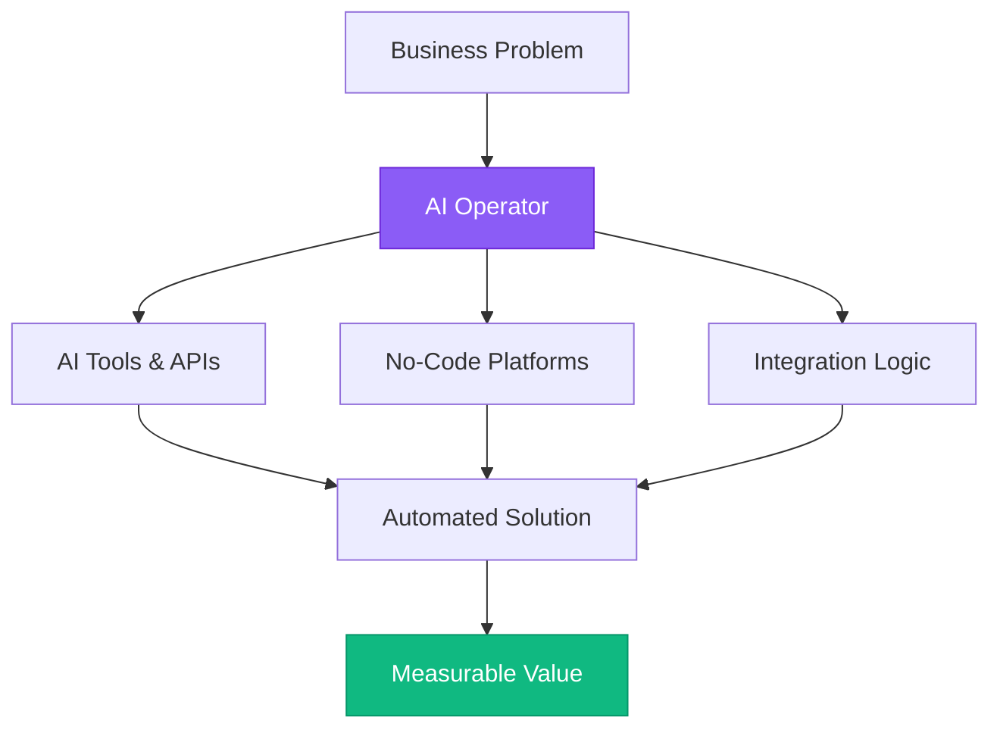
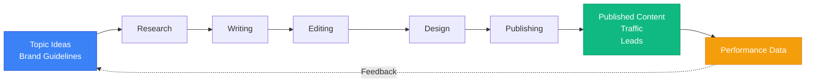
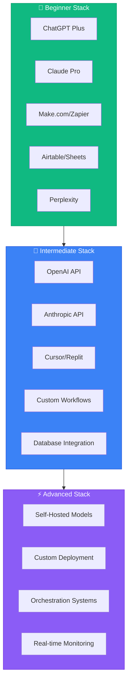

# Foundations of a Modern AI Operator

## Introduction

Welcome to your journey into becoming an AI Operator! This isn't about becoming a data scientist or machine learning engineer—it's about understanding how to leverage AI systems to solve real business problems, automate workflows, and create value at scale.

An AI Operator is someone who:
- Understands how AI systems work at a practical level
- Can identify opportunities for AI automation
- Builds and manages AI-powered workflows
- Bridges the gap between technical and business teams
- Creates measurable value using existing AI tools and platforms

This module establishes the foundational mindset and knowledge you'll build upon throughout this roadmap.

## What is an AI Operator?

### The Role Defined

An AI Operator is distinct from traditional tech roles. You're not writing neural networks from scratch—you're orchestrating existing AI capabilities to solve problems.



**Key Responsibilities:**
- **Systems Thinking**: Understanding how different tools and processes connect
- **Workflow Automation**: Building automated systems that leverage AI
- **Tool Integration**: Connecting AI APIs, no-code platforms, and traditional software
- **Value Creation**: Focusing on business outcomes, not just technical implementation
- **Rapid Iteration**: Testing, learning, and improving quickly

### Why This Role Matters Now

The AI landscape has fundamentally shifted. With GPT-4, Claude, Midjourney, and thousands of specialized AI tools, the bottleneck isn't access to AI—it's knowing how to use it effectively.

Companies need people who can:
- Identify high-impact use cases for AI
- Implement solutions without a 6-month engineering project
- Maintain and improve AI systems over time
- Train others on AI-powered workflows

This creates massive opportunity for AI Operators who can deliver results quickly.

## Systems Thinking Fundamentals

### Understanding Complex Systems

Systems thinking is the foundation of effective AI operation. Every business process is a system of interconnected parts.

**Key Principles:**
1. **Inputs → Process → Outputs**: Map what goes in, what happens, and what comes out
2. **Feedback Loops**: Understand how outputs affect future inputs
3. **Bottlenecks**: Identify where systems slow down or break
4. **Leverage Points**: Find where small changes create big impact

**Example: Content Marketing System**



An AI Operator looks at this and asks: "Which steps can AI automate or enhance?"

**AI Enhancement Opportunities:**
- 🤖 **Research**: Use Perplexity or GPT-4 for topic research
- 🤖 **Writing**: Generate first drafts with Claude
- 🤖 **Editing**: Use Grammarly + GPT-4 for style improvements
- 🤖 **Design**: Generate images with Midjourney/DALL-E
- 🤖 **Publishing**: Automate with Make.com or Zapier

### Identifying Automation Opportunities

Not every process should be automated. Look for:

**High-Value Automation Candidates:**
- Repetitive tasks performed frequently
- Clear inputs and desired outputs
- Tasks that don't require human judgment on every instance
- Processes with measurable success criteria

**Low-Value Automation:**
- Rare, one-off tasks
- Highly creative work requiring human intuition
- Tasks with unclear success criteria
- Processes requiring deep context that changes constantly

### Mapping Process Flows

Before automating anything, map the current process:

1. **Document each step** (even if obvious)
2. **Identify decision points** (where human judgment is used)
3. **Note data sources** (where information comes from)
4. **Measure time/cost** (what's the current baseline?)
5. **List pain points** (where do things go wrong?)

This map becomes your blueprint for AI enhancement.

## How AI Actually Works (Practical View)

### Large Language Models (LLMs)

You don't need to understand transformers and neural networks to use LLMs effectively. You need to understand what they *do*.

**What LLMs Are Good At:**
- Generating human-like text from prompts
- Extracting information from unstructured text
- Summarizing long documents
- Translating between languages and formats
- Following complex instructions
- Reasoning about provided information

**What LLMs Struggle With:**
- Perfect accuracy (they can hallucinate)
- Real-time information (without external tools)
- Mathematical precision (though improving)
- Consistency across long contexts
- Understanding what they don't know

**Practical Implication:** Design systems that leverage strengths and mitigate weaknesses.

### Image & Video AI

**Key Capabilities:**
- **Generation**: Creating images from text (DALL-E, Midjourney, Stable Diffusion)
- **Editing**: Modifying existing images (inpainting, outpainting, style transfer)
- **Analysis**: Understanding image content (object detection, OCR, face recognition)
- **Video**: Generating and editing video content (increasingly powerful)

**Current Limitations:**
- Consistency (same character across images is hard)
- Specific details (text, hands, complex scenes)
- Physics and spatial relationships
- Long-form video coherence

### Voice & Audio AI

**Capabilities:**
- Speech-to-text (Whisper, Deepgram)
- Text-to-speech (ElevenLabs, PlayHT, OpenAI TTS)
- Voice cloning and generation
- Music generation (Suno, Udio)
- Audio enhancement and editing

**Use Cases:**
- Transcription and note-taking
- Voiceover generation
- Podcast editing
- Accessibility features

### Specialized AI Models

Beyond the big models, thousands of specialized AI tools exist for:
- Code generation (GitHub Copilot, Cursor, Replit)
- Data analysis (Julius, ChatGPT Advanced Data Analysis)
- Design (Canva AI, Figma AI plugins)
- Video editing (Runway, Descript)
- Marketing (Jasper, Copy.ai, AdCreative.ai)

An AI Operator knows what tools exist and when to use them.

## The AI Operator Toolchain

### Essential Categories

1. **LLM Platforms**: ChatGPT, Claude, Gemini, Perplexity
2. **Automation Platforms**: Make.com, Zapier, n8n
3. **Data Management**: Airtable, Google Sheets, Notion
4. **Code/Development**: Replit, Cursor, GitHub
5. **APIs**: OpenAI API, Anthropic API, Perplexity API
6. **Voice/Image**: ElevenLabs, Midjourney, Runway
7. **Monitoring**: Custom dashboards, logging systems

### The Practical Stack



**For Beginners (Start Here):**
- ChatGPT Plus (with GPT-4)
- Claude Pro
- Make.com or Zapier (free tier)
- Airtable or Google Sheets
- Perplexity (research)

**Intermediate:**
- API access (OpenAI, Anthropic)
- Replit or Cursor
- Custom automation workflows
- Database integration

**Advanced:**
- Self-hosted solutions
- Custom AI model deployment
- Complex orchestration systems
- Real-time monitoring and optimization

You'll progress through these tiers as you build skills.

## Ethical Foundations

### Responsible AI Use

As an AI Operator, you have responsibility for how AI is used:

**Key Principles:**
1. **Transparency**: Be clear when AI is involved
2. **Accuracy**: Verify AI outputs before using them
3. **Privacy**: Protect sensitive data
4. **Bias**: Be aware of and mitigate AI biases
5. **Human Oversight**: Keep humans in critical decision loops

**Red Flags to Avoid:**
- Using AI to generate misinformation
- Automating decisions that significantly impact people without oversight
- Deploying AI systems without testing for bias
- Ignoring privacy and data protection
- Over-relying on AI for critical judgments

### Data Privacy Basics

When working with AI:
- Never input confidential or sensitive data into public AI tools
- Understand data retention policies (OpenAI, Anthropic, etc.)
- Use enterprise/API versions for business data
- Implement data anonymization where possible
- Follow GDPR, CCPA, and relevant regulations

## Building Your First AI System (Hands-On)

### Project: Automated Research Assistant

Let's build a simple but functional AI system to practice systems thinking.

**Goal**: Create a system that researches topics and generates summaries.

**Components:**
1. **Input**: Topic or question
2. **Process**: Research → Analysis → Synthesis
3. **Output**: Structured summary with sources

**Step 1: Manual Process**
First, do this manually to understand the workflow:
1. Receive a topic (e.g., "latest trends in renewable energy")
2. Use Perplexity to research
3. Use ChatGPT to synthesize findings
4. Format output in a standard template
5. Save to a document

**Step 2: Document the Workflow**
Write down exactly what you did:
- What prompts you used
- What information you extracted
- How you structured the output
- What decisions you made

**Step 3: Standardize**
Create templates for:
- Research prompts
- Synthesis prompts
- Output format

**Step 4: Semi-Automate**
Use a tool like Make.com to:
- Accept topic input (form or email)
- Call Perplexity API (or use ChatGPT)
- Call Claude API for synthesis
- Save output to Google Sheets or Airtable

This simple project teaches:
- Process mapping
- Prompt engineering basics
- Tool integration
- Quality control

## Measuring Success as an AI Operator

### Key Metrics

**Time Saved**: Track hours saved through automation
**Cost Reduction**: Calculate reduced labor costs
**Quality Improvement**: Measure output quality metrics
**Scalability**: Track how much volume you can handle
**Error Reduction**: Monitor accuracy improvements

**Example Calculation:**
```
Manual Process:
- 10 research summaries per week
- 2 hours each = 20 hours/week
- At $50/hour = $1,000/week

AI-Assisted Process:
- 30 research summaries per week
- 30 minutes each = 15 hours/week
- At $50/hour = $750/week
- Plus $100/month AI costs

Result:
- 3x output increase
- 25% cost reduction
- Higher consistency
```

### Value Communication

Learn to articulate value in business terms:
- "This automation saves 15 hours per week"
- "We can now handle 3x the volume with the same team"
- "Error rate decreased from 8% to 2%"
- "This generates $5,000/month in additional revenue"

Quantify everything you can.

## Completion Checklist

- [ ] Understand the role and responsibilities of an AI Operator
- [ ] Grasp systems thinking fundamentals
- [ ] Map a business process end-to-end
- [ ] Understand what LLMs are good at (and not good at)
- [ ] Identify at least 5 AI tools you could use
- [ ] Know the ethical principles of responsible AI use
- [ ] Build your first simple AI-assisted workflow
- [ ] Calculate time saved by an AI automation
- [ ] Set up accounts on ChatGPT and Claude
- [ ] Complete the Automated Research Assistant project

## Next Steps

In Module 2, you'll dive deep into understanding LLMs—how to prompt them effectively, when to use different models, and how to get consistent, high-quality outputs.

**Prepare By:**
- Testing ChatGPT and Claude with various prompts
- Observing where they excel and struggle
- Collecting examples of tasks you want to automate
- Identifying processes in your work that could benefit from AI

---

**Time to Complete**: 2-3 days
**Prerequisites**: None—this is the starting point!
**Next Module**: [02 - Understanding LLMs](./02-understanding-llms)
