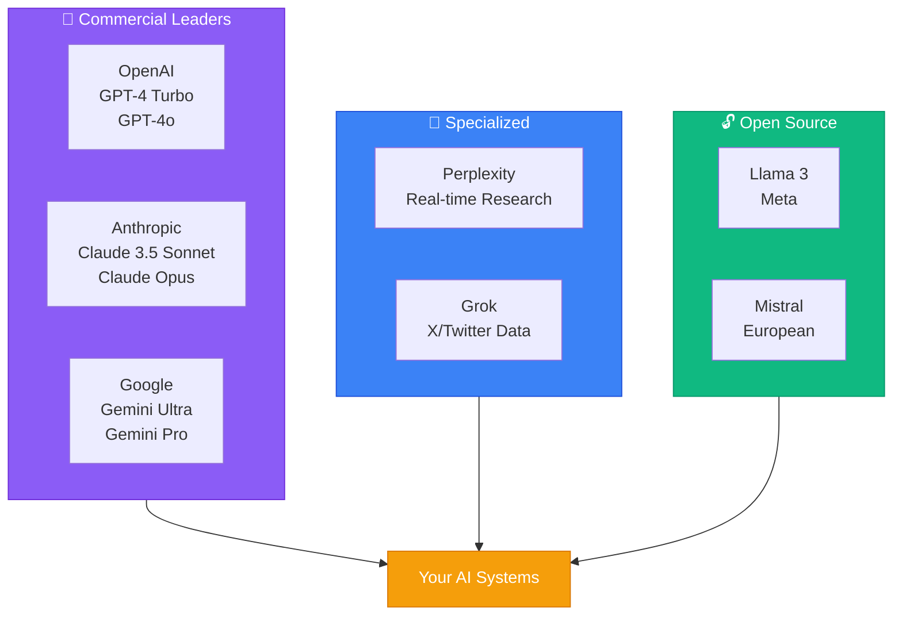
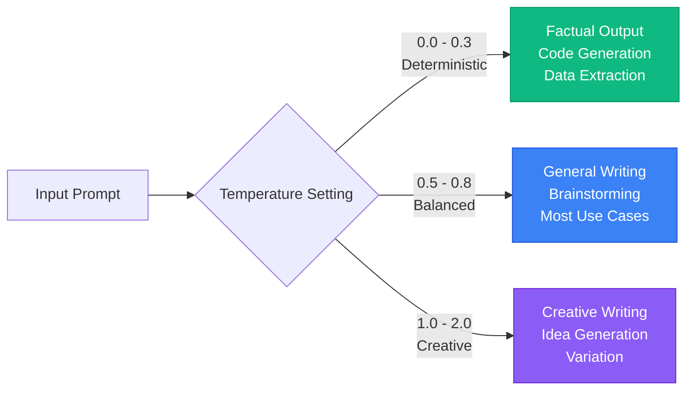
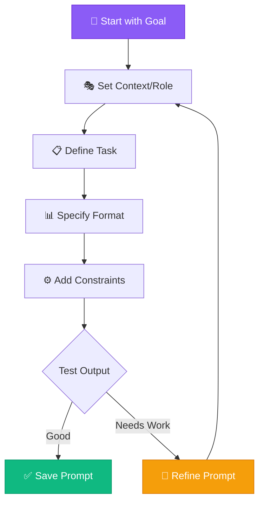

# Understanding LLMs

## Introduction

Large Language Models (LLMs) are the foundation of modern AI operations. Understanding how they work, their strengths and limitations, and how to interact with them effectively is critical to your success as an AI Operator.

This module teaches you practical LLM knowledge—not deep learning theory, but the operational understanding you need to build reliable AI systems.

## The LLM Landscape



### Major LLM Providers

**OpenAI (GPT Series)**
- **GPT-4 Turbo**: Most capable, best reasoning, higher cost
- **GPT-4o**: Faster, multimodal, good balance
- **GPT-3.5 Turbo**: Fast, cheap, good for simple tasks
- **Use Cases**: Complex reasoning, coding, analysis, general-purpose tasks

**Anthropic (Claude Series)**
- **Claude 3.5 Sonnet**: Best for long documents, excellent reasoning
- **Claude 3 Opus**: Most capable for complex tasks
- **Claude 3 Haiku**: Fast and efficient for simple tasks
- **Strengths**: Document analysis, thoughtful responses, safety

**Google (Gemini Series)**
- **Gemini Ultra**: Most capable Google model
- **Gemini Pro**: General-purpose, fast
- **Gemini Nano**: On-device, lightweight
- **Strengths**: Integration with Google services, multimodal

**Other Important Models:**
- **Perplexity**: Best for real-time research
- **Grok** (X/Twitter): Real-time data access
- **Llama (Meta)**: Open-source, self-hostable
- **Mistral**: Open-source, European, strong performance

### Choosing the Right Model

Different models excel at different tasks:

**When to Use GPT-4:**
- Complex reasoning required
- Code generation
- Multi-step problem solving
- Tasks requiring creativity + accuracy

**When to Use Claude:**
- Long document analysis (100K+ tokens)
- Thoughtful, nuanced responses
- Safety-critical applications
- Constitutional AI alignment

**When to Use GPT-3.5:**
- Simple, repetitive tasks
- Cost optimization
- High-volume processing
- Real-time applications

**When to Use Perplexity:**
- Research requiring current information
- Fact-checking
- Source citations needed
- Quick lookups

## How LLMs Actually Work (Conceptual)

### The Prediction Engine

At its core, an LLM predicts the next token (word or word piece) based on all previous tokens.

**Example:**
```
Input: "The capital of France is"
Model predicts: "Paris" (highest probability)
```

This simple mechanism, scaled up with billions of parameters and trained on massive datasets, creates surprisingly capable systems.

**Key Insight**: LLMs don't "know" things—they predict likely continuations based on patterns in training data.

### Tokens and Context Windows

**Tokens**: The basic units LLMs work with
- Roughly 0.75 words per token in English
- "Hello world" ≈ 2 tokens
- Important for: Cost, context limits, performance

**Context Windows**: How much text an LLM can "see"
- GPT-4 Turbo: 128K tokens (~96K words)
- Claude 3: 200K tokens (~150K words)
- GPT-3.5: 16K tokens (~12K words)

**Practical Impact:**
- Larger contexts = analyze longer documents
- But: Cost increases with token count
- And: Performance can degrade at extreme lengths

### Temperature and Sampling

LLMs don't always pick the most likely next token—they use controlled randomness.



**Temperature (0.0 to 2.0):**
- **0.0**: Deterministic, always picks most likely token
- **0.7**: Balanced creativity and consistency
- **1.5+**: Highly creative, less predictable

**When to Adjust:**
- Low temp (0.0-0.3): Factual tasks, code, data extraction
- Medium temp (0.5-0.8): Writing, brainstorming, general use
- High temp (1.0+): Creative writing, idea generation

**Example:**
```
Prompt: "List 3 benefits of exercise"

Temperature 0.0:
1. Improved cardiovascular health
2. Weight management
3. Better mental health

Temperature 1.5:
1. Cellular rejuvenation and longevity
2. Social connections through group activities
3. Spiritual mindfulness through movement
```

### The Hallucination Problem

LLMs sometimes generate plausible-sounding but incorrect information.

**Why This Happens:**
- Model predicts what sounds right, not what is right
- No access to truth (just training patterns)
- Gaps in knowledge filled with plausible guesses

**Mitigation Strategies:**
1. **Verify facts** independently
2. **Use retrieval** (give the model correct info)
3. **Ask for sources** (works with Perplexity)
4. **Multiple models** (cross-check important facts)
5. **Lower temperature** (reduces creativity-based errors)

**Critical Rule**: Never use LLM outputs as final truth for important decisions without verification.

## Effective Prompting Fundamentals

### The Anatomy of a Good Prompt

**Basic Structure:**
```
[Context] + [Task] + [Format] + [Constraints]
```

**Example:**
```
Context: You are an expert content marketer analyzing blog performance.
Task: Analyze the following traffic data and identify trends.
Format: Provide a bullet-point summary followed by 3 actionable recommendations.
Constraints: Focus on data from the last 30 days only.
```



### Prompting Techniques

**1. Few-Shot Learning**
Give examples of what you want:
```
Extract the name and email from these examples:

Input: "Contact John at john@example.com"
Output: Name: John, Email: john@example.com

Input: "Reach out to Sarah (sarah.jones@company.org)"
Output: Name: Sarah, Email: sarah.jones@company.org

Now extract from: "Email Mike at mike.smith@business.net"
```

**2. Chain of Thought**
Ask the model to think step-by-step:
```
Problem: Calculate the total cost for 15 units at $12.50 each with a 20% discount.

Let's solve this step by step:
1. First, calculate base cost: 15 × $12.50
2. Then apply 20% discount
3. Show final amount
```

**3. Role Assignment**
Tell the model what perspective to take:
```
You are a senior software architect reviewing code.
Focus on: scalability, security, and maintainability.
```

**4. Structured Output**
Specify exact format:
```
Generate a product description with this structure:

Title: [catchy title]
Overview: [2-3 sentences]
Key Features:
- [feature 1]
- [feature 2]
- [feature 3]
Call-to-Action: [one sentence]
```

### Common Prompting Mistakes

**❌ Too Vague:**
```
"Write about AI"
```

**✅ Clear and Specific:**
```
"Write a 300-word blog introduction about how AI is transforming customer service.
Target audience: Small business owners.
Tone: Professional but accessible.
Include one specific example."
```

**❌ Conflicting Instructions:**
```
"Write a detailed but brief summary"
```

**✅ Clear Requirements:**
```
"Write a summary in exactly 3 bullet points, each 15-20 words"
```

**❌ Assuming Knowledge:**
```
"Analyze this data" [pastes data without context]
```

**✅ Providing Context:**
```
"This is sales data from our Q4 2023 campaign. Each row represents a day.
Analyze trends and identify the 3 best-performing days."
```

## Advanced Prompting Techniques

### System Prompts vs. User Prompts

**System Prompts**: Set behavior for entire conversation
```
System: You are a helpful assistant that always provides sources for factual claims
and admits when uncertain.
```

**User Prompts**: Specific requests
```
User: What are the benefits of meditation?
```

**API Usage:**
```json
{
  "model": "gpt-4",
  "messages": [
    {"role": "system", "content": "You are a data analyst..."},
    {"role": "user", "content": "Analyze this sales data..."}
  ]
}
```

### Prompt Chaining

Break complex tasks into steps:

**Single Prompt (Less Effective):**
```
"Research renewable energy trends, write a blog post, and create social media captions"
```

**Chained Prompts (More Effective):**
```
Step 1: "Research current renewable energy trends. List 10 key developments."
Step 2: [Use output] "Based on these trends, outline a blog post structure"
Step 3: [Use outline] "Write the introduction section following this outline"
Step 4: [Use blog] "Create 5 social media captions promoting this blog post"
```

### Retrieval-Augmented Generation (RAG)

Give the model specific information to work with:

**Without RAG (Risky):**
```
"What are our company's return policies?"
```

**With RAG (Reliable):**
```
Here is our return policy document:
[paste policy]

Based on this policy, answer: Can customers return opened software?
```

This eliminates hallucination for company-specific information.

## Prompt Engineering for Different Tasks

### Content Generation

**Blog Posts:**
```
Write a 500-word blog post:
Topic: [topic]
Audience: [specific audience]
Goal: [inform/persuade/entertain]
Tone: [professional/casual/technical]
Include:
- Hook in first paragraph
- 3 main points
- Clear conclusion with CTA
SEO keywords: [keywords]
```

**Social Media:**
```
Create 5 LinkedIn posts about [topic]
- Each 100-150 words
- Professional tone
- Include relevant hashtags
- End with engagement question
- Vary formats: tip list, story, question, statistic, how-to
```

### Data Analysis

```
Analyze this dataset:
[paste data]

Provide:
1. Summary statistics (mean, median, outliers)
2. Top 3 trends or patterns
3. Any anomalies or concerning data points
4. 2-3 actionable recommendations

Format as: Executive Summary + Detailed Findings
```

### Code Generation

```
Language: Python
Task: Create a function that validates email addresses
Requirements:
- Check basic format (user@domain.ext)
- Reject common invalid patterns
- Return True/False
- Include error handling
- Add docstring and type hints
```

### Research and Summarization

```
Summarize this article:
[paste article]

Provide:
- 2-sentence overview
- 5 key points (bullet list)
- Notable quotes (if any)
- Implications or takeaways

Audience: [specific role]
Focus on: [specific aspect]
```

## LLM Limitations and Workarounds

### Current Limitations

1. **No Real-Time Data** (without tools)
   - Workaround: Use Perplexity, or provide current data in prompt

2. **Mathematical Reasoning**
   - Workaround: Use code interpreter, external calculators, or low temperature

3. **Consistency Across Long Contexts**
   - Workaround: Break into chunks, use structured prompts, maintain key info

4. **Understanding Context Switches**
   - Workaround: Clear conversation boundaries, restate context when switching

5. **Following Complex Multi-Step Instructions**
   - Workaround: Use prompt chaining, break into subtasks

6. **Determinism** (needed for some tasks)
   - Workaround: Set temperature to 0, use structured outputs, validate outputs

### Safety and Bias

LLMs reflect biases in training data.

**Watch For:**
- Stereotypes in generated content
- Assumptions about users
- Cultural insensitivity
- Gender/race/age bias

**Mitigation:**
- Review outputs carefully
- Use diverse test cases
- Specify inclusive language in prompts
- Have multiple people review sensitive content

## Practical Exercises

### Exercise 1: Model Comparison

Pick a task (e.g., "Explain quantum computing to a 10-year-old").

Try the same prompt with:
- GPT-4
- Claude
- Gemini

**Compare:**
- Response style
- Accuracy
- Creativity
- Tone

**Document** which model works best for this type of task.

### Exercise 2: Temperature Testing

Use this prompt with temperatures 0, 0.5, 1.0, 1.5:

```
"Write a creative tagline for an eco-friendly water bottle"
```

**Observe:** How does creativity vs. consistency change?

### Exercise 3: Prompt Iteration

Start with a vague prompt:
```
"Write about coffee"
```

Iterate 5 times, making it more specific each time.

**Document:**
- Each version of the prompt
- The output quality improvement
- What made each iteration better

### Exercise 4: Error Analysis

Deliberately create a prompt that produces hallucinations:
```
"Tell me about the 2025 Olympics opening ceremony"
```

**Analyze:**
- How does the model handle future events?
- Does it admit uncertainty?
- Does it hallucinate details?

**Rewrite** to prevent hallucination:
```
"What would typically happen at an Olympics opening ceremony?
Note: I'm asking about general format, not a specific future event."
```

## Building Your LLM Toolkit

### Essential Tools

1. **ChatGPT** (OpenAI)
   - Web interface
   - API access
   - GPT-4 and GPT-3.5

2. **Claude** (Anthropic)
   - Web interface
   - API access
   - Long context strength

3. **Perplexity**
   - Research and citations
   - Real-time information

4. **Playground/IDE**
   - OpenAI Playground
   - Anthropic Console
   - Test prompts quickly

### Cost Management

**Token Usage Formula:**
```
Input tokens + Output tokens = Total
Total × Model price per token = Cost
```

**Optimization Strategies:**
- Use GPT-3.5 for simple tasks (10-30x cheaper than GPT-4)
- Reduce context by extracting only relevant info
- Cache system prompts (where possible)
- Batch similar requests
- Use streaming for long outputs (better UX, not cheaper)

**Example Cost Comparison:**
```
Task: Summarize 10 customer reviews (500 words each)

Option 1: One prompt with all reviews
- 5,000 input tokens + 500 output tokens
- GPT-4: ~$0.17 per run

Option 2: Summarize individually, then combine
- 10 × (500 input + 50 output) + final combination
- GPT-3.5: ~$0.01 total
- 17x cheaper, slightly different output style
```

## Completion Checklist

- [ ] Understand the differences between major LLM providers
- [ ] Know when to use GPT-4 vs GPT-3.5 vs Claude
- [ ] Explain how temperature affects outputs
- [ ] Write effective prompts with clear structure
- [ ] Apply few-shot learning in prompts
- [ ] Use chain-of-thought for complex reasoning
- [ ] Implement RAG to prevent hallucinations
- [ ] Compare outputs from 3 different models
- [ ] Document cost-per-task for different models
- [ ] Build a prompt library for common tasks

## Next Steps

Module 3 covers AI-Powered Content Creation & Media Systems—how to use AI for writing, images, video, and voice at scale.

**Prepare By:**
- Creating a personal prompt library (save your best prompts)
- Testing different models on your actual use cases
- Calculating costs for tasks you want to automate
- Identifying your most frequent LLM use cases

---

**Time to Complete**: 3-5 days
**Prerequisites**: Module 01 - Foundations
**Next Module**: [03 - AI-Powered Content Creation](./03-ai-content-creation)
