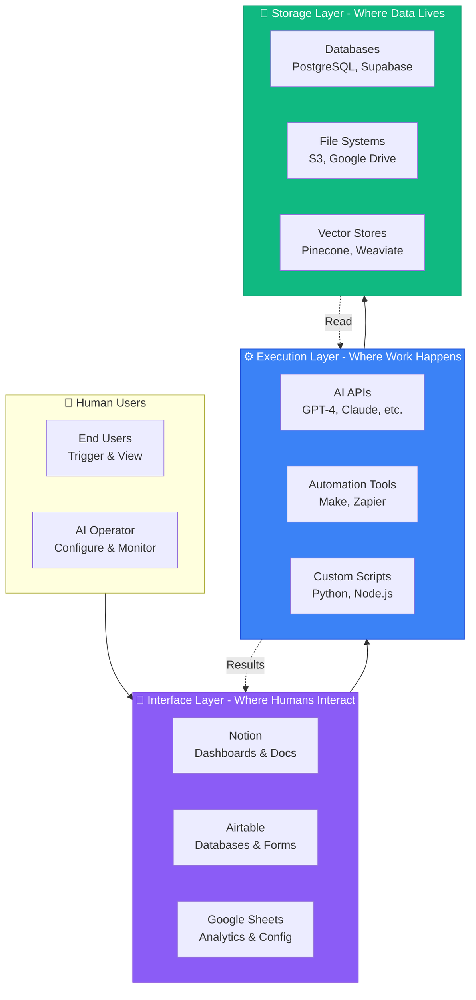
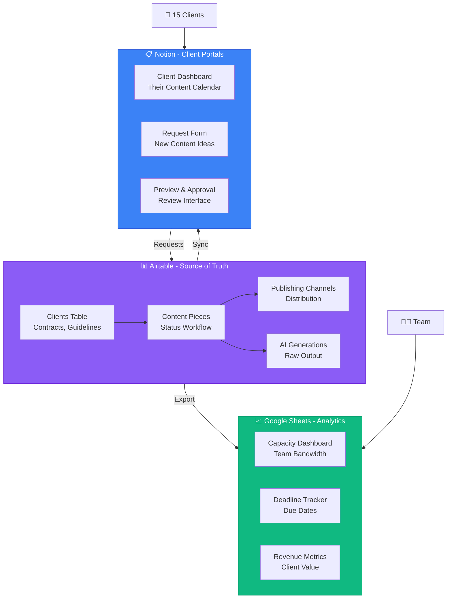
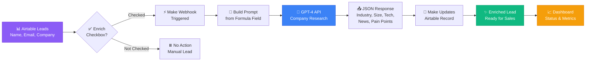

# 📘 MODULE 4: Core Interface Tools

**Estimated Time:** 4-6 days
**Difficulty:** Intermediate
**Prerequisites:** Modules 1-3 (Foundations, Understanding LLMs, AI Content Creation)

## 📖 Overview & Why This Matters

Here's the reality: The difference between someone who just "uses AI tools" and a professional AI Operator often comes down to how well they structure their data and interfaces. You can have the most powerful AI workflows in the world, but if your data is a mess and your teams can't easily access what they need, you're just creating expensive chaos.

This module is about building the command center for your AI operations. Notion, Airtable, and Google Sheets aren't just "productivity tools" - they're the interface layer that sits between your AI systems and your humans. They're where your content calendars live, where your customer data gets organized, where your automation triggers get configured, and where your team actually interacts with all the AI magic happening behind the scenes.

The AI Operators getting hired at $150K+ aren't just prompt engineers - they're the people who can build a complete content management system in Notion that connects to AI generation tools, or create an Airtable base that automatically enriches customer data using GPT-4, or design a Google Sheet that serves as a dashboard for tracking 15 different automation workflows. That's what you'll learn to build in this module.

## 🎯 Learning Objectives

By the end of this module, you will:

- [ ] Understand when to use Notion vs. Airtable vs. Google Sheets for different use cases
- [ ] Build relational databases in Airtable that serve as the foundation for AI workflows
- [ ] Create dynamic dashboards in Notion with databases, formulas, and integrations
- [ ] Use Google Sheets as an automation interface with custom functions and scripts
- [ ] Design user-friendly interfaces that non-technical team members can actually use
- [ ] Implement integration patterns that connect these tools to AI systems

## 🧠 Core Concepts

### The Interface Layer Philosophy



Think of your AI operations stack in three layers:

1. **The Execution Layer** (APIs, AI models, automations) - where the work happens
2. **The Interface Layer** (Notion, Airtable, Sheets) - where humans interact
3. **The Storage Layer** (databases, file systems) - where data lives

The tools in this module are your Interface Layer. They're not trying to be full databases or application platforms - they're trying to make complex systems accessible to regular humans. A good AI Operator designs this layer with two audiences in mind:

- **End users** who need to trigger workflows, view results, and manage content
- **The AI Operator** (you!) who needs to configure, monitor, and maintain systems

### Data Structure vs. Presentation

One critical concept: Separate your data structure from how you present it. In Airtable, this means having well-normalized bases with proper relationships. In Notion, it means using databases with multiple views. In Sheets, it means having raw data tabs separate from dashboard tabs.

Bad pattern: One giant spreadsheet where data and presentation are mixed together
Good pattern: Clean data structure + multiple views/dashboards for different use cases

### The "Single Source of Truth" Principle

In any system, each piece of data should have ONE authoritative source. If you have customer emails in three different places and they get out of sync, your AI workflows will break in unpredictable ways.

Example: Your Airtable CRM is the source of truth for customer data. Notion might display it, Sheets might analyze it, but updates always happen in Airtable and sync everywhere else.

## 🛠️ Tools Deep Dive

### Notion

**Best for:** Documentation, wikis, content planning, internal dashboards, lightweight databases
**When to use:** When you need a flexible, user-friendly interface that non-technical team members will actually enjoy using
**Pros:**
- Beautiful, intuitive interface that people actually want to use
- Databases with multiple views (table, board, calendar, gallery)
- Rich content editing (embed everything)
- Great for documentation and knowledge management
- Free tier is generous for small teams

**Cons:**
- Slower than Airtable for complex queries and large datasets
- Formula system is less powerful than Airtable or Sheets
- API has limitations (can't query formula/rollup fields directly)
- Not great for real-time collaboration on data entry

**Use Cases:**
- Content calendar with AI-generated post tracking
- Project wiki with embedded automation dashboards
- Client portal where they can submit requests that trigger AI workflows
- Internal knowledge base with process documentation

### Airtable

**Best for:** Relational databases, structured data, CRM systems, project management with complex relationships
**When to use:** When you need real database functionality but with a friendly interface
**Pros:**
- True relational database with proper foreign keys and rollups
- Powerful formula system (similar to Excel but better)
- Excellent API for integrations
- Fast performance even with thousands of records
- Rich field types (attachments, linked records, checkboxes, etc.)
- Automation capabilities built-in

**Cons:**
- More expensive than Notion or Sheets for larger teams
- Learning curve is steeper than Notion
- Free tier is limited (1,200 records per base)
- Can get expensive quickly if you need advanced features

**Use Cases:**
- Customer database that feeds into AI personalization workflows
- Content inventory with metadata for RAG systems
- Product catalog with AI-generated descriptions
- Project tracker with automated status updates

### Google Sheets

**Best for:** Data analysis, quick prototyping, formulas and calculations, dashboards, real-time collaboration
**When to use:** When you need powerful formulas, real-time collaboration, or easy sharing
**Pros:**
- Everyone knows how to use it
- Powerful formula system (QUERY, ARRAYFORMULA, etc.)
- Free for personal use, cheap for businesses
- Real-time collaboration is excellent
- Apps Script for custom automation
- Easy to share and embed

**Cons:**
- Not a real database (no proper relationships)
- Performance degrades with large datasets
- Messy data structure if not disciplined
- Limited field types compared to Airtable
- Can become spaghetti code quickly

**Use Cases:**
- Dashboard aggregating data from multiple sources
- Quick data transformations before feeding to AI
- Budget tracking with AI-powered forecasting
- Automation configuration interface (input URLs, get AI-processed results)

## 💡 Real Business Examples

### Example 1: Content Operations Dashboard

**Problem:** Marketing agency managing AI-generated content for 15 clients. Content was being created but nobody knew what was published where, which clients were behind schedule, or which content needed human review.

**Bad Approach:** Different Google Sheets for each client, content stored in random Google Docs, status tracked in Slack messages.



**Good Approach:** Built an Airtable base with four tables:
1. Clients (master list with contracts, brand guidelines)
2. Content Pieces (linked to clients, with status workflow)
3. Publishing Channels (where content goes)
4. AI Generations (raw AI output with review status)

Created Notion client portals that pull from Airtable to show each client their content calendar and allow them to request new content. Used Google Sheets for the internal dashboard showing capacity, deadlines, and revenue tracking.

**Result:** Cut coordination time from 10 hours/week to 1 hour/week. Clients can see their content status 24/7. No more "what's the status of that blog post?" Slack messages. Scaled from 15 to 30 clients without hiring more coordinators.

### Example 2: AI-Powered Customer Enrichment

**Problem:** B2B company had 3,000 leads in their CRM but minimal information about them - just name, email, and company. Sales team was wasting time researching each lead manually.

**Bad Approach:** Export CSV, manually Google each company, copy-paste information back into CRM.



**Good Approach:**
1. Built an Airtable base as the lead management system
2. Added a formula field to construct company research prompts
3. Connected to Make (automation tool) with a webhook trigger
4. When "Enrich" checkbox is checked, sends company name to GPT-4 with prompt: "Research this company and return: industry, employee count, tech stack, recent news, and pain points in JSON format"
5. Make receives the AI response and updates the Airtable record

Created a Google Sheet dashboard showing enrichment status, costs per lead, and accuracy metrics.

**Result:** Enriched 3,000 leads in two weeks for $200 in AI costs. Sales team's research time dropped from 15 minutes per lead to zero. Close rate increased 30% because reps had better context before calls.

### Example 3: Dynamic Pricing Calculator

**Problem:** Consulting firm offering AI implementation services with complex pricing based on company size, industry, technical complexity, and timeline. Sales reps were calculating quotes in their heads and giving inconsistent prices.

**Bad Approach:** Static PDF price list that's always out of date, or letting each rep "wing it" with pricing.

**Good Approach:**
1. Built a Notion page embedded in sales portal with form inputs (dropdowns for company size, industry, project scope)
2. Behind the scenes, a Google Sheet with the pricing model and all the multipliers
3. Form submission writes to Airtable which triggers a Make automation
4. Automation sends project details to Claude with prompt: "Based on this pricing model [includes the spreadsheet logic], calculate the price and write a custom proposal section explaining the value"
5. Returns formatted proposal back to Airtable
6. Sales rep gets notification in Notion with the complete proposal

**Result:** Proposal generation time dropped from 3 hours to 5 minutes. Pricing became consistent across all reps. Win rate increased 25% because proposals included AI-generated custom value propositions for each prospect's industry.

## ⚠️ Common Pitfalls

### 1. **Building Everything in One Tool**
❌ Trying to use Notion for everything including complex data relationships and calculations
✅ Use the right tool for each layer: Airtable for data structure, Notion for presentation, Sheets for calculations

### 2. **Not Planning Your Data Model**
❌ Starting to build immediately without thinking about relationships and fields
✅ Sketch out your data model first: What are your entities? What are the relationships? What fields do you actually need?

### 3. **Creating "View-Only" Interfaces**
❌ Building dashboards that just display information with no way to take action
✅ Add buttons, forms, and triggers that let users actually do things (create content, trigger workflows, update statuses)

### 4. **Mixing Data Entry and Automation**
❌ Having humans and automations both writing to the same fields, causing conflicts
✅ Use separate fields for human input vs. automation output, or use status flags to control who writes when

### 5. **Over-Complicating Formulas**
❌ Building complex nested formulas that break when you change anything
✅ Break complex logic into multiple formula fields with clear naming, or move calculations to Google Sheets

### 6. **Ignoring Performance**
❌ Loading 10,000 records with dozens of formula fields and wondering why it's slow
✅ Archive old records, use linked databases with filters, paginate large views

### 7. **Not Documenting Your Structure**
❌ Building a complex system and being the only person who understands it
✅ Create a simple Notion page documenting: What each base/database does, what the key fields mean, how data flows between tools

## ✨ Pro Tips

### Tip 1: Use Airtable for Structure, Notion for Experience

Build your data structure in Airtable where you get real relationships and powerful formulas. Then create beautiful, user-friendly views in Notion by syncing selected Airtable views. Your team gets the Notion experience they love, but you get the database power you need.

How: Use Airtable's native Notion integration, or for more control, use Make/Zapier to sync specific records to Notion databases.

### Tip 2: The "AI Config Table" Pattern

When building AI workflows, create a configuration table in Airtable where each record is a different AI task or workflow variant. Include fields for prompts, model selection, temperature, and parameters.

Example fields:
- Workflow Name
- AI Model (dropdown: GPT-4, Claude, etc.)
- System Prompt (long text)
- Temperature (number)
- Max Tokens (number)
- Active (checkbox)

Your automation tools reference this table, so you can modify prompts and settings without touching any code or automation configs.

### Tip 3: Google Sheets as Your Integration Hub

Google Sheets has phenomenal integration support - almost every tool can read from or write to Sheets. Use a Google Sheet as a "hub" where all your tools dump their data, then use QUERY() formulas to create unified dashboards.

Example: Sales data from Stripe, marketing data from Airtable, support data from Notion, all feeding into one Sheets dashboard with charts.

### Tip 4: Master These Airtable Formulas

These five formulas solve 80% of use cases:

```
IF(condition, value_if_true, value_if_false)
CONCATENATE({Field1}, " - ", {Field2})
DATETIME_FORMAT({Date Field}, 'YYYY-MM-DD')
ROLLUP({Linked Records}, values, CONCATENATE(values))
IF({Status} = "Pending", DATETIME_DIFF(NOW(), {Created}, 'days'), "")
```

That last one is especially useful - it shows you how many days something has been in a status.

### Tip 5: Use Buttons for Action

Both Notion and Airtable now support buttons that trigger actions. Use these to create "control panels" where users can kick off AI workflows without leaving their workspace.

Example: A Notion content calendar with a "Generate Post" button that sends the post topic to ChatGPT via Make and returns the draft directly into a field.

### Tip 6: The "Staging Table" Pattern

When processing data with AI, use a staging table pattern:
1. **Inbox Table**: Raw, unprocessed data
2. **Processing Table**: Data being worked on by AI
3. **Output Table**: Completed, reviewed data

This prevents race conditions and makes it easy to see what's in flight.

### Tip 7: Version Your Prompts

In your AI configuration tables, include a "Prompt Version" field and "Date Modified". When you update a prompt, increment the version. This makes debugging so much easier when something breaks - you can see exactly when the prompt changed.

## 📝 Module Project: AI-Powered Content Pipeline

### Objective

Build a complete content management system that takes content ideas, uses AI to generate drafts, manages the review process, and tracks publication. This will integrate Airtable (data), Notion (interface), and Google Sheets (dashboard).

### Step-by-Step Instructions

**Step 1: Set Up Your Airtable Base (60 minutes)**

1. Create a new Airtable base called "Content Pipeline"
2. Create these four tables:

**Content Ideas Table:**
- Title (single line text)
- Description (long text)
- Target Audience (single select: Blog, LinkedIn, Twitter, Email)
- Status (single select: Idea, Ready to Generate, Generated, In Review, Approved, Published)
- Priority (single select: High, Medium, Low)
- Assigned To (collaborator field)
- Created Date (created time)

**Generated Content Table:**
- Linked to Content Ideas (link to Content Ideas)
- Generated Text (long text)
- AI Model Used (single line text)
- Generation Date (created time)
- Word Count (formula: `LEN({Generated Text})/5`)
- Review Notes (long text)

**Publishing Channels Table:**
- Channel Name (single line text: "Main Blog", "LinkedIn", etc.)
- Channel Type (single select: Blog, Social Media, Email)
- Published Count (rollup from Published Content)

**Published Content Table:**
- Linked to Content Ideas (link to Content Ideas)
- Linked to Channels (link to Publishing Channels)
- Final Text (long text)
- Published Date (date)
- Published URL (URL)
- Performance Notes (long text)

**Step 2: Build AI Prompt Configuration (30 minutes)**

In the Content Ideas table, add these fields:

- Generate Prompt (formula field):
```
CONCATENATE(
  "Write a ", {Target Audience}, " post about: ", {Title},
  "\n\nDescription: ", {Description},
  "\n\nTone: Professional but conversational",
  "\n\nLength: 800-1000 words",
  "\n\nInclude: Clear intro, 3-5 main points, actionable conclusion"
)
```

- Ready to Generate (checkbox)

When you check this box, it will trigger your automation (which we'll set up in Module 6).

**Step 3: Create Your Notion Interface (45 minutes)**

1. Create a new Notion page called "Content Command Center"
2. Add four database views of your Airtable data:
   - **Ideas Board**: Gallery view showing all ideas with status
   - **This Week**: Calendar view of content scheduled for this week
   - **Review Queue**: Table view filtered to "In Review" status
   - **Published Archive**: Table view of published content with URLs

3. Add a form view for team members to submit new content ideas
4. Create a dashboard section at the top with:
   - Total ideas in pipeline
   - Content published this month
   - Content in review queue

**Step 4: Build Your Google Sheets Dashboard (45 minutes)**

1. Create a new Google Sheet called "Content Analytics"
2. Tab 1: "Raw Data" - Connect to Airtable via Zapier/Make (or use Airtable's CSV export) to pull:
   - All published content with dates
   - All content ideas with status
3. Tab 2: "Dashboard" - Create:
   - Pivot table showing content published by channel
   - Chart showing content volume by month
   - Table showing average time from idea to published
   - Content creation velocity (ideas → published rate)

Use these formulas:
```
// Count published this month
=COUNTIFS('Raw Data'!D:D, "Published", 'Raw Data'!E:E, ">="&DATE(YEAR(TODAY()), MONTH(TODAY()), 1))

// Average days from idea to published
=AVERAGEIF('Raw Data'!D:D, "Published", 'Raw Data'!F:F)
```

**Step 5: Test Your System (30 minutes)**

1. Add 5 test content ideas to your Airtable base
2. For one idea, manually generate content using ChatGPT with this prompt pattern:

```
You are a professional content writer. Write a [TARGET_AUDIENCE] post about [TOPIC].

Topic: [Your content idea title]
Description: [Your content idea description]

Requirements:
- Tone: Professional but conversational
- Length: 800-1000 words
- Include: Clear intro, 3-5 main points, actionable conclusion
- Use specific examples
- End with a call to action

Format the output in markdown.
```

3. Copy the result into the Generated Content table
4. Move the content through your workflow: Generated → In Review → Approved → Published
5. Verify it shows up in all your views (Airtable, Notion, Sheets)

**Step 6: Document Your System (30 minutes)**

Create a Notion page called "Content System Guide" with:

1. **System Overview**: Diagram showing how data flows
2. **How to Add Ideas**: Step-by-step for team members
3. **How to Review Content**: Review checklist and approval process
4. **How to Publish**: Where to add URLs and performance notes
5. **Dashboard Guide**: How to read the analytics

### Success Criteria

✅ You have a working Airtable base with all four tables and proper relationships
✅ Content can move through all status stages (Idea → Published)
✅ Your Notion interface is user-friendly enough that a non-technical team member could use it
✅ Your Google Sheets dashboard updates automatically when you publish content
✅ You have documentation explaining the system
✅ You can explain WHY you chose each tool for its specific role

## 📚 Resources & Next Steps

### Recommended Reading
- Airtable Universe (https://airtable.com/universe) - Browse templates for inspiration
- Notion Template Gallery (https://notion.com/templates) - See how others structure their workspaces
- Google Sheets QUERY function guide - Master the most powerful Sheets formula

### Tools & Links
- Airtable (https://airtable.com) - Start with the free tier
- Notion (https://notion.so) - Free for personal use
- Google Sheets (https://sheets.google.com) - Free with Google account
- Whimsical (https://whimsical.com) - For diagramming your data structure
- Lucidchart (https://lucidchart.com) - Alternative for system diagrams

### Communities
- Airtable Community (https://community.airtable.com)
- Notion Community (https://reddit.com/r/notion)
- Google Sheets subreddit (https://reddit.com/r/sheets)

### What's Next?

In Module 5 (Data Layer), you'll learn when to graduate from Airtable to real databases like PostgreSQL and Supabase, and how to implement vector stores for AI applications. The interface skills you learned here will be how you expose those more powerful data systems to your users.

## ✅ Module Completion Checklist

Before moving to Module 5, you should be able to confidently say "yes" to all of these:

- [ ] I can explain the difference between Notion, Airtable, and Google Sheets and when to use each
- [ ] I understand relational database concepts (tables, relationships, foreign keys)
- [ ] I've built an Airtable base with at least 3 linked tables
- [ ] I've created a Notion workspace with databases and multiple views
- [ ] I've used Google Sheets formulas to aggregate data from multiple sources
- [ ] I can design a data model before building (not just diving in)
- [ ] I've built an interface that non-technical users can navigate
- [ ] I understand how these tools will connect to AI workflows (even if I haven't built the automations yet)
