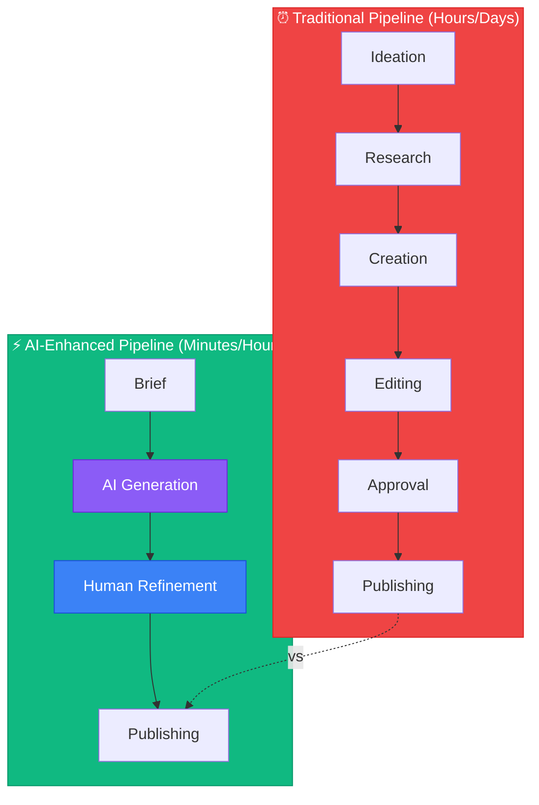
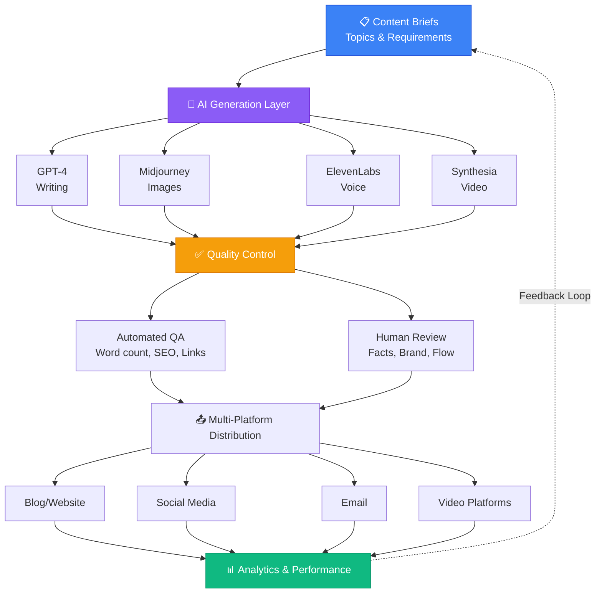
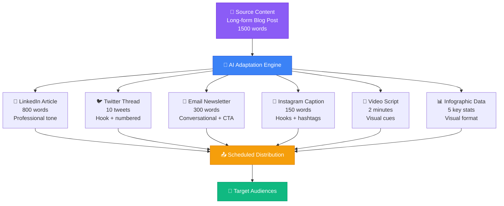

# AI-Powered Content Creation & Media Systems

## Introduction

Content creation has been fundamentally transformed by AI. What once took hours or required specialized skills can now be done in minutes. But effective AI content creation isn't about replacing human creativity—it's about amplifying it.

This module teaches you to build content systems that combine AI generation with human guidance, quality control, and brand consistency.

## Content Strategy for AI Systems

### Understanding Content Types

**Written Content:**
- Blog posts and articles
- Social media posts
- Email campaigns
- Product descriptions
- Documentation
- Scripts and screenplays

**Visual Content:**
- Marketing images
- Illustrations
- Product mockups
- Social media graphics
- Presentations

**Audio Content:**
- Voiceovers
- Podcasts
- Audio descriptions
- Music and sound effects

**Video Content:**
- Marketing videos
- Tutorials
- Social media clips
- Animated explainers

Each type requires different tools, workflows, and quality standards.

### The Content Production Pipeline



**Key Difference**: AI handles first draft, humans focus on quality and strategy.

```quiz
title: Content Strategy Fundamentals Quiz
questions:
- question: What is the primary advantage of the AI-Enhanced Pipeline over the Traditional Pipeline?
  options: [AI completely replaces human workers, AI handles first drafts allowing humans to focus on quality and strategy, AI is cheaper than hiring writers, AI creates better content than humans]
  correct: 1
  explanation: The key advantage is that AI handles the time-consuming first draft creation, freeing humans to focus on strategic elements like quality control, brand consistency, and strategic direction.
- question: Which content type would typically require the longest context window from an AI model?
  options: [Social media posts, Email campaigns, Long-form articles and documentation, Product descriptions]
  correct: 2
  explanation: Long-form articles and documentation require models with large context windows (like Claude's 200K) to maintain consistency and reference throughout lengthy content.
- question: In the AI-Enhanced content pipeline, what role do humans primarily play?
  options: [Writing all content from scratch, Only publishing content, Refinement and quality control after AI generation, Managing the AI servers]
  correct: 2
  explanation: In the AI-Enhanced pipeline, humans focus on refining AI-generated content and ensuring it meets quality standards, brand voice, and strategic goals.
- question: Which of the following is NOT listed as a visual content type in this module?
  options: [Marketing images, Product mockups, 3D animations, Social media graphics]
  correct: 2
  explanation: While 3D animations exist, this module specifically lists marketing images, illustrations, product mockups, social media graphics, and presentations as visual content types.
```

```task
title: Map Your Content Types
description: Create a spreadsheet or document listing all content types your organization or personal brand creates (or plans to create). Categorize each as Written, Visual, Audio, or Video. For each type, note the current creation time and estimate potential time savings with AI assistance.
xp: 10
```

## AI Writing Systems

### Tools and Platforms

**General Writing:**
- ChatGPT, Claude (best for quality)
- Jasper, Copy.ai (marketing-focused)
- Notion AI, Google Bard (integrated)

**SEO Content:**
- Surfer SEO + AI
- Clearscope
- Frase

**Long-Form:**
- Claude (200K context)
- GPT-4 Turbo
- Sudowrite (creative writing)

**Email Marketing:**
- Copy.ai
- Jasper
- Custom GPT workflows

### Building a Content Brief System

The quality of AI content depends on brief quality.

**Effective Brief Template:**
```markdown
## Content Brief

**Type**: [Blog post/Article/Email/Social]
**Topic**: [Specific topic]
**Audience**: [Detailed audience description]
**Goal**: [Inform/Persuade/Entertain/Convert]

**Tone**: [Professional/Casual/Technical/Friendly]
**Word Count**: [Target length]
**Key Points**:
1. [Point 1]
2. [Point 2]
3. [Point 3]

**SEO Keywords**: [Keywords to include]
**Call-to-Action**: [Desired action]
**Style Reference**: [Link to example or style guide]

**Must Include**:
- [Specific elements]

**Must Avoid**:
- [Things to exclude]
```

**Example Usage:**
```
## Content Brief

**Type**: Blog Post
**Topic**: Benefits of standing desks for remote workers
**Audience**: Remote professionals ages 25-45, health-conscious
**Goal**: Inform and drive product consideration

**Tone**: Professional but approachable, evidence-based
**Word Count**: 1200-1500 words

**Key Points**:
1. Health benefits (back pain, posture, energy)
2. Productivity improvements
3. How to transition effectively

**SEO Keywords**: standing desk, remote work ergonomics, desk setup
**Call-to-Action**: Check out our standing desk comparison guide

**Must Include**:
- At least 3 scientific studies/references
- Practical tips for getting started
- Common mistakes to avoid

**Must Avoid**:
- Overly salesy language
- Unsupported health claims
- Assuming everyone has space/budget
```

### Prompt Templates for Content

**Blog Post Generation:**
```
Create a comprehensive blog post:

Topic: {{topic}}
Audience: {{audience}}
Tone: {{tone}}
Length: {{word_count}} words

Structure:
1. Hook - start with compelling opening
2. Introduction - establish context and value
3. Main Content - {{number}} key sections with subheadings
4. Examples - include practical examples
5. Conclusion - summarize and include CTA

SEO Keywords: {{keywords}}
Style: {{style_reference}}

Requirements:
- Use active voice
- Include statistics where relevant
- Add section headings
- Keep paragraphs under 4 sentences
- End with: {{cta}}
```

**Social Media Batch Generation:**
```
Create {{platform}} content:

Topic: {{topic}}
Brand Voice: {{voice}}
Goal: {{goal}}

Generate 5 variations:
1. Educational tip
2. Question to drive engagement
3. Behind-the-scenes/Story
4. Statistic or data point
5. How-to or tutorial

Each post:
- {{platform}} optimal length
- Include relevant hashtags
- End with engagement hook
- Vary formats and angles
```

**Email Campaign:**
```
Write an email campaign:

Campaign: {{campaign_name}}
Segment: {{audience_segment}}
Goal: {{goal}}

Email {{number}}:
Subject Line: {{guidance}}
Preview Text: {{guidance}}

Body:
- Opening: {{approach}}
- Value Proposition: {{key_benefit}}
- Social Proof: {{type}}
- CTA: {{action}}

Tone: {{tone}}
Length: {{word_count}} words

Constraints:
- Personalization: {{tokens}}
- A/B test: {{element}}
```

### Quality Control for AI Writing

**Automated Checks:**
1. **Word Count**: Use prompts with specific targets
2. **Keyword Density**: Check SEO tool integration
3. **Readability**: Use tools like Hemingway, Grammarly
4. **Tone**: Use AI tone analyzers
5. **Plagiarism**: Run through checkers

**Human Review Checklist:**
- [ ] Factual accuracy (verify claims)
- [ ] Brand voice consistency
- [ ] Logical flow
- [ ] Target audience appropriateness
- [ ] Goal alignment
- [ ] Grammar and style (despite AI)
- [ ] No hallucinated information

**Improvement Loop:**
```
Generate → Review → Provide Feedback → Regenerate Sections → Final Review
```

```quiz
title: AI Writing Systems Quiz
questions:
- question: What is the MOST important factor determining the quality of AI-generated content?
  options: [The AI model version used, The quality of the content brief provided, The length of the output, The number of regenerations]
  correct: 1
  explanation: The quality of AI content depends heavily on brief quality. A well-structured brief with clear audience, tone, key points, and requirements produces significantly better results than a vague request.
- question: Which AI writing tool is best suited for long-form content requiring large context windows?
  options: [Copy.ai, Jasper, Claude (200K context), Notion AI]
  correct: 2
  explanation: Claude with its 200K context window is specifically mentioned as ideal for long-form content, allowing it to maintain consistency across lengthy documents.
- question: In the content brief template, which element helps ensure the AI matches your brand's communication style?
  options: [Word Count, SEO Keywords, Tone and Style Reference, Call-to-Action]
  correct: 2
  explanation: The Tone and Style Reference fields in the brief guide the AI to match your brand's specific communication style and voice.
- question: What should be included in the human review checklist for AI-generated content?
  options: [Only grammar and spelling, Only factual accuracy, Factual accuracy, brand voice, logical flow, and no hallucinations, Only keyword density]
  correct: 2
  explanation: Human review must be comprehensive, checking factual accuracy, brand voice consistency, logical flow, audience appropriateness, goal alignment, and ensuring no hallucinated information.
- question: For SEO-focused content creation, which combination of tools is recommended?
  options: [ChatGPT + Copy.ai, Surfer SEO + AI or Clearscope, Jasper + Notion AI, Sudowrite + GPT-4]
  correct: 1
  explanation: The module specifically lists Surfer SEO + AI, Clearscope, and Frase as tools designed for SEO content creation.
```

```task
title: Create Your Content Brief Template
description: Using the template provided in this section, create a customized content brief template for your specific needs. Test it by creating a brief for one piece of content, then use it to generate content with ChatGPT or Claude. Compare the results to content generated without a detailed brief.
xp: 15
```

```task
title: Build a Prompt Library
description: Create a collection of at least 5 reusable prompt templates for different content types you frequently create (e.g., blog posts, social media, emails). Store them in a document or tool where you can easily copy and customize them for future use.
xp: 10
```

## AI Image Generation

### Image AI Platforms

**Major Tools:**
- **Midjourney**: Best overall quality, artistic
- **DALL-E 3**: Good for realistic, follows prompts well
- **Stable Diffusion**: Open-source, customizable
- **Adobe Firefly**: Commercial-safe, integrated with Adobe
- **Leonardo.ai**: Game assets, consistent characters

**Use Cases by Tool:**
- Midjourney: Marketing visuals, hero images, artistic needs
- DALL-E: Product mockups, realistic scenes, specific requests
- Stable Diffusion: High volume, custom training, self-hosted
- Firefly: Enterprise/commercial projects requiring safety

### Image Prompting Fundamentals

**Basic Formula:**
```
[Subject] + [Style] + [Composition] + [Lighting] + [Details]
```

**Example:**
```
Subject: A modern office with standing desks
Style: Clean, minimalist photography
Composition: Wide angle, symmetrical
Lighting: Natural window light, bright and airy
Details: Plants, laptops, diverse professionals working
```

**Midjourney Prompt:**
```
/imagine modern office with standing desks, clean minimalist photography, wide angle symmetrical composition, natural window light bright and airy, plants and laptops, diverse professionals, --ar 16:9 --v 6
```

**DALL-E Prompt:**
```
A bright, modern office space with standing desks arranged symmetrically. Natural window light streams in from the left. Diverse professionals work at laptops. Minimalist design with indoor plants. Clean, professional photography style. Wide angle view.
```

### Advanced Image Techniques

**Style References:**
```
Style: Like [artist name or movement]
Examples:
- "in the style of Pixar animation"
- "like a Wes Anderson film still"
- "corporate photography similar to Apple ads"
```

**Consistency Techniques:**

For consistent characters/objects:
1. **Detailed descriptions** (save and reuse)
2. **Seed values** (Midjourney)
3. **Style reference images**
4. **ControlNet** (Stable Diffusion)
5. **Custom training** (advanced)

**Example Consistency Prompt:**
```
[Character description]: A female entrepreneur in her 30s, shoulder-length brown hair, wearing a navy blazer, friendly smile, professional demeanor

Scene 1: [Character description], sitting at modern desk, working on laptop
Scene 2: [Character description], standing and presenting to team
Scene 3: [Character description], on video call

Style: Corporate stock photography, bright and clean
--seed 12345
```

### Image Editing and Enhancement

**AI Editing Tools:**
- **Remove.bg**: Background removal
- **Cleanup.pictures**: Object removal
- **Upscale.media**: Image upscaling
- **Photoshop AI**: Full editing suite
- **Canva AI**: Design and editing

**Common Workflows:**

**Background Replacement:**
```
1. Generate subject with DALL-E/Midjourney
2. Remove background (remove.bg)
3. Add to custom background (Photoshop/Canva)
4. Adjust lighting/shadows (AI editing)
```

**Product Mockup:**
```
1. Generate product context scene
2. Upload real product photo
3. Use AI to blend and match lighting
4. Enhance and refine
```

```quiz
title: AI Image Generation Quiz
questions:
- question: Which image AI platform is recommended for commercial/enterprise projects requiring copyright safety?
  options: [Midjourney, Stable Diffusion, Adobe Firefly, Leonardo.ai]
  correct: 2
  explanation: Adobe Firefly is specifically mentioned as commercial-safe and designed for enterprise/commercial projects requiring legal safety.
- question: What is the basic formula for effective image prompting?
  options: [Subject + Color + Size, Subject + Style + Composition + Lighting + Details, Just describe what you want, Model name + Subject + Quality]
  correct: 1
  explanation: The module teaches the formula: [Subject] + [Style] + [Composition] + [Lighting] + [Details] for comprehensive image prompts.
- question: Which technique is NOT mentioned for maintaining consistency across multiple AI-generated images?
  options: [Detailed descriptions saved and reused, Seed values, Using the same computer, Style reference images]
  correct: 2
  explanation: The module mentions detailed descriptions, seed values, style reference images, ControlNet, and custom training - but not using the same computer.
- question: What does the '--ar 16:9' parameter in a Midjourney prompt control?
  options: [Image quality, Aspect ratio, Art style, Animation rate]
  correct: 1
  explanation: The --ar parameter controls aspect ratio. 16:9 creates a widescreen rectangular image.
- question: Which tool is best for removing backgrounds from AI-generated images?
  options: [Midjourney, Remove.bg, DALL-E, Canva AI]
  correct: 1
  explanation: Remove.bg is specifically mentioned as the tool for background removal in the editing workflows section.
```

```task
title: Practice Image Prompting
description: Generate 3 images using Midjourney, DALL-E, or another AI image tool. For each image, write a detailed prompt following the formula (Subject + Style + Composition + Lighting + Details). Document your prompts and results, noting which prompt elements had the biggest impact on the output.
xp: 15
```

## Voice and Audio AI

### Voice Synthesis Tools

**Best Platforms:**
- **ElevenLabs**: Most natural, voice cloning
- **PlayHT**: Good quality, affordable
- **Murf.ai**: Multiple voices, easy interface
- **OpenAI TTS**: API-first, good quality
- **Resemble AI**: Custom voice creation

**Use Cases:**
- Voiceovers for videos
- Podcast intros/outros
- Audio articles
- Audiobook narration
- IVR systems
- Language learning

### Voice Quality Factors

**What Affects Quality:**
1. **Text Formatting**: Punctuation, spacing, breaks
2. **Voice Selection**: Match content type
3. **Settings**: Speed, pitch, emphasis
4. **Script Quality**: Natural phrasing

**Good Voice Script:**
```
Welcome to the AI Operator Roadmap.

[PAUSE]

Today, we're diving deep into content creation systems...
that can scale your output while maintaining quality.

[EMPHASIS] This is crucial for modern operators.

Let's get started.
```

**Voice Settings:**
```
Voice: Professional Male (medium depth)
Speed: 1.0x (natural pace)
Stability: 0.75 (consistent)
Clarity: 0.85 (crisp)
Style: Conversational
```

### Voice Cloning and Customization

**ElevenLabs Voice Cloning:**
```
Requirements:
- 1-5 minutes of clear audio
- Single speaker
- Consistent quality
- Various tones/emotions

Process:
1. Upload audio samples
2. AI creates voice model
3. Test with various scripts
4. Fine-tune settings
5. Use for synthesis
```

**Ethical Considerations:**
- Only clone voices you have permission for
- Clearly disclose AI-generated voices
- Don't create misleading content
- Respect privacy and consent

### Audio Production Workflows

**Podcast Intro/Outro:**
```
1. Write script in natural conversational style
2. Generate voice (ElevenLabs)
3. Add background music (Mubert AI, Soundraw)
4. Edit in Descript or Audacity
5. Export and integrate
```

**Video Voiceover:**
```
1. Write script matching video length
2. Add SSML tags for timing
3. Generate audio
4. Sync with video in editor
5. Adjust pacing if needed
```

**Multilingual Content:**
```
1. Create original script (English)
2. Translate (GPT-4/DeepL)
3. Generate voices in target languages
4. Cultural adaptation review
5. Deploy multi-language versions
```

```task
title: Create an AI Voiceover
description: Write a 1-2 minute script for a voiceover (for a video intro, podcast intro, or audio article). Use ElevenLabs, PlayHT, or OpenAI TTS to generate the audio. Experiment with at least 2 different voice settings and compare the results. Document which settings worked best for your use case.
xp: 15
```

## Video AI Systems

### Video Generation Tools

**AI Video Platforms:**
- **Runway Gen-2**: Text-to-video, editing
- **Pika Labs**: Creative video generation
- **Synthesia**: Avatar-based videos
- **D-ID**: Talking head videos
- **Descript**: AI editing and generation

**Current Capabilities:**
- Short clips (few seconds)
- Talking head videos
- Animation and effects
- Video enhancement
- Editing automation

**Limitations:**
- Longer videos still challenging
- Consistency across clips
- Complex scenes
- Physics realism

### Practical Video Workflows

**Talking Head Video (Product Demo):**
```
Platform: Synthesia or D-ID

1. Write script
2. Select avatar
3. Generate voice (or upload)
4. Generate video
5. Add graphics/overlays in editor
6. Export
```

**B-Roll Generation:**
```
Platform: Runway, Pika

1. Define scenes needed
2. Generate short clips (2-5 seconds each)
3. Upscale if needed
4. Combine in video editor
5. Add primary footage
```

**Video Enhancement:**
```
Use: Topaz Video AI, Runway

Tasks:
- Upscale low-res footage
- Stabilize shaky video
- Remove objects/people
- Color correction
- Frame interpolation (smooth slow-mo)
```

### Video Editing with AI

**Descript Workflow:**
```
1. Upload video/audio
2. Automatic transcription
3. Edit by editing text (remove "ums," pauses)
4. Studio Sound (enhance audio quality)
5. Eye contact correction (AI maintains gaze)
6. Export
```

**Benefits:**
- Non-technical editing
- Fast iteration
- Automatic enhancement
- Accessibility (transcripts)

```quiz
title: Voice and Video AI Quiz
questions:
- question: Which voice AI platform is highlighted for its voice cloning capabilities?
  options: [Murf.ai, PlayHT, ElevenLabs, OpenAI TTS]
  correct: 2
  explanation: ElevenLabs is specifically mentioned as offering the most natural voices and voice cloning capabilities.
- question: What is an essential ethical consideration when using voice cloning technology?
  options: [Always use the fastest generation speed, Only clone voices you have permission for and disclose AI generation, Use the cheapest service available, Clone as many voices as possible for variety]
  correct: 1
  explanation: The module emphasizes only cloning voices with permission, clearly disclosing AI-generated voices, avoiding misleading content, and respecting privacy and consent.
- question: For video creation with talking head avatars, which platforms are recommended?
  options: [Midjourney and DALL-E, Runway and Pika Labs, Synthesia and D-ID, Remove.bg and Canva]
  correct: 2
  explanation: Synthesia and D-ID are specifically mentioned for avatar-based talking head videos.
- question: What is Descript's unique editing feature?
  options: [Editing video by editing the transcript text, Fastest rendering speed, Cheapest pricing, Best video quality]
  correct: 0
  explanation: Descript allows you to edit video by editing the automatically generated transcript text, making video editing accessible to non-technical users.
```

```task
title: Design a Multi-Format Content Piece
description: Choose one piece of content (a blog post topic or key message). Create versions for 3 different formats: (1) A written social media post, (2) A script for a 30-second video with voiceover, (3) An image with text overlay. Use AI tools to generate at least one of these formats. Document your process and the tools used.
xp: 20
```

## Building Content Systems at Scale

### The Content Factory Model



**Example: Blog Post Factory:**

**Step 1: Brief Creation** (Human)
```
- Weekly topic planning
- Create detailed briefs
- Add to Airtable/Notion
```

**Step 2: Content Generation** (AI + Automation)
```
- Make.com workflow triggers
- Calls GPT-4 API with brief
- Generates draft
- Saves to Notion
```

**Step 3: Enhancement** (AI)
```
- Generate featured image (Midjourney API)
- Create social snippets
- Generate meta descriptions
- Create email teaser
```

**Step 4: Review** (Human)
```
- Check facts
- Ensure brand voice
- Approve/request changes
```

**Step 5: Distribution** (Automated)
```
- Publish to WordPress
- Share on social
- Send email
- Track analytics
```

### Quality at Scale

**The Challenge**: More content = more potential for errors

**Solutions:**

**1. Template Standardization**
```
- Proven prompt templates
- Consistent briefs
- Style guides in every prompt
```

**2. Automated QA**
```
- Word count verification
- Readability scoring
- Keyword checking
- Link validation
```

**3. Sampling Reviews**
```
- Review 100% at start
- 50% after 10 pieces
- 10% after proven system
- Spot-check always
```

**4. Feedback Loops**
```
Track:
- Which prompts produce best content
- What needs editing most often
- Performance by content type
- ROI per piece
```

### Multi-Platform Content Adaptation



**One Source, Many Formats:**

**Starting Point**: Long-form blog post (1500 words)

**AI-Generated Variations:**
```
1. LinkedIn Article (800 words)
   Prompt: "Condense this to 800 words for LinkedIn, more personal tone"

2. Twitter Thread (10 tweets)
   Prompt: "Convert to 10-tweet thread, start with hook, numbered"

3. Email Newsletter (300 words)
   Prompt: "Create email version, conversational, clear CTA"

4. Instagram Caption (150 words)
   Prompt: "Create engaging Instagram caption with hooks and hashtags"

5. Script for Video (2 min)
   Prompt: "Convert to 2-minute video script, natural speech, visual cues"

6. Infographic Data Points
   Prompt: "Extract 5 data points for infographic, stat + insight format"
```

**Automation Workflow:**
```
New blog post published
↓
Trigger Make.com
↓
Generate all variations via API
↓
Create images for each platform (DALL-E)
↓
Save to content calendar
↓
Schedule distribution
```

## Case Study: Complete Content System

**Scenario**: Tech startup needs 20 blog posts + social content per month

**Manual Approach:**
- 2 writers × 20 hours/week = 160 hours
- Freelance cost: ~$8,000/month
- 1 designer × 10 hours/week = 40 hours
- Design cost: ~$2,000/month
- **Total: $10,000/month, 200 hours**

**AI-Enhanced Approach:**
- 1 AI operator × 30 hours/month
- Operator cost: ~$2,500
- AI tools cost: ~$300/month
- Human editor × 10 hours/month: ~$500
- **Total: $3,300/month, 40 hours**

**Output:**
- 20 blog posts (1500 words each)
- 60+ social posts
- 20 featured images
- 4 email newsletters
- All with higher consistency

**ROI**: 67% cost reduction, 5x efficiency increase

```quiz
title: Content Systems at Scale Quiz
questions:
- question: In the Content Factory Model, what is the feedback loop's primary purpose?
  options: [To reduce costs, To improve future content based on performance analytics, To speed up production, To eliminate human review]
  correct: 1
  explanation: The feedback loop from analytics back to content briefs ensures that performance data informs future content strategy and improves the system over time.
- question: According to the case study, what was the primary cost savings driver in the AI-Enhanced approach?
  options: [Eliminating all human workers, Reducing the hours required from 200 to 40 per month, Using free AI tools only, Cutting quality standards]
  correct: 1
  explanation: The case study shows a reduction from 200 hours/month to 40 hours/month while maintaining or improving quality, resulting in 67% cost reduction.
- question: What percentage should you sample-review after your content system is proven?
  options: [0% - full automation, 10% - spot-check always, 50% - half of all content, 100% - review everything]
  correct: 1
  explanation: The module recommends reviewing 100% at start, 50% after 10 pieces, then 10% after the system is proven, with spot-checks always continuing.
- question: In multi-platform content adaptation, what is the 'Source Content' in the example?
  options: [A tweet, A long-form blog post, An Instagram post, A video script]
  correct: 1
  explanation: The example uses a long-form blog post (1500 words) as the source content that gets adapted to multiple platforms.
- question: What is a key component of maintaining quality at scale?
  options: [Generating as much content as possible, Template standardization with proven prompt templates, Using different prompts for every piece, Avoiding feedback loops]
  correct: 1
  explanation: Template standardization with proven prompt templates, consistent briefs, and style guides helps maintain quality when scaling content production.
```

```task
title: Plan a Content Workflow
description: Design a complete workflow for one type of content you create regularly. Map out: (1) Input/brief stage, (2) AI generation stage (which tools), (3) Quality control stage, (4) Distribution stage, (5) Analytics/feedback stage. Create a visual diagram or written process document. Identify which steps are automated vs. manual.
xp: 20
```

```task
title: Multi-Platform Content Adaptation
description: Take one piece of existing long-form content (blog post, article, or create one with AI). Use AI to adapt it into at least 3 different formats for different platforms (e.g., LinkedIn article, Twitter thread, email newsletter, Instagram caption). Compare how the AI adapted tone, length, and style for each platform.
xp: 20
```

## Completion Checklist

- [ ] Understand content types and AI capabilities
- [ ] Write effective content briefs
- [ ] Generate blog posts with AI
- [ ] Create social media content at scale
- [ ] Generate images with Midjourney or DALL-E
- [ ] Produce voice content with ElevenLabs or similar
- [ ] Edit videos using AI tools
- [ ] Build a multi-step content workflow
- [ ] Implement quality control processes
- [ ] Create one piece of content and adapt to 3+ platforms

## Next Steps

Module 4 covers Core Interface Tools—the no-code and low-code platforms that let you build AI-powered applications and interfaces without extensive coding.

**Prepare By:**
- Building your prompt library for common content types
- Testing different image generation tools
- Creating sample content workflows
- Identifying your most frequent content needs

---

**Time to Complete**: 5-7 days
**Prerequisites**: Module 02 - Understanding LLMs
**Next Module**: [04 - Core Interface Tools](./04-core-interface-tools)
