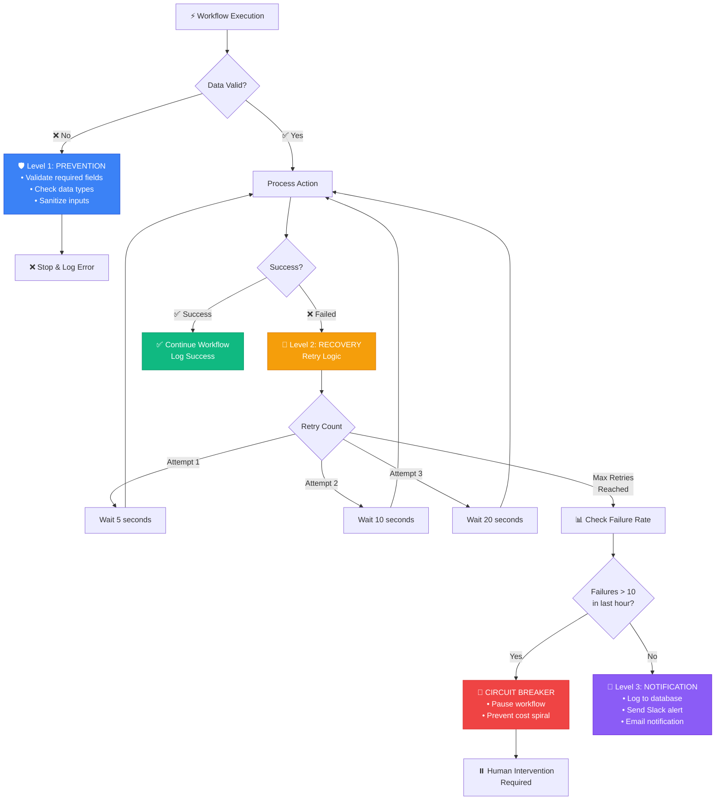
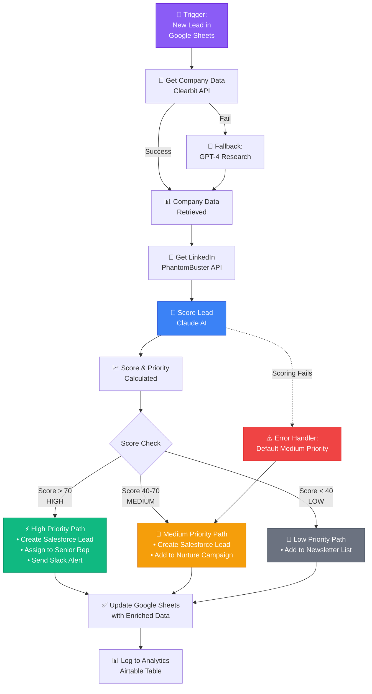

# 📘 MODULE 6: Automation Layer

**Estimated Time:** 6-8 days
**Difficulty:** Intermediate
**Prerequisites:** Modules 1-5 (especially Module 4 on Interface Tools and Module 5 on Data Layer)

## 📖 Overview & Why This Matters

You've built databases. You've set up Airtable and Notion interfaces. You've created a RAG system. Now here's the question: How do they all work together? The answer is automation workflows.

This is where everything clicks. Automation tools like Make (formerly Integromat), Zapier, and n8n are the nervous system of your AI operations. They're what make your databases talk to each other, your AI models process data automatically, and your entire system run without you clicking buttons all day.

Here's the career truth: Companies don't hire AI Operators to manually run ChatGPT prompts. They hire people who can build automation workflows that process 1,000 customer inquiries per day, or generate 50 content pieces per week, or enrich 500 leads automatically. That's what you're learning here.

The difference between a $60K "automation specialist" and a $150K "AI operations engineer" is sophistication. Anyone can connect Google Sheets to Slack. The pros build error-handling systems, implement retry logic, monitor workflow performance, and design workflows that won't break when APIs change. That's this module.

## 🎯 Learning Objectives

By the end of this module, you will:

- [ ] Understand when to use Zapier vs. Make vs. n8n
- [ ] Build multi-step workflows with conditional logic and branching
- [ ] Implement proper error handling and retry mechanisms
- [ ] Design workflows that scale from 10 to 10,000 operations per day
- [ ] Use webhooks to trigger workflows from external events
- [ ] Monitor workflow performance and debug failures
- [ ] Build reusable workflow patterns and templates

## 🧠 Core Concepts

### The Automation Mindset

Think in terms of triggers and actions:
- **Trigger**: Something happens (new row in spreadsheet, webhook received, scheduled time)
- **Action**: Do something in response (send email, create record, call API)

But professional automation goes deeper:
- **Data transformation**: Convert data between formats
- **Conditional logic**: Do different things based on data values
- **Error handling**: What happens when something fails?
- **Monitoring**: How do you know if it's working?

### Workflow Design Patterns

```mermaid
graph TB
    subgraph Linear["📏 Linear Workflow - Simple Sequential"]
        L1[Trigger:<br/>Form Submission] --> L2[Action 1:<br/>Save to Airtable]
        L2 --> L3[Action 2:<br/>Send Email]
        L3 --> L4[Action 3:<br/>Create Calendar Event]
        L4 --> L5[✅ Done]
    end

    subgraph Branching["🔀 Branching Workflow - Conditional Logic"]
        B1[Trigger:<br/>New Lead] --> B2{Check Score}
        B2 -->|Score > 70<br/>High| B3[Notify Sales Team<br/>Create Priority Task]
        B2 -->|Score ≤ 70<br/>Low| B4[Add to Nurture<br/>Campaign]
    end

    subgraph Parallel["⚡ Parallel Workflow - Concurrent Actions"]
        P1[Trigger:<br/>New Article] --> P2[Split Paths]
        P2 --> P3[Path 1:<br/>Generate Summary]
        P2 --> P4[Path 2:<br/>Create Social Posts]
        P2 --> P5[Path 3:<br/>Update Analytics]
        P3 --> P6[Wait for All]
        P4 --> P6
        P5 --> P6
        P6 --> P7[✅ Continue]
    end

    subgraph Loop["🔁 Loop Workflow - Iterative Processing"]
        Lo1[Trigger:<br/>Daily 9am] --> Lo2[Get List:<br/>Pending Tasks]
        Lo2 --> Lo3{For Each Task}
        Lo3 --> Lo4[Send Reminder<br/>Email]
        Lo4 --> Lo5{More Items?}
        Lo5 -->|Yes| Lo3
        Lo5 -->|No| Lo6[✅ Done]
    end

    style Linear fill:#8B5CF6,stroke:#6D28D9,color:#fff
    style Branching fill:#3B82F6,stroke:#1D4ED8,color:#fff
    style Parallel fill:#10B981,stroke:#059669,color:#fff
    style Loop fill:#F59E0B,stroke:#D97706,color:#fff
```



**Linear Workflows** (Simple)
- Example: New form submission → Save to Airtable → Send email → Create calendar event

**Branching Workflows** (Conditional)
- Example: New lead → Check score → If high, notify sales → If low, add to nurture campaign

**Parallel Workflows** (Concurrent)
- Example: New article → Generate summary + Create social posts + Update analytics (all at once)

**Loop Workflows** (Iterative)
- Example: Daily trigger → Get all pending tasks → For each task → Send reminder email

### Error Handling Philosophy



Your workflows WILL fail. APIs go down. Rate limits hit. Data is malformed. Professional automation anticipates this.

**The Three Levels of Error Handling:**

1. **Prevention**: Validate data before processing
2. **Recovery**: Retry failed actions with exponential backoff
3. **Notification**: Alert humans when something needs attention

Bad: Workflow fails silently, you discover it weeks later
Good: Workflow retries automatically, logs error, notifies you if retry fails

### The Idempotency Principle

Idempotent operations can be run multiple times safely without causing duplicates or errors.

Non-idempotent: "Create a new customer record"
- Run it twice → You get two customer records (bad)

Idempotent: "Create customer record if email doesn't exist, otherwise update"
- Run it twice → You get one customer record (good)

Design workflows to be idempotent so retries don't cause problems.

## 🛠️ Tools Deep Dive

### Zapier

**Best for:** Quick integrations, non-technical users, pre-built connectors
**When to use:** Simple workflows, standard app integrations, rapid prototyping
**Pricing:** Free: 100 tasks/month, Paid: $19.99/month for 750 tasks
**Pros:**
- Largest library of pre-built app integrations (7,000+)
- Easiest to learn (most user-friendly interface)
- Excellent documentation and templates
- Built-in AI features (AI by Zapier)
- Stable and reliable

**Cons:**
- More expensive per task than alternatives
- Limited logic capabilities on lower tiers
- Can't inspect API responses as easily
- Less control over complex workflows
- Task consumption can get expensive quickly

**Best Use Cases:**
- Standard integrations (Gmail → Sheets → Slack)
- Internal team workflows
- Quick prototypes to validate ideas
- When pre-built connectors exist for your tools

### Make (formerly Integromat)

**Best for:** Complex workflows, visual workflow design, AI-heavy operations
**When to use:** When you need advanced logic, API work, or AI integrations
**Pricing:** Free: 1,000 operations/month, Paid: $9/month for 10,000 operations
**Pros:**
- Visual workflow builder (easier to understand complex flows)
- Better value (more operations per dollar)
- Excellent for API work (HTTP module is powerful)
- Advanced logic (routers, iterators, aggregators)
- Can see and manipulate all data visually
- Great for AI integrations (OpenAI, Anthropic, etc.)

**Cons:**
- Steeper learning curve than Zapier
- Fewer pre-built app connectors
- Documentation not as comprehensive
- Can be overwhelming for beginners

**Best Use Cases:**
- AI content generation workflows
- Complex data transformations
- When you need to work with APIs directly
- Cost-conscious projects with high volume
- Workflows with multiple branches and conditions

### n8n

**Best for:** Self-hosted automation, full control, technical users
**When to use:** When you need unlimited operations or complete data privacy
**Pricing:** Free (self-hosted), Cloud: $20/month
**Pros:**
- Completely free if self-hosted
- Unlimited operations (on self-hosted)
- Open source (can modify code)
- Full data privacy (runs on your servers)
- Good for technical teams
- Can connect to anything via custom code

**Cons:**
- Need to manage hosting yourself
- Requires technical knowledge to deploy
- Smaller community than Zapier/Make
- Fewer pre-built templates
- You're responsible for uptime

**Best Use Cases:**
- High-volume operations (thousands per day)
- Sensitive data that can't leave your servers
- Technical teams comfortable with deployment
- When cost per operation matters most
- Need to run custom code in workflows

## 💡 Real Business Examples

### Example 1: AI Content Generation Pipeline

**Problem:** Marketing agency needed to generate 200 social media posts per week for clients. Manual process was taking 20 hours/week.

**Bad Approach:** Using ChatGPT manually, copy-pasting into Google Sheets, then manually scheduling in Buffer. Error-prone and time-consuming.

**Good Approach (Built in Make):**

1. **Trigger**: Every Monday at 9am (Schedule trigger)
2. **Get Content Topics**: Fetch this week's topics from Airtable (where clients submit ideas)
3. **Iterator**: For each topic
4. **Generate Post**: Send to OpenAI API with prompt:
```
Generate 3 social media post variations about: {topic}
Format: JSON array with fields: text, platform, hashtags
Target platform: {client_platform}
Tone: {client_tone}
Length: {platform_max_length}
```
5. **Parse Response**: Extract JSON from GPT response
6. **Create Records**: For each variation, create row in Airtable "Generated Posts" table
7. **Filter**: Only approved posts continue
8. **Schedule**: Send to Buffer API to schedule at optimal times
9. **Update Status**: Mark original topic as "Completed" in Airtable

**Error Handling:**
- If OpenAI fails → Retry 3 times with 5-minute delays
- If retry fails → Send Slack notification to team
- If Airtable unavailable → Queue data in Google Sheets as backup

**Result:**
- Content generation time: 20 hours → 2 hours (just reviewing)
- Cost: $150/month in AI + automation
- Scaled from 5 clients to 25 clients without adding headcount
- Error rate: <1% (vs. 15% manual errors before)

### Example 2: Lead Enrichment Engine

**Problem:** Sales team receiving 50-100 leads per day from website form. Needed company information, LinkedIn profile, and lead scoring before routing to sales reps.

**Bad Approach:** Sales reps manually researching each lead (30 mins per lead).



**Good Approach (Built in Make):**

1. **Trigger**: New row in Google Sheets (from website form)
2. **Get Company Info**:
   - Send company domain to Clearbit API → Get company data
   - If Clearbit fails, use GPT-4 with prompt: "Research {company_name} and return: industry, size, tech stack, recent funding in JSON"
3. **Get LinkedIn**: Use PhantomBuster API to find LinkedIn profile
4. **Score Lead**: Send all data to Claude with prompt:
```
Score this lead from 1-100 based on:
- Company size (ideal: 50-500 employees)
- Industry match (ideal: SaaS, Tech, Professional Services)
- Tech stack (bonus: uses Salesforce, HubSpot)
- Recent funding (bonus: raised in last 12 months)

Data: {all_enrichment_data}
Return JSON: {score: number, reasoning: string, priority: "high"|"medium"|"low"}
```
5. **Branch on Score**:
   - If score > 70 → Create Salesforce lead + Assign to senior rep + Send Slack notification
   - If score 40-70 → Create Salesforce lead + Add to nurture campaign
   - If score < 40 → Add to general newsletter list
6. **Update Sheet**: Write all enriched data back to Google Sheets
7. **Log**: Write to Airtable analytics table for reporting

**Error Handling:**
- If any API fails → Use fallback AI research
- If scoring fails → Default to medium priority
- All errors logged to "Failed Leads" table for manual review

**Result:**
- Lead processing time: 30 minutes → 2 minutes
- Lead routing accuracy: 65% → 92%
- Sales team close rate increased 35% (better qualified leads)
- Cost: $300/month (APIs + AI + automation)

### Example 3: Customer Support Auto-Responder

**Problem:** SaaS company getting 200 support emails per day. 60% were common questions that could be answered automatically.

**Bad Approach:** All emails go to support queue, human reads and responds (even to "how do I reset password?").

**Good Approach (Built in n8n, self-hosted):**

1. **Trigger**: New email to support@company.com (Email trigger via IMAP)
2. **Classify Intent**: Send email to GPT-4:
```
Classify this support email into categories:
- password_reset
- billing_question
- bug_report
- feature_request
- other

Email: {email_body}
Return JSON: {category: string, confidence: number, urgency: "low"|"medium"|"high"}
```
3. **Branch by Category**:
   - **Password Reset**: Send auto-reply with reset instructions + Create password reset token via API
   - **Billing Question**: Check Stripe API for customer status → Generate personalized response
   - **Bug Report**: Create GitHub issue + Send acknowledgment email
   - **Feature Request**: Add to product board (Notion) + Thank you email
   - **Other/Low Confidence**: Route to human support queue
4. **Check Confidence**: If confidence < 80%, route to human anyway
5. **Send Response**: Send generated email via SMTP
6. **Log**: Record interaction in Supabase for analytics
7. **Follow-up**: If no customer reply in 24 hours and ticket closed, mark as resolved

**Error Handling:**
- If classification fails → Route to human immediately
- If response generation fails → Use template response
- All failures create support ticket for human

**Result:**
- Auto-resolved: 58% of tickets (116/day)
- Average response time: 2 hours → 2 minutes (for auto-resolved)
- Support team can focus on complex issues
- Customer satisfaction score: 72 → 88
- Cost: $50/month (server) + $200/month (AI APIs)

## ⚠️ Common Pitfalls

### 1. **Not Handling Rate Limits**
❌ Sending 1,000 API requests instantly, hitting rate limits, workflow crashes
✅ Use delays between requests, implement batch processing, respect API limits

### 2. **No Error Notifications**
❌ Workflow fails silently, you discover broken automation weeks later when customers complain
✅ Every critical workflow should have error → Slack/email notification path

### 3. **Hard-Coding Values**
❌ Embedding prompts, API keys, and settings directly in workflows
✅ Store configuration in Airtable/database, workflows read from there (easier to update)

### 4. **Not Testing with Real Data**
❌ Testing workflows with perfect, clean test data
✅ Test with messy real data: empty fields, special characters, edge cases

### 5. **Single Point of Failure**
❌ If one step fails, entire workflow crashes
✅ Use try-catch logic, fallbacks, and partial success handling

### 6. **Ignoring Costs**
❌ Not tracking operation counts, getting surprise bills
✅ Monitor usage in dashboards, set up billing alerts, optimize workflows

### 7. **Over-Complicating Workflows**
❌ Building one massive workflow that does everything
✅ Break into smaller, modular workflows that can be reused and debugged independently

## ✨ Pro Tips

### Tip 1: The "Safety First" Pattern

Always start workflows with validation:

```
Trigger → Validate Data (check required fields exist)
  ├─ If valid → Continue workflow
  └─ If invalid → Log error + Send notification + Stop
```

This prevents bad data from cascading through your system.

### Tip 2: Use Webhook Queues for High Volume

When processing many items:

```
Don't: Trigger → For each item → Do slow AI processing
Do: Trigger → Add to queue → Separate workflow processes queue in batches
```

This prevents timeouts and allows better error recovery.

### Tip 3: The "Idempotency Key" Pattern

Add a unique identifier to prevent duplicates:

```
Before creating record:
1. Generate key from input data (e.g., hash of email + date)
2. Check if key exists in database
3. If exists → Update; If not → Create
```

Safe to run multiple times without duplicates.

### Tip 4: Build "Circuit Breakers"

If workflow is failing repeatedly, stop auto-retrying to prevent cost spirals:

```
Track failures in database
If failures > 10 in last hour:
  - Pause workflow
  - Send urgent notification
  - Wait for human intervention
```

### Tip 5: Use Data Stores as Middleware

When connecting incompatible systems, use a database as intermediary:

```
System A → Write to Supabase → System B reads from Supabase

Instead of:
System A → Direct connection → System B (brittle)
```

This allows async processing and easier debugging.

### Tip 6: Template Your Prompts in Airtable

Store AI prompts in Airtable with version numbers:

**Prompts Table:**
- Prompt Name
- Version
- Prompt Text
- Is Active
- Created Date

Workflow fetches active prompt by name. Now you can update prompts without touching workflow.

### Tip 7: Monitor with Aggregated Metrics

Don't just log errors - track workflow health:

```
Every workflow should log to analytics table:
- Workflow Name
- Execution Time
- Success/Failure
- Input/Output Size
- Cost Estimate

Weekly: Review aggregated metrics to find slow/expensive workflows
```

## 📝 Module Project: Build a Multi-Channel AI Content System

### Objective

Build a complete automation system that takes content ideas from Airtable, generates multiple content formats using AI, reviews quality, schedules publication, and monitors performance. This integrates everything from previous modules.

### Step-by-Step Instructions

**Step 1: Set Up Your Airtable Base (45 minutes)**

Create an Airtable base called "Content Factory" with these tables:

**Content Ideas:**
- Topic (text)
- Target Audience (single select)
- Keywords (text)
- Status (single select: Pending, Generating, Generated, Approved, Scheduled, Published)
- Priority (single select)
- Trigger Generation (checkbox)

**Generated Content:**
- Linked to Content Ideas
- Content Type (single select: Blog, LinkedIn, Twitter, Email)
- Generated Text (long text)
- AI Model (text)
- Generation Time (date)
- Approved (checkbox)

**Publishing Schedule:**
- Linked to Generated Content
- Scheduled Time (date/time)
- Platform (single select)
- Published (checkbox)
- Published URL (URL)

**Workflow Logs:**
- Workflow Name (text)
- Status (single select: Success, Failed)
- Error Message (long text)
- Execution Time (number)
- Timestamp (date/time)

**Step 2: Create Make Automation - Content Generator (90 minutes)**

1. Create a new scenario in Make
2. Add trigger: **Airtable → Watch Records** (trigger when "Trigger Generation" is checked)
3. Add module: **Router** (split into 4 paths for different content types)

**Path 1: Blog Post**
4a. **OpenAI → Create Completion**:
```
Model: gpt-4o
System: You are a professional blog writer
User prompt:
Write a blog post about: {Topic}
Target audience: {Target Audience}
Keywords to include: {Keywords}
Length: 1000-1200 words
Format: Markdown with H2 headings
Include: Intro, 3-5 main sections, conclusion with CTA
```
4b. **Airtable → Create Record** in Generated Content table

**Path 2: LinkedIn Post**
5a. **OpenAI → Create Completion**:
```
Write a LinkedIn post about: {Topic}
Target: {Target Audience}
Length: 150-200 words
Include: Hook first line, 3 key points, call to action
Use line breaks for readability
```
5b. **Airtable → Create Record**

**Path 3: Twitter Thread**
6a. **OpenAI → Create Completion**:
```
Write a 5-tweet thread about: {Topic}
Format as JSON array: [{tweet: "text", number: 1}, ...]
Each tweet max 280 characters
Thread should: hook → value → value → value → CTA
```
6b. **JSON → Parse Response**
6c. **Iterator**: For each tweet
6d. **Airtable → Create Record** (one per tweet)

**Path 4: Email Newsletter**
7a. **OpenAI → Create Completion**:
```
Write an email newsletter section about: {Topic}
Length: 300-400 words
Include: Catchy subject line, engaging intro, main content, P.S. section
Tone: Conversational and helpful
```
7b. **Airtable → Create Record**

**After all paths:**
8. **Airtable → Update Record**: Set original idea status to "Generated"
9. **Airtable → Create Record** in Workflow Logs (log success)

**Error Handler (on any module):**
10. **Airtable → Create Record** in Workflow Logs (log failure with error details)
11. **Slack → Send Message**: Notify team of failure

**Step 3: Create Make Automation - Quality Checker (60 minutes)**

1. New scenario: **Airtable → Watch Records** (Generated Content table, when created)
2. **OpenAI → Create Completion**:
```
Review this content for quality:

Content: {Generated Text}
Content Type: {Content Type}

Check for:
1. Grammar and spelling
2. Clarity and readability
3. Appropriate length
4. Call to action present
5. On-topic

Return JSON:
{
  score: 1-100,
  issues: ["issue 1", "issue 2"],
  approved: true/false,
  feedback: "detailed feedback"
}
```
3. **JSON → Parse Response**
4. **Router**:
   - If approved: true → Update record, set Approved = true
   - If approved: false → Create Airtable comment with feedback, send Slack notification for human review

**Step 4: Create Make Automation - Smart Scheduler (60 minutes)**

1. New scenario: **Schedule → Every day at 6am**
2. **Airtable → Search Records**: Get all approved content not yet scheduled
3. **Iterator**: For each content piece
4. **OpenAI → Create Completion**:
```
Based on content type and current date, suggest optimal posting time.

Content Type: {Content Type}
Current Date: {today}
Already Scheduled Times: {existing_schedule}

Best practices:
- LinkedIn: Weekdays 7-9am, 12-1pm, 5-6pm
- Twitter: Weekdays 8-10am, 6-9pm
- Blog: Tuesday-Thursday mornings
- Email: Tuesday-Thursday 10am

Return JSON: {suggested_date: "YYYY-MM-DD", suggested_time: "HH:MM", reasoning: "why"}
```
5. **Parse JSON**
6. **Airtable → Create Record** in Publishing Schedule table
7. **Airtable → Update Record**: Mark content as "Scheduled"

**Step 5: Create Publishing Automation (Optional - 60 minutes)**

For each platform you use (Buffer, Hootsuite, etc.):

1. **Airtable → Watch Records**: Publishing Schedule table when scheduled time arrives
2. **HTTP → Make a Request**: Post to platform API
3. **Update Record**: Mark as Published, add URL

**Step 6: Create Monitoring Dashboard (45 minutes)**

In Google Sheets:
1. Connect to Airtable (via Make or Zapier)
2. Pull Workflow Logs data
3. Create pivot tables:
   - Success/failure rates by workflow
   - Average execution time
   - Errors by type
4. Create charts showing:
   - Content generation volume over time
   - Approval rate
   - Most common errors

In Notion:
1. Create dashboard page
2. Embed Airtable views:
   - Today's scheduled content
   - Pending approvals
   - Recent failures
3. Add status widget showing system health

**Step 7: Test the Complete System (60 minutes)**

1. Add 5 test content ideas to Airtable
2. Check "Trigger Generation" on one
3. Wait for generation to complete (2-3 minutes)
4. Verify content appears in Generated Content table
5. Check quality review ran automatically
6. Verify workflow logs recorded execution
7. Run scheduler manually to see content get scheduled
8. Review dashboard to see all metrics

**Debugging checklist:**
- [ ] All API keys are correct
- [ ] Airtable links are set correctly
- [ ] Error handlers are in place
- [ ] Slack/email notifications work
- [ ] Logs are being recorded

### Success Criteria

✅ Content ideas automatically trigger AI generation across 4 formats
✅ Generated content is automatically quality-checked
✅ Approved content is automatically scheduled at optimal times
✅ All workflows log successes and failures
✅ You get notified of any errors
✅ Dashboard shows real-time system status
✅ The system can handle 10+ content ideas per day without manual intervention
✅ You understand every step of the automation and can explain why it's there

## 📚 Resources & Next Steps

### Recommended Reading
- Make Academy (https://www.make.com/en/academy) - Free courses
- Zapier University (https://zapier.com/university) - Certification programs
- n8n Documentation (https://docs.n8n.io)

### Tools & Links
- Make (https://make.com) - Start with free tier
- Zapier (https://zapier.com) - 14-day premium trial
- n8n Cloud (https://n8n.io) or self-host
- Webhook.site (https://webhook.site) - Test webhooks

### Communities
- Make Community (https://community.make.com)
- r/zapier on Reddit
- n8n Community (https://community.n8n.io)

### What's Next?

In Module 7 (APIs & Webhooks), you'll dive deeper into working with APIs directly, understanding authentication, and building custom integrations that automation tools can't handle out of the box.

## ✅ Module Completion Checklist

Before moving to Module 7, you should be able to confidently say "yes" to all of these:

- [ ] I can explain the difference between Zapier, Make, and n8n and when to use each
- [ ] I've built a multi-step workflow with conditional logic
- [ ] I've implemented error handling with retries and notifications
- [ ] I understand how to prevent duplicates (idempotency)
- [ ] I've built a workflow that processes items in a loop/iterator
- [ ] I can debug failed workflows by reading logs and error messages
- [ ] I've set up monitoring and can track workflow performance
- [ ] I understand rate limits and how to avoid hitting them
