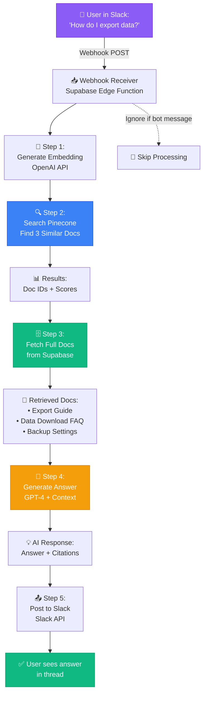

# 📘 MODULE 7: APIs & Webhooks

**Estimated Time:** 5-7 days
**Difficulty:** Intermediate
**Prerequisites:** Modules 1-6 (especially Module 6 on Automation)

## 📖 Overview & Why This Matters

Here's the moment everything opens up: You've been using pre-built integrations in Make and Zapier. But what happens when the tool you need doesn't have a pre-built connector? Or when you need to do something the connector doesn't support? This is where API skills turn you from someone who uses automation tools into someone who can automate ANYTHING.

APIs (Application Programming Interfaces) are how modern software talks to other software. Every tool you use - OpenAI, Airtable, Notion, Stripe, Supabase - has an API. Learning to work with APIs directly means you're no longer limited to what automation tools support. You can connect any system to any other system.

Webhooks are the flip side: instead of constantly checking "has something new happened?" (polling), webhooks let systems notify you instantly when events occur. This is what makes real-time automation possible.

Here's the career impact: Job listings for AI Operators increasingly say "must understand REST APIs" and "experience with webhook integrations." Why? Because companies need people who can solve unique integration challenges, not just use pre-built templates. This module bridges that gap.

## 🎯 Learning Objectives

By the end of this module, you will:

- [ ] Understand REST API fundamentals (GET, POST, PUT, DELETE)
- [ ] Read API documentation and figure out how to call any endpoint
- [ ] Implement different authentication methods (API keys, OAuth, Bearer tokens)
- [ ] Use Postman to test and debug API calls
- [ ] Build webhooks that receive and process data from external systems
- [ ] Handle API errors and rate limits gracefully
- [ ] Implement pagination for large data sets

## 🧠 Core Concepts

### What is an API, Really?

Imagine a restaurant:
- The kitchen is the software's backend (where data is stored and processed)
- You're a customer who wants food (data)
- The menu shows what you can order (API documentation)
- The waiter takes your order and brings food (the API)

You don't go into the kitchen yourself. You communicate through the waiter (API) using the menu's format (API specification).

In technical terms:
```
Your app → API Request → Software's server → Process → API Response → Your app
```

### REST API Basics

```mermaid
graph LR
    subgraph Methods["📡 HTTP Methods"]
        A1[GET<br/>Read Data<br/>📖]
        A2[POST<br/>Create New<br/>➕]
        A3[PUT/PATCH<br/>Update Existing<br/>✏️]
        A4[DELETE<br/>Remove Data<br/>🗑️]
    end

    subgraph Request["📤 API Request"]
        B1[Method: GET]
        B2[URL: /users/123]
        B3[Headers:<br/>Authorization: Bearer token<br/>Content-Type: application/json]
        B4[Body: JSON data]
    end

    subgraph Auth["🔐 Authentication"]
        C1[API Key<br/>X-API-Key: key]
        C2[Bearer Token<br/>Authorization: Bearer token]
        C3[OAuth 2.0<br/>Multi-step flow]
        C4[Basic Auth<br/>Username:Password]
    end

    subgraph Response["📥 API Response"]
        D1[Status: 200 OK ✅]
        D2[Status: 400 Bad Request ❌]
        D3[Status: 401 Unauthorized 🔒]
        D4[Status: 429 Rate Limit ⏱️]
        D5[Status: 500 Server Error 💥]
    end

    Methods --> Request
    Auth --> Request
    Request --> Response

    style Methods fill:#8B5CF6,stroke:#6D28D9,color:#fff
    style Auth fill:#3B82F6,stroke:#1D4ED8,color:#fff
    style Response fill:#10B981,stroke:#059669,color:#fff
```



REST (Representational State Transfer) is the most common API architecture. It uses standard HTTP methods:

**GET** - Retrieve data
```
GET https://api.example.com/users/123
Response: {id: 123, name: "John", email: "john@example.com"}
```

**POST** - Create new data
```
POST https://api.example.com/users
Body: {name: "Jane", email: "jane@example.com"}
Response: {id: 124, name: "Jane", email: "jane@example.com"}
```

**PUT/PATCH** - Update existing data
```
PUT https://api.example.com/users/123
Body: {name: "John Smith"}
Response: {id: 123, name: "John Smith", email: "john@example.com"}
```

**DELETE** - Remove data
```
DELETE https://api.example.com/users/123
Response: {success: true}
```

### API Authentication Methods

APIs need to know who's making requests. Common methods:

**1. API Key** (Simplest)
```
GET https://api.example.com/data
Header: X-API-Key: your_api_key_here
```
Used by: OpenAI, Pinecone, many others

**2. Bearer Token**
```
GET https://api.example.com/data
Header: Authorization: Bearer your_token_here
```
Used by: Supabase, many modern APIs

**3. OAuth 2.0** (Most complex, most secure)
```
1. App redirects user to service
2. User authorizes access
3. Service returns temporary token
4. App uses token for requests
```
Used by: Google, Twitter, LinkedIn, etc.

**4. Basic Auth** (Username + Password)
```
GET https://api.example.com/data
Header: Authorization: Basic base64(username:password)
```
Less common now, considered less secure.

### Webhooks: Push vs. Pull

```mermaid
graph TB
    subgraph Polling["🔄 Traditional Polling (PULL) - Inefficient"]
        P1[Your App] -->|Request 1:<br/>'Any new data?'| P2[External API]
        P2 -->|'No'| P1
        P1 -->|Wait 5 min...<br/>Request 2:<br/>'Any new data?'| P2
        P2 -->|'No'| P1
        P1 -->|Wait 5 min...<br/>Request 3:<br/>'Any new data?'| P2
        P2 -->|'Yes! Here: {...}'| P1
        P3[❌ Problems:<br/>• Wasted API calls<br/>• Uses rate limits<br/>• Not real-time<br/>• High latency]
    end

    subgraph Webhooks["⚡ Webhooks (PUSH) - Efficient"]
        W1[External Service] -.Register webhook URL.-> W2[Your App]
        W3[Event Occurs:<br/>Payment received] --> W1
        W1 -->|Instant POST:<br/>https://you.com/webhook<br/>Data: payment_details| W2
        W2 -->|Process data| W4[Take action]
        W5[✅ Benefits:<br/>• Real-time<br/>• No wasted calls<br/>• Event-driven<br/>• Efficient]
    end

    style Polling fill:#EF4444,stroke:#DC2626,color:#fff
    style Webhooks fill:#10B981,stroke:#059669,color:#fff
    style P3 fill:#FCA5A5,stroke:#DC2626,color:#000
    style W5 fill:#86EFAC,stroke:#059669,color:#000
```

**Traditional API (Pull)**: Your app asks "anything new?" every few minutes
- Inefficient (many wasted requests)
- Not real-time
- Uses API rate limits

**Webhooks (Push)**: External service sends data to your app when events happen
- Efficient (only triggers when needed)
- Real-time
- Doesn't use your API rate limits

Example webhook flow:
```
1. You give service your webhook URL: https://yourdomain.com/webhook
2. Event happens (e.g., payment received)
3. Service sends POST request to your URL with event data
4. Your app receives and processes data
```

### Reading API Documentation

All APIs have documentation. The pattern:

1. **Authentication** - How to prove you're authorized
2. **Base URL** - Where to send requests (e.g., https://api.openai.com/v1)
3. **Endpoints** - What actions are available (e.g., /chat/completions)
4. **Parameters** - What data to send (required vs. optional)
5. **Response Format** - What you'll get back
6. **Rate Limits** - How many requests you can make
7. **Error Codes** - What different errors mean

### HTTP Status Codes

Understanding response codes:

**2xx - Success**
- 200 OK - Request successful
- 201 Created - New resource created
- 204 No Content - Success, but no data to return

**4xx - Client Errors (Your Mistake)**
- 400 Bad Request - Invalid data sent
- 401 Unauthorized - Bad/missing authentication
- 403 Forbidden - Not allowed to access this
- 404 Not Found - Endpoint/resource doesn't exist
- 429 Too Many Requests - Hit rate limit

**5xx - Server Errors (Their Problem)**
- 500 Internal Server Error - Something broke on their end
- 502 Bad Gateway - Server is down/unreachable
- 503 Service Unavailable - Temporary outage

## 🛠️ Tools Deep Dive

### Postman

**Best for:** Testing APIs, debugging requests, building API collections
**When to use:** Before building automation, to understand how an API works
**Pricing:** Free for personal use
**Pros:**
- Visual interface for building requests
- Save requests in collections
- Environment variables for different setups
- Automatic code generation (converts to JavaScript, Python, etc.)
- Can share collections with team
- Built-in authentication helpers

**Cons:**
- Can be overwhelming for beginners
- Not for production use (just testing)

**Getting Started:**
1. Download Postman
2. Create a new request
3. Select method (GET, POST, etc.)
4. Enter URL
5. Add headers/auth
6. Send and inspect response

### Webhook.site

**Best for:** Testing webhooks, debugging incoming data
**When to use:** When building webhook receivers, need to see what data looks like
**Pricing:** Free with limitations, Pro: $10/month
**Pros:**
- Instant webhook URL (no setup)
- See all incoming requests in real-time
- Can modify and replay requests
- Shows headers, body, query params
- Perfect for development

**Cons:**
- URLs expire after 7 days on free tier
- Not for production (just testing)

### Thunder Client (VS Code Extension)

**Best for:** Developers who live in VS Code
**When to use:** Testing APIs without leaving your code editor
**Pricing:** Free
**Pros:**
- Lightweight alternative to Postman
- Integrated with VS Code
- Fast and simple
- Can save requests in version control

**Cons:**
- Fewer features than Postman
- Only available in VS Code

### cURL (Command Line)

**Best for:** Quick API tests, scripts, automation
**When to use:** When you want to test from terminal or include in scripts
**Pricing:** Free (built into Unix/Mac/Linux)
**Pros:**
- Universal (works everywhere)
- Fast
- Easy to script
- Can copy cURL commands from browser dev tools

**Cons:**
- Command-line only
- Syntax can be tricky
- No visual interface

Example:
```bash
curl -X POST https://api.openai.com/v1/chat/completions \
  -H "Authorization: Bearer $OPENAI_API_KEY" \
  -H "Content-Type: application/json" \
  -d '{
    "model": "gpt-4o",
    "messages": [{"role": "user", "content": "Hello!"}]
  }'
```

## 💡 Real Business Examples

### Example 1: Custom Slack Bot with OpenAI Integration

**Problem:** Company wanted a Slack bot that could answer questions about internal documentation using RAG, but no pre-built integration existed.

**Bad Approach:** Try to force Zapier to do it (doesn't support complex RAG logic).



**Good Approach:**

1. **Set up Slack webhook**:
   - Create Slack app
   - Enable Events API
   - Subscribe to `message` events
   - Point webhook to: `https://yourdomain.com/slack-webhook`

2. **Build webhook receiver** (Supabase Edge Function):
```javascript
// Receives POST requests from Slack
export async function handler(req) {
  const { event } = await req.json();

  // Ignore bot messages
  if (event.bot_id) return { ok: true };

  const userMessage = event.text;

  // 1. Generate embedding of question
  const embedding = await openai.embeddings.create({
    input: userMessage,
    model: "text-embedding-3-small"
  });

  // 2. Search Pinecone for relevant docs
  const results = await pinecone.query({
    vector: embedding.data[0].embedding,
    topK: 3
  });

  // 3. Fetch doc content from Supabase
  const docs = await fetchDocsFromSupabase(results.matches);

  // 4. Generate answer with GPT
  const answer = await openai.chat.completions.create({
    model: "gpt-4o",
    messages: [{
      role: "system",
      content: "Answer based on these docs: " + docs
    }, {
      role: "user",
      content: userMessage
    }]
  });

  // 5. Send to Slack
  await fetch('https://slack.com/api/chat.postMessage', {
    method: 'POST',
    headers: {
      'Authorization': `Bearer ${slackBotToken}`,
      'Content-Type': 'application/json'
    },
    body: JSON.stringify({
      channel: event.channel,
      text: answer.choices[0].message.content
    })
  });

  return { ok: true };
}
```

**Result:**
- Team can ask questions in Slack, get instant answers
- Reduced time searching documentation from 15 mins to 30 seconds
- 200+ questions answered per week
- Cost: $50/month in API calls

### Example 2: E-commerce Order Automation

**Problem:** Online store using Shopify needed to automatically create fulfillment tasks in Notion when orders came in, with custom logic based on product type.

**Bad Approach:** Shopify → Zapier → Notion (but Zapier can't handle complex product categorization logic).

**Good Approach:**

1. **Set up Shopify webhook**:
   - Shopify Admin → Settings → Notifications → Webhooks
   - Create webhook for `orders/create`
   - URL: `https://yourdomain.com/shopify-orders`

2. **Build webhook processor** (Make HTTP endpoint):
```javascript
// Receives order data from Shopify
Webhook Trigger → Parse JSON

// Analyze order with AI
OpenAI Module:
Prompt: "Categorize this order:
Products: {order.line_items}
Determine:
1. Priority (standard/rush/custom)
2. Fulfillment type (warehouse/dropship/custom-made)
3. Special instructions
Return JSON"

// Parse AI response
JSON Parse → Extract priority, type, instructions

// Router based on fulfillment type
If warehouse → Create Notion task in "Warehouse Queue"
If dropship → Send API request to dropship vendor
If custom-made → Create task + Send email to production team

// Update Shopify order with notes
HTTP Request to Shopify API:
PUT /admin/api/2024-01/orders/{order_id}.json
Body: { note: "Fulfillment type: {type}, Priority: {priority}" }

// Log to analytics
Supabase Insert: Record order processing details
```

**Result:**
- Order processing time: 30 minutes → 2 minutes
- Zero orders sent to wrong fulfillment channel
- Custom orders flagged instantly (used to get missed)
- Fulfillment team sees detailed instructions automatically

### Example 3: AI Content Approval Workflow

**Problem:** Agency generating content with AI needed client approval before publishing, but clients wouldn't log into Airtable to review.

**Bad Approach:** Email clients manually with content, track approvals in spreadsheet.

**Good Approach:**

1. **When content is generated** (in Airtable):
   - Generate unique approval token
   - Create record in Supabase `approval_requests` table

2. **Send email with webhook links**:
```
Subject: Review your content for approval

[Content preview]

Approve: https://yourdomain.com/approve?token={unique_token}
Request Changes: https://yourdomain.com/changes?token={unique_token}
```

3. **Build webhook endpoints**:

**Approve endpoint:**
```javascript
// GET https://yourdomain.com/approve?token=xxx

async function handleApprove(token) {
  // 1. Look up approval request
  const request = await supabase
    .from('approval_requests')
    .select('*')
    .eq('token', token)
    .single();

  if (!request) return "Invalid link";

  // 2. Update Airtable record
  await airtable.update(request.content_id, {
    'Status': 'Approved',
    'Approved At': new Date(),
    'Approved By': request.client_email
  });

  // 3. Trigger publishing workflow
  await triggerMakeWebhook({
    content_id: request.content_id,
    action: 'publish'
  });

  return "✅ Content approved and scheduled for publishing!";
}
```

**Request Changes endpoint:**
```javascript
// Shows form for feedback
// On submit, updates Airtable with feedback
// Notifies content team via Slack
```

**Result:**
- Approval rate: 45% → 89% (easier for clients)
- Average approval time: 3 days → 4 hours
- Zero lost approvals (trackable links)
- Clients love the simple one-click process

## ⚠️ Common Pitfalls

### 1. **Not Reading the Documentation**
❌ Guessing at API parameters, getting frustrated when it doesn't work
✅ Read the docs first, understand authentication and required fields

### 2. **Exposing API Keys in Code**
❌ Hardcoding API keys in scripts that get committed to GitHub
✅ Use environment variables, never commit secrets

### 3. **Not Handling Rate Limits**
❌ Making 1000 requests in a loop, getting blocked
✅ Check rate limits in docs, implement delays, use batch endpoints

### 4. **Ignoring Error Responses**
❌ Assuming API calls always succeed, app breaks when they don't
✅ Always check status codes, handle errors gracefully

### 5. **Not Validating Webhook Data**
❌ Accepting any data sent to your webhook URL
✅ Verify webhook signatures, validate data structure

### 6. **Forgetting About Pagination**
❌ Making one request, getting only first 100 of 10,000 records
✅ Check for pagination in responses, loop through all pages

### 7. **Testing in Production**
❌ Trying out API calls with real customer data
✅ Use test/sandbox environments, create test accounts

## ✨ Pro Tips

### Tip 1: Always Test in Postman First

Before building automation:
1. Test the API call in Postman
2. Get it working with the exact data you need
3. Save the successful request
4. Use Postman's code generation to get curl/JavaScript/Python code
5. Paste into your automation tool

This saves hours of debugging in Make/n8n.

### Tip 2: Use Environment Variables in Postman

Create environments for dev/staging/production:
```
Dev: {{base_url}} = https://dev-api.example.com
Prod: {{base_url}} = https://api.example.com
```

Switch environments instantly without changing requests.

### Tip 3: The "Webhook Testing" Pattern

When building webhook receivers:

1. Set up webhook.site
2. Point service to webhook.site URL
3. Trigger the event (create order, send message, etc.)
4. Examine the exact JSON structure
5. Build your processor based on real data
6. Switch to your actual endpoint

Don't guess at data structure - see the real thing first.

### Tip 4: Implement Exponential Backoff for Retries

When API calls fail:

```
Attempt 1: Immediate
Attempt 2: Wait 2 seconds
Attempt 3: Wait 4 seconds
Attempt 4: Wait 8 seconds
Attempt 5: Give up, notify human
```

This handles temporary glitches without hammering the API.

### Tip 5: Batch When Possible

Many APIs support batch operations:

```
Bad: 100 separate API calls to create 100 records
Good: 1 API call with array of 100 records
```

Check docs for `/batch` endpoints or array support.

### Tip 6: Use Webhook Signatures for Security

Services like Stripe sign webhooks. Verify signatures:

```javascript
const stripe = require('stripe');

// Stripe sends signature in header
const sig = request.headers['stripe-signature'];

// Verify it's really from Stripe
const event = stripe.webhooks.constructEvent(
  request.body,
  sig,
  webhookSecret
);

// Now process event
```

This prevents someone sending fake webhook data.

### Tip 7: Log Everything (But Not Secrets)

For every API call, log:
- Timestamp
- Endpoint called
- Status code
- Response time
- Success/failure

But never log:
- API keys
- Passwords
- Customer credit card data
- Auth tokens

## 📝 Module Project: Build a Multi-Service Integration Hub

### Objective

Build a webhook receiver that accepts data from multiple sources (form submissions, payments, support tickets), processes them with AI, and routes them to appropriate destinations. This demonstrates real-world API and webhook skills.

### Step-by-Step Instructions

**Step 1: Set Up Supabase Edge Function (60 minutes)**

1. In your Supabase project, go to Edge Functions
2. Create new function: `webhook-hub`
3. Set up basic structure:

```typescript
import { serve } from 'https://deno.land/std@0.168.0/http/server.ts'
import { createClient } from 'https://esm.sh/@supabase/supabase-js@2'

serve(async (req) => {
  // 1. Parse incoming request
  const { source, data } = await req.json()

  // 2. Log to database
  const supabase = createClient(
    Deno.env.get('SUPABASE_URL'),
    Deno.env.get('SUPABASE_SERVICE_KEY')
  )

  await supabase.from('webhook_logs').insert({
    source,
    payload: data,
    received_at: new Date()
  })

  // 3. Route to appropriate handler
  let result
  switch (source) {
    case 'typeform':
      result = await handleFormSubmission(data)
      break
    case 'stripe':
      result = await handlePayment(data)
      break
    case 'support':
      result = await handleSupportTicket(data)
      break
    default:
      return new Response('Unknown source', { status: 400 })
  }

  return new Response(JSON.stringify(result), {
    headers: { 'Content-Type': 'application/json' }
  })
})
```

**Step 2: Create Database Tables (30 minutes)**

In Supabase, create these tables:

**webhook_logs:**
- id (uuid, primary key)
- source (text)
- payload (jsonb)
- received_at (timestamp)
- processed (boolean)
- error (text)

**form_submissions:**
- id (uuid, primary key)
- name (text)
- email (text)
- message (text)
- category (text) - AI-generated
- priority (text) - AI-generated
- assigned_to (text)
- status (text)
- created_at (timestamp)

**payment_events:**
- id (uuid, primary key)
- customer_email (text)
- amount (integer)
- status (text)
- thank_you_sent (boolean)
- created_at (timestamp)

**Step 3: Implement Form Handler (45 minutes)**

```typescript
async function handleFormSubmission(data) {
  // 1. Extract form data
  const { name, email, message } = data

  // 2. Use AI to categorize and prioritize
  const openai = new OpenAI({
    apiKey: Deno.env.get('OPENAI_API_KEY')
  })

  const analysis = await openai.chat.completions.create({
    model: 'gpt-4o-mini',
    messages: [{
      role: 'system',
      content: `Analyze this support request and return JSON:
      {
        category: "technical"|"billing"|"sales"|"other",
        priority: "high"|"medium"|"low",
        suggested_response: "brief response suggestion",
        assignment: "support"|"sales"|"engineering"
      }`
    }, {
      role: 'user',
      content: `From: ${name} (${email})\nMessage: ${message}`
    }],
    response_format: { type: "json_object" }
  })

  const { category, priority, suggested_response, assignment } =
    JSON.parse(analysis.choices[0].message.content)

  // 3. Save to database
  const { data: submission } = await supabase
    .from('form_submissions')
    .insert({
      name,
      email,
      message,
      category,
      priority,
      assigned_to: assignment,
      status: 'new'
    })
    .select()
    .single()

  // 4. Send to appropriate team
  if (priority === 'high') {
    await sendSlackNotification({
      channel: '#urgent-support',
      text: `🚨 High Priority ${category} Request from ${name}`,
      blocks: [{
        type: 'section',
        text: {
          type: 'mrkdwn',
          text: `*From:* ${name} (${email})\n*Category:* ${category}\n*Message:* ${message}\n*Suggested Response:* ${suggested_response}`
        }
      }]
    })
  }

  // 5. Send auto-reply
  await sendEmail({
    to: email,
    subject: 'We received your message',
    body: `Hi ${name},\n\nThanks for reaching out. We've received your ${category} request and ${
      priority === 'high' ? 'our team will respond within 2 hours' : 'will get back to you within 24 hours'
    }.\n\nBest regards,\nThe Team`
  })

  return { success: true, submission_id: submission.id }
}
```

**Step 4: Implement Payment Handler (45 minutes)**

```typescript
async function handlePayment(data) {
  // 1. Verify webhook signature (if Stripe)
  // [signature verification code]

  const { customer_email, amount_total, payment_status } = data

  // 2. Save to database
  await supabase.from('payment_events').insert({
    customer_email,
    amount: amount_total,
    status: payment_status,
    thank_you_sent: false
  })

  // 3. If successful payment, trigger fulfillment
  if (payment_status === 'paid') {
    // Generate personalized thank you with AI
    const thankYou = await openai.chat.completions.create({
      model: 'gpt-4o-mini',
      messages: [{
        role: 'system',
        content: 'Write a warm, personalized thank you email for a purchase.'
      }, {
        role: 'user',
        content: `Customer: ${customer_email}, Amount: $${amount_total / 100}`
      }]
    })

    await sendEmail({
      to: customer_email,
      subject: 'Thank you for your purchase!',
      body: thankYou.choices[0].message.content
    })

    // Create Notion task for fulfillment
    await createNotionPage({
      database_id: Deno.env.get('NOTION_FULFILLMENT_DB'),
      properties: {
        'Customer': { email: customer_email },
        'Amount': { number: amount_total },
        'Status': { select: { name: 'Pending' } },
        'Date': { date: { start: new Date().toISOString() } }
      }
    })

    // Update database
    await supabase
      .from('payment_events')
      .update({ thank_you_sent: true })
      .eq('customer_email', customer_email)
  }

  return { success: true }
}
```

**Step 5: Set Up Test Webhooks (30 minutes)**

Use Postman to test your webhook receiver:

**Test 1: Form Submission**
```
POST https://your-project.supabase.co/functions/v1/webhook-hub
Headers:
  Authorization: Bearer YOUR_ANON_KEY
  Content-Type: application/json
Body:
{
  "source": "typeform",
  "data": {
    "name": "John Doe",
    "email": "john@example.com",
    "message": "I'm having trouble logging in to my account"
  }
}
```

**Test 2: Payment Event**
```
POST https://your-project.supabase.co/functions/v1/webhook-hub
Headers:
  Authorization: Bearer YOUR_ANON_KEY
  Content-Type: application/json
Body:
{
  "source": "stripe",
  "data": {
    "customer_email": "jane@example.com",
    "amount_total": 4999,
    "payment_status": "paid"
  }
}
```

**Step 6: Connect Real Services (60 minutes)**

**For Typeform:**
1. Go to Typeform → Connect → Webhooks
2. Add webhook URL: `https://your-project.supabase.co/functions/v1/webhook-hub`
3. Test by submitting form

**For Stripe:**
1. Stripe Dashboard → Developers → Webhooks
2. Add endpoint: your webhook URL
3. Select events: `payment_intent.succeeded`
4. Test with Stripe CLI or test mode

**Step 7: Build Monitoring Dashboard (45 minutes)**

Create a simple monitoring page:

```html
<!DOCTYPE html>
<html>
<head>
  <title>Webhook Hub Dashboard</title>
  <script src="https://cdn.jsdelivr.net/npm/@supabase/supabase-js@2"></script>
  <script src="https://cdn.jsdelivr.net/npm/chart.js"></script>
</head>
<body>
  <h1>Webhook Hub Dashboard</h1>

  <div class="stats">
    <div>Total Received: <span id="total">0</span></div>
    <div>Processed: <span id="processed">0</span></div>
    <div>Errors: <span id="errors">0</span></div>
  </div>

  <canvas id="chart"></canvas>

  <h2>Recent Events</h2>
  <table id="events">
    <tr>
      <th>Time</th>
      <th>Source</th>
      <th>Status</th>
    </tr>
  </table>

  <script>
    // Connect to Supabase
    const supabase = createClient(SUPABASE_URL, SUPABASE_KEY)

    // Load stats
    async function loadStats() {
      const { data } = await supabase
        .from('webhook_logs')
        .select('*')
        .order('received_at', { ascending: false })
        .limit(50)

      document.getElementById('total').textContent = data.length
      document.getElementById('processed').textContent =
        data.filter(d => d.processed).length
      document.getElementById('errors').textContent =
        data.filter(d => d.error).length

      // Update table
      const table = document.getElementById('events')
      data.forEach(log => {
        const row = table.insertRow()
        row.insertCell(0).textContent = new Date(log.received_at).toLocaleString()
        row.insertCell(1).textContent = log.source
        row.insertCell(2).textContent = log.processed ? '✅' : '⏳'
      })
    }

    loadStats()
    setInterval(loadStats, 30000) // Refresh every 30s
  </script>
</body>
</html>
```

### Success Criteria

✅ Webhook receiver accepts requests from multiple sources
✅ Incoming data is logged to database
✅ AI analyzes form submissions and categorizes them
✅ High-priority requests trigger Slack notifications
✅ Payment events trigger thank-you emails and fulfillment tasks
✅ Dashboard shows real-time webhook activity
✅ Error handling works (test by sending invalid data)
✅ You can explain the complete flow from webhook trigger to final action

## 📚 Resources & Next Steps

### Recommended Reading
- MDN HTTP Guide (https://developer.mozilla.org/en-US/docs/Web/HTTP)
- "REST API Tutorial" (https://restfulapi.net)
- Postman Learning Center (https://learning.postman.com)

### Tools & Links
- Postman (https://postman.com) - API testing platform
- Webhook.site (https://webhook.site) - Test webhooks
- httpie (https://httpie.io) - Modern curl alternative
- Insomnia (https://insomnia.rest) - Postman alternative

### Communities
- r/webdev on Reddit
- Stack Overflow (tag: rest-api)
- Postman Community

### What's Next?

In Module 8 (AI Workflows, RAG, Agents), you'll combine everything - APIs, webhooks, databases, and automation - to build sophisticated AI systems with memory, tool calling, and agent behavior.

## ✅ Module Completion Checklist

Before moving to Module 8, you should be able to confidently say "yes" to all of these:

- [ ] I understand REST API basics (GET, POST, PUT, DELETE)
- [ ] I can read API documentation and figure out how to call endpoints
- [ ] I've successfully authenticated with APIs using API keys and Bearer tokens
- [ ] I can test API calls in Postman
- [ ] I've built a webhook receiver that processes incoming data
- [ ] I understand the difference between polling and webhooks
- [ ] I can handle API errors and implement retry logic
- [ ] I know how to secure webhooks with signature verification
