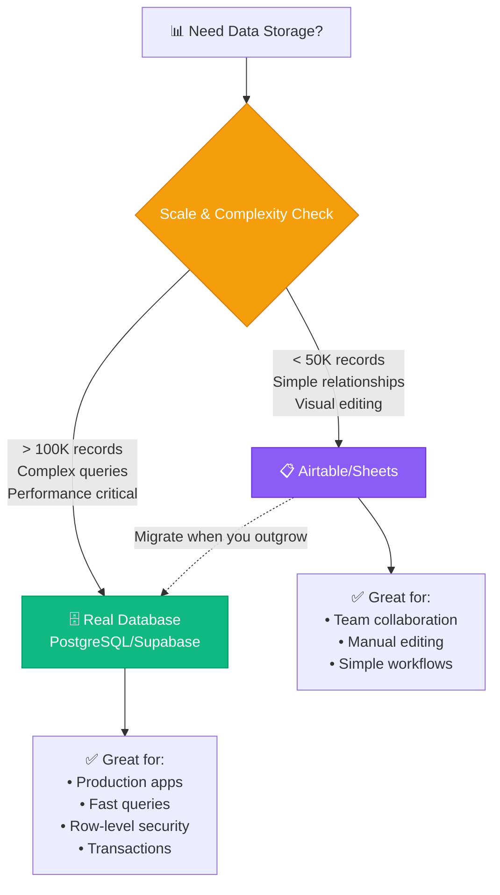
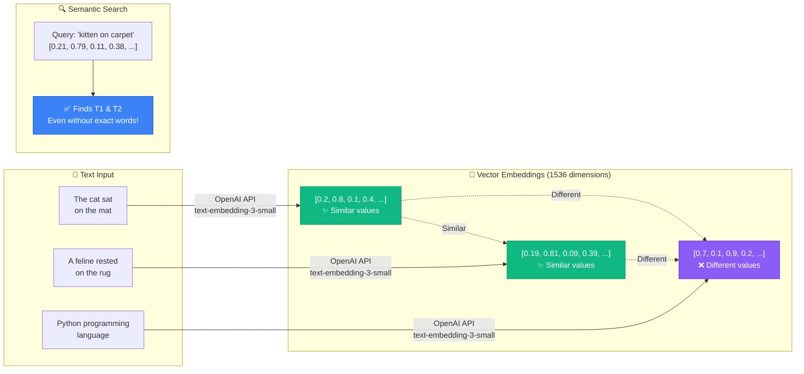
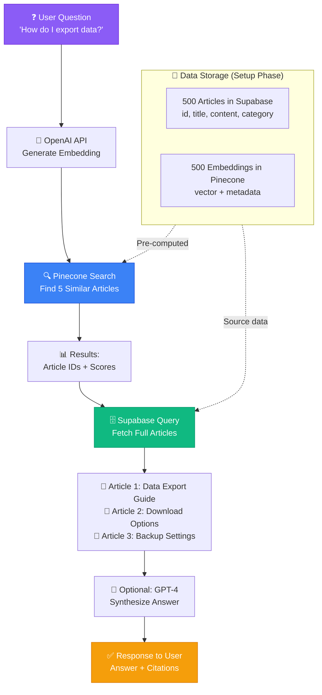

# 📘 MODULE 5: Data Layer

**Estimated Time:** 5-7 days
**Difficulty:** Intermediate
**Prerequisites:** Modules 1-4 (especially Module 4 on Interface Tools)

## 📖 Overview & Why This Matters

You've been building with Airtable and Google Sheets. They're great for getting started, but here's what happens when your AI operation starts scaling: You hit record limits. Performance gets slow. You need more complex queries. You want to search through thousands of documents by meaning, not just keywords. Suddenly, spreadsheets aren't enough.

This is where real databases and vector stores come in. Don't panic - you're not becoming a database administrator. You're becoming an AI Operator who knows how to use databases as powerful tools for AI applications. The difference is huge.

Real databases (like PostgreSQL via Supabase) give you unlimited scaling, millisecond query times, and the ability to handle complex data relationships that would make Airtable cry. Vector stores (like Pinecone or Chroma) give you the superpower of semantic search - finding information by meaning rather than exact text matches. This is what powers ChatGPT's ability to search through your documents, what makes RAG (Retrieval Augmented Generation) possible, and what separates amateur AI projects from professional ones.

Here's the career reality: AI Operators who can say "I built a RAG system with Supabase and Pinecone" get hired. Those who can only say "I use ChatGPT" do not. This module bridges that gap.

## 🎯 Learning Objectives

By the end of this module, you will:

- [ ] Understand when to use real databases vs. Airtable/Sheets
- [ ] Set up a Supabase project and create database tables without writing SQL
- [ ] Implement basic CRUD operations (Create, Read, Update, Delete) via Supabase API
- [ ] Understand vector embeddings and how they enable semantic search
- [ ] Set up a vector store (Pinecone or Chroma) for document search
- [ ] Build a simple RAG system that searches your knowledge base and generates answers
- [ ] Design data models that support AI workflows

## 🧠 Core Concepts

### Databases vs. Spreadsheets: The Real Difference



Spreadsheets are like keeping papers in folders. Databases are like having a librarian who can find anything instantly.

**Spreadsheets/Airtable are great when:**
- You have fewer than 50,000 records
- You need visual, manual editing
- Your team needs to collaborate directly on data
- Relationships are simple (one-to-many)

**Real databases are necessary when:**
- You need to handle 100,000+ records efficiently
- Performance matters (sub-second queries)
- You have complex relationships (many-to-many)
- You need transactional integrity (e.g., payments)
- You're building a product that users interact with directly
- You need row-level security (users can only see their data)

```quiz
title: Databases vs Spreadsheets Understanding
questions:
- question: When would you choose a real database over Airtable for a project?
  options: [You need to store 30K customer records with simple filtering, You're building a production app handling 200K+ records with complex queries, Your team of 5 needs to manually edit data collaboratively, You want a visual interface for non-technical team members]
  correct: 1
  explanation: Real databases like PostgreSQL/Supabase excel at handling large datasets (100K+ records) with complex queries and sub-second performance. Options A, C, and D are ideal use cases for Airtable/spreadsheets.
- question: What is the main advantage of row-level security in databases like Supabase?
  options: [It makes queries run faster, It allows users to only see and modify their own data, It reduces storage costs, It eliminates the need for API authentication]
  correct: 1
  explanation: Row-level security (RLS) policies ensure users can only access data they're authorized to see, making it essential for multi-tenant applications. It doesn't affect query speed, storage costs, or replace API authentication.
- question: Which scenario indicates you've outgrown spreadsheets?
  options: [You have 20K records and need team collaboration, Your queries are taking 5+ seconds and you need complex many-to-many relationships, You want to share data with external stakeholders, You need to create charts and visualizations]
  correct: 1
  explanation: Slow performance (5+ seconds) combined with complex relationships indicates you need a real database. The other scenarios can still be handled well by Airtable or Google Sheets.
- question: What does transactional integrity mean in the context of databases?
  options: [All transactions are logged for auditing, Multiple operations either all succeed or all fail together, Data is encrypted during transmission, Payments are processed securely]
  correct: 1
  explanation: Transactional integrity ensures that multiple related operations (like debiting one account and crediting another) either all complete successfully or all fail together, preventing inconsistent states. This is critical for payment systems and other scenarios requiring data consistency.
```

```task
title: Evaluate Your Current Data Storage
description: Take an existing project using Airtable or Google Sheets. Document: 1) Current record count, 2) Query performance issues (if any), 3) Data relationships, 4) Whether you need row-level security. Write a recommendation for whether to migrate to Supabase or stay with current solution.
xp: 10
```

### Understanding Supabase

Supabase is "Firebase for PostgreSQL." Translation: It's a service that gives you a powerful PostgreSQL database with a beautiful dashboard, instant APIs, authentication, and real-time subscriptions - all without needing to be a database expert.

Why Supabase specifically?
- **Free tier is generous** (500MB database, 50,000 monthly active users)
- **PostgreSQL under the hood** (industry-standard, powerful)
- **Instant APIs** (you create a table, you get an API endpoint automatically)
- **Built-in authentication** (we'll use this in Module 9)
- **Vector extension** (you can store and search embeddings in the same database)
- **Great documentation** (actually written for humans)

### Vector Embeddings: The Magic Behind Semantic Search



Here's the concept that unlocks modern AI: Every piece of text can be converted into a list of numbers (a vector) that represents its meaning. Similar meanings = similar numbers.

Example:
- "The cat sat on the mat" → [0.2, 0.8, 0.1, 0.4, ...]
- "A feline rested on the rug" → [0.19, 0.81, 0.09, 0.39, ...]
- "Python programming language" → [0.7, 0.1, 0.9, 0.2, ...]

Notice how the first two are numerically similar (because they mean the same thing), while the third is different. This is how AI can find relevant information even when you don't use the exact keywords.

```task
title: Generate Your First Embeddings
description: Use the OpenAI API to generate embeddings for 3 different pieces of text (at least 100 words each). Compare the embedding vectors - do similar texts produce similar vectors? Document your findings and calculate the cosine similarity between them.
xp: 15
```

### Vector Stores: Databases for Meaning

Regular databases search for exact matches or patterns. Vector stores search for similarity. This is the foundation of:

- **RAG systems** (finding relevant context before generating answers)
- **Semantic search** (search by meaning, not keywords)
- **Recommendation engines** (find similar products/content)
- **Duplicate detection** (find similar records even with different wording)

Popular vector stores:
- **Pinecone** - Managed service, easiest to use, pay-as-you-go
- **Chroma** - Open source, can run locally or in cloud
- **Supabase pgvector** - Extension that adds vector search to PostgreSQL
- **Weaviate** - Open source, more complex but very powerful

```quiz
title: Vector Embeddings and Semantic Search
questions:
- question: What is the primary purpose of converting text to vector embeddings?
  options: [To compress text data to save storage space, To enable semantic similarity search by representing meaning as numbers, To encrypt sensitive information for security, To translate text between different languages]
  correct: 1
  explanation: Vector embeddings convert text into numerical representations that capture semantic meaning, allowing systems to find conceptually similar content even without matching keywords. This is the foundation of semantic search and RAG systems.
- question: In a RAG system, when should embeddings be generated?
  options: [Every time a user makes a search query and for each document when it's first added, Only when the user performs a search, Only for documents when they're added to the knowledge base, At the end of each day in a batch process]
  correct: 0
  explanation: RAG systems pre-compute embeddings for all documents when they're added (stored in the vector database), and generate one embedding in real-time for each user query. This approach is efficient since you only generate one embedding per search instead of re-embedding your entire knowledge base.
- question: What makes vector search different from traditional keyword search?
  options: [Vector search is faster than keyword search, Vector search finds semantically similar content even without exact keyword matches, Vector search only works with numerical data, Vector search requires less storage space]
  correct: 1
  explanation: Vector search finds results based on semantic similarity - meaning you can search for "affordable car" and find documents about "budget vehicle" even though the keywords don't match. This is the key advantage over traditional keyword/exact-match search.
- question: Why would you use Pinecone instead of Supabase pgvector for a project?
  options: [Pinecone is always cheaper than pgvector, Pinecone is better optimized for large-scale vector search with millions of vectors, Pinecone can also store regular relational data, Pinecone doesn't require any technical setup]
  correct: 1
  explanation: Pinecone is purpose-built for vector search at scale and performs better with millions of vectors. pgvector is great for small-to-medium projects where you want vectors and regular data in one place, but Pinecone excels at high-volume vector operations.
- question: What is a common chunk size for embedding article content?
  options: [10-50 words per chunk, 300-500 words per chunk, 5000+ words per chunk, One sentence per chunk]
  correct: 1
  explanation: 300-500 words is a sweet spot for most article content - large enough to contain meaningful context, but small enough to remain focused on specific topics. Too small (sentences) loses context, too large (full 5000-word articles) dilutes relevance.
```

```task
title: Compare Vector Store Options
description: Research and create a comparison table for Pinecone, Chroma, and Supabase pgvector. Include: pricing for 100K vectors, ease of setup, performance characteristics, and when to use each. Choose which one you'd use for a specific project and justify your decision.
xp: 10
```

### Data Modeling for AI Workflows

When designing databases for AI systems, think about these patterns:

1. **Source + Generated Content Pattern**
   - Table for source material (articles, docs, etc.)
   - Table for AI-generated variants (summaries, rewrites)
   - Link them together

2. **Embeddings as First-Class Citizens**
   - Store the original text
   - Store its embedding vector
   - Store metadata (when created, which model, etc.)

3. **Audit Trails**
   - Track who (human or AI) made changes
   - Store versions of AI-generated content
   - Log prompts and responses

## 🛠️ Tools Deep Dive

### Supabase

**Best for:** Building applications with authentication, real-time features, and structured data
**When to use:** When you're graduating from Airtable to a real application
**Pricing:** Free tier: 500MB database, 1GB file storage, 50,000 active users
**Pros:**
- No server management needed
- Instant REST and GraphQL APIs
- Row-level security policies (users can only access their data)
- Real-time subscriptions (changes appear instantly)
- Built-in authentication and file storage
- Can add vector search with pgvector extension

**Cons:**
- PostgreSQL knowledge helpful (but not required)
- Free tier has usage limits
- Can get expensive at scale (but you'll be profitable by then)

**Getting Started:**
1. Sign up at supabase.com
2. Create a new project (takes 2 minutes to provision)
3. Use the Table Editor to create tables visually
4. Get your API keys from Project Settings
5. Start making API calls

### Pinecone

**Best for:** Vector search at scale, RAG systems, semantic search
**When to use:** When you need to search through thousands+ of documents by meaning
**Pricing:** Free tier: 1 index, 1GB storage, up to 100,000 vectors
**Pros:**
- Purpose-built for vectors (extremely fast)
- Managed service (no infrastructure)
- Simple API
- Excellent for production RAG systems
- Good free tier for learning and prototyping

**Cons:**
- Costs scale with number of vectors
- Only does vector search (need separate database for other data)
- Free tier limited to one index (one project)

**Getting Started:**
1. Sign up at pinecone.io
2. Create an index (specify dimension size, e.g., 1536 for OpenAI embeddings)
3. Generate embeddings using OpenAI API
4. Upload vectors to Pinecone
5. Query for similar vectors

### Chroma

**Best for:** Self-hosted vector search, development environments, full control
**When to use:** When you want to run locally or keep data on your own servers
**Pricing:** Free (open source)
**Pros:**
- Completely free
- Can run on your laptop
- Good for development and testing
- Simple Python API
- Can be deployed to cloud when ready

**Cons:**
- Need to manage hosting yourself for production
- Less battle-tested at scale than Pinecone
- Documentation not as polished

**Getting Started:**
```bash
pip install chromadb
```

Then in Python:
```python
import chromadb
client = chromadb.Client()
collection = client.create_collection("my_documents")
```

### Supabase pgvector Extension

**Best for:** When you want vectors and regular data in one database
**When to use:** Simpler projects where you don't need separate vector infrastructure
**Pricing:** Same as Supabase (free tier available)
**Pros:**
- All your data in one place
- SQL queries can combine vector search with regular filters
- No additional service to manage
- Good for small-to-medium projects

**Cons:**
- Not as optimized for vectors as Pinecone
- Slower at very large scale
- Limited to PostgreSQL

## 💡 Real Business Examples

### Example 1: Customer Support Knowledge Base

**Problem:** SaaS company with 500+ support articles. Support team was using keyword search, which missed 40% of relevant articles. Customers were getting frustrated with unhelpful search results.

**Bad Approach:** Elasticsearch with keyword matching. Searching for "how do I export data" wouldn't find articles about "downloading your information."



**Good Approach:**
1. Set up Supabase database with `articles` table (id, title, content, category, created_at)
2. Created Pinecone index for article embeddings
3. For each article, generated embedding using OpenAI API: `text-embedding-3-small`
4. Stored embeddings in Pinecone with metadata (article_id, category)
5. Built search flow:
   - User types question
   - Convert question to embedding
   - Query Pinecone for 5 most similar articles
   - Fetch full article details from Supabase
   - Display results with highlighted relevance

**Result:** Search success rate jumped from 60% to 92%. Support ticket volume dropped 30% because customers could find answers themselves. Support team response time improved because when they searched, they actually found relevant articles.

**Cost:** ~$20/month (Pinecone free tier + OpenAI embedding costs)

### Example 2: Content Recommendation Engine

**Problem:** Media company publishing 50 articles/week. Wanted to show "Related Articles" at the bottom of each post, but keyword matching was giving bad recommendations ("iPhone 15" article recommended "iPhone 14" instead of other mobile tech reviews).

**Bad Approach:** Tag-based system where someone manually tags articles. Slow, inconsistent, and misses subtle connections.

**Good Approach:**
1. Supabase table: `articles` (id, title, content, author, published_date)
2. Chroma vector store running on their server
3. Automation that runs when article is published:
   - Generate embedding of article content
   - Store in Chroma with article_id
   - Query Chroma for 10 most similar existing articles
   - Store these IDs in Supabase `related_articles` field
4. Frontend just reads `related_articles` field

**Result:** Click-through rate on related articles increased 2.5x. Readers spent 40% more time on site. Writer productivity increased because they could see similar past articles when writing.

**Cost:** $0 (Chroma self-hosted on existing server)

### Example 3: Sales Intelligence Platform

**Problem:** B2B sales team researching prospects by reading their websites, LinkedIn posts, and news articles. Taking 30+ minutes per prospect. Needed a system to instantly retrieve relevant information about companies.

**Bad Approach:** Bookmarking articles and using browser search. No way to search across everything by concept.

**Good Approach:**
1. Supabase tables:
   - `companies` (id, name, industry, website)
   - `research_documents` (id, company_id, source, content, date)
2. Pinecone index storing document embeddings
3. Scraper automation that:
   - Monitors news and social media for target companies
   - Stores full content in Supabase
   - Generates embedding and stores in Pinecone
4. Sales rep query interface:
   - "Show me companies struggling with data security"
   - Convert query to embedding
   - Search Pinecone across all documents
   - Aggregate results by company
   - Feed top excerpts to GPT-4: "Summarize this company's data security challenges"
   - Display company list with AI-generated summaries

**Result:** Research time per prospect dropped from 30 minutes to 3 minutes. Sales team could research 10x more prospects. Close rate increased 15% because reps had better context.

**Cost:** ~$150/month (Pinecone + OpenAI for embeddings and summaries)

## ⚠️ Common Pitfalls

### 1. **Embedding Everything Without a Strategy**
❌ "I'll just embed all my data and figure out how to use it later"
✅ Define your search use case first. What questions will users ask? What chunks of text make sense to embed?

### 2. **Making Chunks Too Large or Too Small**
❌ Embedding entire 5,000-word articles as one vector, or embedding every sentence separately
✅ Chunk text into coherent sections (300-500 words for articles, full records for short content)

### 3. **Not Storing Metadata with Vectors**
❌ Just storing text embeddings with no context about where they came from
✅ Store metadata: source_id, date, author, category, etc. so you can filter results

### 4. **Forgetting to Update Embeddings When Content Changes**
❌ Article gets updated but the embedding stays old, so search finds outdated version
✅ Re-embed content when it's modified, or mark old embeddings as deprecated

### 5. **Using Vectors When You Don't Need Them**
❌ Using vector search for exact match queries like "find all orders from this customer"
✅ Use regular database queries for exact matches, vectors for semantic similarity

### 6. **Not Testing Search Quality**
❌ Setting up vector search and assuming it works well
✅ Create a test set of queries and expected results. Measure precision and recall.

### 7. **Exposing Raw Database to Frontend**
❌ Letting your frontend app connect directly to database with full access
✅ Use Row-Level Security policies in Supabase, or create a backend API that validates requests

```quiz
title: RAG Systems and Best Practices
questions:
- question: What is the correct order of steps in a RAG (Retrieval Augmented Generation) system?
  options: [Generate answer → Search vectors → Embed query → Retrieve documents, Embed query → Search vectors → Retrieve documents → Generate answer, Search vectors → Embed query → Generate answer → Retrieve documents, Retrieve documents → Embed query → Search vectors → Generate answer]
  correct: 1
  explanation: The correct RAG flow is 1) Convert user query to embedding, 2) Search vector store for similar embeddings, 3) Retrieve full content from database using the matched IDs, 4) Generate answer using retrieved context. This ensures the AI has relevant information before generating a response.
- question: Why should you store metadata alongside vector embeddings in Pinecone?
  options: [To make embeddings more accurate, To enable filtering results before performing similarity search, To reduce storage costs, To improve embedding generation speed]
  correct: 1
  explanation: Metadata filtering allows you to narrow search scope before computing similarity (e.g., only search documents from a specific category or date range). This makes searches more relevant, faster, and more efficient.
- question: What is the idempotency principle when updating embeddings?
  options: [Embeddings should never be updated once created, The same document should always produce the same embedding, Operations should be safe to run multiple times without creating duplicates, Embeddings should be encrypted for security]
  correct: 2
  explanation: Idempotency means operations can be run multiple times safely. For embeddings, this means using "upsert" (update if exists, insert if not) instead of always inserting, preventing duplicate embeddings if a workflow runs twice.
- question: When should you re-generate embeddings for existing documents?
  options: [Every time a user performs a search, Never - embeddings are permanent, When the document content is modified or updated, At the end of each business day]
  correct: 2
  explanation: Embeddings must be regenerated whenever document content changes, otherwise search will return outdated information. Pre-computed embeddings are only valid as long as the source content remains unchanged.
```

```task
title: Design a Data Model for AI Workflows
description: Choose a real-world scenario (e.g., customer support, content management, e-commerce). Design a database schema that includes: 1) Source data tables, 2) AI-generated content tables, 3) Audit trail fields, 4) Embedding storage strategy. Document why you made each design decision.
xp: 15
```

```task
title: Set Up Your First Supabase Database
description: Create a free Supabase account and project. Build a simple database with at least 2 tables and a relationship between them. Practice CRUD operations using the Supabase dashboard. Document the table structure and insert 10 sample records.
xp: 10
```

## ✨ Pro Tips

### Tip 1: Use Hybrid Search

Don't choose between keyword search and vector search - use both! Query for exact matches AND semantic similarity, then combine results.

Example: User searches "refund policy"
- Keyword search finds anything with those exact words
- Vector search finds semantically similar content (return policy, money-back guarantee)
- Combine and deduplicate results

This catches both direct matches and conceptually related content.

### Tip 2: The Metadata Filtering Pattern

When searching vectors, use metadata filters to narrow results before doing similarity search. This makes searches more relevant and faster.

Example:
```javascript
// Instead of searching all 100,000 vectors
pinecone.query({
  vector: questionEmbedding,
  topK: 5
})

// Filter first, then search
pinecone.query({
  vector: questionEmbedding,
  topK: 5,
  filter: {
    category: { $eq: "technical-docs" },
    date: { $gte: "2024-01-01" }
  }
})
```

### Tip 3: Batch Your Embedding Calls

OpenAI's embedding API accepts arrays of text. Instead of making 100 API calls, make 1 call with 100 texts.

```javascript
// Slow: 100 API calls
for (let doc of documents) {
  const embedding = await openai.embeddings.create({
    input: doc.text,
    model: "text-embedding-3-small"
  });
}

// Fast: 1 API call
const embeddings = await openai.embeddings.create({
  input: documents.map(d => d.text),
  model: "text-embedding-3-small"
});
```

This is 100x faster and cheaper (fewer API overhead charges).

### Tip 4: Pre-compute Expensive Operations

Don't generate embeddings on every search. Pre-compute and store them.

Pattern:
1. When document is created/updated → generate embedding → store in vector DB
2. When user searches → generate query embedding → search pre-computed vectors

The only real-time embedding is the user's query (1 item), not your entire knowledge base.

### Tip 5: Use Supabase Edge Functions for Backend Logic

Instead of exposing your database directly, create Supabase Edge Functions (serverless functions) that handle logic securely.

Example edge function: `search-knowledge-base`
```javascript
// User calls: https://yourproject.supabase.co/functions/v1/search-knowledge-base
// Function handles:
// 1. Generate embedding of query
// 2. Search Pinecone
// 3. Fetch full records from Supabase
// 4. Return results
// User never gets direct database access
```

### Tip 6: The "Dual Write" Pattern for Migrations

When moving from Airtable to Supabase, don't do a big-bang migration. Use dual writes:

1. Keep writing to Airtable (your team's familiar interface)
2. ALSO write to Supabase (via automation)
3. Read from Supabase for your new features
4. Once stable, switch fully to Supabase

This lets you test without breaking everything.

### Tip 7: Start with Supabase pgvector, Graduate to Pinecone

For learning and small projects (< 50,000 vectors), use Supabase's pgvector extension. Everything in one place, simpler.

When you need to scale or it gets slow, migrate to Pinecone. The concepts are the same, just different endpoints.

```task
title: Build a Mini RAG System
description: Complete the module project or build your own simplified version. Must include: 1) Storage for at least 10 documents in Supabase, 2) Vector embeddings in Pinecone or Chroma, 3) Search functionality that retrieves relevant documents, 4) AI-generated answers with source citations. Test with 5 different queries and document results.
xp: 25
```

## 📝 Module Project: Build a Personal Knowledge Base with RAG

### Objective

Build a searchable knowledge base where you can store articles, notes, and documents, then ask questions and get AI-generated answers with source citations. This combines Supabase (structured data), Pinecone (vector search), and OpenAI (embeddings + generation).

### Step-by-Step Instructions

**Step 1: Set Up Supabase (30 minutes)**

1. Go to supabase.com and create a free account
2. Create a new project (name it "knowledge-base")
3. Wait 2 minutes for provisioning
4. Go to Table Editor and create a table called `documents`:
   - `id` (int8, primary key, auto-increment)
   - `title` (text)
   - `content` (text)
   - `source` (text) - URL or filename
   - `category` (text)
   - `created_at` (timestamptz, default: now())
5. Create a table called `queries`:
   - `id` (int8, primary key, auto-increment)
   - `query_text` (text)
   - `answer` (text)
   - `source_documents` (jsonb) - will store array of doc IDs used
   - `created_at` (timestamptz, default: now())
6. Go to Project Settings → API and copy:
   - Project URL
   - `anon` public key

**Step 2: Set Up Pinecone (30 minutes)**

1. Go to pinecone.io and create account
2. Create an index:
   - Name: "knowledge-base"
   - Dimensions: 1536 (for OpenAI's `text-embedding-3-small`)
   - Metric: cosine
   - Cloud: aws, region: us-east-1 (free tier)
3. Copy your API key from API Keys section
4. Note your environment name (shown in index details)

**Step 3: Set Up Your Development Environment (20 minutes)**

Create a new folder and install dependencies:

```bash
mkdir knowledge-base-rag
cd knowledge-base-rag
npm init -y
npm install @supabase/supabase-js @pinecone-database/pinecone openai dotenv
```

Create `.env` file:
```
SUPABASE_URL=your_project_url
SUPABASE_KEY=your_anon_key
PINECONE_API_KEY=your_pinecone_key
PINECONE_ENVIRONMENT=your_environment
OPENAI_API_KEY=your_openai_key
```

**Step 4: Create Document Ingestion Script (45 minutes)**

Create `ingest.js`:

```javascript
import { createClient } from '@supabase/supabase-js';
import { Pinecone } from '@pinecone-database/pinecone';
import OpenAI from 'openai';
import 'dotenv/config';

const supabase = createClient(
  process.env.SUPABASE_URL,
  process.env.SUPABASE_KEY
);

const pinecone = new Pinecone({
  apiKey: process.env.PINECONE_API_KEY
});

const openai = new OpenAI({
  apiKey: process.env.OPENAI_API_KEY
});

async function ingestDocument(title, content, source, category) {
  // 1. Store in Supabase
  const { data: doc, error } = await supabase
    .from('documents')
    .insert({ title, content, source, category })
    .select()
    .single();

  if (error) throw error;

  // 2. Generate embedding
  const embedding = await openai.embeddings.create({
    input: content,
    model: "text-embedding-3-small"
  });

  // 3. Store in Pinecone
  const index = pinecone.index('knowledge-base');
  await index.upsert([{
    id: `doc-${doc.id}`,
    values: embedding.data[0].embedding,
    metadata: {
      title: title,
      category: category,
      source: source
    }
  }]);

  console.log(`✅ Ingested: ${title}`);
  return doc.id;
}

// Example usage
ingestDocument(
  "Understanding RAG Systems",
  "Retrieval Augmented Generation (RAG) is a technique that combines...",
  "https://example.com/rag-guide",
  "AI/ML"
).then(id => console.log(`Document ID: ${id}`));
```

Test it by running: `node ingest.js`

**Step 5: Create Query/Search Script (60 minutes)**

Create `search.js`:

```javascript
import { createClient } from '@supabase/supabase-js';
import { Pinecone } from '@pinecone-database/pinecone';
import OpenAI from 'openai';
import 'dotenv/config';

const supabase = createClient(
  process.env.SUPABASE_URL,
  process.env.SUPABASE_KEY
);

const pinecone = new Pinecone({
  apiKey: process.env.PINECONE_API_KEY
});

const openai = new OpenAI({
  apiKey: process.env.OPENAI_API_KEY
});

async function queryKnowledgeBase(question) {
  console.log(`🔍 Searching for: ${question}\n`);

  // 1. Convert question to embedding
  const questionEmbedding = await openai.embeddings.create({
    input: question,
    model: "text-embedding-3-small"
  });

  // 2. Search Pinecone for similar documents
  const index = pinecone.index('knowledge-base');
  const searchResults = await index.query({
    vector: questionEmbedding.data[0].embedding,
    topK: 3,
    includeMetadata: true
  });

  // 3. Fetch full document content from Supabase
  const docIds = searchResults.matches.map(m =>
    parseInt(m.id.replace('doc-', ''))
  );

  const { data: documents } = await supabase
    .from('documents')
    .select('*')
    .in('id', docIds);

  // 4. Create context for GPT
  const context = documents.map((doc, i) =>
    `[${i + 1}] ${doc.title}\n${doc.content}\n`
  ).join('\n');

  // 5. Generate answer with GPT
  const completion = await openai.chat.completions.create({
    model: "gpt-4o-mini",
    messages: [{
      role: "system",
      content: "You are a helpful assistant. Answer questions based on the provided context. Cite sources by number [1], [2], etc."
    }, {
      role: "user",
      content: `Context:\n${context}\n\nQuestion: ${question}\n\nAnswer:`
    }],
    temperature: 0.7
  });

  const answer = completion.choices[0].message.content;

  // 6. Store query and answer in Supabase
  await supabase.from('queries').insert({
    query_text: question,
    answer: answer,
    source_documents: docIds
  });

  // 7. Display results
  console.log('📄 Sources:');
  documents.forEach((doc, i) => {
    console.log(`  [${i + 1}] ${doc.title} (${doc.source})`);
  });

  console.log(`\n💡 Answer:\n${answer}\n`);

  return { answer, sources: documents };
}

// Example usage
const question = process.argv[2] || "What is RAG?";
queryKnowledgeBase(question);
```

Test it: `node search.js "How does semantic search work?"`

**Step 6: Add Sample Documents (30 minutes)**

Create `seed-data.js` with 10-15 sample documents about topics you're interested in. Use ChatGPT to generate them:

**Prompt for ChatGPT:**
```
Generate 10 sample documents for a knowledge base about AI operations. Each document should have:
- Title (concise)
- Content (200-300 words explaining a concept)
- Category (e.g., "AI/ML", "Tools", "Best Practices")

Format as JavaScript array of objects with keys: title, content, category
```

Then ingest them all:
```javascript
import { ingestDocument } from './ingest.js';

const sampleDocs = [
  // ... paste ChatGPT output
];

for (const doc of sampleDocs) {
  await ingestDocument(
    doc.title,
    doc.content,
    'Sample Data',
    doc.category
  );
}
```

**Step 7: Test Your RAG System (30 minutes)**

Run various queries and verify:

```bash
node search.js "What are best practices for prompt engineering?"
node search.js "How do I choose between different AI models?"
node search.js "What is the difference between Pinecone and Chroma?"
```

Check that:
- Relevant documents are retrieved
- Answers cite sources correctly
- Queries are logged in Supabase `queries` table

**Step 8: Build a Simple Web Interface (Optional - 60 minutes)**

If you know basic HTML/JS, create `index.html`:

```html
<!DOCTYPE html>
<html>
<head>
  <title>Knowledge Base</title>
  <script src="https://cdn.jsdelivr.net/npm/@supabase/supabase-js@2"></script>
</head>
<body>
  <h1>Ask a Question</h1>
  <textarea id="question" rows="3" cols="50"></textarea>
  <button onclick="search()">Search</button>
  <div id="results"></div>

  <script>
    // Call your search.js via Supabase Edge Function
    // Or implement the logic here
  </script>
</body>
</html>
```

### Success Criteria

✅ You have a working Supabase database storing documents
✅ You have a Pinecone index storing document embeddings
✅ You can ingest new documents (store in both places)
✅ You can ask questions and get AI-generated answers
✅ Answers cite which documents they came from
✅ The system works with at least 10 sample documents
✅ You understand the complete RAG flow: query → embed → search → retrieve → generate

## 📚 Resources & Next Steps

### Recommended Reading
- Supabase Documentation (https://supabase.com/docs)
- Pinecone Documentation (https://docs.pinecone.io)
- OpenAI Embeddings Guide (https://platform.openai.com/docs/guides/embeddings)
- "What is RAG?" by LangChain (https://python.langchain.com)

### Tools & Links
- Supabase (https://supabase.com) - Free tier: 500MB database
- Pinecone (https://pinecone.io) - Free tier: 100K vectors
- Chroma (https://www.trychroma.com) - Open source alternative
- pgvector (https://github.com/pgvector/pgvector) - PostgreSQL extension

### Communities
- Supabase Discord (https://discord.supabase.com)
- Pinecone Community (https://community.pinecone.io)
- r/vectordatabase on Reddit

### What's Next?

In Module 6 (Automation Layer), you'll learn to connect these databases to automation tools like Make and n8n, so you can build workflows that automatically ingest documents, update embeddings, and trigger searches - without manual script running.

## ✅ Module Completion Checklist

Before moving to Module 6, you should be able to confidently say "yes" to all of these:

- [ ] I understand the difference between regular databases and vector stores
- [ ] I've created a Supabase project and built tables using the UI
- [ ] I've set up a Pinecone index and uploaded vectors
- [ ] I understand what embeddings are and how they represent meaning
- [ ] I've built a working RAG system that can answer questions
- [ ] I can explain the complete flow: embed → store → search → retrieve → generate
- [ ] I know when to use Supabase vs. Airtable vs. traditional PostgreSQL
- [ ] I understand metadata filtering and why it's important for vector search
