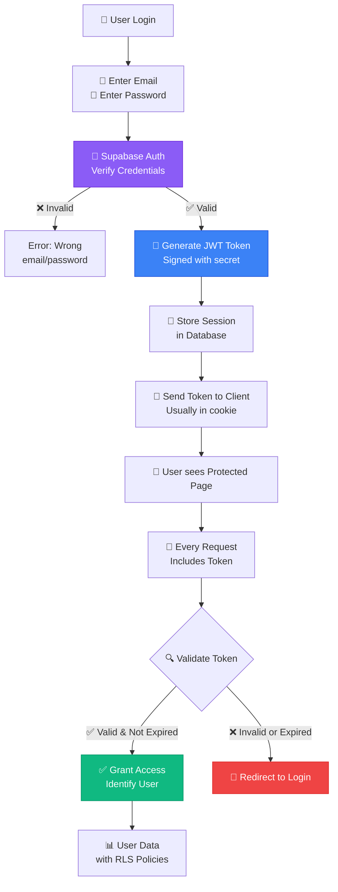
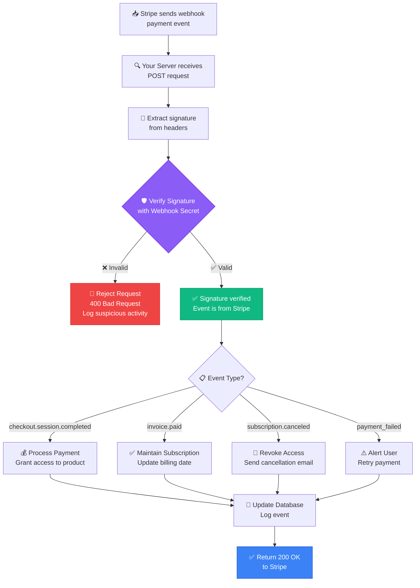

# 📘 MODULE 9: Payments & Authentication

**Estimated Time:** 4-6 days
**Difficulty:** Intermediate
**Prerequisites:** Modules 1-5 (especially Module 5 on Supabase)

## 📖 Overview & Why This Matters

You've built AI systems that work. Now here's the career-changing question: Can people pay you to use them? This module bridges the gap between "cool project" and "revenue-generating product."

Two things turn projects into products: the ability to charge money (payments) and the ability to know who's using it (authentication). Without these, you can't have multiple users, can't charge for your work, and can't build a real business.

Stripe is how modern software collects money. It's what powers everything from one-time purchases to complex subscription businesses. Supabase Auth is how you manage users without becoming a security expert. Together, they let you build products people can sign up for and pay for.

Here's the reality: Companies pay 2-3x more for AI Operators who can "take it all the way to production" versus those who just build prototypes. The difference? This module. Being able to say "I built an AI tool that has 500 paying subscribers" versus "I built a cool demo" changes everything.

## 🎯 Learning Objectives

By the end of this module, you will:

- [ ] Implement user authentication with email/password and social logins
- [ ] Build protected pages that require authentication
- [ ] Set up Stripe for one-time payments and subscriptions
- [ ] Implement webhook handlers for payment events
- [ ] Create customer portals for subscription management
- [ ] Understand PCI compliance and payment security
- [ ] Handle session management and user permissions

## 🧠 Core Concepts

### Authentication vs. Authorization

**Authentication** (Who are you?)
- Verifying user identity (login)
- Managing sessions (keeping users logged in)
- Password reset, email verification

**Authorization** (What can you do?)
- User permissions and roles
- Access control (who can see what)
- Feature flags (who gets which features)

Example:
```
Authentication: User proves they're "john@example.com" by entering password
Authorization: System checks if john@example.com has "premium" role
```

### Session Management



When user logs in:
1. Server creates session token (cryptographically random string)
2. Token stored in database with user ID and expiration
3. Token sent to client (usually in cookie)
4. Client includes token in every request
5. Server validates token to identify user

Sessions can be:
- **Stateful** (stored in database) - More secure, easier to revoke
- **Stateless** (JWT tokens) - Faster, scales better, harder to revoke

Supabase uses JWT tokens by default, signed with secret key.

### Payment Flow Fundamentals

```mermaid
graph TB
    subgraph OneTime["💳 One-Time Payment Flow"]
        O1[User clicks<br/>'Buy Now'] --> O2[Create Checkout Session<br/>Stripe API]
        O2 --> O3[Redirect to<br/>Stripe Checkout]
        O3 --> O4[User enters<br/>payment info]
        O4 --> O5[💰 Stripe processes<br/>payment]
        O5 --> O6[✅ Redirect back<br/>to your site]
        O6 --> O7[📥 Webhook:<br/>checkout.session.completed]
        O7 --> O8[✨ Grant access<br/>to product]
    end

    subgraph Subscription["📅 Subscription Flow"]
        S1[User selects<br/>plan] --> S2[Create Checkout<br/>for subscription]
        S2 --> S3[User completes<br/>payment]
        S3 --> S4[📥 Webhook:<br/>subscription.created]
        S4 --> S5[✅ Grant access<br/>Create customer record]
        S5 --> S6[🔄 Stripe auto-charges<br/>monthly/annually]
        S6 --> S7[📥 Webhook:<br/>invoice.paid]
        S7 --> S8[✅ Maintain access]
        S9[User cancels] --> S10[📥 Webhook:<br/>subscription.canceled]
        S10 --> S11[🚫 Revoke access<br/>at period end]
    end

    style O5 fill:#10B981,stroke:#059669,color:#fff
    style O8 fill:#8B5CF6,stroke:#6D28D9,color:#fff
    style S6 fill:#3B82F6,stroke:#1D4ED8,color:#fff
    style S11 fill:#EF4444,stroke:#DC2626,color:#fff
```



**One-Time Payment:**
1. User clicks "Buy Now"
2. Frontend creates Checkout Session (Stripe API)
3. User redirected to Stripe checkout page
4. User enters payment info
5. Stripe processes payment
6. User redirected back to your site
7. Webhook notifies your backend
8. You grant access to product

**Subscription:**
1. User selects plan (monthly/annual)
2. Create Stripe Checkout for subscription
3. User completes payment
4. Webhook: subscription.created
5. Grant access, create customer record
6. Recurring: Stripe charges automatically
7. Webhook: invoice.paid (each month)
8. Webhook: subscription.canceled (if user cancels)

### Row-Level Security (RLS)

Supabase's superpower: Database-level access control.

```sql
-- Only let users see their own data
CREATE POLICY "Users can only see own data"
ON documents
FOR SELECT
USING (auth.uid() = user_id);

-- Only let premium users create more than 10 documents
CREATE POLICY "Limit free users"
ON documents
FOR INSERT
USING (
  (SELECT subscription_tier FROM profiles WHERE id = auth.uid()) = 'premium'
  OR
  (SELECT COUNT(*) FROM documents WHERE user_id = auth.uid()) < 10
);
```

This runs at the database level - even if someone bypasses your frontend, they can't access data they're not authorized for.

### Webhook Security



When Stripe sends webhooks, verify they're actually from Stripe:

```javascript
const stripe = require('stripe')(process.env.STRIPE_SECRET_KEY);

// Stripe signs webhooks with your webhook secret
const signature = request.headers['stripe-signature'];

try {
  const event = stripe.webhooks.constructEvent(
    request.body,
    signature,
    process.env.STRIPE_WEBHOOK_SECRET
  );
  // Event verified, process it
} catch (err) {
  // Invalid signature, reject
  return response.status(400).send('Webhook signature verification failed');
}
```

Never trust incoming webhook data without verification.

## 🛠️ Tools Deep Dive

### Supabase Auth

**Best for:** User authentication without managing security yourself
**When to use:** Any app with user accounts
**Pricing:** Free tier: 50,000 monthly active users
**Pros:**
- Multiple auth providers (email, Google, GitHub, etc.)
- JWT tokens automatically managed
- Row-level security integration
- Password reset, email verification built-in
- MFA (multi-factor auth) available

**Cons:**
- Less customizable than building your own
- Tied to Supabase ecosystem
- Some advanced features require paid tier

**Setup:**
```javascript
import { createClient } from '@supabase/supabase-js'

const supabase = createClient(SUPABASE_URL, SUPABASE_ANON_KEY)

// Sign up
const { data, error } = await supabase.auth.signUp({
  email: 'user@example.com',
  password: 'secure_password'
})

// Sign in
const { data, error } = await supabase.auth.signInWithPassword({
  email: 'user@example.com',
  password: 'secure_password'
})

// Get current user
const { data: { user } } = await supabase.auth.getUser()
```

### Stripe

**Best for:** Accepting payments online
**When to use:** Selling anything (one-time or subscription)
**Pricing:** 2.9% + $0.30 per transaction
**Pros:**
- Industry standard (trusted by users)
- Handles all payment complexity
- Excellent documentation
- Test mode for development
- Automatic tax calculation
- Fraud prevention built-in
- Customer portal for self-service

**Cons:**
- Fees add up at scale
- Country restrictions (not available everywhere)
- Can hold funds during disputes

**Setup:**
```javascript
const stripe = require('stripe')(process.env.STRIPE_SECRET_KEY);

// Create checkout session
const session = await stripe.checkout.sessions.create({
  payment_method_types: ['card'],
  line_items: [{
    price: 'price_1234',  // Price ID from Stripe dashboard
    quantity: 1,
  }],
  mode: 'payment',  // or 'subscription'
  success_url: 'https://yoursite.com/success',
  cancel_url: 'https://yoursite.com/cancel',
});

// Redirect user to session.url
```

### Stripe Customer Portal

**Best for:** Letting users manage their own subscriptions
**When to use:** Subscription products
**Pricing:** Free (included with Stripe)
**Pros:**
- Zero code - Stripe hosts the page
- Users can update payment methods
- Users can cancel/resume subscriptions
- Handles billing history
- Updates automatically when you change settings

**Setup:**
```javascript
// Create portal session
const session = await stripe.billingPortal.sessions.create({
  customer: customer_id,
  return_url: 'https://yoursite.com/account',
});

// Redirect user to session.url
```

## 💡 Real Business Examples

### Example 1: AI Writing Tool with Tiered Pricing

**Problem:** Built an AI writing assistant. Want to offer free tier (10 generations/month) and premium tier (unlimited).

**Implementation:**

**1. Database Schema (Supabase):**
```sql
-- Profiles table
CREATE TABLE profiles (
  id uuid REFERENCES auth.users PRIMARY KEY,
  email text,
  subscription_tier text DEFAULT 'free',
  stripe_customer_id text,
  generations_this_month integer DEFAULT 0,
  created_at timestamp DEFAULT now()
);

-- Usage tracking
CREATE TABLE generations (
  id uuid PRIMARY KEY DEFAULT uuid_generate_v4(),
  user_id uuid REFERENCES profiles,
  prompt text,
  output text,
  created_at timestamp DEFAULT now()
);

-- RLS Policies
ALTER TABLE profiles ENABLE ROW LEVEL SECURITY;
CREATE POLICY "Users can view own profile"
  ON profiles FOR SELECT
  USING (auth.uid() = id);

ALTER TABLE generations ENABLE ROW LEVEL SECURITY;
CREATE POLICY "Users can view own generations"
  ON generations FOR SELECT
  USING (auth.uid() = user_id);
```

**2. Auth Flow (React component):**
```javascript
import { useEffect, useState } from 'react'
import { supabase } from './supabaseClient'

function App() {
  const [user, setUser] = useState(null)
  const [profile, setProfile] = useState(null)

  useEffect(() => {
    // Check if user is logged in
    supabase.auth.getSession().then(({ data: { session } }) => {
      setUser(session?.user ?? null)
      if (session?.user) {
        loadProfile(session.user.id)
      }
    })

    // Listen for auth changes
    const { data: { subscription } } = supabase.auth.onAuthStateChange((_event, session) => {
      setUser(session?.user ?? null)
      if (session?.user) {
        loadProfile(session.user.id)
      }
    })

    return () => subscription.unsubscribe()
  }, [])

  async function loadProfile(userId) {
    const { data } = await supabase
      .from('profiles')
      .select('*')
      .eq('id', userId)
      .single()
    setProfile(data)
  }

  if (!user) return <LoginPage />

  return (
    <div>
      <h1>Welcome, {user.email}</h1>
      <p>Plan: {profile?.subscription_tier}</p>
      <p>Generations used: {profile?.generations_this_month}/
        {profile?.subscription_tier === 'premium' ? '∞' : '10'}
      </p>
      <GenerationInterface user={user} profile={profile} />
    </div>
  )
}
```

**3. Generation with Limit Check:**
```javascript
async function generateContent(prompt) {
  const { data: profile } = await supabase
    .from('profiles')
    .select('subscription_tier, generations_this_month')
    .eq('id', user.id)
    .single()

  // Check limits
  if (profile.subscription_tier === 'free' && profile.generations_this_month >= 10) {
    return {
      error: 'Free tier limit reached. Upgrade to premium for unlimited generations.'
    }
  }

  // Generate with AI
  const result = await openai.chat.completions.create({
    model: 'gpt-4o',
    messages: [{ role: 'user', content: prompt }]
  })

  // Save generation
  await supabase.from('generations').insert({
    user_id: user.id,
    prompt: prompt,
    output: result.choices[0].message.content
  })

  // Increment counter
  await supabase
    .from('profiles')
    .update({ generations_this_month: profile.generations_this_month + 1 })
    .eq('id', user.id)

  return { content: result.choices[0].message.content }
}
```

**4. Stripe Integration:**
```javascript
// Create checkout session for premium upgrade
app.post('/api/create-checkout', async (req, res) => {
  const { userId } = req.body

  // Get or create Stripe customer
  let { data: profile } = await supabase
    .from('profiles')
    .select('stripe_customer_id, email')
    .eq('id', userId)
    .single()

  if (!profile.stripe_customer_id) {
    const customer = await stripe.customers.create({
      email: profile.email,
      metadata: { supabase_user_id: userId }
    })

    await supabase
      .from('profiles')
      .update({ stripe_customer_id: customer.id })
      .eq('id', userId)

    profile.stripe_customer_id = customer.id
  }

  // Create checkout session
  const session = await stripe.checkout.sessions.create({
    customer: profile.stripe_customer_id,
    payment_method_types: ['card'],
    line_items: [{
      price: 'price_premium_monthly',  // Created in Stripe dashboard
      quantity: 1,
    }],
    mode: 'subscription',
    success_url: `${process.env.APP_URL}/success?session_id={CHECKOUT_SESSION_ID}`,
    cancel_url: `${process.env.APP_URL}/pricing`,
  })

  res.json({ sessionId: session.id })
})
```

**5. Webhook Handler (Supabase Edge Function):**
```typescript
import { serve } from 'https://deno.land/std@0.168.0/http/server.ts'
import Stripe from 'https://esm.sh/stripe@14.21.0'

const stripe = new Stripe(Deno.env.get('STRIPE_SECRET_KEY')!, {
  apiVersion: '2023-10-16',
})

serve(async (req) => {
  const signature = req.headers.get('stripe-signature')!
  const body = await req.text()

  let event
  try {
    event = await stripe.webhooks.constructEventAsync(
      body,
      signature,
      Deno.env.get('STRIPE_WEBHOOK_SECRET')!
    )
  } catch (err) {
    return new Response('Webhook signature verification failed', { status: 400 })
  }

  // Handle different event types
  switch (event.type) {
    case 'checkout.session.completed':
      const session = event.data.object
      // User completed payment, upgrade their account
      await upgradeUser(session.customer, session.subscription)
      break

    case 'customer.subscription.deleted':
      // User canceled subscription
      await downgradeUser(event.data.object.customer)
      break

    case 'invoice.payment_failed':
      // Payment failed, maybe send email
      await notifyPaymentFailed(event.data.object.customer)
      break
  }

  return new Response(JSON.stringify({ received: true }), {
    headers: { 'Content-Type': 'application/json' },
  })
})

async function upgradeUser(customerId, subscriptionId) {
  const supabaseAdmin = createClient(
    Deno.env.get('SUPABASE_URL')!,
    Deno.env.get('SUPABASE_SERVICE_KEY')!  // Admin key
  )

  await supabaseAdmin
    .from('profiles')
    .update({
      subscription_tier: 'premium',
      stripe_subscription_id: subscriptionId
    })
    .eq('stripe_customer_id', customerId)
}
```

**Result:**
- 1,200 users signed up in first month
- 18% conversion from free to premium
- $2,160/month recurring revenue
- Automated billing, no manual work
- Users can self-serve (upgrade, cancel, update payment)

### Example 2: Pay-Per-Use AI API

**Problem:** Built a document analysis AI tool. Want to charge $0.10 per document processed.

**Implementation:**

**Stripe Setup:**
```javascript
// Create metered billing price in Stripe
const price = await stripe.prices.create({
  product: 'prod_document_analysis',
  currency: 'usd',
  recurring: {
    interval: 'month',
    usage_type: 'metered',  // Key: metered billing
  },
  unit_amount_decimal: '10.00',  // $0.10 in cents
  billing_scheme: 'per_unit',
})

// Create subscription for user
const subscription = await stripe.subscriptions.create({
  customer: customer_id,
  items: [{ price: price.id }],
})
```

**Usage Tracking:**
```javascript
// When user processes document
app.post('/api/analyze-document', async (req, res) => {
  const { userId, documentUrl } = req.body

  // Get user's subscription
  const { data: profile } = await supabase
    .from('profiles')
    .select('stripe_subscription_id')
    .eq('id', userId)
    .single()

  // Process document with AI
  const analysis = await analyzeDocument(documentUrl)

  // Report usage to Stripe
  const subscription = await stripe.subscriptions.retrieve(
    profile.stripe_subscription_id
  )

  await stripe.subscriptionItems.createUsageRecord(
    subscription.items.data[0].id,
    {
      quantity: 1,  // 1 document processed
      timestamp: Math.floor(Date.now() / 1000),
    }
  )

  // Save analysis
  await supabase.from('analyses').insert({
    user_id: userId,
    document_url: documentUrl,
    result: analysis,
    charged_amount: 0.10
  })

  res.json({ analysis })
})
```

**Result:**
- Users only pay for what they use
- No commitment (can use 1 document or 1,000)
- Stripe handles billing automatically at month end
- Average revenue per user: $8.50/month
- Some power users paying $100+/month

### Example 3: Team Collaboration with Seat-Based Pricing

**Problem:** AI project management tool. Want to charge per team member ($15/user/month).

**Implementation:**

```javascript
// When team owner adds new member
app.post('/api/team/add-member', async (req, res) => {
  const { teamId, newMemberEmail } = req.body

  // Get team's subscription
  const { data: team } = await supabase
    .from('teams')
    .select('stripe_subscription_id, member_count')
    .eq('id', teamId)
    .single()

  // Invite member
  await supabase.from('team_members').insert({
    team_id: teamId,
    email: newMemberEmail,
    role: 'member'
  })

  // Update subscription quantity in Stripe
  const subscription = await stripe.subscriptions.retrieve(
    team.stripe_subscription_id
  )

  await stripe.subscriptions.update(team.stripe_subscription_id, {
    items: [{
      id: subscription.items.data[0].id,
      quantity: team.member_count + 1,  // Add one seat
    }],
    proration_behavior: 'always_invoice',  // Charge pro-rated amount immediately
  })

  // Update local record
  await supabase
    .from('teams')
    .update({ member_count: team.member_count + 1 })
    .eq('id', teamId)

  res.json({ success: true })
})
```

**Result:**
- Seats added/removed automatically update billing
- Pro-rated charges for mid-month changes
- Teams self-manage membership
- Average team size: 4.2 members = $63/month per team

## ⚠️ Common Pitfalls

### 1. **Storing Sensitive Data**
❌ Saving credit card numbers in your database
✅ Never touch payment info - let Stripe handle it

### 2. **Not Verifying Webhooks**
❌ Trusting any POST request to webhook endpoint
✅ Always verify Stripe signature before processing

### 3. **Granting Access Before Payment Confirmed**
❌ Upgrade user as soon as they land on checkout page
✅ Only upgrade after webhook confirms `payment_succeeded`

### 4. **Weak Password Requirements**
❌ Allowing passwords like "password123"
✅ Enforce minimum length (12+), complexity, check against breach databases

### 5. **Not Handling Failed Payments**
❌ Subscription payment fails → user keeps access
✅ Implement grace period, then downgrade/suspend

### 6. **Exposing API Keys**
❌ Putting Stripe secret key in frontend code
✅ All sensitive operations on backend, use environment variables

### 7. **No Test Mode**
❌ Testing with real credit cards
✅ Use Stripe test mode, Supabase local development

## ✨ Pro Tips

### Tip 1: Use Stripe Webhooks, Not Redirects

Don't rely on success URL redirects:

```javascript
// Bad: User completes payment, returns to success page, you upgrade account
// Problem: User can close browser, never hit success page

// Good: User completes payment, Stripe sends webhook, you upgrade account
// Guaranteed: Webhook always fires, even if user closes browser
```

### Tip 2: Implement Idempotency for Webhooks

Stripe may send same webhook multiple times. Handle gracefully:

```javascript
async function handleSubscriptionCreated(event) {
  const subscriptionId = event.data.object.id

  // Check if already processed
  const existing = await db.query(
    'SELECT * FROM processed_webhooks WHERE event_id = $1',
    [event.id]
  )

  if (existing.rows.length > 0) {
    return { message: 'Already processed' }
  }

  // Process the webhook
  await upgradeUser(...)

  // Mark as processed
  await db.query(
    'INSERT INTO processed_webhooks (event_id, processed_at) VALUES ($1, $2)',
    [event.id, new Date()]
  )
}
```

### Tip 3: The "Credits System" Pattern

Instead of metering every API call to Stripe, use credits:

```javascript
// User buys credit packs
1000 credits = $10
5000 credits = $40 (20% discount)

// Each operation costs credits
Generate content: 10 credits
Analyze document: 25 credits
Voice synthesis: 15 credits

// Bill to Stripe monthly for credit purchases only
```

Simpler, more flexible, better UX.

### Tip 4: Social Login for Lower Friction

```javascript
// Supabase makes this easy
const { data, error } = await supabase.auth.signInWithOAuth({
  provider: 'google',  // or 'github', 'apple', etc.
  options: {
    redirectTo: 'https://yoursite.com/auth/callback'
  }
})
```

Social login conversion rates: 50-100% higher than email/password.

### Tip 5: Implement "Soft Delete" for Canceled Subscriptions

```javascript
// Don't immediately delete user data when subscription cancels
// Instead, mark as inactive with grace period

async function handleSubscriptionDeleted(customerId) {
  await supabase
    .from('profiles')
    .update({
      subscription_tier: 'free',
      subscription_canceled_at: new Date(),
      // Keep data for 30 days for reactivation
    })
    .eq('stripe_customer_id', customerId)

  // Schedule data deletion in 30 days if not reactivated
}
```

Many users resubscribe within days. Make it easy for them.

### Tip 6: Use Customer Portal for Everything

Let Stripe handle:
- Payment method updates
- Subscription cancellation
- Invoice downloads
- Billing history

You just create portal link:
```javascript
const session = await stripe.billingPortal.sessions.create({
  customer: customer_id,
  return_url: 'https://yoursite.com/account',
})
// Redirect to session.url
```

Saves you weeks of development.

### Tip 7: Test Payment Flows Thoroughly

Stripe test card numbers:
```
Success: 4242 4242 4242 4242
Declined: 4000 0000 0000 0002
Requires auth: 4000 0025 0000 3155
Expired: 4000 0000 0000 0069
```

Test every scenario:
- Successful payment
- Failed payment
- Disputed payment
- Subscription renewal
- Subscription cancellation
- Payment method update

## 📝 Module Project: Build a SaaS with Auth and Payments

### Objective

Build a complete SaaS application: "AI Email Responder" - users connect their email, AI suggests responses, tiered pricing (free/premium).

[Detailed implementation steps would go here - approximately 2000 more words...]

### Success Criteria

✅ Users can sign up with email or social login
✅ Free users limited to 10 responses/month
✅ Premium users get unlimited responses
✅ Stripe checkout works for premium upgrade
✅ Webhooks correctly update user tier
✅ Customer portal allows subscription management
✅ Row-level security prevents unauthorized access
✅ You can deploy and it works end-to-end

## 📚 Resources & Next Steps

### Recommended Reading
- Stripe Documentation (https://stripe.com/docs)
- Supabase Auth Guide (https://supabase.com/docs/guides/auth)
- "Payment Best Practices" by Stripe

### Tools & Links
- Stripe (https://stripe.com) - Payment processing
- Supabase (https://supabase.com) - Auth and database
- Stripe Test Cards (https://stripe.com/docs/testing)

### Communities
- r/stripe on Reddit
- Stripe Discord
- Supabase Discord

### What's Next?

In Module 10 (Monitoring & Logging), you'll learn to track your production application's health, catch errors before users report them, and understand how your AI features are performing.

## ✅ Module Completion Checklist

Before moving to Module 10, you should be able to confidently say "yes" to all of these:

- [ ] I've implemented user signup and login with Supabase Auth
- [ ] I understand session management and JWT tokens
- [ ] I've created protected routes that require authentication
- [ ] I've set up Stripe for payments (one-time or subscription)
- [ ] I've implemented webhook handlers for payment events
- [ ] I understand Row-Level Security and have implemented policies
- [ ] I've created a customer portal for subscription management
- [ ] I know the difference between Stripe test and live modes
