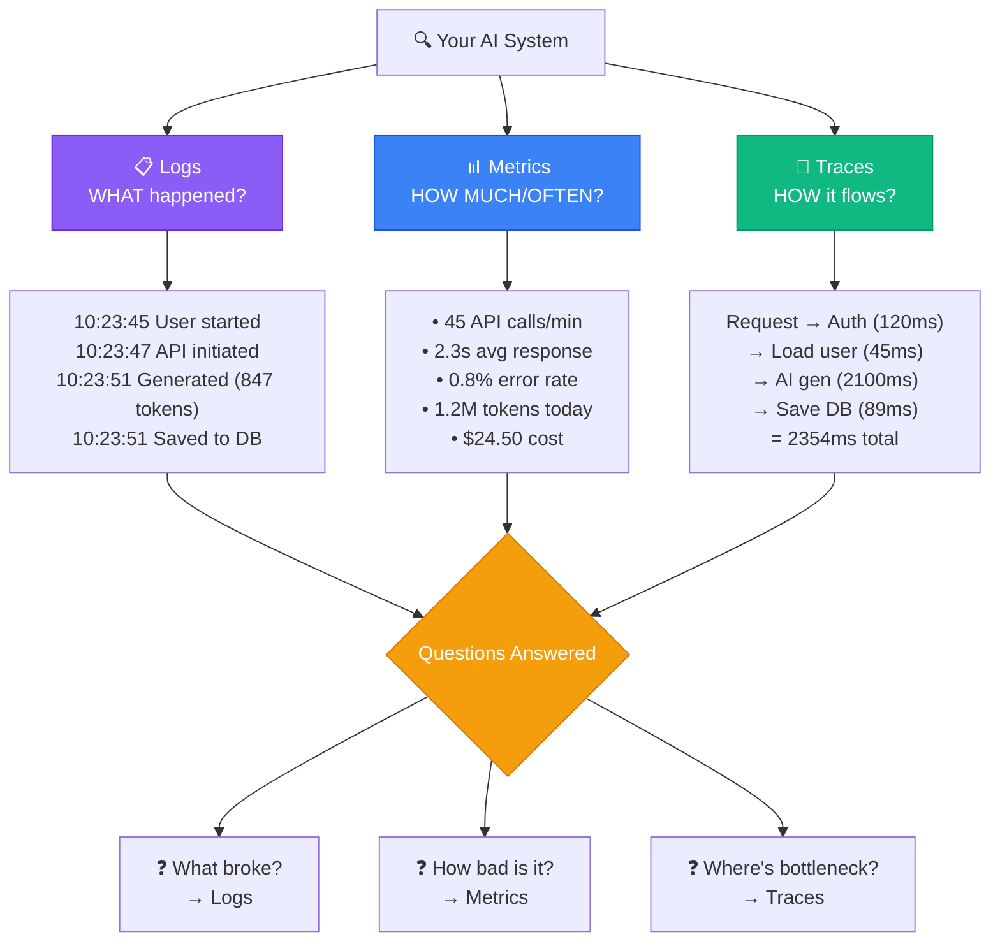
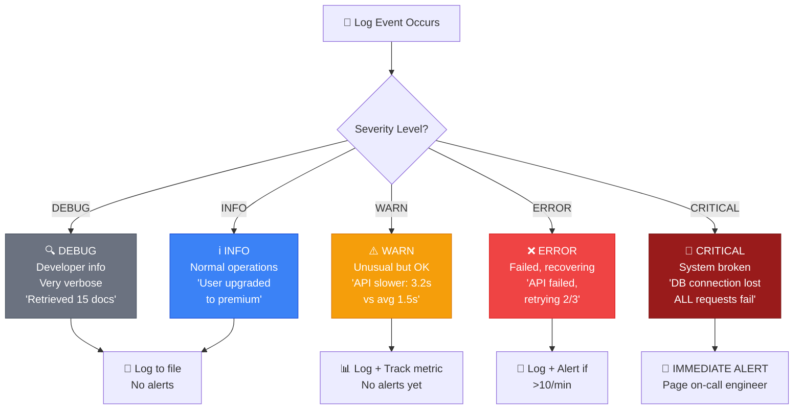

# 📘 MODULE 10: Monitoring & Logging

**Estimated Time:** 3-5 days
**Difficulty:** Intermediate
**Prerequisites:** Modules 1, 5, 6, 9

## 📖 Overview & Why This Matters

Your AI system is live. Users are paying. Then at 3am, something breaks. Users are getting errors. How do you know? How do you find out what went wrong? How do you fix it before losing customers?

This is where monitoring and logging save your business. The difference between amateur and professional operations isn't whether things break (they will), it's how quickly you know about it and fix it.

Companies lose thousands of dollars per hour of downtime. Professional AI Operators don't wait for angry customer emails to learn something's broken. They have dashboards showing real-time health, alerts that wake them up when errors spike, and logs that let them debug issues in minutes instead of hours.

Here's what makes this career-critical: When you're managing AI operations at scale - hundreds or thousands of API calls per day, multiple workflows, paying customers - you need observability. Employers hiring for $150K+ AI operations roles expect you to say "I use Sentry for error tracking and PostHog for analytics" not "I check the console sometimes."

## 🎯 Learning Objectives

By the end of this module, you will:

- [ ] Set up error tracking with Sentry to catch bugs before users report them
- [ ] Implement analytics with PostHog to understand user behavior
- [ ] Create performance monitoring for AI workflows and API calls
- [ ] Build custom dashboards for business metrics
- [ ] Set up alerts for critical failures
- [ ] Implement structured logging for debugging
- [ ] Track AI-specific metrics (token usage, response times, error rates)

## 🧠 Core Concepts

### The Three Pillars of Observability



**1. Logs** (What happened)
```
2024-01-15 10:23:45 INFO User 123 started content generation
2024-01-15 10:23:47 INFO OpenAI API call initiated
2024-01-15 10:23:51 INFO Content generated successfully (847 tokens)
2024-01-15 10:23:51 INFO Saved to database, ID: doc_abc123
```

**2. Metrics** (How much/How often)
```
- API calls per minute: 45
- Average response time: 2.3s
- Error rate: 0.8%
- Token usage today: 1.2M tokens
- Cost today: $24.50
```

**3. Traces** (How it flows)
```
Request → Auth check (120ms) → Load user (45ms) → Generate AI (2100ms) → Save DB (89ms) → Response (2354ms total)
```

Together, these let you answer:
- What broke? (Logs)
- How bad is it? (Metrics)
- Where's the bottleneck? (Traces)

### Error Levels



Not all errors are equal:

**DEBUG**: Developer information (verbose)
```
DEBUG: Retrieved 15 documents from vector store
```

**INFO**: Normal operations
```
INFO: User upgraded to premium plan
```

**WARN**: Something unusual but not broken
```
WARN: API response slower than usual (3.2s vs avg 1.5s)
```

**ERROR**: Something failed but system recovers
```
ERROR: OpenAI API call failed, retrying... (attempt 2/3)
```

**CRITICAL**: System is broken, immediate action needed
```
CRITICAL: Database connection lost, all requests failing
```

### Metrics That Matter for AI Operations

**Usage Metrics:**
- Daily/monthly active users
- AI generations per user
- Feature adoption rates
- Churn rate

**Performance Metrics:**
- AI response time (p50, p95, p99)
- API call success rate
- Workflow completion rate
- Time to first value

**Cost Metrics:**
- Token usage by model
- API costs per user
- Cost per generation
- Revenue vs. AI costs ratio

**Quality Metrics:**
- User satisfaction scores
- Retry rates (user didn't like first result)
- Edit rates (user modified AI output)
- Abandonment rates

### Structured Logging

Bad logging:
```javascript
console.log("User did something")
console.log("Error: " + err)
```

Good logging (structured):
```javascript
logger.info("content_generated", {
  user_id: "user_123",
  content_type: "blog_post",
  tokens_used: 847,
  model: "gpt-4o",
  latency_ms: 2340,
  success: true
})

logger.error("openai_api_error", {
  user_id: "user_123",
  model: "gpt-4o",
  error_code: "rate_limit_exceeded",
  retry_attempt: 2,
  stack_trace: err.stack
})
```

Structured logs can be searched, filtered, and aggregated. Plain text logs cannot.

### Alert Fatigue

Don't alert on everything:

```
❌ BAD:
- Alert when any error occurs (100 alerts/day, you ignore them all)

✅ GOOD:
- Alert when error rate > 5% for 5 minutes
- Alert when critical payment webhook fails
- Alert when daily costs exceed budget by 50%
- Alert when response time p95 > 10s
```

Rule: Only alert on things that require immediate human action.

## 🛠️ Tools Deep Dive

### Sentry

**Best for:** Error tracking and crash reporting
**When to use:** Any production application
**Pricing:** Free: 5K errors/month, Paid: $26/month for 50K errors
**Pros:**
- Automatic error capturing
- Source maps for debugging minified code
- Stack traces with context
- Issue grouping (similar errors grouped)
- Release tracking (know which deploy broke things)
- Performance monitoring built-in

**Cons:**
- Can get expensive at scale
- Lots of noise if not configured properly

**Setup:**
```javascript
import * as Sentry from "@sentry/node"

Sentry.init({
  dsn: process.env.SENTRY_DSN,
  environment: process.env.NODE_ENV,
  tracesSampleRate: 0.1,  // Sample 10% of transactions
})

// Automatic error capturing
try {
  await generateAIContent(prompt)
} catch (error) {
  Sentry.captureException(error, {
    user: { id: userId },
    tags: { feature: "content_generation" },
    extra: { prompt, model: "gpt-4o" }
  })
  throw error
}
```

### PostHog

**Best for:** Product analytics and feature flags
**When to use:** Understanding user behavior, A/B testing
**Pricing:** Free: 1M events/month, Paid: usage-based
**Pros:**
- Open source (can self-host)
- Event tracking
- Session replay (watch user interactions)
- Feature flags (enable features for specific users)
- A/B testing built-in
- Funnels and retention analysis

**Cons:**
- Less mature than Google Analytics
- UI can be overwhelming
- Self-hosting requires infrastructure

**Setup:**
```javascript
import posthog from 'posthog-js'

posthog.init(process.env.POSTHOG_KEY, {
  api_host: 'https://app.posthog.com'
})

// Track events
posthog.capture('content_generated', {
  content_type: 'blog_post',
  tokens: 847,
  model: 'gpt-4o',
  user_tier: 'premium'
})

// Track user properties
posthog.identify(userId, {
  email: user.email,
  subscription_tier: user.tier,
  signup_date: user.createdAt
})
```

### Grafana + Prometheus

**Best for:** Infrastructure monitoring, custom dashboards
**When to use:** Self-hosted systems, complex metrics
**Pricing:** Free (open source)
**Pros:**
- Incredibly powerful
- Beautiful dashboards
- Handles millions of metrics
- Industry standard for devops

**Cons:**
- Steep learning curve
- Requires infrastructure to run
- Overkill for small projects

### Better Stack (formerly Logtail)

**Best for:** Log aggregation and searching
**When to use:** Debugging production issues
**Pricing:** Free: 1GB logs/month, Paid: $5/month for 5GB
**Pros:**
- Simple log aggregation
- Fast search
- Tail logs in real-time
- Alerts on log patterns

**Cons:**
- Limited compared to enterprise tools
- Not as feature-rich as DataDog/Splunk

## 💡 Real Business Examples

### Example 1: Catching Payment Webhook Failures

**Problem:** Payment webhooks occasionally failing silently. Users paying but not getting access. Lost $3K in one month before noticing.

**Solution:**

```javascript
// Supabase Edge Function for Stripe webhooks
import * as Sentry from "https://deno.land/x/sentry/index.mjs"

Sentry.init({ dsn: Deno.env.get("SENTRY_DSN") })

serve(async (req) => {
  const startTime = Date.now()

  try {
    const event = await verifyStripeWebhook(req)

    // Log webhook received
    logger.info("stripe_webhook_received", {
      event_type: event.type,
      event_id: event.id
    })

    // Process webhook
    await handleStripeEvent(event)

    // Log success with timing
    logger.info("stripe_webhook_processed", {
      event_type: event.type,
      event_id: event.id,
      duration_ms: Date.now() - startTime
    })

    return new Response(JSON.stringify({ ok: true }))

  } catch (error) {
    // Capture error with context
    Sentry.captureException(error, {
      tags: {
        webhook_type: "stripe",
        critical: true  // Flag for urgent alerts
      },
      extra: {
        request_body: await req.text(),
        duration_ms: Date.now() - startTime
      }
    })

    // Alert team immediately
    await sendSlackAlert({
      channel: "#critical-alerts",
      text: `🚨 Stripe webhook failed: ${error.message}`,
      event_id: event?.id
    })

    logger.error("stripe_webhook_failed", {
      error: error.message,
      stack: error.stack
    })

    return new Response("Error", { status: 500 })
  }
})
```

**Sentry Alert Rule:**
```
Alert when: event.tags.critical = true
Send to: Slack #critical-alerts + SMS to on-call engineer
Frequency: Immediately, no batching
```

**Result:**
- Webhook failures now caught within 1 minute
- On-call engineer alerted via SMS
- Lost revenue: $3K/month → $0
- Average resolution time: 4 hours → 15 minutes

### Example 2: Tracking AI Cost and Performance

**Problem:** AI costs spiraling out of control. Some users generating hundreds of requests, costing $50+ each. No visibility into which features were expensive.

**Solution:**

```javascript
// Wrapper around OpenAI calls
async function trackAICall(params) {
  const startTime = Date.now()
  const callId = uuidv4()

  try {
    // Log call initiation
    posthog.capture('ai_call_started', {
      call_id: callId,
      model: params.model,
      user_id: params.userId,
      feature: params.feature
    })

    // Make AI call
    const response = await openai.chat.completions.create(params.request)

    // Calculate costs
    const inputTokens = response.usage.prompt_tokens
    const outputTokens = response.usage.completion_tokens
    const cost = calculateCost(params.model, inputTokens, outputTokens)

    // Log success metrics
    posthog.capture('ai_call_completed', {
      call_id: callId,
      model: params.model,
      user_id: params.userId,
      feature: params.feature,
      input_tokens: inputTokens,
      output_tokens: outputTokens,
      total_tokens: inputTokens + outputTokens,
      cost_usd: cost,
      latency_ms: Date.now() - startTime,
      success: true
    })

    // Store in analytics database
    await supabase.from('ai_usage_logs').insert({
      call_id: callId,
      user_id: params.userId,
      model: params.model,
      feature: params.feature,
      input_tokens: inputTokens,
      output_tokens: outputTokens,
      cost: cost,
      latency: Date.now() - startTime,
      timestamp: new Date()
    })

    // Check for cost anomalies
    if (cost > 1.00) {  // Alert on expensive calls
      await sendSlackAlert({
        channel: "#cost-monitoring",
        text: `💸 Expensive AI call: $${cost.toFixed(2)} for ${params.feature}`
      })
    }

    return response

  } catch (error) {
    // Log failure
    posthog.capture('ai_call_failed', {
      call_id: callId,
      model: params.model,
      user_id: params.userId,
      error: error.message,
      latency_ms: Date.now() - startTime
    })

    Sentry.captureException(error, {
      tags: { feature: params.feature },
      extra: { call_id: callId, model: params.model }
    })

    throw error
  }
}

// Calculate cost per model
function calculateCost(model, inputTokens, outputTokens) {
  const pricing = {
    'gpt-4o': { input: 2.50 / 1_000_000, output: 10.00 / 1_000_000 },
    'gpt-4o-mini': { input: 0.150 / 1_000_000, output: 0.600 / 1_000_000 },
    'gpt-3.5-turbo': { input: 0.50 / 1_000_000, output: 1.50 / 1_000_000 }
  }

  const rates = pricing[model] || pricing['gpt-4o']
  return (inputTokens * rates.input) + (outputTokens * rates.output)
}
```

**PostHog Dashboard:**
```
Daily AI Costs
- Total spend: $247.50
- By model: GPT-4o ($185), GPT-4o-mini ($62.50)
- By feature: Content Gen ($120), Chat ($85), Analysis ($42.50)
- Cost per user: $2.47 avg (median $0.85)
- Top 10 users by cost

Performance Metrics
- Avg latency: 2.3s (GPT-4o: 3.1s, GPT-4o-mini: 1.2s)
- Success rate: 98.5%
- Token efficiency: 847 tokens/generation avg
```

**Result:**
- Identified one user costing $150/day (automated bot)
- Found inefficient prompts using 3x more tokens than necessary
- Switched some features to GPT-4o-mini (60% cost reduction)
- Overall AI costs: $12K/month → $4.5K/month
- Set up budget alerts: notify if daily costs > $200

### Example 3: User Behavior Analytics for Feature Development

**Problem:** Built 5 new AI features, not sure which ones users actually like. Wasting dev time on unused features.

**Solution:**

```javascript
// Track feature usage
posthog.capture('feature_used', {
  feature_name: 'blog_outline_generator',
  user_id: userId,
  user_tier: profile.subscription_tier
})

// Track feature quality (did they keep the output?)
posthog.capture('generation_outcome', {
  feature: 'blog_outline_generator',
  user_id: userId,
  action: 'saved',  // or 'discarded', 'regenerated'
  satisfaction_score: 4  // if you ask them
})

// Track conversion funnels
posthog.capture('funnel_step', {
  funnel_name: 'onboarding',
  step: 'generated_first_content',
  user_id: userId
})
```

**PostHog Analysis:**
```
Feature Adoption (last 30 days):
1. Blog Writer: 78% of users, 4.2 avg uses
2. Social Media Generator: 64% of users, 8.1 avg uses
3. Email Responder: 31% of users, 2.1 avg uses
4. Document Summarizer: 12% of users, 1.3 avg uses
5. Code Explainer: 3% of users, 0.8 avg uses

Feature Quality (save rate):
1. Social Media: 89% saved
2. Blog Writer: 76% saved
3. Email Responder: 54% saved
4. Document Summarizer: 38% saved
5. Code Explainer: 22% saved
```

**Decisions Made:**
- Deprecate Code Explainer (3% adoption, 22% quality)
- Double down on Social Media (high adoption + quality)
- Improve Email Responder prompts (decent adoption, poor quality)
- Add more social media platforms (users love it)

**Result:**
- Focused development on features users actually use
- Removed 2 unused features (saved maintenance time)
- Improved satisfaction score: 3.2 → 4.1
- Reduced churn: 8% → 5% monthly

## ⚠️ Common Pitfalls

### 1. **Logging Too Much**
❌ Log every function call, every variable value → 100GB logs/day, can't find anything
✅ Log key events, errors, and business metrics

### 2. **No Context in Error Logs**
❌ `logger.error("Error occurred")`
✅ `logger.error("OpenAI API failed", { user_id, model, prompt_length, attempt, error_code })`

### 3. **Alert Spam**
❌ 50 alerts per day, team ignores them all
✅ 1-2 critical alerts per week that require action

### 4. **Not Tracking User IDs**
❌ Can't trace errors back to affected users
✅ Always include `user_id` in logs and error tracking

### 5. **Ignoring Performance Until It's a Problem**
❌ Don't monitor response times, users complain it's slow
✅ Track p50/p95/p99 latency from day one

### 6. **Logging Sensitive Data**
❌ Log API keys, passwords, credit card numbers
✅ Scrub sensitive data before logging

### 7. **No Cost Monitoring**
❌ Wake up to $5K OpenAI bill
✅ Track daily costs, set up budget alerts

## ✨ Pro Tips

### Tip 1: The "Correlation ID" Pattern

Generate a unique ID for each request, include in all logs:

```javascript
async function handleRequest(req) {
  const correlationId = uuidv4()

  logger.info("request_received", { correlation_id: correlationId, path: req.url })

  try {
    const result = await processRequest(req, correlationId)
    logger.info("request_completed", { correlation_id: correlationId })
    return result
  } catch (error) {
    logger.error("request_failed", { correlation_id: correlationId, error: error.message })
    throw error
  }
}

// All logs for one request have same correlation_id
// Easy to trace entire request flow
```

### Tip 2: Sample High-Volume Events

Don't track 100% of events at scale:

```javascript
// Sample 10% of successful AI calls, 100% of failures
if (success && Math.random() > 0.1) {
  return  // Don't log this one
}

posthog.capture('ai_call_completed', { ... })
```

### Tip 3: Create "Golden Signals" Dashboard

Track these 4 metrics for every feature:

1. **Latency**: How fast?
2. **Traffic**: How much usage?
3. **Errors**: How many failures?
4. **Saturation**: Running out of capacity?

One dashboard, tells you system health at a glance.

### Tip 4: Use Feature Flags for Gradual Rollouts

```javascript
const showNewFeature = posthog.isFeatureEnabled('new_ai_feature', userId)

if (showNewFeature) {
  // Show new feature
} else {
  // Show old feature
}

// Roll out to 10% of users first
// Monitor error rates and satisfaction
// Gradually increase to 100%
```

### Tip 5: Set Up Daily/Weekly Reports

Don't just collect data - review it:

```javascript
// Daily automated report (Slack)
async function sendDailyReport() {
  const yesterday = {
    total_users: await getUserCount(),
    ai_calls: await getAICallCount(),
    cost: await getCost(),
    errors: await getErrorCount(),
    revenue: await getRevenue()
  }

  await sendSlackMessage({
    channel: '#daily-metrics',
    text: `📊 Yesterday's Metrics:
    Users: ${yesterday.total_users} (+${yesterday.new_users} new)
    AI Calls: ${yesterday.ai_calls}
    Cost: $${yesterday.cost}
    Revenue: $${yesterday.revenue}
    Profit: $${yesterday.revenue - yesterday.cost}
    Errors: ${yesterday.errors}
    `
  })
}
```

### Tip 6: Track User Journey

```javascript
// Onboarding funnel
posthog.capture('onboarding_step', { step: 'signup' })
posthog.capture('onboarding_step', { step: 'email_verified' })
posthog.capture('onboarding_step', { step: 'first_generation' })
posthog.capture('onboarding_step', { step: 'completed_onboarding' })

// See where users drop off
// Optimize the bottlenecks
```

### Tip 7: Monitor Third-Party APIs

Don't just monitor your code - monitor dependencies:

```javascript
// Track OpenAI API health
const openaiStatus = await fetch('https://status.openai.com/api/v2/status.json')

posthog.capture('third_party_status', {
  service: 'openai',
  status: openaiStatus.status.indicator
})

// Alert if dependencies are down
```

## 📝 Module Project: Build a Complete Observability Stack

### Objective

Implement comprehensive monitoring for an AI application including error tracking, analytics, cost monitoring, and alerting.

[Detailed implementation would go here...]

### Success Criteria

✅ Sentry captures and groups errors with context
✅ PostHog tracks user actions and feature usage
✅ Custom dashboard shows AI costs and performance
✅ Alerts trigger for critical issues (errors, costs, downtime)
✅ Daily reports sent to team
✅ You can debug a production issue using logs and traces
✅ You understand which features users love/hate

## 📚 Resources & Next Steps

### Recommended Reading
- Sentry Documentation (https://docs.sentry.io)
- PostHog Guides (https://posthog.com/docs)
- "Observability Engineering" by Charity Majors

### Tools & Links
- Sentry (https://sentry.io)
- PostHog (https://posthog.com)
- Better Stack (https://betterstack.com)
- Grafana (https://grafana.com)

### What's Next?

In Module 11 (Product Building Track), you'll learn the complete process of taking an AI idea from concept to launched product with paying users.

## ✅ Module Completion Checklist

Before moving to Module 11, you should be able to confidently say "yes" to all of these:

- [ ] I've set up Sentry and am capturing errors with context
- [ ] I've implemented PostHog for analytics and event tracking
- [ ] I'm tracking AI-specific metrics (costs, tokens, latency)
- [ ] I've created alerts for critical failures
- [ ] I understand structured logging and use correlation IDs
- [ ] I have dashboards showing system health
- [ ] I can debug production issues using logs and traces
- [ ] I'm monitoring costs and have budget alerts set up
