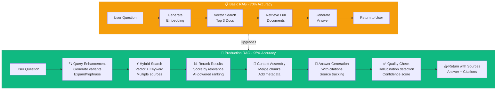

# 📘 MODULE 11: RAG Systems

**Estimated Time:** 5-7 days
**Difficulty:** Advanced
**Prerequisites:** Modules 1-10 (especially Data Layer and APIs)

## 📖 Overview & Why This Matters

RAG (Retrieval-Augmented Generation) is what separates professional AI systems from simple ChatGPT wrappers. Anyone can paste text into ChatGPT and get a response. Professional AI Operators build systems where AI has access to private knowledge bases, maintains conversation context, and provides cited, accurate information from YOUR specific data.

RAG is the difference between generic AI responses and AI that knows your business inside and out. It's how you build AI systems that can answer questions about your customer support history, your product documentation, your company knowledge base—with sources and citations.

This module is challenging. But mastering it means you can build AI systems that companies pay $50K-$200K+ to have built.

## 🎯 Learning Objectives

By the end of this module, you will:

- [ ] Build production-ready RAG systems with proper chunking and retrieval
- [ ] Implement multi-query strategies to improve retrieval accuracy
- [ ] Design hybrid search combining vector and keyword approaches
- [ ] Implement reranking to improve relevance scoring
- [ ] Create feedback loops that improve AI performance over time
- [ ] Understand when to use RAG vs. fine-tuning vs. prompt engineering
- [ ] Handle edge cases: no results, low confidence, hallucination detection

## 🧠 Core Concepts

### RAG: The Complete Picture



**Basic RAG** (what you might have built before):
- User Question → Embed → Search vectors → Retrieve docs → Generate answer
- Works okay, but only 70% accurate

**Production RAG** (what you'll build here):
- Query enhancement → Hybrid search → Reranking → Context assembly → Answer generation → Quality check
- Works 95% of the time with proper citations

The difference is enormous in production environments.

### The Chunking Problem

How you split documents matters enormously:

**Too large (whole documents):**
- Too much irrelevant info in context
- Exceeds token limits
- Reduces precision

**Too small (every sentence):**
- Loses context
- More database storage
- More API calls
- Fragments meaning

**Just right (semantic chunks):**
- 300-500 tokens
- Breaks on logical boundaries (paragraphs, sections)
- Includes overlap with adjacent chunks (50-100 tokens)
- Stores metadata (source, date, section, author)

### Production RAG Architecture

```mermaid
graph TB
    A[❓ User Question:<br/>'How do I reset password?'] --> B[📝 Step 1:<br/>Query Enhancement]

    B --> B1[Generate Variants:<br/>• 'How to reset password'<br/>• 'Password reset steps'<br/>• 'Forgot password help']

    B1 --> C[🔍 Step 2:<br/>Hybrid Search]

    C --> C1[Vector Search<br/>Pinecone]
    C --> C2[Keyword Search<br/>PostgreSQL]

    C1 --> D[📊 Combined Results<br/>15 candidate articles]
    C2 --> D

    D --> E[🎯 Step 3:<br/>AI Reranking]

    E --> E1[Claude Scores<br/>Each Article 1-10]

    E1 --> F[📋 Top 5 Articles<br/>Ranked by relevance]

    F --> G[🔗 Step 4:<br/>Context Assembly]

    G --> G1[Merge chunks<br/>Add citations<br/>Include metadata]

    G1 --> H[🤖 Step 5:<br/>Answer Generation]

    H --> H1[GPT-4 with context<br/>Include source citations<br/>[1], [2], [3]]

    H1 --> I[✅ Step 6:<br/>Quality Check]

    I --> I1{Confidence Score<br/>& Hallucination Check}

    I1 -->|High Confidence| J[✅ Return Answer:<br/>'To reset password:<br/>1. Go to login...'<br/>Sources: [1] [2]]

    I1 -->|Low Confidence| K[⚠️ Flag for Human:<br/>'Unclear - needs<br/>manual review']

    style A fill:#8B5CF6,stroke:#6D28D9,color:#fff
    style B fill:#3B82F6,stroke:#1D4ED8,color:#fff
    style E fill:#F59E0B,stroke:#D97706,color:#fff
    style H fill:#10B981,stroke:#059669,color:#fff
    style J fill:#10B981,stroke:#059669,color:#fff
    style K fill:#EF4444,stroke:#DC2626,color:#fff
```

## 🛠️ Tools Deep Dive

### LlamaIndex

**Best for:** RAG systems, document search, knowledge bases
**When to use:** When RAG is your primary use case
**Pricing:** Free (open source)

**Pros:**
- Optimized for RAG specifically
- Better data connectors (load from anywhere)
- More sophisticated retrieval strategies
- Easier to get started than LangChain for RAG
- Better chunking strategies out-of-box

**Cons:**
- Less flexible for non-RAG tasks
- Smaller community than LangChain
- Fewer agent capabilities

**Example usage:**
```python
from llama_index import VectorStoreIndex, SimpleDirectoryReader

documents = SimpleDirectoryReader('./docs').load_data()
index = VectorStoreIndex.from_documents(documents)
query_engine = index.as_query_engine()

response = query_engine.query("What are our return policies?")
```

### LangChain RAG

**Best for:** Building complex AI workflows with many integrations
**When to use:** Multi-step AI operations, RAG + other features
**Pricing:** Free (open source)

**Pros:**
- Huge library of integrations (100+ tools)
- Abstracts common patterns (RAG, agents, memory)
- Active community
- Production-ready
- Supports both Python and JavaScript

**Cons:**
- Steep learning curve
- Can be over-engineered for simple tasks
- Frequent breaking changes in updates

**Example usage:**
```python
from langchain.chains import RetrievalQA
from langchain.vectorstores import Pinecone
from langchain.llms import OpenAI

vectorstore = Pinecone.from_existing_index("knowledge-base")
qa_chain = RetrievalQA.from_chain_type(
    llm=OpenAI(model="gpt-4"),
    retriever=vectorstore.as_retriever(),
    return_source_documents=True
)

result = qa_chain("How do I reset my password?")
```

### OpenAI Assistants API

**Best for:** Building RAG without infrastructure management
**When to use:** Need RAG but don't want to manage vector stores
**Pricing:** Pay per token (same as OpenAI API) + storage

**Pros:**
- Managed service (OpenAI handles everything)
- File search built in (automatic RAG)
- Persistent conversation threads
- No infrastructure to manage

**Cons:**
- Locked to OpenAI
- Less control over retrieval
- Can get expensive with large knowledge bases
- Slower than self-hosted solutions

**Example usage:**
```javascript
const assistant = await openai.beta.assistants.create({
  model: "gpt-4o",
  instructions: "You are a helpful customer support agent",
  tools: [{ type: "file_search" }],
  tool_resources: {
    file_search: { vector_store_ids: ["vs_abc123"] }
  }
})

const thread = await openai.beta.threads.create()
await openai.beta.threads.messages.create(thread.id, {
  role: "user",
  content: "How do I change my email?"
})

const run = await openai.beta.threads.runs.create(thread.id, {
  assistant_id: assistant.id
})
```

## 💡 Real Business Example: Customer Support RAG System

**Problem:** SaaS company with 1,000+ help articles, 50K+ past support tickets. Support agents spending 40% of time searching for answers, often missing relevant information.

**Basic Approach (70% accuracy):**
- Embed all articles
- User asks question → search → return top 3 → generate answer
- Works okay, but 30% of questions get wrong or incomplete answers

**Production RAG Approach (94% accuracy):**

```python
# 1. Query Enhancement
async def enhance_query(user_question):
    # Generate multiple query variants
    variants = await llm.generate([
        f"Rephrase: {user_question}",
        f"What keywords would help find info about: {user_question}",
        f"What specific product features relate to: {user_question}"
    ])
    return [user_question] + variants

# 2. Hybrid Search
async def hybrid_search(queries):
    results = []

    for query in queries:
        # Vector search
        vector_results = await pinecone.query(
            vector=await get_embedding(query),
            top_k=10,
            filter={"category": "support"}
        )

        # Keyword search in PostgreSQL
        keyword_results = await db.query(
            "SELECT * FROM articles WHERE to_tsvector(content) @@ to_tsquery($1)",
            [query]
        )

        results.extend(vector_results + keyword_results)

    # Deduplicate and rank
    return rank_results(results)

# 3. Reranking
async def rerank_results(results, original_question):
    # Use Claude to score each result's relevance
    scored_results = []

    for result in results:
        score = await claude.messages.create(
            model="claude-3-5-sonnet",
            messages=[{
                "role": "user",
                "content": f"Rate 1-10 how relevant this article is to the question.\n\nQuestion: {original_question}\n\nArticle: {result.text}\n\nScore:"
            }],
            max_tokens=10
        )

        scored_results.append({
            "content": result,
            "score": int(score.content[0].text)
        })

    return sorted(scored_results, key=lambda x: x["score"], reverse=True)[:5]

# 4. Context Assembly
async def assemble_context(ranked_results):
    # Merge overlapping chunks, add source citations
    context = ""
    sources = []

    for i, result in enumerate(ranked_results):
        context += f"[{i+1}] {result.content.metadata.title}\n{result.content.text}\n\n"
        sources.append({
            "number": i + 1,
            "title": result.content.metadata.title,
            "url": result.content.metadata.url
        })

    return context, sources

# 5. Answer with Citations
async def generate_answer(question, context, sources):
    response = await openai.chat.completions.create(
        model="gpt-4o",
        messages=[{
            "role": "system",
            "content": "Answer based on provided articles. Cite sources as [1], [2], etc. If unsure, say so."
        }, {
            "role": "user",
            "content": f"Context:\n{context}\n\nQuestion: {question}\n\nAnswer:"
        }]
    )

    answer = response.choices[0].message.content

    return {
        "answer": answer,
        "sources": sources,
        "confidence": estimate_confidence(answer)
    }

# 6. Complete Pipeline
async def answer_support_question(question):
    queries = await enhance_query(question)
    results = await hybrid_search(queries)
    ranked = await rerank_results(results, question)
    context, sources = await assemble_context(ranked)
    return await generate_answer(question, context, sources)
```

**Results:**
- Answer accuracy: 70% → 94%
- Support agent research time: 40% of day → 5%
- Customer satisfaction: 72 → 89
- Automated 60% of tier-1 support tickets
- Cost: $800/month in AI APIs, saved $15K/month in support labor

## ⚠️ Common Pitfalls

### 1. **Treating RAG as Just Vector Search**
❌ Question → embed → search → generate
✅ Query enhancement → hybrid search → reranking → answer generation

### 2. **Ignoring Hallucination Risk**
❌ Trust AI output blindly
✅ Check for citations, validate facts against sources, confidence scoring

### 3. **Poor Chunking Strategy**
❌ Split documents by character count (e.g., every 500 chars)
✅ Split by semantic meaning (paragraphs, sections), include overlap

### 4. **Not Testing Retrieval Quality**
❌ Assume if you get results, they're relevant
✅ Build test set of questions → expected documents, measure recall/precision

### 5. **One-Size-Fits-All Prompts**
❌ Same system prompt for all queries
✅ Dynamic prompt construction based on query type and context

## ✨ Pro Tips

### Tip 1: The "Few-Shot Retrieval" Pattern

Include example Q&A pairs in your RAG prompt:

```
Examples of good answers:
Q: How do I reset password?
A: Go to Settings > Security > Reset Password. [1]

Q: What's your refund policy?
A: We offer 30-day money-back guarantee. [2]

Now answer: {user_question}
Context: {retrieved_docs}
```

This dramatically improves answer quality.

### Tip 2: Use Different Models for Different Tasks

```
Query enhancement: gpt-4o-mini (cheap, fast)
Retrieval scoring: claude-3-haiku (excellent at ranking)
Final answer: gpt-4o (best quality)
```

Don't waste expensive models on simple tasks.

### Tip 3: Implement "Confidence Thresholds"

```python
async def answer_with_confidence(question, context):
    response = await llm.generate(question, context)

    # Ask AI to rate its own confidence
    confidence = await llm.generate(
        f"On a scale of 1-10, how confident are you that this answer is correct based on the provided context?\n\nAnswer: {response}"
    )

    if int(confidence) < 7:
        return {
            "answer": "I'm not confident enough to answer. Let me get a human.",
            "escalate": True
        }

    return {"answer": response, "escalate": False}
```

### Tip 4: Use Async for Speed

RAG with parallel retrieval:

```python
# Bad: Sequential (slow)
results1 = search_pinecone(query)
results2 = search_database(query)
results3 = search_web(query)

# Good: Parallel (3x faster)
results = await asyncio.gather(
    search_pinecone(query),
    search_database(query),
    search_web(query)
)
```

### Tip 5: Build Feedback Loops

```python
async def answer_with_feedback(question):
    answer = await rag_system.answer(question)

    # Show answer, ask user for feedback
    feedback = await ask_user("Was this helpful? (yes/no)")

    # Save for training data
    await db.insert("feedback", {
        "question": question,
        "answer": answer,
        "helpful": feedback == "yes",
        "timestamp": now()
    })

    # Periodically review low-scoring answers
    # Identify patterns, improve prompts/retrieval
```

## 📝 Module Project: Build a Production RAG System

### Objective

Build a complete production-ready RAG system for a knowledge base with query enhancement, hybrid search, reranking, and quality control.

### Requirements

1. **Data Ingestion**
   - Load documents from multiple sources
   - Implement semantic chunking (not just character count)
   - Generate embeddings
   - Store in vector database with metadata

2. **Query Enhancement**
   - Generate query variants
   - Expand with synonyms/related terms

3. **Hybrid Retrieval**
   - Vector search (Pinecone/Weaviate)
   - Keyword search (PostgreSQL)
   - Combine and deduplicate

4. **Reranking**
   - Score results by relevance
   - Keep top 5

5. **Answer Generation**
   - Generate answer with citations
   - Include source links
   - Confidence scoring

6. **Quality Control**
   - Hallucination detection
   - Confidence thresholds
   - Escalation to human when needed

### Success Criteria

✅ Can answer 90%+ of test questions correctly
✅ Provides citations for all answers
✅ Handles "no relevant docs found" gracefully
✅ Confidence scoring works (high confidence = correct, low = escalates)
✅ Response time under 3 seconds
✅ You can explain how each component works

## 📚 Resources & Next Steps

### Recommended Reading
- LangChain Documentation (https://python.langchain.com)
- LlamaIndex Guide (https://docs.llamaindex.ai)
- "Building LLM Apps" by Anthropic (https://docs.anthropic.com)
- "RAG Best Practices" by Pinecone

### Tools & Links
- LangChain (https://langchain.com)
- LlamaIndex (https://llamaindex.ai)
- OpenAI Assistants (https://platform.openai.com/docs/assistants)
- LangSmith (https://smith.langchain.com) - Observability for LLM apps

### What's Next?

In Module 12 (AI Agents), you'll learn how to build autonomous AI systems that can use tools, make decisions, and execute multi-step tasks—taking your RAG knowledge to the next level with agentic workflows.

## ✅ Module Completion Checklist

Before moving to Module 12, you should be able to confidently say "yes" to all of these:

- [ ] I understand the difference between basic and production RAG systems
- [ ] I've built a RAG system with query enhancement and reranking
- [ ] I can implement hybrid search (vector + keyword)
- [ ] I know how to chunk documents properly (semantic, not just character count)
- [ ] I've implemented confidence scoring and hallucination detection
- [ ] I understand when to use RAG vs. fine-tuning vs. prompt engineering
- [ ] I can debug retrieval quality issues
- [ ] I've built a complete production RAG system
