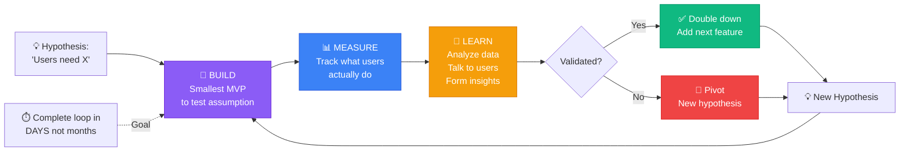

# 📘 MODULE 11: Product Building Track

**Estimated Time:** 7-10 days
**Difficulty:** Advanced
**Prerequisites:** Modules 1, 4-10 (Most of the roadmap)

## 📖 Overview & Why This Matters

You've built AI systems. You understand databases, APIs, automation, payments, monitoring. Now the hardest question: Can you build something people actually want to use and pay for?

This module is different. It's not about technology - it's about turning technology into products. Most AI projects fail not because the tech doesn't work, but because nobody wants them. They solve problems that don't exist, or solve real problems in ways users don't like.

The AI Operators making $200K+ and building successful companies aren't the ones with the most sophisticated RAG systems. They're the ones who found a painful problem, built the simplest possible solution, got it in front of users fast, and iterated based on feedback.

This is the module about product thinking, not engineering thinking. About shipping fast, failing fast, learning what works, and building it. By the end, you won't just be able to build AI systems - you'll be able to build AI products that people love and pay for.

## 🎯 Learning Objectives

By the end of this module, you will:

- [ ] Validate product ideas before building them
- [ ] Define an MVP that can ship in 2 weeks or less
- [ ] Build feedback loops that tell you what users actually want
- [ ] Run effective user interviews to discover real problems
- [ ] Implement analytics that drive product decisions
- [ ] Iterate quickly based on data and feedback
- [ ] Know when to pivot, when to persevere, and when to kill a feature

## 🧠 Core Concepts

### The MVP Mindset

MVP (Minimum Viable Product) doesn't mean "barely functional." It means:
**The smallest thing you can build that validates your riskiest assumption.**

Bad MVP thinking:
- "I'll build all the features I imagine users might want"
- "I need perfect UI before showing anyone"
- "I'll launch when it's ready" (never launches)

Good MVP thinking:
- "I'll build one core feature that solves one problem"
- "I'll get it in front of 10 users this week"
- "I'll ship something embarrassingly simple and improve based on feedback"

Example:
```
Not MVP: AI writing tool with 15 features, perfect UI, full auth system
MVP: Web form where you paste text, click button, get AI rewrite, copy result
```

### The Build-Measure-Learn Loop



1. **Build**: Ship smallest version that tests assumption
2. **Measure**: Track what users actually do (not what they say)
3. **Learn**: Analyze data, talk to users, form hypotheses
4. **Repeat**: Build next smallest thing based on learning

This loop should take days, not months.

### Problem-First vs. Solution-First

```mermaid
graph TB
    subgraph Wrong["❌ Solution-First (Usually Fails)"]
        W1[🛠️ I built RAG system<br/>with vector search<br/>and agents] --> W2[🤔 Now what problem<br/>does this solve?]
        W2 --> W3[🔍 Searching for users<br/>who might need this]
        W3 --> W4[💔 Usually fails:<br/>No product-market fit]
    end

    subgraph Right["✅ Problem-First (Usually Succeeds)"]
        R1[😫 Observed problem:<br/>Sales teams spend<br/>3hrs/day on emails] --> R2[💡 What's simplest<br/>AI solution?]
        R2 --> R3[🔨 Build that<br/>MVP first]
        R3 --> R4[✅ Usually succeeds:<br/>Clear value prop]
    end

    style Wrong fill:#EF4444,stroke:#DC2626,color:#fff
    style Right fill:#10B981,stroke:#059669,color:#fff
    style W4 fill:#FCA5A5,stroke:#DC2626,color:#000
    style R4 fill:#86EFAC,stroke:#059669,color:#000
```



**Solution-First (Wrong):**
```
"I built a RAG system with vector search and agents"
→ Now looking for problems it could solve
→ Usually fails
```

**Problem-First (Right):**
```
"Sales teams spend 3 hours/day writing follow-up emails"
→ What's the simplest AI solution?
→ Build that
→ Usually succeeds
```

Start with a painful problem you've observed. Then find the simplest AI solution.

### The Mom Test

Don't ask: "Would you use an AI tool that writes emails?"
(Everyone says yes, means nothing)

Ask: "When's the last time you spent more than 10 minutes writing an email?"
(Specific, reveals real behavior)

The Mom Test: Talk about their life, not your idea. Learn about their problems, don't pitch your solution.

### User Feedback Hierarchy

Not all feedback is equal:

**Tier 1: Usage Data** (Most reliable)
- What users actually do
- Feature adoption rates
- Time spent in app
- Completion rates

**Tier 2: Unsolicited Feedback** (Very reliable)
- Users proactively tell you something
- Support ticket themes
- Feature requests from paying users

**Tier 3: Direct Asks** (Somewhat reliable)
- User interviews
- Surveys
- Beta tester feedback

**Tier 4: Hypothetical Questions** (Least reliable)
- "Would you use this?"
- "Would you pay for that?"
- "What features would you want?"

Build based on Tier 1 and 2. Use Tier 3 to understand context. Ignore Tier 4.

### The Importance of Distribution

Best product with no distribution: 0 users
Mediocre product with great distribution: 10,000 users

Distribution channels for AI tools:
- **SEO**: Build in public, write content
- **Social Media**: Twitter/X, LinkedIn with demos
- **Communities**: Reddit, Discord, Slack groups
- **Direct Outreach**: Email people with the problem
- **Content**: YouTube demos, blog posts
- **Marketplaces**: GPT Store, Chrome extensions

Plan distribution from day one, not after building.

## 🛠️ Tools Deep Dive

### User Research Tools

**Calendly**
- Book user interviews
- Free tier available
- Integrate with Google Calendar

**Loom**
- Record product demos
- Share with potential users
- Get async feedback

**TypeForm**
- Beautiful surveys
- Higher completion rates than Google Forms
- Conditional logic for smart surveys

### Analytics Tools

**PostHog** (from Module 10)
- Track feature usage
- See what users actually do
- Session recordings

**Google Analytics**
- Traffic sources
- User demographics
- Conversion funnels

**Amplitude**
- Product analytics
- Cohort analysis
- Retention tracking

### Feedback Collection

**Canny**
- Feature request board
- Users upvote requests
- See what people actually want

**Intercom**
- Live chat
- Collect feedback
- Announce new features

**Tally**
- Embed feedback forms
- Free tier
- Beautiful design

### Launch Platforms

**Product Hunt**
- Tech-savvy early adopters
- One-day traffic spike
- Good for brand awareness

**Indie Hackers**
- Entrepreneur community
- Thoughtful feedback
- Potential early customers

**Hacker News**
- Show HN posts
- Technical audience
- Can drive significant traffic

## 💡 Real Business Examples

### Example 1: From Idea to 100 Paying Users in 30 Days

**The Idea:**
"Marketing teams waste time repurposing content across platforms. AI could automate this."

**Week 1: Validation**
- Posted on Twitter: "Marketing folks - how much time do you spend adapting content for different platforms?"
- Got 37 replies, most said "2-3 hours per piece"
- Interviewed 5 marketers (15 min calls)
- Confirmed: Real, painful problem

**Week 2: MVP Build**
Didn't build:
- User accounts
- Payment system
- Database
- Beautiful UI

Did build:
- Simple web form
- Input: LinkedIn post URL
- AI scrapes post, generates Twitter thread + Instagram caption
- Output: Shows results, user copies manually

Tech stack: One Next.js page, OpenAI API, that's it.

**Week 3: First Users**
- Shared on Twitter with demo video
- Posted in marketing Discord servers
- Emailed the 5 people from interviews
- Got 47 users first day

**Feedback Received:**
- "Love it! Can you add Facebook posts?"
- "I'd pay for this if it saved to Google Docs"
- "Can it do this for multiple posts at once?"
- "I'd want this integrated with Buffer"

**What We Built Next:**
- None of those things!
- Added payment (Stripe checkout, one-time fee)
- Added save history (simple SQLite)
- Posted "Launching paid version at $19"
- 23 people paid in first 3 days

**Week 4: Iteration**
- Now had revenue, could invest more time
- Added most-requested feature: Google Docs export
- Raised price to $29
- Made it subscription: $15/month
- Got to 100 paying subscribers

**Key Lessons:**
- Validated before building
- Shipped in 7 days, not 7 months
- Got paying customers before adding features
- Built based on what users did (paid for), not what they said (wanted integrations)

**Current Status:**
- 1,200 paying subscribers
- $18K MRR
- One developer, part-time

### Example 2: When to Pivot

**Original Idea:**
"AI resume writer - upload your experience, get professional resume"

**Built MVP:**
- Simple form: paste work experience
- AI generates resume
- Download PDF

**Week 1 Results:**
- 500 people tried it
- 230 downloaded resume
- 0 paid (offered $9 one-time fee)

**User Feedback:**
- "This is nice but I already have a resume"
- "The format isn't quite what I want"
- "I'd rather customize it myself"

**Hypothesis:**
People don't need resume creation. They need resume optimization for specific jobs.

**Pivot:**
- New tool: Paste job description + your resume
- AI tells you what to change
- Highlights missing keywords
- Suggests better phrasing

**Week 1 After Pivot:**
- 500 people tried it
- 420 used it multiple times (!!!)
- 67 paid $14 for "unlimited optimizations"

**The Difference:**
- Same AI tech
- Different problem
- Much better product-market fit

**Lesson:**
Watch what users do. Original tool: One-and-done. New tool: Repeat usage. Repeat usage → real value → willingness to pay.

### Example 3: Building in Public Success

**Strategy:**
- Built AI email writer
- Shared progress daily on Twitter
- Day 1: "Building AI email writer, here's the problem"
- Day 3: "First working prototype, here's a demo"
- Day 7: "Launched! Here's the link"
- Day 14: "10 paying users, here's what I learned"
- Day 30: "100 users, $1K MRR, here's my tech stack"

**Results:**
- Gained 2,000 Twitter followers during build
- 300 signups on launch day (from Twitter audience)
- 43 paid in first week
- Multiple podcast interview invitations
- Acquired by larger company after 6 months

**Distribution Strategy:**
- No paid ads
- No SEO
- Just building in public on Twitter
- Sharing lessons, demos, metrics
- Being helpful in replies

**Lesson:**
Distribution is easier when people watch you build. They're invested in your success. They become early adopters.

## ⚠️ Common Pitfalls

### 1. **Building Too Much Before Launch**
❌ "I'll launch when I have 20 features and perfect UI"
✅ Ship one feature, ugly UI, get feedback, iterate

### 2. **Asking Hypothetical Questions**
❌ "Would you pay $20/month for this?"
✅ "Here's the product, it costs $20/month, buy it now or don't"

### 3. **Building Features Nobody Asked For**
❌ "Users might want dark mode, let me build it"
✅ Wait for multiple users to request, then build

### 4. **Ignoring Churn**
❌ Focusing only on new signups
✅ Watch retention rate, fix why users leave

### 5. **Not Talking to Users**
❌ Building based on your assumptions
✅ Interview users weekly, always

### 6. **Scaling Too Early**
❌ Building for 10,000 users when you have 10
✅ Do things that don't scale until you must scale

### 7. **Feature Bloat**
❌ Adding every requested feature
✅ Say no to 90% of requests, focus on core value

## ✨ Pro Tips

### Tip 1: The "Concierge MVP" Pattern

Before building anything, do it manually:

```
Example: AI contract reviewer
Don't build: Automated system with PDF parsing, AI analysis, report generation

Do instead:
- User emails you contract
- You manually review using ChatGPT
- Send back notes in email
- Charge $50

Do this for 20 customers. Learn what they really need. Then automate.
```

Advantage: Learn faster, make money while learning, build the right thing.

### Tip 2: Set Public Deadlines

Tweet: "Shipping v1 of [product] this Friday, here's what it'll do:"

- Public accountability
- Deadline forces shipping
- Builds anticipation
- Creates launch audience

### Tip 3: The "Five Users" Rule

Before adding a feature, need 5 separate users to request it. Prevents building one-off requests.

Track in Notion:
```
Feature: Export to Notion
Requested by:
1. john@email.com (Dec 1)
2. sarah@email.com (Dec 3)
3. mike@email.com (Dec 8)
4. lisa@email.com (Dec 10)
5. tom@email.com (Dec 12)

Status: Ready to build ✅
```

### Tip 4: Implement "Jobs to Be Done" Framework

Users don't want features. They want to make progress in their life.

Don't think: "What features should my AI writing tool have?"
Think: "When do people hire an AI writing tool?"

```
Job: "I need to respond to 50 emails but don't have time"
Solution: Bulk email responder

Job: "I need to write product descriptions but hate writing"
Solution: Product description generator

Job: "I need to draft a blog post outline quickly"
Solution: Outline generator
```

Different jobs = different products (or different features).

### Tip 5: The "Barbell Strategy" for Features

Spend time on:
- 80%: Core feature that users pay for
- 20%: Delightful details that make users love you

Skip the middle: Mediocre features nobody asked for.

Example:
- Core: AI generates emails ← Make this amazing
- Delight: Celebrates when user hits 100 emails ← Little touch
- Skip: Templates, dark mode, mobile app ← Doesn't matter yet

### Tip 6: Charge Money Early

Don't wait until product is "ready." Charge from day one of MVP.

Benefits:
- Validates people actually want this
- Forces you to deliver value
- Revenue lets you invest more time
- Paying customers give better feedback

Even $1 converts "interesting" to "valuable."

### Tip 7: Weekly Metrics Review

Every Monday, review:
1. **New users**: How many signed up?
2. **Activation**: How many completed core action?
3. **Retention**: How many came back?
4. **Revenue**: How much did we make?
5. **Churn**: How many canceled?

Pick ONE metric to improve this week. Focus entire week on moving it.

## 📝 Module Project: Launch an AI Product in 14 Days

### Objective

Validate an idea, build an MVP, get 100 users, and get at least 10 paying customers - all in 14 days.

### Day 1-2: Problem Discovery

**Task: Find a problem worth solving**

1. List 10 problems you've personally experienced
2. Post on Twitter/LinkedIn: "What's the most time-consuming part of your job?"
3. Browse Reddit communities related to potential problems
4. Interview 3 people (15 min each) about their workflows

**Deliverable:**
- Document: "Problem Statement"
  - Who has this problem?
  - How painful is it? (1-10 scale)
  - Current solutions and why they suck
  - How often does it happen?
  - Would they pay to solve it?

**Success Criteria:**
- Found a problem that:
  - Happens at least weekly
  - Costs people 30+ minutes each time
  - At least 3 people confirmed they have it
  - They currently use a manual process (opportunity for AI)

### Day 3-5: MVP Build

**Task: Build the simplest possible solution**

What to build:
- Single web page
- One input form
- AI processes input
- Shows result
- That's it

What NOT to build:
- User accounts
- Database
- Payment system
- Multiple features
- Perfect UI

**Tech Stack Suggestion:**
```
- Next.js (or plain HTML + JavaScript)
- OpenAI API
- Deploy to Vercel (free)
- Env variables for API key
```

**Code Structure:**
```javascript
// pages/index.js
export default function Home() {
  const [input, setInput] = useState('')
  const [result, setResult] = useState('')
  const [loading, setLoading] = useState(false)

  async function handleSubmit() {
    setLoading(true)
    const response = await fetch('/api/generate', {
      method: 'POST',
      body: JSON.stringify({ input })
    })
    const data = await response.json()
    setResult(data.result)
    setLoading(false)
  }

  return (
    <div>
      <h1>Solve [Problem]</h1>
      <textarea value={input} onChange={e => setInput(e.target.value)} />
      <button onClick={handleSubmit}>Generate</button>
      {loading && <p>Processing...</p>}
      {result && <div>{result}</div>}
    </div>
  )
}
```

```javascript
// pages/api/generate.js
import OpenAI from 'openai'

const openai = new OpenAI({ apiKey: process.env.OPENAI_API_KEY })

export default async function handler(req, res) {
  const { input } = JSON.parse(req.body)

  const completion = await openai.chat.completions.create({
    model: 'gpt-4o',
    messages: [{
      role: 'system',
      content: 'You are a helpful assistant that [solves the problem]'
    }, {
      role: 'user',
      content: input
    }]
  })

  res.json({ result: completion.choices[0].message.content })
}
```

**Deliverable:**
- Working URL
- Demo video (Loom, 2 minutes)

### Day 6-7: First Users

**Task: Get 50 people to try your MVP**

Distribution tactics:
1. Post on Twitter with demo video
2. Share in relevant subreddits (check rules first)
3. Post in Slack/Discord communities
4. Email the people you interviewed
5. Post on Indie Hackers

**Add This Before Launch:**
```javascript
// Simple analytics
posthog.capture('tool_used', {
  result_length: result.length,
  input_length: input.length
})

// Feedback form at bottom
<a href="https://forms.gle/your-form">Give feedback</a>
```

**Deliverable:**
- 50 users tried tool
- 10 feedback responses
- Document what worked, what didn't

### Day 8-9: Learn & Iterate

**Task: Analyze usage and feedback**

Questions to answer:
1. What % of users tried it multiple times? (shows value)
2. What was the most common feedback theme?
3. What did users do after getting result? (copy, discard, regenerate?)
4. Did anyone ask if they could pay for this?

**Make ONE improvement based on feedback**

Not 10 improvements. One. The most important one.

Examples:
- If results too generic → Improve prompt
- If UI confusing → Simplify
- If people want to save results → Add simple save button

**Deliverable:**
- Updated version with one key improvement
- Document what you learned

### Day 10-12: Add Payment

**Task: Make it possible to pay you**

Simple payment implementation:
```javascript
// Add Stripe
import Stripe from 'stripe'
const stripe = new Stripe(process.env.STRIPE_SECRET_KEY)

// Add "Upgrade" button
<button onClick={createCheckout}>Get Unlimited for $19</button>

async function createCheckout() {
  const session = await fetch('/api/create-checkout').then(r => r.json())
  window.location.href = session.url
}

// API route: /api/create-checkout.js
export default async function handler(req, res) {
  const session = await stripe.checkout.sessions.create({
    payment_method_types: ['card'],
    line_items: [{
      price: 'price_xxx',  // Create in Stripe dashboard
      quantity: 1,
    }],
    mode: 'payment',
    success_url: `${process.env.URL}/success`,
    cancel_url: `${process.env.URL}/`,
  })

  res.json({ url: session.url })
}
```

**Pricing Strategy:**
- Free: 3 uses
- Paid: Unlimited

Or:
- One-time payment: $19
- Monthly subscription: $9/month

Start with one-time payment (simpler).

**Deliverable:**
- Working payment flow
- At least 1 paying customer (ask your interviewed users to be first)

### Day 13-14: Launch & Iterate

**Task: Bigger launch, aim for 10 paying customers**

Launch Plan:
- Day 13 morning: Post on Product Hunt
- Day 13 afternoon: Share on Twitter, LinkedIn
- Day 13 evening: Post in communities
- Day 14: Email everyone who used free version

**Launch Post Template:**
```
I spent 2 weeks building [Product Name] - [one-line description]

The problem: [painful problem in one sentence]

The solution: [what it does in one sentence]

Try it: [link]

Built it completely in public, here's what I learned: [thread]
```

**Success Criteria:**
- 100 total users
- 10 paying customers
- $100+ in revenue
- Feedback from paying customers on what to build next

### Post-Launch: What Next?

**You succeeded if:**
- People used it multiple times (validation)
- People paid for it (stronger validation)
- You learned what they really want

**Next steps:**
- If good retention & payment: Keep improving
- If poor retention: Might be wrong problem, consider pivot
- If good engagement but no payment: Pricing might be wrong

**Iterate weekly:**
1. Review metrics
2. Talk to users
3. Ship one improvement
4. Repeat

## 📚 Resources & Next Steps

### Recommended Reading
- "The Lean Startup" by Eric Ries
- "The Mom Test" by Rob Fitzpatrick
- "Make" by Pieter Levels (makebook.io)

### Tools & Links
- Product Hunt (https://producthunt.com)
- Indie Hackers (https://indiehackers.com)
- Loom (https://loom.com) - Demo videos

### Communities
- Indie Hackers
- r/SideProject on Reddit
- MicroConf community
- Twitter #BuildInPublic

### What's Next?

Module 12 (Consulting & Business Skills) teaches you how to sell your AI operations skills as a consultant or agency, if you choose that path instead of products.

## ✅ Module Completion Checklist

Before moving to Module 12, you should be able to confidently say "yes" to all of these:

- [ ] I've validated a product idea by talking to real users
- [ ] I've built and shipped an MVP in under 2 weeks
- [ ] I've gotten strangers to use my product
- [ ] I've implemented payment and gotten at least one paying customer
- [ ] I understand the Build-Measure-Learn loop
- [ ] I can run effective user interviews
- [ ] I know the difference between what users say and what they do
- [ ] I've experienced the complete product development cycle
