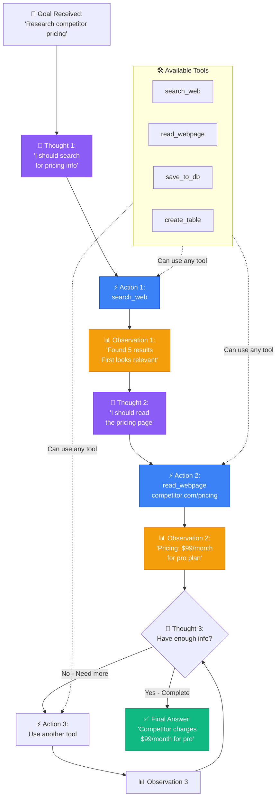

# 📘 MODULE 12: AI Agents

**Estimated Time:** 5-7 days
**Difficulty:** Advanced
**Prerequisites:** Modules 1-11 (especially RAG Systems)

## 📖 Overview & Why This Matters

AI Agents are the frontier of AI operations right now, and the skill that's most in demand. While RAG systems help AI access information, agents take it further—they can break down complex tasks, decide which tools to use, execute actions, and iterate until the task is complete.

Think of the difference this way:
- **RAG**: AI that can search and cite your knowledge base
- **Agents**: AI that can research competitors, book meetings, update spreadsheets, send notifications, AND synthesize everything into a report—all autonomously

Building agents is challenging. But mastering it means you can build AI systems that most people think are magic—and that companies pay $200K+ to have built.

## 🎯 Learning Objectives

By the end of this module, you will:

- [ ] Build AI agents that can use multiple tools autonomously
- [ ] Implement the ReAct pattern (Reasoning + Acting)
- [ ] Design prompt chains that break complex tasks into steps
- [ ] Implement conversation memory and context management
- [ ] Build guardrails: max iterations, timeouts, error handling
- [ ] Create agents that learn from feedback
- [ ] Understand when to use agents vs. simple workflows

## 🧠 Core Concepts

### What Makes an Agent?

An agent is an AI system that:
1. **Receives a goal** ("Research competitor pricing")
2. **Plans steps** to achieve it
3. **Decides which tools** to use
4. **Executes tool calls**
5. **Observes results**
6. **Iterates** until goal is met

Example agent loop:
```
Goal: "Research competitor pricing and create comparison table"

Agent thinks: "I need to find competitor websites, scrape pricing, organize in table"
Tool call: search("competitor pricing pages")
Observation: Found 3 competitor URLs

Agent thinks: "Now get pricing from each site"
Tool call: scrape_website(url1)
Observation: Pricing data retrieved

... repeat for each site ...

Agent thinks: "Now organize into table"
Tool call: create_table(data)
Observation: Table created

Final answer: [returns table]
```

The AI is **choosing which tools to use and when**—that's the key difference from simple automation.

```task
title: Build Your First Simple Agent
description: Create a basic agent that can use 2-3 tools (e.g., web search, calculator, note-taking). Give it a simple task like "Find the current price of Bitcoin and calculate 10% of it" and observe how it chooses which tools to use.
xp: 15
```

### The ReAct Pattern



ReAct (Reasoning + Acting) is the dominant agent pattern:

```
Thought: I should search for competitor pricing
Action: search_web("competitor pricing software")
Observation: Found 5 results

Thought: The first result looks most relevant
Action: read_webpage("https://competitor.com/pricing")
Observation: Pricing is $99/month for pro plan

Thought: I have enough information now
Final Answer: Competitor charges $99/month
```

The AI explains its reasoning, takes actions, observes results, and iterates.

### Prompt Chaining: Sequential AI Operations

Instead of one mega-prompt, chain focused prompts:

```
Step 1: Extract key info from user request
Step 2: Search knowledge base with extracted info
Step 3: Validate search results are relevant
Step 4: Generate answer from validated results
Step 5: Format answer for user's preferred style
```

Each step is simpler, more reliable, and easier to debug.

### Memory Systems

**Short-term memory (conversation context):**
- Store recent messages in conversation
- Summarize when token limit approaches
- Pass to next AI call

**Long-term memory (across conversations):**
- Store conversation summaries in database
- Embed and search like RAG
- Retrieve relevant past conversations

**Episodic memory (specific events):**
- Store key facts learned about user
- Update knowledge graph
- Reference in future conversations

```quiz
title: Agent Fundamentals and Patterns
questions:
- question: What is the key difference between an AI agent and a simple automated workflow?
  options: [Agents use more expensive AI models, Agents autonomously decide which tools to use and when, Agents are faster, Agents require less code]
  correct: 1
  explanation: The defining characteristic of an agent is autonomy - it decides which tools to use and when based on the goal, rather than following a predetermined sequence of steps like traditional automation.
- question: In the ReAct pattern, what does the 'Observation' step represent?
  options: [The agent's internal reasoning, The result returned from executing a tool, The user's feedback, The final answer]
  correct: 1
  explanation: In ReAct (Reasoning + Acting), the Observation is the result returned after executing a tool. The pattern is Thought → Action → Observation → repeat until complete.
- question: Why is prompt chaining better than using one mega-prompt for complex tasks?
  options: [It's faster, Each step is simpler and more reliable, It uses less tokens, It requires fewer AI models]
  correct: 1
  explanation: Breaking complex tasks into sequential focused prompts makes each step simpler, more reliable, and easier to debug. One mega-prompt tries to do too much at once and is harder to control.
- question: What is the purpose of short-term memory in an agent system?
  options: [To permanently store all conversations, To maintain recent conversation context within the current session, To reduce API costs, To make the agent faster]
  correct: 1
  explanation: Short-term memory stores recent messages in the current conversation, providing context for the next AI call. It's typically summarized when approaching token limits.
- question: Which type of memory would you use to remember a user's preferred writing style across multiple sessions?
  options: [Short-term memory, Long-term memory, Episodic memory, No memory needed]
  correct: 2
  explanation: Episodic memory stores specific facts learned about users (preferences, style, habits) that persist across sessions. Long-term memory is for conversation summaries, while episodic is for specific learned facts.
```

```task
title: Implement the ReAct Pattern
description: Build an agent using the ReAct pattern. For each step, have it output: Thought (reasoning), Action (tool to use), Action Input (parameters), and Observation (result). Test with a multi-step task that requires 3+ tool uses. Log the complete reasoning trace.
xp: 25
```

## 🛠️ Tools Deep Dive

### LangChain Agents

**Best for:** Building complex AI workflows with many integrations
**When to use:** Multi-step AI operations, agent systems
**Pricing:** Free (open source)

**Pros:**
- Huge library of integrations (100+ tools)
- Abstracts common patterns (agents, memory)
- Active community
- Production-ready
- Supports both Python and JavaScript

**Cons:**
- Steep learning curve
- Can be over-engineered for simple tasks
- Frequent breaking changes in updates

**Example usage:**
```python
from langchain.agents import Tool, AgentExecutor
from langchain.agents.react.agent import create_react_agent
from langchain.llms import OpenAI

# Define tools the agent can use
tools = [
    Tool(
        name="WebSearch",
        func=search_web,
        description="Search the web for information. Input: search query."
    ),
    Tool(
        name="ReadWebpage",
        func=scrape_webpage,
        description="Read content from a URL. Input: URL."
    ),
    Tool(
        name="SaveToDatabase",
        func=save_to_supabase,
        description="Save findings. Input: JSON with {company, data, category}."
    ),
]

# Create agent
agent = create_react_agent(
    llm=OpenAI(model="gpt-4o"),
    tools=tools,
    prompt=agent_prompt
)

executor = AgentExecutor(agent=agent, tools=tools, verbose=True)

# Run task
result = executor.invoke({
    "input": "Research top 3 competitors and save to database"
})
```

### Anthropic Claude with Tools

**Best for:** Reliable tool use, complex reasoning tasks
**When to use:** Need high-quality reasoning or working with sensitive data
**Pricing:** Pay per token (Input: $3/M tokens, Output: $15/M tokens for Claude 3.5 Sonnet)

**Pros:**
- Excellent at following tool schemas
- Better at complex reasoning than GPT-4
- Longer context windows (200K tokens)
- More reliable tool calling

**Cons:**
- No built-in agent framework (you build it)
- More expensive than GPT-4o
- Smaller ecosystem than OpenAI

```task
title: Compare Agent Frameworks
description: Build the same simple agent task (e.g., "Research and summarize a topic") using two different frameworks: LangChain and either Claude with manual tool handling or OpenAI Assistants API. Compare code complexity, cost, and performance.
xp: 20
```

### OpenAI Assistants API

**Best for:** Building agents without infrastructure management
**When to use:** Need agents but don't want to manage conversation state
**Pricing:** Pay per token (same as OpenAI API) + storage

**Pros:**
- Managed service (OpenAI handles everything)
- Built-in tool calling
- Persistent conversation threads
- No infrastructure to manage

**Cons:**
- Locked to OpenAI
- Less control over agent behavior
- Can get expensive
- Slower than self-hosted solutions

```quiz
title: Agent Tools and Frameworks
questions:
- question: What is the main advantage of using LangChain for building agents?
  options: [It's the cheapest option, It has 100+ pre-built tool integrations and abstracts common patterns, It's the fastest framework, It requires the least code]
  correct: 1
  explanation: LangChain's strength is its extensive library of 100+ tool integrations and pre-built abstractions for common agent patterns like ReAct, memory, and multi-step workflows.
- question: When would you choose Claude over GPT-4o for agent tool calling?
  options: [When you need the cheapest option, When you need excellent reasoning and reliable tool schema following, When you need the fastest responses, When you need built-in agent frameworks]
  correct: 1
  explanation: Claude excels at complex reasoning and is particularly reliable at following tool schemas correctly. It's more expensive but better for tasks requiring careful reasoning and accurate tool use.
- question: What is a key disadvantage of using OpenAI Assistants API for agents?
  options: [No tool calling support, You're locked to OpenAI and have less control over agent behavior, It requires more code, It doesn't support persistent threads]
  correct: 1
  explanation: Assistants API is a managed service, which means you're locked into OpenAI's ecosystem and have less control over exactly how the agent makes decisions compared to building your own.
- question: Which framework would be best for a simple agent that only needs 2-3 custom tools and maximum control?
  options: [LangChain with all integrations, Raw API calls with manual tool handling (Claude/OpenAI), OpenAI Assistants API, LlamaIndex]
  correct: 1
  explanation: For simple use cases with just a few custom tools, using raw API calls gives you maximum control and avoids the complexity of larger frameworks. Save frameworks like LangChain for complex multi-tool scenarios.
```

## 💡 Real Business Examples

### Example 1: Research Agent

**Problem:** Marketing team needed to research competitors, synthesize information from multiple sources, and create comparison reports. Taking 8 hours per report.

**Agent System Design:**

```python
from langchain.agents import Tool, AgentExecutor
from langchain.agents.react.agent import create_react_agent
from langchain.llms import OpenAI

# Define tools the agent can use
tools = [
    Tool(
        name="WebSearch",
        func=search_web,
        description="Search the web for information. Input: search query. Returns: list of results."
    ),
    Tool(
        name="ReadWebpage",
        func=scrape_webpage,
        description="Read content from a URL. Input: URL. Returns: page text content."
    ),
    Tool(
        name="SaveToDatabase",
        func=save_to_supabase,
        description="Save research findings. Input: JSON with {company, data, category}."
    ),
    Tool(
        name="CreateTable",
        func=generate_comparison_table,
        description="Create comparison table. Input: list of companies with data."
    )
]

# Create agent
agent = create_react_agent(
    llm=OpenAI(model="gpt-4o"),
    tools=tools,
    prompt="""You are a research assistant. Break down research tasks into steps.

Available tools:
{tools}

Use this format:
Thought: [your reasoning]
Action: [tool name]
Action Input: [input to tool]
Observation: [tool output]
... (repeat Thought/Action/Observation as needed)
Thought: I now have enough information
Final Answer: [your final response]

Task: {input}
{agent_scratchpad}"""
)

executor = AgentExecutor(agent=agent, tools=tools, verbose=True)

# Run research task
result = executor.invoke({
    "input": """Research top 3 competitors in project management software:
    1. Find their websites
    2. Get pricing information
    3. Extract key features
    4. Create comparison table
    5. Save findings to database"""
})
```

**Example execution:**

```
Thought: I need to find the top project management software competitors first.
Action: WebSearch
Action Input: "top project management software 2024"
Observation: Found articles mentioning Asana, Monday.com, ClickUp as top 3

Thought: Now I need to get pricing info for Asana
Action: ReadWebpage
Action Input: "https://asana.com/pricing"
Observation: [Pricing page content]

Thought: I found Asana pricing. Now for Monday.com
Action: ReadWebpage
Action Input: "https://monday.com/pricing"
Observation: [Pricing page content]

[... continues for all competitors ...]

Thought: I have all the data. Let me save it and create a table.
Action: SaveToDatabase
Action Input: {"company": "Asana", "data": {...}, "category": "pricing"}
Observation: Saved successfully

Action: CreateTable
Action Input: [{"name": "Asana", "price": "$10.99", ...}, ...]
Observation: Table created

Thought: I now have complete research with table
Final Answer: [Research report with comparison table]
```

**Result:**
- Research time: 8 hours → 20 minutes
- Can research 10x more competitors in same time
- Findings automatically organized in database
- Consistent data format (no human variation)
- Cost: $5-10 per report in API costs

### Example 2: Content Production Agent with Memory

**Problem:** Agency creating personalized content for 50 clients. Each client has preferences, brand voice, topics to avoid. Hard to keep track manually.

**Memory-Enhanced Agent:**

```python
class ContentAgent:
    def __init__(self, client_id):
        self.client_id = client_id
        self.memory = ConversationBufferMemory()
        self.client_knowledge = self.load_client_knowledge()

    async def load_client_knowledge(self):
        # Load past conversations and preferences
        past_content = await db.query(
            "SELECT * FROM content WHERE client_id = $1 ORDER BY created_at DESC LIMIT 10",
            [self.client_id]
        )

        preferences = await db.query(
            "SELECT * FROM client_preferences WHERE client_id = $1",
            [self.client_id]
        )

        # Embed and store in vector DB for retrieval
        knowledge = {
            "past_content": past_content,
            "preferences": preferences,
            "style_guide": await self.extract_style_patterns(past_content)
        }

        return knowledge

    async def extract_style_patterns(self, past_content):
        # Use AI to analyze writing patterns
        analysis = await openai.chat.completions.create(
            model="gpt-4o",
            messages=[{
                "role": "system",
                "content": "Analyze these content samples and extract the writing style patterns."
            }, {
                "role": "user",
                "content": f"Samples:\n{past_content}"
            }]
        )

        return analysis.choices[0].message.content

    async def create_content(self, topic, content_type):
        # Build context from memory
        relevant_memories = await self.search_memories(topic)

        prompt = f"""Create {content_type} about: {topic}

Client Profile:
- Industry: {self.client_knowledge.preferences.industry}
- Tone: {self.client_knowledge.preferences.tone}
- Avoid: {self.client_knowledge.preferences.avoid_topics}

Writing Style (learned from past content):
{self.client_knowledge.style_guide}

Relevant Past Content:
{relevant_memories}

Create new content that matches their style but with fresh angle."""

        content = await openai.chat.completions.create(
            model="gpt-4o",
            messages=[{"role": "user", "content": prompt}]
        )

        # Save to memory for future use
        await self.save_to_memory(topic, content.choices[0].message.content)

        return content.choices[0].message.content

    async def search_memories(self, query):
        # Search past content for relevant examples
        embedding = await get_embedding(query)
        similar = await pinecone.query(
            vector=embedding,
            filter={"client_id": self.client_id},
            top_k=3
        )
        return similar

    async def save_to_memory(self, topic, content):
        # Store in both database and vector store
        await db.insert("content", {
            "client_id": self.client_id,
            "topic": topic,
            "content": content,
            "created_at": datetime.now()
        })

        embedding = await get_embedding(content)
        await pinecone.upsert({
            "id": f"{self.client_id}-{uuid()}",
            "values": embedding,
            "metadata": {"client_id": self.client_id, "topic": topic}
        })
```

**Result:**
- Content matches client style 95% of time (vs. 60% before)
- No more "this doesn't sound like us" revisions
- Agent learns and improves with each piece
- Scales from 5 to 50 clients without quality drop
- New clients ramp up faster (learns style in 3-5 samples)

```quiz
title: Production Agent Systems
questions:
- question: In the research agent example, why does the agent use multiple search queries instead of just one?
  options: [To increase API costs, Different phrasings and approaches find different relevant results, To make the system slower, To use more tools]
  correct: 1
  explanation: Generating multiple query variants (original, rephrased, keyword-focused) helps find results that might be missed with a single query. Different phrasings catch different aspects of the research topic.
- question: What is the purpose of the 'reasoning trace' in production agent systems?
  options: [To make the system slower, To log every decision for debugging and transparency, To increase costs, To confuse users]
  correct: 1
  explanation: Logging every thought, action, and observation creates a reasoning trace that's invaluable for debugging when things go wrong and for understanding how the agent makes decisions.
- question: In the content production agent example, why is episodic memory important?
  options: [To reduce API costs, To remember client preferences and writing style across sessions, To make responses faster, To reduce code complexity]
  correct: 1
  explanation: Episodic memory stores learned facts about each client (tone, style, topics to avoid) and retrieves them in future sessions, ensuring consistency without retraining.
- question: Why does the research agent save findings to a database during execution rather than just at the end?
  options: [To use more storage, To preserve partial results if the agent fails mid-task, To make it slower, To increase complexity]
  correct: 1
  explanation: Saving incrementally means partial results are preserved even if the agent hits an error or timeout. This is crucial for long-running tasks that might not complete in one attempt.
- question: What is the benefit of using vector search for long-term memory in the content agent?
  options: [It's cheaper, It allows semantic search to find relevant past content even without exact keyword matches, It's faster, It requires less code]
  correct: 1
  explanation: Vector search enables semantic similarity matching, so the agent can find relevant past content based on meaning rather than just exact keywords. This is much more powerful for context retrieval.
```

```task
title: Build a Research Agent with Multiple Tools
description: Create an agent that can research a topic using multiple tools: web search, webpage reading, and data storage. Give it a task like "Research the top 3 competitors in [industry] and save key info to a database." Ensure it makes autonomous decisions about which tools to use.
xp: 35
```

## ⚠️ Common Pitfalls

### 1. **No Guardrails on Agent Loops**
❌ Agent runs forever trying to complete impossible task
✅ Max iterations limit (e.g., 10 steps), timeout after 2 minutes

### 2. **One-Size-Fits-All Prompts**
❌ Same system prompt for all agent tasks
✅ Task-specific prompts, dynamic prompt construction based on context

### 3. **No Monitoring of Agent Decisions**
❌ Agent runs, you only see final output
✅ Log every tool call, decision, and observation for debugging

### 4. **Too Many Tools at Once**
❌ Give agent access to 50 different tools
✅ Progressive disclosure: start with 3-5 relevant tools

### 5. **Not Testing Edge Cases**
❌ Only test happy path
✅ Test: no results found, API errors, conflicting information, infinite loops

## ✨ Pro Tips

### Tip 1: The "Reasoning Trace" Pattern

Have agents explain their reasoning:

```python
agent_prompt = """For each action, explain:
1. What you're trying to achieve
2. Why this tool/approach
3. What you expect to learn

This helps debug when things go wrong."""
```

### Tip 2: Implement Progressive Disclosure

Don't dump all tools on agent at once:

```python
# Start with basic tools
if task_complexity == "low":
    tools = [search, read]
# Add more as needed
elif task_complexity == "medium":
    tools = [search, read, save, analyze]
# Full suite for complex tasks
else:
    tools = [search, read, save, analyze, create, execute]
```

Fewer tools = better decision making.

### Tip 3: Add Guardrails

```python
executor = AgentExecutor(
    agent=agent,
    tools=tools,
    max_iterations=10,  # Prevent infinite loops
    max_execution_time=120,  # 2 minute timeout
    early_stopping_method="generate",  # Stop gracefully
    verbose=True
)
```

### Tip 4: Log Everything

```python
class LoggingAgent:
    def run(self, task):
        self.log("Starting task", task)

        for step in self.execute(task):
            self.log("Thought", step.thought)
            self.log("Action", step.action)
            self.log("Observation", step.observation)

        self.log("Final answer", step.final_answer)

    def log(self, event_type, data):
        # Save to database for debugging
        db.insert("agent_logs", {
            "timestamp": now(),
            "event_type": event_type,
            "data": data
        })
```

### Tip 5: Build Feedback Loops

```python
async def agent_with_feedback(task):
    result = await agent.run(task)

    # Ask user for feedback
    feedback = await ask_user("Did the agent complete the task correctly?")

    # Save for improvement
    await db.insert("agent_feedback", {
        "task": task,
        "result": result,
        "success": feedback == "yes",
        "timestamp": now()
    })

    # Periodically analyze failures and adjust prompts
```

```task
title: Implement Agent Guardrails
description: Add safety guardrails to your agent: max 10 iterations limit, 2-minute timeout, error handling with retries (max 3 attempts), and graceful degradation when limits are hit. Test with tasks designed to trigger each guardrail.
xp: 20
```

```task
title: Build a Memory-Enhanced Agent
description: Create an agent with three types of memory: short-term (current conversation), long-term (past conversation summaries in vector DB), and episodic (learned user preferences). Test by having multiple sessions where the agent remembers context from earlier conversations.
xp: 30
```

## 📝 Module Project: Build an AI Research Assistant Agent

### Objective

Build a complete AI agent that can research topics, search multiple sources, synthesize information, and create comprehensive reports with citations.

### Requirements

1. **Agent Core**
   - Implement ReAct pattern
   - Support 5+ tools
   - Reasoning trace logging

2. **Tools**
   - Web search
   - Webpage scraping
   - Database save/retrieve
   - Table creation
   - Summary generation

3. **Memory**
   - Short-term: conversation context
   - Long-term: past research saved to DB
   - Episodic: learned facts about user preferences

4. **Guardrails**
   - Max 10 iterations
   - 2 minute timeout
   - Error handling with retries
   - Graceful degradation

5. **Observability**
   - Log all thoughts/actions/observations
   - Performance metrics
   - Success/failure tracking

### Success Criteria

✅ Agent can break down research tasks autonomously
✅ Uses multiple tools appropriately
✅ Generates reports with proper citations
✅ Maintains memory across sessions
✅ Implements guardrails (max iterations, timeouts)
✅ Logs all decisions for debugging
✅ Handles errors gracefully
✅ You can explain how each component works

## 📚 Resources & Next Steps

### Recommended Reading
- LangChain Documentation (https://python.langchain.com)
- "Building LLM Apps" by Anthropic (https://docs.anthropic.com)
- OpenAI Function Calling Guide

### Tools & Links
- LangChain (https://langchain.com)
- LangSmith (https://smith.langchain.com) - Observability for agents
- OpenAI Assistants (https://platform.openai.com/docs/assistants)

### What's Next?

In Module 13 (Payments & Auth), you'll learn to add user authentication and payment processing to your AI applications, turning projects into products people can actually use and pay for.

## ✅ Module Completion Checklist

Before moving to Module 13, you should be able to confidently say "yes" to all of these:

- [ ] I've built an AI agent that uses multiple tools
- [ ] I understand the ReAct pattern (Reasoning + Acting)
- [ ] I can implement prompt chaining for multi-step tasks
- [ ] I've implemented conversation memory in an AI system
- [ ] I've added guardrails (max iterations, timeouts)
- [ ] I can debug agent behavior by examining reasoning traces
- [ ] I understand when to use agents vs. simple automation
- [ ] I've built a complete autonomous agent system
