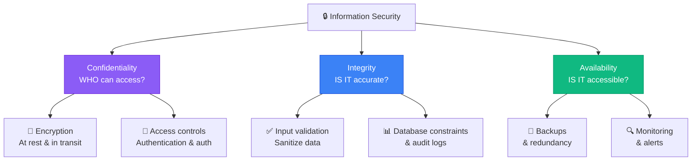
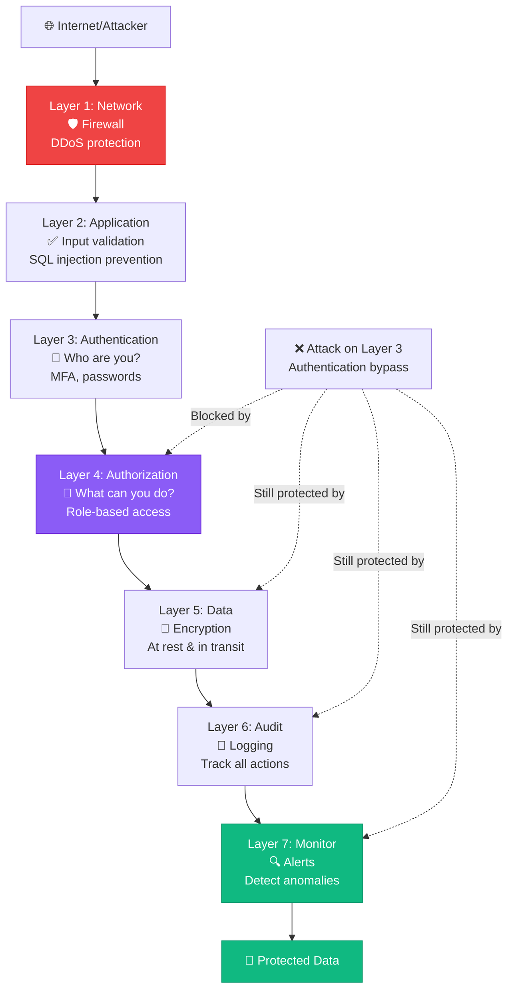

# 📘 MODULE 13: Security & Ethics

**Estimated Time:** 3-5 days
**Difficulty:** Beginner
**Prerequisites:** Modules 1, 5, 7, 9

## 📖 Overview & Why This Matters

You can build the most sophisticated AI system in the world, but one data breach or ethical misstep will destroy your reputation and potentially your business. Security and ethics aren't optional extras - they're foundational requirements for professional AI operations.

Here's what's at stake: Companies are trusting you with customer data, proprietary information, and sometimes deeply personal content. Healthcare companies need HIPAA compliance. European customers trigger GDPR requirements. Every API key you expose or data breach you cause can result in lawsuits, fines, and lost trust.

But this isn't just about avoiding disasters. Clients increasingly ask: "How do you handle data security?" and "What's your stance on ethical AI?" If you can't answer confidently, you won't win enterprise contracts. If you can demonstrate strong security practices and ethical frameworks, you differentiate yourself from amateurs.

The good news: You don't need to become a security expert. You need to understand core principles, implement standard best practices, and know when to bring in specialists. This module gives you that foundation.

## 🎯 Learning Objectives

By the end of this module, you will:

- [ ] Implement proper API key management and never expose secrets
- [ ] Understand data privacy principles and GDPR basics
- [ ] Build systems that protect user data by default
- [ ] Recognize and avoid common security vulnerabilities
- [ ] Apply ethical frameworks to AI implementations
- [ ] Identify and mitigate bias in AI systems
- [ ] Create transparent AI systems that users can trust

## 🧠 Core Concepts

### The CIA Triad



Three pillars of information security:

**Confidentiality**: Only authorized people can access data
- Encryption at rest and in transit
- Access controls
- Authentication and authorization

**Integrity**: Data is accurate and hasn't been tampered with
- Input validation
- Database constraints
- Audit logs

**Availability**: Systems are accessible when needed
- Backups
- Redundancy
- Monitoring and alerts

### Defense in Depth



Don't rely on a single security measure. Layer multiple protections:

```
Layer 1: Network security (firewall)
Layer 2: Application security (input validation)
Layer 3: Authentication (who are you?)
Layer 4: Authorization (what can you do?)
Layer 5: Data encryption
Layer 6: Audit logging
Layer 7: Monitoring and alerts
```

If one layer fails, others still protect.

### Privacy by Design

Build privacy into systems from the start, not as an afterthought:

**Data Minimization**: Collect only what you need
- Bad: Collecting birth date when you only need age range
- Good: Ask for age range directly

**Purpose Limitation**: Use data only for stated purposes
- Bad: Using email for marketing when user signed up for product updates
- Good: Separate opt-ins for different purposes

**Storage Limitation**: Delete data when no longer needed
- Bad: Keeping user data forever "just in case"
- Good: Automated deletion after 90 days of inactivity

### The Principle of Least Privilege

Give minimum access necessary:

```
Bad: All team members have admin access to production database
Good: Developers have read-only, only you have write access

Bad: Frontend app has database admin credentials
Good: Frontend calls API, API has limited database permissions

Bad: One API key with full access to everything
Good: Separate API keys per service with minimal permissions
```

### Ethical AI Frameworks

**Transparency**: Users should know they're interacting with AI
```
Bad: AI chatbot pretending to be human
Good: "I'm an AI assistant. Here's how I can help:"
```

**Fairness**: AI shouldn't discriminate
```
Bad: Resume screener that favors male candidates
Good: Regularly audit for bias, adjust training data
```

**Accountability**: Someone is responsible for AI decisions
```
Bad: "The AI made that decision, not us"
Good: "We're responsible for our AI systems and their outputs"
```

**Privacy**: Protect user data in AI systems
```
Bad: Training AI on user data without consent
Good: Explicit consent, data anonymization, opt-out options
```

### Common Security Vulnerabilities

**Injection Attacks**: Malicious code in user input
```javascript
// Bad: SQL injection vulnerability
db.query(`SELECT * FROM users WHERE email = '${userInput}'`)

// Good: Parameterized queries
db.query('SELECT * FROM users WHERE email = $1', [userInput])
```

**Exposed Secrets**: API keys in code
```javascript
// Bad: Hardcoded API key
const apiKey = 'sk-abcd1234...'

// Good: Environment variable
const apiKey = process.env.OPENAI_API_KEY
```

**Broken Authentication**: Weak session management
```javascript
// Bad: Predictable session tokens
const session = userId + Date.now()

// Good: Cryptographically random tokens
const session = crypto.randomBytes(32).toString('hex')
```

**Cross-Site Scripting (XSS)**: Unsanitized user input displayed
```javascript
// Bad: Directly rendering user input
<div>{userInput}</div>

// Good: Sanitized/escaped
<div>{escapeHTML(userInput)}</div>
```

## 🛠️ Tools Deep Dive

### Secret Management

**Environment Variables** (Minimum standard)
```bash
# .env file (never commit to git!)
OPENAI_API_KEY=sk-...
SUPABASE_KEY=eyJ...
STRIPE_SECRET_KEY=sk_live_...
```

```javascript
// Access in code
const apiKey = process.env.OPENAI_API_KEY
```

**1Password / LastPass** (For team management)
- Shared vaults for team
- Secure password generation
- Access logging

**HashiCorp Vault** (Enterprise)
- Centralized secret storage
- Dynamic credentials
- Audit logging
- Overkill for small projects

### Data Encryption

**At Rest**: Encrypt stored data
- Most databases encrypt by default (check settings)
- File storage: Use encrypted buckets (S3 with encryption)
- Local backups: Full disk encryption

**In Transit**: Encrypt data moving over network
- Always use HTTPS, never HTTP
- API calls use TLS/SSL
- Database connections encrypted

**Application Level**: Encrypt sensitive fields
```javascript
// Encrypt before storing
const encrypted = await encrypt(sensitiveData, encryptionKey)
await db.insert({ data: encrypted })

// Decrypt when reading
const decrypted = await decrypt(row.data, encryptionKey)
```

### Security Scanning

**GitHub Secret Scanning**
- Automatically detects committed secrets
- Alerts you before they're public
- Free for public repositories

**npm audit / Dependabot**
- Scans dependencies for vulnerabilities
- Suggests updates
- Automated pull requests

**Snyk**
- Continuous security monitoring
- Finds vulnerabilities in code and dependencies
- Integration with CI/CD

### Compliance Tools

**OneTrust / TrustArc** (Privacy management)
- Cookie consent management
- Privacy policy generators
- GDPR compliance tools
- Expensive (enterprise)

**Termly** (Small business)
- Privacy policy generator
- Cookie consent banners
- $10-25/month

### Ethical AI Tools

**IBM AI Fairness 360**
- Detect bias in datasets
- Metrics for fairness
- Mitigation algorithms
- Open source

**Google What-If Tool**
- Visualize model behavior
- Test for bias
- Understand model decisions
- Free

## 💡 Real Business Examples

### Example 1: The $50K GDPR Fine (Preventable)

**What Happened:**
Small AI tool with 500 users. One user from Germany.

1. User signed up (stored: email, name, IP, usage data)
2. User submitted GDPR deletion request via email
3. Founder thought "I'll get to it next week"
4. User filed complaint after 45 days of no response
5. GDPR fine: €45,000 ($50K)

**What They Should Have Done:**

1. GDPR-compliant privacy policy on signup
2. Self-service data deletion in account settings
3. Respond to deletion request within 30 days
4. Actually delete all user data
5. Send confirmation email

**The Fix They Implemented:**
```javascript
// Self-service deletion endpoint
app.post('/api/delete-account', async (req, res) => {
  const userId = req.user.id

  // Delete from all systems
  await Promise.all([
    supabase.from('users').delete().eq('id', userId),
    supabase.from('generations').delete().eq('user_id', userId),
    pinecone.delete({ filter: { user_id: userId } }),
    stripe.customers.del(customerId)
  ])

  // Log deletion for compliance
  await logGDPRAction({
    user_id: userId,
    action: 'account_deleted',
    timestamp: new Date(),
    ip_address: req.ip
  })

  // Send confirmation
  await sendEmail({
    to: req.user.email,
    subject: 'Account Deleted',
    body: 'Your account and all associated data have been permanently deleted.'
  })

  res.json({ success: true })
})
```

**Cost of Prevention:** 2 hours of development
**Cost of Not Having It:** $50K + reputation damage

### Example 2: AI Bias in Resume Screening

**The Problem:**
Company built AI resume screener. Trained on 10 years of hiring data.

**What They Didn't Notice:**
- Historical data was biased (90% male hires in engineering)
- AI learned to favor male candidates
- Penalized resumes with "women's" college names
- Downranked candidates with gap years (affected women more)

**How They Discovered It:**
- Only 5% of AI-recommended candidates were women
- Someone noticed and investigated
- Realized AI was amplifying historical bias

**The Fix:**

1. **Audit Dataset:**
```python
# Analyze historical data
print(f"Historical gender split: {data['gender'].value_counts()}")
print(f"Hiring rate by gender: {hired_by_gender}")

# Red flag: 90% male in engineering roles
```

2. **Balance Training Data:**
```python
# Undersample majority class or oversample minority
from sklearn.utils import resample

balanced_data = pd.concat([
  resample(male_candidates, n_samples=len(female_candidates)),
  female_candidates
])
```

3. **Remove Biased Features:**
```python
# Don't include:
removed_features = [
  'college_name',  # Proxy for gender/race
  'age',           # Age discrimination
  'zip_code',      # Proxy for race/income
  'first_name'     # Gender proxy
]
```

4. **Regular Bias Audits:**
```python
# Check model outputs monthly
def audit_predictions(predictions):
    results = predictions.merge(demographic_data)

    print("Recommendation rate by gender:")
    print(results.groupby('gender')['recommended'].mean())

    print("Recommendation rate by race:")
    print(results.groupby('race')['recommended'].mean())

    # Flag if any group < 80% of others (80% rule)
```

5. **Human-in-the-Loop:**
```
AI recommends candidates → Human reviews → Human decides

AI assists, doesn't decide
```

**Result:**
- More diverse candidate pool
- Avoided potential discrimination lawsuit
- Better hiring outcomes (diverse teams perform better)

### Example 3: API Key Exposure Disaster

**What Happened:**
Developer building AI tool committed code to GitHub with OpenAI API key in it.

**Timeline:**
- 10:23 AM: Code pushed to public GitHub repo
- 10:24 AM: Bot scraped repo, found API key
- 10:25-11:30 AM: Bot used API key to generate spam content
- 11:30 AM: Developer checks OpenAI usage dashboard
- **$847 in charges in 67 minutes**

**The Aftermath:**
- OpenAI refused to refund (Terms of Service: secure your keys)
- Had to eat the cost
- Revoked key, all production systems broke
- Scrambled to deploy with new key

**Prevention (What they should have done):**

1. **Never commit secrets:**
```gitignore
# .gitignore
.env
.env.local
*.key
secrets.json
```

2. **Use environment variables:**
```javascript
// Never:
const apiKey = 'sk-abc123...'

// Always:
const apiKey = process.env.OPENAI_API_KEY
```

3. **Pre-commit hooks:**
```bash
# .git/hooks/pre-commit
#!/bin/bash

# Check for potential secrets
if git diff --cached | grep -E 'sk-[a-zA-Z0-9]{48}|eyJ[a-zA-Z0-9_-]+'; then
  echo "Error: Potential API key detected!"
  echo "Remove secrets before committing"
  exit 1
fi
```

4. **GitHub Secret Scanning:**
- Automatically enabled for public repos
- Alerts you if secrets detected
- Partners notify (OpenAI disables key automatically now)

5. **Rate Limits on Keys:**
```javascript
// OpenAI dashboard: Set usage limits
Usage limit: $50/month
Alert at: $40
Hard cap: $50 (stops requests)
```

## ⚠️ Common Pitfalls

### 1. **Assuming AI Outputs Are Safe**
❌ Displaying AI-generated content directly without sanitization
✅ Always sanitize outputs, especially if displaying as HTML

### 2. **Collecting More Data Than Needed**
❌ "We might need this someday, let's collect it"
✅ Only collect data you have a specific use for right now

### 3. **Using Production Data for Testing**
❌ Testing with real customer emails and names
✅ Use synthetic test data or properly anonymized samples

### 4. **No Data Retention Policy**
❌ Keeping all user data forever
✅ Delete data after defined period (90 days, 1 year, etc.)

### 5. **Weak Password Requirements**
❌ Allowing "password123"
✅ Enforce minimum 12 characters, check against breach databases

### 6. **Not Logging Security Events**
❌ No record of login attempts, data access
✅ Audit log of sensitive operations

### 7. **Trusting User Input**
❌ Using user input directly in queries or commands
✅ Validate, sanitize, parameterize

## ✨ Pro Tips

### Tip 1: The "Principle of Least Data"

Before adding a field to your database, ask:
1. Do we absolutely need this?
2. Will we actually use it?
3. What's the risk if it leaks?
4. How long should we keep it?

If uncertain, don't collect it.

### Tip 2: Environment-Specific Keys

Never use production keys in development:

```
Development: OpenAI key with $10/month limit
Production: OpenAI key with $500/month limit

Development: Stripe test mode
Production: Stripe live mode
```

Can't accidentally charge real customers or rack up bills in dev.

### Tip 3: The "Bed Time Test" for Ethics

Before shipping an AI feature, ask:
- Would I be comfortable seeing this on the front page of the news?
- Would I want this used on my data?
- What's the worst case if this goes wrong?

If answers make you uncomfortable, rethink the feature.

### Tip 4: Anonymize Data in Logs

```javascript
// Bad: Logs contain PII
logger.info(`User john@email.com generated content`)

// Good: Logs use IDs, not PII
logger.info(`User ${userId} generated content`)

// Better: Hash PII if you must log it
logger.info(`User ${hash(email)} generated content`)
```

### Tip 5: Implement "Break Glass" Access

For emergencies, have secure way to access systems:

```
Normal: Team members have normal access
Emergency: Admin can elevate permissions temporarily
All emergency access logged and reviewed
```

### Tip 6: Regular Security Reviews

Monthly checklist:
- [ ] Review active API keys, revoke unused ones
- [ ] Check npm audit for vulnerabilities
- [ ] Review access logs for anomalies
- [ ] Test data deletion process
- [ ] Review user permissions
- [ ] Update dependencies

30 minutes/month prevents disasters.

### Tip 7: Privacy Policy in Plain English

Don't just copy a template. Explain clearly:

```
Bad: "We may process your data for legitimate business interests"
Good: "We use your email to send you AI-generated content and account updates. We never sell your data to third parties."

Bad: "Data subject access requests pursuant to Article 15..."
Good: "You can download or delete all your data at any time from Account Settings"
```

## 📝 Module Project: Security Audit & Ethical Review

### Objective

Perform a complete security audit of an AI system and implement ethical safeguards.

### Task 1: Security Checklist (Day 1)

**Review an AI project (yours or example) against this checklist:**

**Secret Management:**
- [ ] No API keys in code
- [ ] Secrets in environment variables
- [ ] .env file in .gitignore
- [ ] Different keys for dev/prod
- [ ] Regular key rotation plan

**Authentication & Authorization:**
- [ ] Strong password requirements
- [ ] Session tokens cryptographically random
- [ ] Rate limiting on login attempts
- [ ] Row-level security if using database
- [ ] Principle of least privilege for permissions

**Data Security:**
- [ ] HTTPS for all connections
- [ ] Database connections encrypted
- [ ] Sensitive data encrypted at rest
- [ ] Input validation on all user input
- [ ] Output sanitization before display

**Privacy:**
- [ ] Privacy policy exists and is clear
- [ ] Only collecting necessary data
- [ ] User can download their data
- [ ] User can delete their data
- [ ] Data retention policy defined

**Dependencies:**
- [ ] Regular dependency updates
- [ ] npm audit run weekly
- [ ] No critical vulnerabilities
- [ ] Dependencies from trusted sources

**Fix at least 5 items** that are currently failing.

### Task 2: Implement Data Deletion (Day 2)

**Build complete data deletion:**

```typescript
// Supabase Edge Function: /functions/delete-user-data

import { serve } from "https://deno.land/std/http/server.ts"
import { createClient } from 'https://esm.sh/@supabase/supabase-js@2'

serve(async (req) => {
  // Verify user is authenticated
  const authHeader = req.headers.get('Authorization')!
  const supabase = createClient(
    Deno.env.get('SUPABASE_URL')!,
    Deno.env.get('SUPABASE_SERVICE_KEY')!
  )

  const { data: { user } } = await supabase.auth.getUser(authHeader.replace('Bearer ', ''))

  if (!user) {
    return new Response('Unauthorized', { status: 401 })
  }

  try {
    // Delete from all tables
    await Promise.all([
      supabase.from('profiles').delete().eq('id', user.id),
      supabase.from('generations').delete().eq('user_id', user.id),
      supabase.from('usage_logs').delete().eq('user_id', user.id)
    ])

    // Delete from vector store
    await fetch(`https://api.pinecone.io/vectors/delete`, {
      method: 'POST',
      headers: {
        'Api-Key': Deno.env.get('PINECONE_API_KEY')!
      },
      body: JSON.stringify({
        filter: { user_id: user.id }
      })
    })

    // Cancel Stripe subscription if exists
    const customer = await getStripeCustomer(user.email)
    if (customer) {
      await cancelStripeSubscription(customer.id)
    }

    // Log deletion for compliance
    await supabase.from('gdpr_logs').insert({
      user_id: user.id,
      action: 'data_deleted',
      timestamp: new Date(),
      ip_address: req.headers.get('cf-connecting-ip')
    })

    // Delete auth user (do this last)
    await supabase.auth.admin.deleteUser(user.id)

    return new Response(JSON.stringify({
      success: true,
      message: 'All data permanently deleted'
    }))

  } catch (error) {
    // Don't expose internal errors
    console.error(error)
    return new Response('Error deleting data', { status: 500 })
  }
})
```

**Test it:**
1. Create test account
2. Generate some data
3. Call deletion endpoint
4. Verify all data gone from all systems
5. Try to login (should fail)

### Task 3: Bias Audit (Day 3)

**Test your AI for potential bias:**

1. **Collect Test Cases:**
```javascript
const testCases = [
  { name: "Michael Smith", expected_score: null },
  { name: "Lakisha Washington", expected_score: null },
  { name: "Emily Johnson", expected_score: null },
  { name: "José Rodriguez", expected_score: null },
  // Names statistically associated with different demographics
]
```

2. **Run Through Your AI:**
```javascript
for (const testCase of testCases) {
  const result = await yourAIFunction(testCase.name)
  testCase.actual_score = result.score
}
```

3. **Analyze Results:**
```javascript
// Are scores consistent across demographic groups?
// Do certain name patterns get systematically different results?

console.log(testCases)
// Flag if variance > 20% between groups
```

4. **If Bias Found:**
- Remove demographic proxies from inputs
- Balance training examples
- Add explicit fairness constraints
- Implement human review step

### Task 4: Ethical Guidelines Document (Day 4)

**Create your AI Ethics Policy:**

```markdown
# AI Ethics Guidelines - [Your Company/Project]

## Our Commitments

### Transparency
- Users always know when they're interacting with AI
- We explain how our AI makes decisions
- We document AI capabilities and limitations

### Fairness
- We regularly audit for bias
- We don't discriminate based on protected characteristics
- We balance training data across demographics

### Privacy
- We collect minimal data necessary
- We encrypt sensitive data
- Users can access and delete their data
- We never sell user data

### Accountability
- A human reviews high-impact AI decisions
- We have clear escalation paths
- We monitor AI outputs for quality and safety
- We take responsibility for AI errors

### Safety
- We test AI outputs before deployment
- We have kill switches for problematic AI
- We monitor for misuse
- We update AI when we discover issues

## What We Won't Do

- Use AI to deceive users
- Train on data without consent
- Deploy AI with known bias
- Use AI for surveillance without disclosure
- Create AI that could cause significant harm

## Our Process

1. Before building: Ethical review
2. During building: Bias testing
3. Before launch: Safety review
4. After launch: Ongoing monitoring
5. If issues found: Immediate action

## Contact

Questions about AI ethics: ethics@yourcompany.com
Report concerns: [reporting form]
```

### Task 5: Security Incident Response Plan (Day 5)

**Document what to do if something goes wrong:**

```markdown
# Security Incident Response Plan

## Severity Levels

**P0 (Critical)**
- Active data breach
- API keys exposed publicly
- Customer data leaked
- System completely down

**P1 (High)**
- Suspected data breach
- Authentication bypass discovered
- Payment system compromised

**P2 (Medium)**
- Security vulnerability found
- Abnormal access patterns
- Failed attack attempts logged

## Response Steps

### P0: Critical Incident

**Immediate (0-15 minutes):**
1. [ ] Revoke compromised credentials immediately
2. [ ] Take affected system offline if necessary
3. [ ] Alert team via [emergency channel]
4. [ ] Begin collecting evidence

**Short-term (15 min - 4 hours):**
1. [ ] Assess scope of breach
2. [ ] Notify affected users if data compromised
3. [ ] Implement temporary fix
4. [ ] Contact legal counsel
5. [ ] Prepare public statement if necessary

**Long-term (4-48 hours):**
1. [ ] Root cause analysis
2. [ ] Permanent fix deployed
3. [ ] Security audit of related systems
4. [ ] Incident report written
5. [ ] Preventive measures implemented

### Communication Templates

**To Users (Data Breach):**
```
Subject: Important Security Notice

We discovered unauthorized access to [system] on [date].

What happened:
[Clear, non-technical explanation]

What data was affected:
[Specific list]

What we did:
[Actions taken]

What you should do:
[Specific recommendations]

Questions: security@company.com
```

**To Team:**
```
SECURITY INCIDENT - P0

What: [One-line description]
When: [Time discovered]
Status: [Investigating/Contained/Resolved]
Impact: [Who/what is affected]
Action needed: [What team members should do]

Updates: [Where to follow progress]
```

## Contacts

- Security Lead: [name, phone]
- Legal Counsel: [name, phone]
- Hosting Provider Support: [number]
- OpenAI Support: support@openai.com
```

### Success Criteria

✅ Completed security checklist with 5+ fixes implemented
✅ Working data deletion that removes user from all systems
✅ Tested AI system for potential bias
✅ Created ethics policy document
✅ Documented incident response plan
✅ Tested incident response with simulation
✅ You can confidently discuss security with clients

## 📚 Resources & Next Steps

### Recommended Reading
- OWASP Top 10 (https://owasp.org/top-10/)
- GDPR Overview (https://gdpr.eu)
- "AI Ethics Guidelines" by EU (https://digital-strategy.ec.europa.eu/en/library/ethics-guidelines-trustworthy-ai)

### Tools & Links
- Have I Been Pwned (https://haveibeenpwned.com) - Check for breaches
- OWASP ZAP (https://zaproxy.org) - Security testing
- Privacy Policy Generator (https://termly.io)

### What's Next?

Module 14 (Operator Mindset) covers the mental models and frameworks that separate great AI Operators from good ones - how to think at scale and make better decisions.

## ✅ Module Completion Checklist

Before moving to Module 14, you should be able to confidently say "yes" to all of these:

- [ ] I never commit API keys or secrets to version control
- [ ] I use environment variables for all sensitive configuration
- [ ] I understand GDPR basics and user data rights
- [ ] I've implemented user data deletion functionality
- [ ] I sanitize user inputs before processing
- [ ] I've audited my AI system for potential bias
- [ ] I have a documented ethics policy for AI use
- [ ] I know how to respond to security incidents
