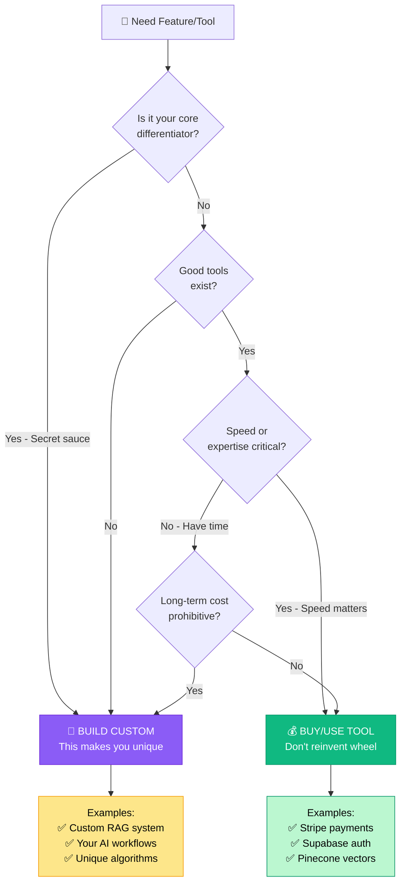

# 📘 MODULE 2: Operator Mindset

**Estimated Time:** 3-4 days
**Difficulty:** Beginner
**Prerequisites:** Module 1 (Foundations)

## 📖 Overview & Why This Matters

Before you dive into the technical skills—databases, APIs, automations, AI agents—you need to develop the right mindset. This is what separates AI Operators earning $80K from those earning $200K+: How they think.

The best operators don't just execute tasks - they see systems, spot leverage points, make high-quality decisions quickly, and know when to build versus when to buy. They don't chase every new AI model or tool. They focus on outcomes, not technologies.

This module isn't about learning new tools. It's about developing the mental frameworks that let you:
- Navigate ambiguity and make decisions with incomplete information
- Think in systems, not just individual components
- Prioritize ruthlessly when everything feels urgent
- Stay current without drowning in AI hype
- Know when you're solving the wrong problem

These are the skills that make you indispensable. Anyone can follow a tutorial. Operators who think strategically about problems become the people companies can't afford to lose.

## 🎯 Learning Objectives

By the end of this module, you will:

- [ ] Apply systems thinking to identify leverage points in workflows
- [ ] Use decision frameworks to choose between options quickly
- [ ] Recognize when to build custom vs. use existing tools
- [ ] Develop strategies for continuous learning without burnout
- [ ] Identify and eliminate low-value work
- [ ] Think about AI operations at scale (1 user vs. 10,000 users)
- [ ] Build sustainable work practices for long-term success

## 🧠 Core Concepts

### Systems Thinking

Don't optimize individual parts. Optimize the whole system.

**Component Thinking (Wrong):**
```
"Our content generation is slow. Let's switch to a faster AI model."
```
Result: 10% faster generation, but bottleneck is actually review process.

**Systems Thinking (Right):**
```
Map entire workflow:
1. Topic selection (2 hours)
2. Content generation (10 minutes) ← Fast!
3. Human review (4 hours) ← Actual bottleneck
4. Editing (2 hours)
5. Publishing (30 minutes)

Solution: Automate review with quality-checking AI, reduce 4 hours to 30 minutes
```

Result: 5x improvement vs. 10% if you'd optimized the wrong thing.

### The 80/20 Rule (Pareto Principle)

80% of results come from 20% of efforts.

**Application:**
- 80% of value from 20% of features (build those first)
- 80% of users use 20% of functionality (optimize that)
- 80% of revenue from 20% of clients (focus there)
- 80% of bugs in 20% of code (audit carefully)

**Anti-pattern:** Trying to build/optimize everything equally.

**Operator pattern:** Find the 20%, double down.

### Leverage Points

Where small changes create big impact.

**Low Leverage:**
- Making individual tasks slightly faster
- Perfect UI polish before validation
- Optimizing costs when revenue is low

**High Leverage:**
- Automating repetitive manual work
- Improving conversion rates (10% better → 10% more revenue forever)
- Making systems self-serve (you stop being bottleneck)
- Building once, using many times (templates, frameworks, processes)

Always ask: "Is this high leverage?"

### Decision Making Under Uncertainty

You rarely have complete information. Develop frameworks:

**The Two-Way Door Decision:**
- Easily reversible? Make it fast.
- Hard to reverse? Take more time.

Examples:
```
Easy to reverse (decide in minutes):
- Try new AI model
- Change pricing
- Test new feature

Hard to reverse (decide carefully):
- Hire employee
- Choose database architecture
- Sign long-term contract
```

**The Regret Minimization Framework:**
"Which option will I regret least at the end of my life?"

Helps with: Build product vs. stable job, ship imperfect vs. wait for perfect, specialize vs. generalize.

### Build vs. Buy Framework



When to build custom vs. use existing tool:

**Build Custom When:**
- It's core differentiator (your secret sauce)
- Existing tools don't fit your use case
- Long-term cost of buying is prohibitive
- You need unusual customization
- You have time and resources

**Use Existing Tool When:**
- It's not core to your value proposition
- Good tools exist (don't reinvent Stripe)
- Speed to market matters
- You're resource-constrained
- It's outside your expertise (security, payments, auth)

**Example Decisions:**
```
✅ Use Stripe for payments (don't build payment processing)
✅ Use Supabase for auth (don't build authentication)
✅ Use Pinecone for vectors (don't build vector database)
✅ Build custom RAG system (this is your value)
✅ Build custom AI workflows (this is what customers pay for)
```

Rule of thumb: Build what makes you unique. Buy everything else.

### Staying Current Without Drowning

AI moves fast. How to keep up without burning out:

**Don't:**
- Try to learn every new AI model
- Read every AI paper
- Follow every AI influencer
- Use every new tool

**Do:**
- Pick 2-3 core sources (newsletters, podcasts)
- Spend 30 min/week on "AI news"
- Try new things only when they solve current problem
- Focus on principles, not specifics (models change weekly, principles don't)

**Signal vs. Noise:**

Noise:
- "New AI model is 2% better on benchmark"
- "Startup raises $50M for AI tool"
- "10 AI tools you must try"

Signal:
- New capability that wasn't possible before (e.g., multimodal)
- Major price/performance shift (GPT-4 → GPT-4o-mini cost drop)
- Tool you know people will pay for

### Thinking at Scale

Design differently for 10 users vs. 10,000 users.

**For 10 Users (Do Things That Don't Scale):**
- Manual onboarding calls
- Custom solutions per customer
- You can be the bottleneck
- Handle errors manually
- No caching needed

**For 10,000 Users (Must Scale):**
- Self-serve onboarding
- One solution for all
- Must automate yourself out of bottlenecks
- Error handling must be automatic
- Caching critical
- Costs matter

Don't prematurely optimize for scale you don't have. But know when to transition.

## 🛠️ Tools Deep Dive

### Decision-Making Tools

**Decision Matrix**
```
Options: [A, B, C]
Criteria: [Cost, Speed, Quality, Maintenance]
Weight each criterion (1-5)
Score each option (1-10)
Multiply scores by weights
Highest total wins
```

**Pros/Cons List**
- Simple for quick decisions
- Weight items by importance
- Often the gut feeling emerges clearly

**RICE Framework** (Product decisions)
```
Reach: How many users affected?
Impact: How much improvement? (0.25x to 3x)
Confidence: How sure are you? (%)
Effort: How long will it take? (person-weeks)

RICE Score = (Reach × Impact × Confidence) / Effort

Build highest RICE scores first
```

### Learning Resources

**Newsletters (Weekly):**
- TLDR AI (https://tldr.tech/ai) - Quick summary
- The Batch (Andrew Ng) - Thoughtful analysis
- AI Breakfast (https://aibreakfast.beehiiv.com) - Practical focus

**Podcasts:**
- Latent Space (technical but accessible)
- Practical AI (very hands-on)
- No Priors (interviews with builders)

**Communities:**
- Indie Hackers (products/business focus)
- EleutherAI Discord (technical depth)
- r/LocalLLaMA (open source models)

**Bookmark for Reference:**
- OpenAI Cookbook (https://cookbook.openai.com)
- Anthropic Prompt Engineering (https://docs.anthropic.com/claude/docs)
- LangChain Blog (implementation patterns)

### Productivity Tools

**Time Blocking**
- Use calendar, not to-do lists
- Block time for deep work (no interruptions)
- Batch similar tasks (all meetings one day)
- Protect mornings for building

**Note-Taking System**
- Notion or Obsidian for knowledge base
- Capture learnings immediately
- Review weekly
- Connect ideas over time

**Automation for Yourself**
- Automate repetitive personal tasks
- Email filters and auto-responses
- Zapier for personal workflows
- Scripts for common tasks

## 💡 Real Business Examples

### Example 1: The Build vs. Buy Decision

**Scenario:**
Building AI content tool. Need user authentication.

**Option A: Build Custom Auth**
- Estimated time: 3 weeks
- Cost: $0 in tools, $6K in your time
- Maintenance: Ongoing (security updates)
- Risk: High (security is hard)

**Option B: Use Supabase Auth**
- Estimated time: 1 day
- Cost: $0 (free tier), potentially $25/month
- Maintenance: Minimal
- Risk: Low (battle-tested)

**Decision:**
Use Supabase Auth. Auth is not your differentiator. Save 2.5 weeks for building actual value (AI features).

**Outcome:**
- Shipped 2.5 weeks earlier
- Avoided security vulnerabilities
- Could focus on what makes product unique
- Total cost savings: $6K - $300/year = $5,700

**The Pattern:**
Don't build what you can buy, unless it's your core value proposition.

### Example 2: Systems Thinking Saves 20 Hours/Week

**Initial Problem:**
"We're spending 20 hours/week manually generating social media posts."

**Component Solution:**
Hire AI tool to generate posts faster.
Result: 20 hours → 15 hours (25% improvement)

**Systems Analysis:**

Mapped complete workflow:
```
1. Topic selection: 4 hours
2. Content generation: 8 hours ← AI can help here
3. Image selection: 3 hours
4. Scheduling: 2 hours
5. Performance tracking: 3 hours
Total: 20 hours
```

**Systems Solution:**

1. Topic selection: Use AI to analyze trending topics from RSS feeds → 30 minutes
2. Content generation: AI generates text → 30 minutes (+ 2 hours review)
3. Image selection: AI generates images via Midjourney → 30 minutes
4. Scheduling: Automated via Buffer → 10 minutes
5. Performance tracking: Automated dashboard → 0 minutes

New total: 4 hours (80% reduction vs. 25%)

**Key Insight:**
The bottleneck wasn't generation speed. It was the entire manual process. Automating the system beat optimizing one component.

### Example 3: Decision Framework in Action

**Situation:**
Two opportunities, limited time:

**Option A: Consulting Project**
- Revenue: $15K
- Time: 3 weeks
- Learning: Low (similar to past work)
- Recurring: No

**Option B: Build SaaS Product**
- Revenue: $0 immediate, potentially $5K/month
- Time: 3 weeks
- Learning: High (new skills)
- Recurring: Yes

**Decision Framework Used:**

**Short-term thinking:** Choose A (immediate $15K)

**Long-term thinking (Regret Minimization):**
"In 5 years, which will I regret not doing?"

Answer: Not building the product.

**RICE Score:**

Option A:
- Reach: 1 client
- Impact: 1x (helps one company)
- Confidence: 95%
- Effort: 3 weeks

RICE: (1 × 1 × 0.95) / 3 = 0.32

Option B:
- Reach: Potentially 100+ customers
- Impact: 2x (learn new skills + revenue)
- Confidence: 60%
- Effort: 3 weeks

RICE: (100 × 2 × 0.6) / 3 = 40

**Decision:** Choose B (build product)

**Outcome:**
- First month: $0 revenue (worse than consulting)
- Month 3: $2K MRR
- Month 6: $7K MRR
- Month 12: $15K MRR

Decision paid off. Consulting would have been $15K one-time.

**Lesson:**
Good frameworks help override short-term thinking.

### Example 4: Staying Current That Actually Worked

**Bad Approach (What most people do):**
- Follow 50 AI influencers on Twitter
- Try every new tool that launches
- Read every AI paper
- FOMO on missing the "next big thing"

Result: Exhausted, distracted, built nothing of value.

**Good Approach (What worked):**

**Monday (30 min):**
- Read TLDR AI newsletter
- Scan Hacker News "Show HN" for AI tools
- Note anything genuinely new (not incremental)

**Monthly (2 hours):**
- Try one new tool that solves current problem
- Read one in-depth tutorial on interesting technique
- Update skill inventory: "What new capability is now possible?"

**Quarterly (1 day):**
- Review what actually changed in 3 months
- Update tech stack if something is clearly better
- Learn one new thing deeply

**Ignored:**
- Benchmarks (rarely matter for real use)
- Incremental model improvements (GPT-4 to GPT-4.1)
- AI hype posts ("This changes everything!")
- Tools solving problems you don't have

**Result:**
- Actually built products instead of consuming content
- Adopted genuinely useful tools (Claude Artifacts when it launched)
- Didn't waste time on dead ends
- Sustainable, not exhausting

**Lesson:**
Staying current is about signal detection, not information consumption.

## ⚠️ Common Pitfalls

### 1. **Premature Optimization**
❌ Building for 100K users when you have 10
✅ Build for scale you have now, refactor when needed

### 2. **Analysis Paralysis**
❌ Researching perfect solution for weeks
✅ Make reversible decision quickly, test, adjust

### 3. **Tool Chasing**
❌ Constantly switching tools for marginal gains
✅ Stick with tools that work, only switch for step-changes

### 4. **Perfectionism**
❌ Waiting until product is perfect to ship
✅ Ship something that works, improve based on feedback

### 5. **Not Saying No**
❌ Saying yes to every opportunity/feature request
✅ Ruthlessly prioritize, say no to most things

### 6. **Thinking Too Small**
❌ "I'll just build this one feature"
✅ "How does this fit into larger vision?"

### 7. **Ignoring Unit Economics**
❌ "We'll figure out profitability later"
✅ Understand costs and revenue from day one

## ✨ Pro Tips

### Tip 1: The "Hell Yes or No" Framework

When considering opportunities:

```
Is it a "Hell yes!"? → Do it
Is it a "Maybe"? → No
Is it a "I should probably"? → No
```

Your time is finite. Only do things you're genuinely excited about.

### Tip 2: Timeboxing for Learning

Don't fall into learning rabbit holes:

```
Exploring new tool: 30 min max
Reading documentation: 1 hour max
Tutorial: 2 hours max

After timebox: Make decision to continue or not
Don't drift endlessly
```

### Tip 3: The "One Level Up" Pattern

Always be thinking one level up:

```
Task level: "Build this feature"
Project level: "Is this the right feature?"
Product level: "Is this the right product?"
Career level: "Is this the right direction?"
```

Check in weekly: Am I working on the right things at all levels?

### Tip 4: Document Your Decision-Making

When making significant decisions:

```markdown
## Decision: Use Pinecone vs. Self-hosted Weaviate

**Context:** Need vector store for RAG system

**Options:**
1. Pinecone (managed)
2. Weaviate (self-hosted)

**Criteria:**
- Cost at expected scale
- Operational complexity
- Performance
- Vendor lock-in risk

**Analysis:**
[Details...]

**Decision:** Pinecone

**Reasoning:** [Why...]

**Date:** 2024-01-15

**Review date:** 2024-06-15 (revisit in 6 months)
```

Future you will thank you.

### Tip 5: Build a "Spike" First

Before committing to approach, build a spike:

```
Spike: Crude prototype to test feasibility

Time: 2-4 hours
Goal: Answer one specific question
Output: Yes/no decision

Example: "Can GPT-4 accurately extract data from these PDFs?"
Build rough script, test with 10 samples, get answer
```

Saves weeks of building wrong solution.

### Tip 6: The "What Would This Look Like If It Were Easy?" Question

When stuck on hard problem, ask:

"What would this look like if it were easy?"

Often reveals you're overcomplicating.

Example:
```
Hard: "Build ML model to classify user intents"
Easy: "Use GPT-4 with few-shot examples"

Hard: "Build custom vector search algorithm"
Easy: "Use Pinecone's default settings"
```

### Tip 7: Quarterly Reset

Every 3 months:

```
1. What worked? (do more)
2. What didn't? (stop doing)
3. What's changed in AI? (what's now possible that wasn't?)
4. What should I learn next quarter? (pick ONE thing)
5. What should I build? (highest impact)
```

Prevents drift, ensures continuous course correction.

## 📝 Module Project: Build Your Operator Framework

### Objective

Create your personal operating system: decision frameworks, learning system, and strategic planning tools.

### Day 1: Map Your Systems

**Task: Identify where you spend time**

1. Track one full work week:
```
Activity log:
- Building features: X hours
- Client calls: X hours
- Email/admin: X hours
- Learning: X hours
- Marketing: X hours
- Support: X hours
```

2. Calculate:
```
High value (directly creates revenue/progress): ___% of time
Medium value (necessary but not creative): ___% of time
Low value (could be eliminated or automated): ___% of time
```

3. Identify:
```
Top 3 bottlenecks:
1. [Activity where you're stuck waiting/blocked most]
2.
3.

Top 3 time sinks:
1. [Activity that takes lots of time for little value]
2.
3.

Top 3 leverage points:
1. [If I solved this once, would help forever]
2.
3.
```

**Deliverable:** Document showing time allocation and improvement targets

### Day 2: Create Your Decision Framework

**Task: Build personal decision matrix**

Create templates for common decisions:

**Template 1: Build vs. Buy**
```
Problem: [What needs solving?]

Build Option:
- Time: [weeks]
- Cost: $[estimate]
- Maintenance: [ongoing burden]
- Learning: [new skills gained]
- Differentiation: [does this make me unique?]
- Score: ___/10

Buy Option:
- Time: [hours]
- Cost: $[monthly/yearly]
- Maintenance: [vendor handles it]
- Lock-in risk: [how hard to switch later?]
- Differentiation: [everyone can use this]
- Score: ___/10

Decision: [Build/Buy]
Reasoning: [Why]
```

**Template 2: Feature Priority**
```
Feature: [Name]

RICE Score:
- Reach: [how many users affected?]
- Impact: [how much better? 0.25x to 3x]
- Confidence: [how sure? 0-100%]
- Effort: [how long? person-weeks]

RICE = (Reach × Impact × Confidence) / Effort = ___

Build now / Build later / Never
```

**Template 3: Opportunity Evaluation**
```
Opportunity: [Consulting gig, Product idea, Partnership, etc.]

Quick filter:
- Hell yes? [Y/N]
- If no, automatically decline

If yes, evaluate:
- Immediate revenue: $___
- Recurring revenue potential: $___/month
- Learning/growth: ___/10
- Alignment with goals: ___/10
- Time required: ___ weeks
- Opportunity cost: [What else could I do?]

Decision: [Accept/Decline]
Reasoning: [Why]
```

**Deliverable:** Decision framework document with 3+ templates

### Day 3: Design Your Learning System

**Task: Create sustainable learning routine**

**Weekly Learning Plan:**
```
Monday (30 min):
- Read: [specific newsletter]
- Action: Note one new thing to try

Wednesday (1 hour):
- Deep dive: [tutorial or documentation]
- Action: Implement one thing learned

Friday (30 min):
- Review: What did I learn this week?
- Decide: What's worth remembering?
- Document: Add to knowledge base

Monthly (2 hours):
- Try one new tool solving current problem
- Read one in-depth article
- Update mental model: "What's possible now that wasn't before?"

Quarterly (1 day):
- Review 3 months of learning
- Identify patterns and gaps
- Pick ONE thing to go deep on next quarter
```

**Create Curated Sources List:**
```
Daily:
- [None - don't check AI news daily]

Weekly:
- [Newsletter 1]
- [Newsletter 2]
- [Podcast or YouTube channel]

Monthly:
- [Blog or publication]

Follow:
- [3-5 people max on Twitter/LinkedIn]
```

**Knowledge Base Structure:**
```
/Learnings
  /AI-Models (what I need to know about GPT-4, Claude, etc.)
  /Tools (tools I use, how and why)
  /Patterns (reusable solutions to common problems)
  /Decisions (log of major decisions and outcomes)

Weekly review → Capture learnings → Connect to existing knowledge
```

**Deliverable:** Learning system document

### Day 4: Build Your Strategic Planning Framework

**Task: Create quarterly and annual planning system**

**Quarterly Planning Template:**
```markdown
# Q[X] YYYY Planning

## Review Last Quarter

**What worked:**
- [Achievement 1]
- [Achievement 2]

**What didn't:**
- [Failure 1] - Why? What did I learn?
- [Failure 2] - Why? What did I learn?

**Metrics:**
- Revenue: $[amount] (vs $[target])
- Users: [number] (vs [target])
- Projects completed: [number]

## This Quarter

**Theme:** [One-word focus for the quarter]

**Primary Goal:** [ONE main objective]

**Success Metrics:**
- [Measurable outcome 1]
- [Measurable outcome 2]
- [Measurable outcome 3]

**Key Projects:**
1. [Project] - [Why it matters] - [Completion date]
2. [Project] - [Why it matters] - [Completion date]
3. [Project] - [Why it matters] - [Completion date]

**What I'm NOT doing:**
- [Thing I'm saying no to]
- [Thing I'm saying no to]

**Learning Goal:**
- [ONE skill or tool to master this quarter]

**Review date:** [Last day of quarter]
```

**Annual Vision Template:**
```markdown
# YYYY Vision

**Where I want to be end of year:**
- Revenue: $[amount]/month
- Users/clients: [number]
- Primary work: [product/consulting/mix]
- Learning: [skills acquired]

**Big Bets:**
1. [Major project or direction]
2. [Major project or direction]

**Things to figure out:**
- [Open question 1]
- [Open question 2]

**Review quarterly:** Am I on track?
```

**Deliverable:** Completed Q1 plan

### Day 5: Create Your Operating Principles

**Task: Define your personal principles**

Write your personal "README" for how you operate:

```markdown
# My Operating Principles

## How I Make Decisions

1. [Example: "Bias toward action - make reversible decisions fast"]
2. [Example: "User feedback > my intuition"]
3. [Example: "Simple > clever"]
4. [Example: "Ship imperfect > wait for perfect"]
5. [Example: "Build what makes me unique, buy everything else"]

## How I Prioritize

1. [Example: "Revenue-generating > interesting"]
2. [Example: "High leverage > high effort"]
3. [Example: "Compound gains > one-time wins"]

## How I Learn

1. [Example: "Build to learn, don't just read"]
2. [Example: "Timebox exploration"]
3. [Example: "Principles > specifics"]

## What I Say No To

1. [Example: "Consulting work below $X"]
2. [Example: "Features that benefit <5 users"]
3. [Example: "Opportunities that don't excite me"]

## My Non-Negotiables

1. [Example: "Ethics: Always disclose when users interact with AI"]
2. [Example: "Security: Never commit API keys"]
3. [Example: "Quality: All AI outputs reviewed before showing to users"]

## How I Know I'm Successful

Short-term (this week):
- [Metric: e.g., "Shipped one meaningful improvement"]

Medium-term (this quarter):
- [Metric: e.g., "10 paying customers"]

Long-term (this year):
- [Metric: e.g., "$10K/month revenue"]

## Review and Update

- Review quarterly
- Update when principles change
- Reflect on when I violated them and why
```

**Deliverable:** Personal operating principles document

### Success Criteria

✅ Mapped how you spend time and identified leverage points
✅ Created decision framework templates you'll actually use
✅ Designed sustainable learning system (not burnout-inducing)
✅ Built quarterly planning process
✅ Wrote personal operating principles
✅ You have a system for thinking strategically, not just tactically

## 📚 Resources & Next Steps

### Recommended Reading
- "The Effective Executive" by Peter Drucker
- "Thinking in Systems" by Donella Meadows
- "The Lean Startup" by Eric Ries
- "Deep Work" by Cal Newport

### Tools & Links
- Notion (https://notion.so) - Knowledge base
- Obsidian (https://obsidian.md) - Note-taking
- TLDR AI (https://tldr.tech/ai) - Newsletter

### What's Next?

Module 3 (Understanding LLMs) dives deep into how Large Language Models work, how to prompt them effectively, and how to get consistent, high-quality outputs for your AI systems.

## ✅ Module Completion Checklist

Before moving to Module 3, you should be able to confidently say "yes" to all of these:

- [ ] I think in systems, not just individual components
- [ ] I have decision frameworks that help me choose quickly
- [ ] I know when to build custom vs. use existing tools
- [ ] I have a sustainable learning system
- [ ] I can identify high-leverage work vs. busy work
- [ ] I think differently at different scales (10 users vs. 10,000)
- [ ] I have personal operating principles that guide my work
- [ ] I can explain my thinking process to others
