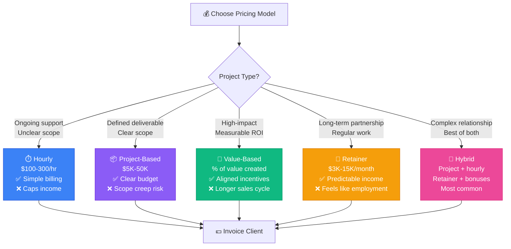

# 📘 MODULE 12: Consulting & Business Skills

**Estimated Time:** 5-7 days
**Difficulty:** Intermediate
**Prerequisites:** Modules 1, 2, 4-6

## 📖 Overview & Why This Matters

Not everyone wants to build products. Many AI Operators build six-figure careers as consultants and freelancers, implementing AI systems for businesses that need the expertise but don't want to hire full-time.

Here's the reality: Small and medium businesses are desperate for AI help. They see AI working for their competitors. They know they need it. But they don't know where to start, what tools to use, or how to implement. That's where you come in.

The consulting path can hit $150K/year faster than the product path. Why? You get paid immediately for every project. You don't have to wait for product-market fit. You're delivering clear value: "I'll save you 20 hours per week with this AI automation."

But consulting has different skills than building. You need to find clients, understand their actual problems (not what they think they need), price your work profitably, write proposals that win, and deliver projects on time. Technical skills get you in the door. These business skills determine if you succeed or struggle.

## 🎯 Learning Objectives

By the end of this module, you will:

- [ ] Conduct discovery calls that uncover real business problems
- [ ] Price AI implementation projects profitably
- [ ] Write proposals that win against competitors
- [ ] Structure projects with clear milestones and deliverables
- [ ] Manage scope creep without damaging client relationships
- [ ] Build a consulting business that generates consistent $10K+ months
- [ ] Create case studies that attract better clients

## 🧠 Core Concepts

### The Discovery Call Framework

A discovery call isn't a sales pitch. It's structured problem diagnosis.

**Bad discovery call:**
"We build AI automation. What do you need?"

**Good discovery call structure:**
1. **Current State** (15 min): What does their process look like today?
2. **Pain Points** (10 min): What's the most frustrating part?
3. **Impact** (10 min): What does this cost them? (time, money, opportunity)
4. **Attempted Solutions** (5 min): What have they tried?
5. **Ideal Future** (5 min): What would success look like?
6. **Next Steps** (5 min): Based on what I heard, here's what I recommend

Total: 50 minutes. You talk 30%, they talk 70%.

### Pricing Models



**Hourly** ($100-300/hour)
- Pro: Simple, easy to bill
- Con: Penalizes efficiency, caps income
- Use for: Ongoing support, unclear scope

**Project-Based** ($5K-50K per project)
- Pro: Aligns incentives, clear budget
- Con: Scope creep risk
- Use for: Defined deliverables

**Value-Based** (% of value created)
- Pro: Aligns with client outcomes
- Con: Harder to calculate, longer sales cycle
- Use for: High-impact projects with measurable ROI

**Retainer** ($3K-15K/month)
- Pro: Predictable income
- Con: Can feel like employment
- Use for: Ongoing relationship

**Hybrid** (Most common)
- Project fee + hourly for changes
- Retainer + project bonuses
- Use for: Long-term clients

### The Proposal Structure

Winning proposals have this structure:

1. **Executive Summary**
   - The problem you're solving
   - The solution overview
   - Expected results
   - Investment required

2. **Current State Analysis**
   - Their current process (from discovery)
   - Pain points identified
   - Cost of current state

3. **Proposed Solution**
   - What you'll build
   - How it works (high-level)
   - Timeline and phases

4. **Expected Outcomes**
   - Specific, measurable benefits
   - ROI projection
   - Success metrics

5. **Investment & Timeline**
   - Scope of work
   - Deliverables
   - Payment terms
   - Timeline

6. **About You**
   - Relevant experience
   - Case studies
   - Why you're qualified

### Scope Creep Management

Scope creep kills profitability. Handle it with this framework:

**In-Scope:** Defined in proposal
**Nice-to-Have:** Mentioned but not committed
**Out-of-Scope:** Not discussed

When client asks for addition:
```
"That's a great idea! That falls outside our current scope.
I can:
1. Add it to Phase 2 (separate proposal)
2. Replace an existing deliverable with this
3. Bill hourly for the addition

Which would you prefer?"
```

Never say yes without discussing scope/budget.

### The Productized Service Model

Instead of custom everything, create packages:

**Example: AI Content Automation**

**Bronze** ($3K)
- 1 AI workflow
- Up to 500 generations/month
- Email support

**Silver** ($7K)
- 3 AI workflows
- Up to 2,000 generations/month
- Slack support
- Monthly optimization call

**Gold** ($15K)
- Unlimited workflows
- Unlimited generations
- Dedicated Slack channel
- Weekly calls
- Priority support

Benefits:
- Easier to price
- Easier to sell
- Scalable
- Clear expectations

### Client Education Framework

Most clients don't understand AI. Your job is to educate without overwhelming.

**Explain AI Like This:**

Bad: "We'll use RAG with vector embeddings and semantic search..."
Good: "We'll teach the AI about your specific knowledge base, so it can find relevant information and answer questions accurately."

Bad: "GPT-4o has better reasoning capabilities..."
Good: "We'll use the AI model that's best at understanding complex requests like yours."

Rule: Explain outcomes, not technology.

```quiz
title: Consulting Fundamentals Quiz
questions:
- question: What is the correct structure for a discovery call?
  options: [You talk 70%, they talk 30%, You talk 30%, they talk 70%, Split 50/50, You pitch your services immediately]
  correct: 1
  explanation: In discovery calls, you should talk 30% and let the client talk 70%. Your job is to understand their problem deeply, not to pitch. Ask questions about their current state, pain points, impact, and ideal future.
- question: Which pricing model is best for a project with unclear scope and ongoing support needs?
  options: [Project-based flat fee, Value-based percentage, Hourly rate, Free trial period]
  correct: 2
  explanation: Hourly pricing is best for unclear scope and ongoing support because it's simple to bill and doesn't put you at risk for scope creep. Once scope becomes clear, you can switch to project-based pricing.
- question: What should you do when a client asks for an addition outside the current scope?
  options: [Say yes to keep them happy, Add it for free if it's small, Present options - add to Phase 2, replace existing deliverable, or bill hourly for the addition, Refuse to do it]
  correct: 2
  explanation: Never say yes without discussing scope/budget. Present options: add to Phase 2 (separate proposal), replace an existing deliverable, or bill hourly. This respects both your time and maintains clear boundaries.
- question: What is the main benefit of the productized service model?
  options: [Higher prices, Easier to price, easier to sell, scalable, and clear expectations, More customization, Longer projects]
  correct: 1
  explanation: Productized services are easier to price and sell because they're standardized packages. They're scalable (can serve more clients with same offering) and set clear expectations upfront.
- question: When explaining AI to clients, what should you focus on?
  options: [Technical details like embedding dimensions and cosine similarity, Outcomes and results, not technology details, The specific models and APIs you'll use, How much you know about AI]
  correct: 1
  explanation: Explain outcomes, not technology. Clients care about results - "answer customer questions 3x faster" not "RAG with vector embeddings." Technology is just the "how."
```

```task
title: Conduct a Mock Discovery Call
description: Practice the discovery call framework with a friend or colleague playing the role of a potential client. Follow the structure - Current State (15 min), Pain Points (10 min), Impact (10 min), Attempted Solutions (5 min), Ideal Future (5 min), Next Steps (5 min). Record it and review your performance. You should talk 30% or less.
xp: 15
```

```task
title: Create Your Service Package
description: Design a productized service offering with 3 tiers (Bronze/Silver/Gold or similar). Define clear deliverables, pricing ($3K-15K range), timeline, and what's included/excluded for each tier. Create a one-page offering sheet you can share with prospects.
xp: 15
```

## 🛠️ Tools Deep Dive

### CRM & Pipeline Management

**HubSpot** (Free tier available)
- Track leads and deals
- Email integration
- Pipeline visualization
- Free for basic use

**Notion** (Your existing tool)
- Client database
- Project tracker
- Proposal templates
- Knowledge base

**Pipedrive** ($14/user/month)
- Sales-focused
- Simple pipeline view
- Email tracking

### Proposal Tools

**PandaDoc** ($19/month)
- Beautiful proposals
- E-signatures
- Analytics (see when they open it)
- Templates

**Notion** (Free)
- Template your proposals
- Share as web page
- Track in pipeline

### Project Management

**ClickUp** (Free tier available)
- Tasks and subtasks
- Client portal
- Time tracking
- Automations

**Linear** (Free for small teams)
- Clean interface
- Great for technical projects
- Integration with GitHub

### Communication

**Slack** (Client-specific channels)
- Quick communication
- File sharing
- Searchable history

**Loom** (Free tier)
- Video updates
- Demo walkthroughs
- Async communication

### Time Tracking

**Toggl** (Free tier)
- Simple time tracking
- Reporting
- Project-based tracking

**Clockify** (Free)
- Unlimited time tracking
- Team features
- Reporting

## 💡 Real Business Examples

### Example 1: From $0 to $12K/Month in 90 Days

**Background:**
Solo AI operator, technical background, no consulting experience.

**Month 1: Getting First Clients**

Week 1-2: Positioned himself
- Created LinkedIn: "AI Automation Consultant"
- Posted daily about AI tools and tips
- Joined 5 relevant Slack/Discord communities

Week 3: Outreach
- Made list of 50 small businesses (local + online)
- Sent personalized cold emails:

```
Subject: Saw you're hiring a content writer

Hi [Name],

I noticed you posted a job for a content writer on [platform].
Before hiring, have you considered AI content automation?

I helped [similar company] reduce content creation time by 70%
while maintaining quality. They were able to redirect their budget
to distribution instead of creation.

Would a 15-minute call to discuss your content process make sense?

Best,
[Your name]
```

Response rate: 12% (6 calls booked)

Week 4: Discovery & Proposals
- Conducted 6 discovery calls
- Sent 4 proposals (2 ghosted, 2 interested)
- Won 1 project: $4K

**First Project Delivered:**
- AI content automation for marketing agency
- Scope: Set up Make workflow to generate social media posts from blog articles
- Delivered in 2 weeks
- Client thrilled, asked for Phase 2

**Month 2: Scaling Up**

Used case study from first client:
- Wrote detailed case study on LinkedIn
- Before/after metrics
- Screenshots of automation
- Client testimonial

Result: 3 inbound inquiries

Projects:
- Client 1 Phase 2: $3K
- New client (content automation): $5K
- New client (lead enrichment): $4K

Total month 2: $12K

**Month 3: Systematizing**

Created productized offering:
- "AI Content System" - $6K
- "AI Lead System" - $5K
- "Custom AI Automation" - $8K-15K

Hired virtual assistant ($500/month) for:
- Scheduling discovery calls
- Sending proposals
- Following up with leads

Started getting referrals from happy clients.

Month 3 revenue: $14K

**Current State (6 months later):**
- Consistent $15-20K/month
- 3-4 active clients at a time
- 2 retainer clients ($3K/month each)
- Built reputation in specific niche (B2B SaaS)

**Key Success Factors:**
- Niched down (B2B SaaS content automation)
- Built in public on LinkedIn
- Delivered results, asked for testimonials
- Created packages instead of custom quotes
- Outsourced admin work early

### Example 2: Agency Model ($50K/Month)

**Background:**
Started solo, grew to small agency.

**Structure:**
- Founder: Sales + strategy
- 2 Technical AI Operators (contractors)
- 1 Project Manager (part-time)

**Service Offering:**
"AI Implementation for Professional Services Firms"

Three packages:
1. **Quick Win** ($8K, 2 weeks)
   - One AI automation
   - Proof of concept
   - Training session

2. **Transform** ($25K, 6 weeks)
   - 3 major automations
   - Airtable/Notion setup
   - Team training
   - 30-day support

3. **Enterprise** ($50K+, 3 months)
   - Custom AI systems
   - RAG implementation
   - Full team training
   - 90-day support

**Sales Process:**
1. Inbound leads from content marketing
2. Discovery call (founder)
3. Technical audit (contractor)
4. Proposal (founder)
5. Delivery (contractor + PM)
6. Upsell to retainer

**Economics:**
- Average project: $25K
- Contractor cost: $8K (32% margin)
- PM cost: $1K
- Net per project: $16K
- 2-3 projects/month = $32-48K net

**Growth Strategy:**
- SEO content (blog posts about AI for their niche)
- Case studies on website
- Speaking at industry conferences
- Partner program with complementary services

### Example 3: Specialist vs. Generalist

**Generalist AI Consultant:**
- "I do AI automation for any business"
- Competes on price
- Harder to market
- Lower rates ($3-5K per project)

**Specialist (Legal AI):**
- "I automate document review for law firms"
- Competes on expertise
- Easier to market
- Higher rates ($15-30K per project)
- Fewer competitors
- Better client retention

**The Difference:**
Specialist can say: "I've implemented this exact system for 15 law firms. Here's the average ROI: $150K/year saved."

Generalist says: "I can probably figure this out."

**Lesson:** Riches in niches. Pick an industry or problem type.

```quiz
title: Consulting Business Strategy Quiz
questions:
- question: In Example 1 ($0 to $12K/Month in 90 Days), what was the response rate for personalized cold emails?
  options: [2%, 12% (6 calls from 50 emails), 50%, 80%]
  correct: 1
  explanation: The consultant got a 12% response rate by sending personalized cold emails that referenced specific observations about the prospect's business and offered clear value. Generic emails get much lower response rates.
- question: What was the first thing the solo consultant did after landing their first $4K project?
  options: [Hired a team, Created a case study and posted it on LinkedIn, which led to 3 inbound inquiries, Bought paid ads, Raised prices immediately]
  correct: 1
  explanation: They wrote a detailed case study with before/after metrics, screenshots, and client testimonial, then shared it on LinkedIn. This led to 3 inbound inquiries without any additional outreach.
- question: In the Agency Model example, what was the net profit margin per $25K project?
  options: [90%, 64% ($16K net after $8K contractor + $1K PM costs), 32%, 10%]
  correct: 1
  explanation: On average $25K projects, contractor costs were $8K and PM costs were $1K, leaving $16K net (64% margin). This shows the profitability of the agency model with contractors.
- question: What is the key difference between a generalist and specialist AI consultant?
  options: [Specialists charge less, Specialists can charge 3-5x more and compete on expertise not price, Generalists get more clients, There is no difference]
  correct: 1
  explanation: Specialists can charge $15-30K per project vs. $3-5K for generalists because they compete on expertise, not price. They can say "I've done this exact thing 15 times with measurable ROI" which wins trust and commands premium pricing.
- question: What is the recommended payment structure for a $15K project to ensure healthy cash flow?
  options: [100% upfront, 100% on completion, 50% upfront, 25% midpoint, 25% completion, Payment plan over 12 months]
  correct: 2
  explanation: For $5K-15K projects, the recommended structure is 50% upfront, 50% on delivery. For larger projects ($15K+), use 33% upfront, 33% midpoint, 34% completion. Never start work without a deposit.
```

```task
title: Write a Complete Proposal
description: Write a full consulting proposal using the provided template. Include Executive Summary, Current State Analysis, Proposed Solution with phases, Expected Outcomes with ROI calculation, Investment & Terms, and About You section. Base it on a real or realistic scenario with specific metrics.
xp: 20
```

```task
title: Calculate Value-Based Pricing
description: For a potential consulting project, calculate the ROI. Identify current state costs (hours × rate × weeks), calculate savings from your solution, and determine your price based on value delivered. Create a one-page ROI calculator you can use in proposals. Your price should allow client to break even in 6-12 months.
xp: 15
```

```task
title: Build Your Consulting Swipe File
description: Create templates for discovery call scripts, email outreach, proposals, contracts, and case studies. Store them in Notion or similar tool. Include at least 5 different templates you can customize and reuse for future clients.
xp: 10
```

```task
title: Execute Cold Outreach Campaign
description: Create a list of 20 potential clients in your niche. Research each one and send personalized outreach (LinkedIn or email). Reference specific observations about their business and offer clear value. Track response rate and book at least 2 discovery calls.
xp: 15
```

## ⚠️ Common Pitfalls

### 1. **Underpricing to Win Business**
❌ "I'll do it for $2K even though it's worth $10K"
✅ Price based on value, walk away from cheap clients

### 2. **Scope Creep Without Boundaries**
❌ Client keeps adding "small requests," you keep saying yes
✅ "That's out of scope. Let's discuss adding it for $X."

### 3. **Not Getting Testimonials**
❌ Complete project, move on
✅ Ask for testimonial, case study, and referrals

### 4. **Building Custom Everything**
❌ Every client gets bespoke solution from scratch
✅ Build reusable components, customize minimally

### 5. **Poor Communication**
❌ Client has no idea what you're doing for weeks
✅ Weekly updates, even if "still working on it"

### 6. **No Contracts**
❌ Handshake deals, "let's just start"
✅ Always have signed agreement before work starts

### 7. **Chasing Every Lead**
❌ Spend hours on proposals for anyone who asks
✅ Qualify leads, only write proposals for good fits

## ✨ Pro Tips

### Tip 1: The "Pilot Project" Strategy

For expensive projects, start small:

```
Full project: $30K, 3 months
Pilot: $8K, 2 weeks - Build one automation

If pilot succeeds → Full project
If pilot fails → You both learned something, minimal investment lost
```

Conversion rate on pilots: 80%+

### Tip 2: Value-Based Pricing Calculator

```
Current state cost:
- 2 employees × 10 hours/week × $30/hour × 52 weeks = $31,200/year

Your automation:
- Reduces to 2 hours/week
- Saves $24,960/year

Your price: $15K (they get ROI in 7 months)
```

Always calculate and present ROI in proposal.

### Tip 3: The "Results, Not Features" Framework

Proposal language:

Bad: "I'll build a RAG system with vector embeddings..."
Good: "Your support team will answer customer questions 3x faster"

Bad: "Using Make, Airtable, and OpenAI API..."
Good: "Generate 50 social posts per week instead of 5"

Lead with outcomes, technology is just "how."

### Tip 4: Payment Terms for Cash Flow

```
50% upfront
25% at midpoint
25% on completion

Or:

- Projects under $5K: 100% upfront
- Projects $5K-15K: 50% upfront, 50% on delivery
- Projects $15K+: 33% upfront, 33% midpoint, 34% completion
```

Never start work without deposit.

### Tip 5: Build Your "Swipe File"

Collect and reuse:
- Proposal templates
- Discovery call scripts
- Email templates
- Case study templates
- Contract templates
- Project plans

Don't start from scratch each time.

### Tip 6: The "Three Quotes" Strategy

Always provide options:

**Option A: "Good"** ($5K)
- Basic implementation
- Email support

**Option B: "Better"** ($10K) ⭐ Most Popular
- Advanced features
- Training included
- 30-day support

**Option C: "Best"** ($18K)
- Everything in B
- Custom integrations
- 90-day support
- Monthly optimization

Most clients choose middle option. But some choose high end. If you only offer one price, you lose those sales.

### Tip 7: Ask for Referrals Systematically

After successful project:

Email template:
```
Subject: Quick request

Hi [Client],

I'm glad the [project name] is working well for you!

I'm looking to help a few more companies like yours. Would you be
comfortable introducing me to:

1. Anyone in your network dealing with [similar problem]
2. Or leaving a brief testimonial I could share?

Happy to write something for you to edit if that's easier.

Thanks again for being a great client!
```

One referral can lead to 5 more projects.

## 📝 Module Project: Land Your First $5K Client

### Objective

Complete the full consulting cycle: find a client, conduct discovery, write proposal, win project, deliver results.

### Phase 1: Positioning (Day 1-2)

**Task: Define your niche and offering**

1. Choose a niche (don't try to serve everyone):
   - Industry: Real estate, law, marketing, etc.
   - Problem: Content creation, lead generation, customer support
   - Company size: Solopreneurs, SMBs, enterprise

2. Create your positioning statement:
```
I help [target audience] solve [specific problem] using [AI approach]

Examples:
- "I help marketing agencies automate content creation using AI"
- "I help law firms automate document review with custom AI systems"
- "I help e-commerce brands generate product descriptions at scale"
```

3. Create service package:
```
Package Name: [Compelling name]
Price: $5,000
Deliverables:
- [Specific deliverable 1]
- [Specific deliverable 2]
- [Specific deliverable 3]
Timeline: 3 weeks
Success Metric: [Measurable outcome]
```

### Phase 2: Outreach (Day 3-5)

**Task: Get 5 discovery calls booked**

**Strategy A: Cold Outreach**

1. Make list of 50 potential clients
2. Find decision makers on LinkedIn
3. Send personalized connection requests + message

Message template:
```
Hi [Name],

I noticed [specific observation about their business].
I specialize in helping [niche] companies automate [process]
using AI.

Recently helped [similar company] achieve [specific result].

Would a quick call to discuss your current [process] make sense?

No pressure if not relevant.

Best,
[Your name]
```

**Strategy B: Content + Inbound**

1. Post daily on LinkedIn for 5 days about your niche
2. Share specific tips, case studies, how-tos
3. Include: "DM me if you want to discuss implementation"

**Strategy C: Warm Network**

1. Email everyone you know: "I'm now doing AI consulting for [niche]"
2. Ask: "Know anyone dealing with [problem]?"
3. Offer: "Happy to do free consultation call"

**Goal: 5 calls booked**

### Phase 3: Discovery Calls (Day 6-8)

**Task: Conduct 5 discovery calls**

**Before Call:**
- Research their company (15 min)
- Note specific pain points you think they have
- Prepare questions

**During Call - Script:**

Opening (2 min):
```
"Thanks for taking the time. I've done some research on [company],
but I'd love to hear in your words: what's your current process for
[relevant area]?"
```

Current State (15 min):
```
- Walk me through your current workflow
- Who's involved?
- How much time does this take?
- What tools are you using?
```

Pain Points (10 min):
```
- What's the most frustrating part?
- What have you tried to fix this?
- What's stopping you from solving it?
```

Impact (10 min):
```
- How much does this cost you in time?
- What opportunities are you missing?
- What would change if this was automated?
```

Closing (5 min):
```
"Based on what you've shared, I think I can help. I'd like to put
together a specific proposal for you. I'll send it over by [date].
Does [follow-up date] work for a call to review it?"
```

**After Call:**
- Send thank you email immediately
- Document everything they said
- Calculate potential ROI

**Goal: Get 3 interested in seeing proposal**

### Phase 4: Proposal Writing (Day 9-11)

**Task: Write 3 tailored proposals**

**Proposal Template:**

```markdown
# Proposal for [Company Name]
## [Specific Solution Name]

### Executive Summary
[Company] currently spends [X hours/week] on [process]. This costs
approximately $[amount] annually and limits [opportunity].

I propose implementing an AI automation system that will:
- Reduce time spent by [X%]
- Allow team to focus on [higher value work]
- Save approximately $[amount] annually

Investment: $5,000
Timeline: 3 weeks

---

### Current State Analysis

Based on our discussion on [date], here's what I understand:

**Current Process:**
1. [Step 1 - time required]
2. [Step 2 - time required]
3. [Step 3 - time required]

**Pain Points:**
- [Pain point 1]
- [Pain point 2]
- [Pain point 3]

**Annual Cost:**
- Labor: $[amount]
- Opportunity cost: $[amount]
- Total: $[amount]

---

### Proposed Solution

**Phase 1: Setup (Week 1)**
- [Specific deliverable]
- [Specific deliverable]

**Phase 2: Build (Week 2)**
- [Specific deliverable]
- [Specific deliverable]

**Phase 3: Training & Launch (Week 3)**
- [Specific deliverable]
- [Specific deliverable]

**Technical Approach:**
[High-level explanation in business terms]

---

### Expected Outcomes

**Primary Benefits:**
- Reduce [process] time from [X] to [Y] hours/week
- Enable team to handle [X%] more volume
- Free up [Y] hours/week for [higher value work]

**ROI Projection:**
- Annual savings: $[amount]
- Investment: $5,000
- Payback period: [X] months
- 3-year ROI: [X]%

**Success Metrics:**
- Time saved: [specific metric]
- Quality: [specific metric]
- Adoption: [specific metric]

---

### Investment & Terms

**Investment:** $5,000

**Payment Schedule:**
- $2,500 upon signing (Week 1)
- $1,250 at midpoint (Week 2)
- $1,250 upon completion (Week 3)

**Included:**
- [Deliverable 1]
- [Deliverable 2]
- [Deliverable 3]
- 30 days post-launch support
- Training documentation

**Not Included (Available separately):**
- Ongoing monthly support ($500/month)
- Additional automations
- Custom integrations beyond scope

**Timeline:** 3 weeks from signing

---

### About Me

[Your positioning statement]

**Relevant Experience:**
- [Similar project 1]
- [Similar project 2]

**Why I'm Qualified:**
- [Specific skills]
- [Results delivered]
- [Unique approach]

---

### Next Steps

1. Review this proposal
2. Schedule call to discuss questions: [Calendly link]
3. Upon agreement, sign contract and submit deposit
4. Week 1 kickoff: [proposed date]

Looking forward to working together!

[Your name]
[Your email]
[Your website/LinkedIn]
```

**Goal: Send 3 proposals**

### Phase 5: Follow-Up & Close (Day 12-14)

**Task: Win at least 1 project**

**Follow-up sequence:**

Day 1 (Proposal sent):
```
"Sent over the proposal. Let me know if any questions!"
```

Day 3 (If no response):
```
"Following up on the proposal I sent. Have you had a chance to review?
Happy to jump on a quick call to discuss."
```

Day 5 (If still no response):
```
"I know you're busy. This proposal is open until [date]. After that,
I'll be booked with other clients. Let me know if you'd like to move
forward."
```

**Handling Objections:**

"It's too expensive"
→ "Compared to the $[X] you're spending annually on this problem,
the $5K investment pays for itself in [X] months. Plus, you'll continue
saving $[Y] every year after that."

"We need to think about it"
→ "Absolutely. What specific concerns would be helpful to discuss?"

"Can you do it for $[lower amount]?"
→ "I could reduce scope to stay in that budget. Which deliverables
are most important to you?" [Then create a smaller package]

**Closing:**
When they say yes:
1. Send contract immediately (DocuSign/PandaDoc)
2. Invoice for deposit
3. Schedule kickoff call
4. Celebrate!

**Goal: Close 1 project at $5K+**

### Phase 6: Delivery Excellence (Week 3-5)

**Task: Deliver amazing results**

**Week 1: Setup**
- Kickoff call: Confirm scope, get access to systems
- Set up development environment
- Send weekly update email

**Week 2: Build**
- Build the automation
- Test thoroughly
- Send weekly update with demo video

**Week 3: Launch**
- Training session with team
- Documentation delivered
- Launch automation
- Collect feedback

**Week 4: Support**
- Monitor performance
- Fix any issues
- Optimize based on usage
- Request testimonial

**Goal: Deliver results, get testimonial**

### Success Criteria

✅ Defined your niche and service offering
✅ Booked 5 discovery calls
✅ Conducted discovery calls using framework
✅ Wrote 3 tailored proposals
✅ Won at least 1 project at $5K+
✅ Delivered project successfully
✅ Got testimonial from client
✅ You now have a repeatable process for winning clients

## 📚 Resources & Next Steps

### Recommended Reading
- "The Win Without Pitching Manifesto" by Blair Enns
- "Double Your Freelancing Rate" by Brennan Dunn
- "The Consulting Bible" by Alan Weiss

### Tools & Links
- PandaDoc (https://pandadoc.com) - Proposals
- Calendly (https://calendly.com) - Scheduling
- HubSpot (https://hubspot.com) - CRM

### Communities
- r/consulting on Reddit
- Indie Hackers
- Freelance subreddit

### What's Next?

Module 13 (Security & Ethics) covers the critical topics of data privacy, security, and ethical AI use - essential knowledge for working with client data.

## ✅ Module Completion Checklist

Before moving to Module 13, you should be able to confidently say "yes" to all of these:

- [ ] I can conduct effective discovery calls
- [ ] I understand different pricing models and when to use each
- [ ] I can write proposals that clearly communicate value
- [ ] I know how to calculate and present ROI
- [ ] I can handle scope creep professionally
- [ ] I've created service packages instead of custom quotes
- [ ] I know how to get testimonials and referrals
- [ ] I have a repeatable process for finding and winning clients
