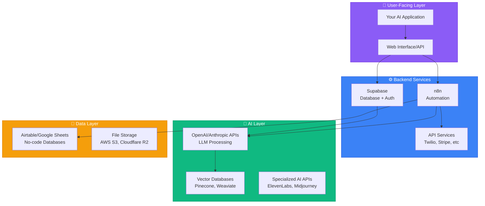
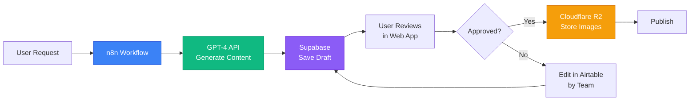
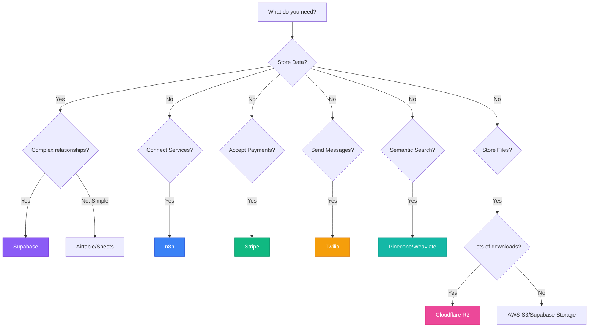

# AI Operator Tool Primer

## Introduction

Before you start building AI systems, you need to understand the tools in your toolkit. This module introduces the key platforms and services you'll use throughout the roadmap—not with hands-on tutorials yet, but with clear explanations of **what each tool does**, **when to use it**, and **how it fits into your AI Operator workflow**.

Think of this as your "tool shed tour" before you start building. By the end, you'll know which tool to reach for when you encounter different problems.

## Why Tool Knowledge Matters

**The Problem**: Many AI courses throw you into tools without context. You're told "use Supabase" or "connect n8n" without understanding why these tools exist or what problems they solve.

**The AI Operator Approach**: Tools are solutions to specific problems. When you understand the problem first, choosing and using tools becomes intuitive.

## The AI Operator Tool Stack

### Overview Diagram

## Database & Backend: Supabase

### What It Is
Supabase is an open-source "backend-as-a-service" platform. Think of it as a ready-made backend for your applications that includes:
- PostgreSQL database (stores your data)
- Authentication system (handles user logins)
- Real-time subscriptions (live data updates)
- Storage (file uploads)
- Edge functions (serverless code execution)

### The Problem It Solves
**Without Supabase**: You'd need to set up a database server, write authentication code, configure security, manage user sessions, handle password resets, set up file storage, etc. This takes weeks.

**With Supabase**: All of this infrastructure is pre-built. You get a production-ready backend in minutes.

### When to Use It
- Building any application that needs to store data
- User authentication and authorization
- Real-time features (like chat or live dashboards)
- File uploads and storage

### Real Example
**Scenario**: You're building an AI content generator where users sign up, save their generated content, and access it later.

**Supabase provides**:
- User signup/login (authentication)
- Database to store generated content
- Row-level security (users only see their own content)
- Storage for any images generated

### Key Concept: Row-Level Security (RLS)
Supabase's superpower is RLS—you can write rules like "users can only see rows where user_id matches their ID." This prevents security vulnerabilities without complex backend code.

### Pricing
- **Free tier**: 500MB database, 1GB file storage, 50,000 monthly active users
- **Pro tier**: $25/month for 8GB database, 100GB storage
- Most learning projects fit in free tier

### Alternatives
- **Firebase**: Google's equivalent (NoSQL instead of SQL)
- **PlanetScale**: MySQL database with branching
- **Neon**: Serverless Postgres alternative

## Automation: n8n

### What It Is
n8n is a workflow automation tool that connects different services together. It's like Zapier but self-hostable, more flexible, and better for AI workflows.

### The Problem It Solves
**Without n8n**: You'd write custom code to connect every service (OpenAI API → process data → save to Supabase → send email → etc.). Each integration requires learning that service's API.

**With n8n**: Visual workflow builder where you drag-and-drop nodes, connect them, and let n8n handle the API calls.

### When to Use It
- Automating multi-step workflows
- Connecting services that don't natively integrate
- Building AI pipelines (e.g., "when user submits form → call GPT-4 → save to database → send notification")
- Scheduled tasks (run something every hour/day)

### Real Example
**Scenario**: Automated research assistant

**The Workflow**:
1. Trigger: Form submission with research topic
2. Call OpenAI API with topic
3. Parse and structure response
4. Save to Google Sheets
5. Send email with summary
6. Post to Slack

**Without n8n**: ~200 lines of code connecting these APIs
**With n8n**: Visual workflow, maybe 10 minutes to build

### Key Features
- **800+ integrations**: OpenAI, Anthropic, Google Sheets, Airtable, Slack, email, databases
- **AI nodes**: Built-in nodes for AI services
- **Conditional logic**: "If this, then that"
- **Data transformation**: Format and clean data between steps
- **Error handling**: Retry failed steps, send alerts

### n8n vs. Zapier vs. Make
| Feature | n8n | Zapier | Make.com |
|---------|-----|--------|----------|
| Cost | Self-hosted free, Cloud $20/mo | $20-$50/mo | $9-$29/mo |
| AI workflows | Excellent | Good | Good |
| Flexibility | Very high | Medium | High |
| Learning curve | Medium | Easy | Easy |

**Recommendation**: n8n for AI workflows (better AI nodes, more flexibility)

### Pricing
- **Self-hosted**: Free (you pay for server)
- **Cloud**: $20/month starter, scales up

## Communication: Twilio

### What It Is
Twilio is a communications platform that lets you send/receive SMS, make phone calls, and send WhatsApp messages programmatically.

### The Problem It Solves
**Without Twilio**: You can't send SMS from your application. Phone carriers don't provide developer APIs.

**With Twilio**: Simple API to send SMS, make calls, build chatbots.

### When to Use It
- SMS notifications (order confirmations, alerts, 2FA codes)
- Voice calls (automated reminders, AI phone agents)
- WhatsApp business messaging
- Phone number verification

### Real Example
**Scenario**: AI appointment reminder system

**The Flow**:
1. User books appointment in your app
2. n8n workflow triggers 24 hours before
3. GPT-4 generates personalized reminder message
4. Twilio sends SMS to user's phone

### Key Features
- **SMS**: Send to 200+ countries
- **Voice**: Automated calls with text-to-speech
- **WhatsApp**: Business messaging API
- **Phone numbers**: Buy virtual numbers for receiving messages
- **Verify API**: Phone number verification

### Pricing
- SMS: $0.0075 - $0.02 per message (varies by country)
- Voice: $0.013 - $0.02 per minute
- Phone number: $1-$2/month rental
- Free trial: $15 credit

### Alternatives
- **Vonage**: Similar pricing, different API
- **Amazon SNS**: Cheaper, less user-friendly
- **Plivo**: Good for high volume

## Payments: Stripe

### What It Is
Stripe is a payment processing platform. It handles credit cards, subscriptions, invoices, and basically anything money-related.

### The Problem It Solves
**Without Stripe**: You can't accept payments online. Banks don't give individuals access to payment processing.

**With Stripe**: Accept payments in your app with a few lines of code.

### When to Use It
- Accepting credit card payments
- Subscription billing
- One-time purchases
- Usage-based pricing (charge per API call)
- Invoicing

### Real Example
**Scenario**: AI writing tool with subscription

**The Setup**:
- Free tier: 10 generations/month
- Pro tier: $20/month for unlimited
- Pay-as-you-go: $0.50 per generation

**Stripe handles**:
- Subscription billing (recurring $20 charge)
- Usage metering (count generations)
- Failed payment retries
- Invoices and receipts
- Refunds and disputes

### Key Features
- **Payment methods**: Credit/debit cards, Apple Pay, Google Pay, bank transfers
- **Subscriptions**: Recurring billing, trials, upgrades/downgrades
- **Webhooks**: Get notified when payments succeed/fail
- **Customer portal**: Users manage their own subscriptions
- **Revenue reporting**: Built-in analytics

### Pricing
- **Standard**: 2.9% + $0.30 per successful charge
- **No monthly fees** (unlike PayPal)
- **International cards**: +1.5%

### Stripe vs. PayPal
| Feature | Stripe | PayPal |
|---------|--------|--------|
| Developer experience | Excellent | Outdated |
| Fees | 2.9% + $0.30 | 2.9% + $0.30 |
| Recurring billing | Native | Add-on |
| User trust | Growing | Established |

**Recommendation**: Stripe for new applications (better API, better developer tools)

## Vector Databases: Pinecone

### What It Is
Pinecone is a vector database—a specialized database for storing and searching "embeddings" (numeric representations of text/images generated by AI models).

### The Problem It Solves
**The Challenge**: You have 10,000 documents. A user asks "How do I reset my password?" You need to find the most relevant documents—but traditional keyword search doesn't work well.

**Example**:
- Query: "How do I reset my password?"
- Relevant doc might say: "Forgot your login credentials? Here's how to recover access"
- Keyword search misses this (different words)
- Vector search finds it (similar meaning)

**Pinecone** stores embeddings and finds semantically similar items ultra-fast.

### When to Use It
- Semantic search (find similar meaning, not just keywords)
- RAG systems (Retrieval-Augmented Generation)
- Recommendation engines
- Duplicate detection
- Chatbots that search your docs

### How It Works (Simplified)
1. **Create embeddings**: Convert text to vectors using OpenAI embeddings API
   - "How do I reset password?" → [0.2, 0.8, -0.3, ..., 0.1] (1536 numbers)
2. **Store in Pinecone**: Upload vectors with metadata
3. **Query**: Convert user question to vector
4. **Search**: Pinecone finds closest matching vectors
5. **Return**: Get original text of most similar items

### Real Example
**Scenario**: AI customer support chatbot

**Without vector DB**:
- User asks question
- GPT-4 answers from memory (often wrong/outdated)
- Hallucinates company policies

**With Pinecone**:
1. Store all help docs as embeddings
2. User asks question → convert to embedding
3. Find 5 most similar help articles
4. Send those to GPT-4 as context
5. GPT-4 answers based on actual docs

### Pricing
- **Free tier**: 1 index, 100K vectors
- **Starter**: $70/month for 5M vectors
- **Enterprise**: Custom pricing

Good for learning, gets expensive at scale

### Alternatives
- **Weaviate**: Open-source, self-hostable
- **Qdrant**: Fast, good for production
- **Chroma**: Lightweight, embeddings in Python
- **PostgreSQL pgvector**: Add-on to regular Postgres (what Supabase uses)

### When NOT to Use Vector Databases
- Simple keyword search (use regular database)
- Small datasets (<1000 items) (use in-memory search)
- Exact matches (use SQL)

## No-Code Databases: Airtable

### What It Is
Airtable is a spreadsheet-database hybrid. It looks like Google Sheets but acts like a database with relationships, automations, and integrations.

### The Problem It Solves
**Scenario**: You need a database but don't want to learn SQL or set up Supabase.

**Airtable**: Visual database with a spreadsheet interface. Non-technical team members can view and edit data.

### When to Use It
- Rapid prototyping (test idea before building real database)
- Content management (store blog posts, products, etc.)
- Team collaboration (everyone can see data)
- Simple CRUD operations (Create, Read, Update, Delete)

### Real Example
**Scenario**: AI content calendar

**The Setup**:
- Table 1: Content Ideas (title, topic, status)
- Table 2: Generated Content (idea link, generated text, image URL)
- Table 3: Publishing Schedule (content link, platform, publish date)

**Workflow**:
1. Team adds ideas to Airtable
2. n8n reads "Pending" ideas
3. Sends to GPT-4 for content generation
4. Saves generated content back to Airtable
5. Team reviews and schedules

### Key Features
- **Relationships**: Link records across tables
- **Views**: Different ways to visualize data (calendar, kanban, gallery)
- **Automations**: Trigger actions when data changes
- **API**: Read/write data programmatically
- **Forms**: Collect data from users

### Pricing
- **Free**: Unlimited bases, 1,200 records per base
- **Plus**: $10/user/month, 5,000 records per base
- **Pro**: $20/user/month, 50,000 records per base

### Airtable vs. Google Sheets
| Feature | Airtable | Google Sheets |
|---------|----------|---------------|
| Structure | Database | Spreadsheet |
| Relationships | Native | Complex formulas |
| Automations | Built-in | Apps Script |
| API | Excellent | Good |

**When to use Airtable**: Data with relationships, non-technical users
**When to use Sheets**: Calculations, simple lists, everyone knows Sheets

## File Storage: Cloudflare R2

### What It Is
Cloudflare R2 is object storage (like Amazon S3) for storing files—images, videos, documents, etc.

### The Problem It Solves
**Scenario**: Users upload images to your AI app. Where do you store them?

**Options**:
1. ❌ On your server (runs out of space, slow, doesn't scale)
2. ✅ Cloud storage like R2 (unlimited space, fast CDN delivery, cheap)

### When to Use It
- Storing user uploads
- Hosting generated images/videos
- Backups
- Large file distribution

### Why R2 vs. AWS S3
Both do the same thing, but:
- **S3**: $0.023/GB storage, **$0.09/GB egress** (expensive when users download)
- **R2**: $0.015/GB storage, **$0.00/GB egress** (free downloads!)

**If users download files often**: R2 saves massive money

### Real Example
**Scenario**: AI avatar generator

**The Flow**:
1. User uploads photo → Store in R2
2. AI processes photo → Generate avatar → Store in R2
3. User views avatar → Served from R2's CDN (fast worldwide)
4. User downloads avatar → **Free egress with R2** (would cost with S3)

### Pricing
- **Storage**: $0.015/GB/month
- **Bandwidth**: Free (no egress fees!)
- **Operations**: $4.50/million writes, $0.36/million reads

### Alternatives
- **AWS S3**: Industry standard, expensive egress
- **Backblaze B2**: Cheap, good for backups
- **DigitalOcean Spaces**: Simple, middle price

## AI Model APIs

### OpenAI API
**What it is**: Programmatic access to GPT-4, GPT-3.5, DALL-E, Whisper

**Key models**:
- **GPT-4**: Most capable, $0.03/1K input tokens, $0.06/1K output tokens
- **GPT-3.5-turbo**: Fast and cheap, $0.0005/1K input tokens
- **DALL-E 3**: Image generation, $0.04-$0.08 per image
- **Whisper**: Speech-to-text, $0.006/minute

**When to use**: General-purpose LLM tasks, image generation, transcription

### Anthropic API (Claude)
**What it is**: Access to Claude models (Sonnet, Opus, Haiku)

**Key models**:
- **Claude 3.5 Sonnet**: Balanced, $3/$15 per 1M tokens
- **Claude 3 Opus**: Most capable, $15/$75 per 1M tokens
- **Claude 3 Haiku**: Fast, $0.25/$1.25 per 1M tokens

**When to use**: Long-form content, complex reasoning, code generation

### Other AI APIs
- **ElevenLabs**: Text-to-speech (realistic voices), $5-$99/month
- **Deepgram**: Speech-to-text (alternative to Whisper), pay-as-you-go
- **Replicate**: Run open-source models (Stable Diffusion, etc.)
- **Together AI**: Open-source LLMs at lower cost

## How Tools Work Together

### Example: Complete AI Content System

**User Flow**: User requests blog post on topic → AI generates → Saves to database → User can edit → Publishes

**Behind the Scenes**:

**Tools Used**:
1. **n8n**: Orchestrates the workflow
2. **OpenAI API**: Generates the content
3. **Supabase**: Stores drafts, user data, auth
4. **Airtable**: Team collaboration on editing
5. **Cloudflare R2**: Stores generated images
6. **(Future) Stripe**: Charge per post generated

## Choosing the Right Tool for the Job

### Decision Tree

## Setting Up Your Development Environment

### Recommended Initial Setup

**Month 1** (Learning fundamentals):
- ✅ ChatGPT Plus ($20/month)
- ✅ Claude Pro ($20/month)
- ✅ Supabase (Free tier)
- ✅ n8n (Self-hosted free OR Cloud trial)
- ✅ Airtable (Free tier)

**Total cost**: $40/month

**Month 2** (Building projects):
- ✅ Add Stripe (only pay when you earn)
- ✅ Add Twilio ($15 trial credit, then pay-as-you-go)
- ✅ Add OpenAI API ($10-20/month for testing)

**Month 3** (Production systems):
- ✅ Upgrade Supabase if needed ($25/month)
- ✅ Add Pinecone if building RAG ($70/month or use pgvector)
- ✅ Add Cloudflare R2 (pay-as-you-go, minimal cost)

### Free Tier Limits (Good for Learning)

| Service | Free Tier | Upgrade When |
|---------|-----------|--------------|
| Supabase | 500MB DB, 1GB storage | 50+ daily users |
| n8n Cloud | 5,000 workflow executions | 10+ workflows |
| Airtable | 1,200 records/base | Need more data |
| Pinecone | 100K vectors | Building RAG at scale |
| Vercel | 100GB bandwidth | 100K+ visits/month |
| Stripe | No fees until you earn | When you make money! |

## Common Pitfalls & How to Avoid Them

### 1. Tool Overload
**Mistake**: Trying to learn all tools at once
**Solution**: Start with Supabase + n8n. Add others as needed.

### 2. Premature Optimization
**Mistake**: Choosing the "perfect" tool before understanding the problem
**Solution**: Start with the simplest tool that works. Upgrade later.

### 3. Vendor Lock-In Paranoia
**Mistake**: Avoiding cloud tools because "what if they raise prices?"
**Solution**: For learning/MVP, speed > portability. Most tools have export features.

### 4. Ignoring Free Tiers
**Mistake**: Immediately paying for tools you don't need yet
**Solution**: Use free tiers until you hit limits. Most learning projects never do.

### 5. Not Reading Documentation
**Mistake**: Guessing how tools work instead of reading docs
**Solution**: Spend 30 minutes reading official docs before using any tool. Worth it.

## Next Steps: Applying Your Tool Knowledge

In upcoming modules, you'll use these tools hands-on:

- **Module 7** (Core Interface Tools): Airtable + n8n first workflows
- **Module 8** (Data Layer): Supabase deep dive
- **Module 9** (Automation): n8n advanced workflows
- **Module 10** (APIs & Webhooks): Twilio, custom APIs
- **Module 11** (RAG Systems): Pinecone + embeddings
- **Module 12** (Payments & Auth): Stripe + Supabase auth

Now when you encounter "connect to Supabase" or "build n8n workflow," you'll understand **why** and **how** these tools fit together.

## Completion Checklist

- [ ] Understand what Supabase provides (database, auth, storage, edge functions)
- [ ] Know when to use n8n vs. custom code for automation
- [ ] Understand Twilio's role in communication
- [ ] Know how Stripe handles payments and subscriptions
- [ ] Understand vector databases and when to use them
- [ ] Know the difference between Airtable and traditional databases
- [ ] Understand object storage (R2/S3) use cases
- [ ] Can explain how tools work together in a complete system
- [ ] Have created free accounts on Supabase and Airtable
- [ ] Understand the cost implications of different tools

## Resources

### Official Documentation
- **Supabase**: https://supabase.com/docs
- **n8n**: https://docs.n8n.io
- **Stripe**: https://stripe.com/docs
- **Twilio**: https://www.twilio.com/docs
- **Pinecone**: https://docs.pinecone.io
- **Airtable**: https://airtable.com/developers/web/api

### Free Tutorials
- Supabase crash course: https://www.youtube.com/supabase
- n8n beginner playlist: https://www.youtube.com/n8n
- Stripe integration guide: https://stripe.com/docs/development/quickstart

### Cost Calculators
- **Supabase**: https://supabase.com/pricing
- **Stripe**: https://stripe.com/pricing#pricing-calculator
- **Twilio**: https://www.twilio.com/en-us/pricing

---

**Time to Complete**: 1-2 days
**Prerequisites**: Foundations, Operator Mindset, Understanding LLMs, Security & Ethics
**Next Module**: Core Interface Tools (hands-on with Airtable and n8n)
