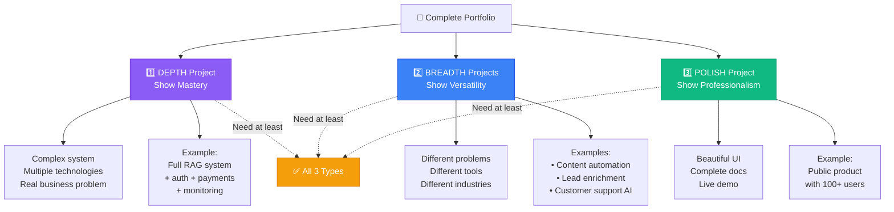
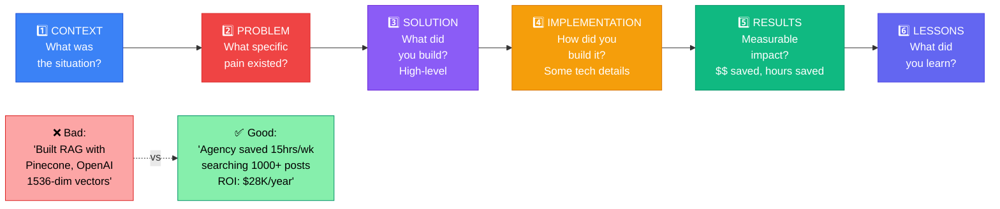

# 📘 MODULE 15: Final Portfolio Requirements

**Estimated Time:** 7-10 days
**Difficulty:** Advanced
**Prerequisites:** All previous modules (1-14)

## 📖 Overview & Why This Matters

You've completed the roadmap. You can build databases, APIs, automations, AI agents, and products. You understand security, ethics, and business. But here's the hard truth: If you can't show what you've built, none of it matters for your career.

This module is about packaging everything you've learned into a portfolio that:
- Gets you hired for $150K+ AI Operations roles
- Wins you $10K+ consulting projects
- Attracts users to your AI products
- Proves you're not just someone who took a course

The difference between "I know AI" and "I'm an AI Operator" is a portfolio of real work. Not tutorials you followed - actual systems you built that solve real problems.

By the end of this module, you'll have:
- 3-5 portfolio projects demonstrating different skills
- Case studies that tell compelling stories
- A personal website showcasing your work
- A positioning statement that differentiates you
- A plan for continuous portfolio growth

This is your capstone. Make it count.

## 🎯 Learning Objectives

By the end of this module, you will:

- [ ] Build 3-5 portfolio-worthy projects from previous modules
- [ ] Write case studies that demonstrate impact, not just features
- [ ] Create a portfolio website that showcases your work
- [ ] Position yourself clearly in the AI operations market
- [ ] Develop an effective personal brand
- [ ] Know how to present technical work to non-technical audiences
- [ ] Have a plan for getting your first clients or job

## 🧠 Core Concepts

### Portfolio vs. Resume

**Resume:** Lists what you've done
**Portfolio:** Proves you can do it

Employers and clients care about portfolios more than resumes in AI operations.

### The Three Types of Portfolio Projects



**1. Depth Projects** (Show mastery)
- One complex system
- Multiple technologies integrated
- Real business problem solved
- Example: Full RAG system with auth, payments, monitoring

**2. Breadth Projects** (Show versatility)
- Different problem types
- Different tools/approaches
- Different industries
- Example: Content automation, lead enrichment, customer support

**3. Polish Projects** (Show professionalism)
- Beautiful UI
- Complete documentation
- Live demo available
- Example: Public-facing product with 100+ users

You need at least one of each type.

### The Case Study Formula



Don't just describe what you built. Tell a story:

**1. Context** - What was the situation?
**2. Problem** - What specific pain did they have?
**3. Solution** - What did you build? (High-level, not technical details)
**4. Implementation** - How did you build it? (Some technical details)
**5. Results** - What measurable impact did it have?
**6. Lessons** - What did you learn?

**Bad Case Study:**
"I built a RAG system using Pinecone, OpenAI, and Supabase. It has 1536-dimensional vectors and uses cosine similarity for retrieval."

**Good Case Study:**
"Marketing agency was spending 15 hours/week searching through 1,000+ past blog posts to find content to repurpose. I built an AI search system that finds relevant past content in seconds. Result: Research time dropped from 15 hours to 1 hour per week. ROI: $28K/year in saved labor."

### Positioning: The "Who-What-How" Framework

Don't be generic. Be specific about:

**Who** you serve:
- Bad: "I help businesses with AI"
- Good: "I help B2B SaaS companies automate customer support"

**What** you deliver:
- Bad: "AI automation solutions"
- Good: "AI systems that reduce support tickets by 40%"

**How** you're different:
- Bad: "I use the latest AI technology"
- Good: "I specialize in RAG systems for technical documentation"

Example positioning:
"I'm an AI Operations Engineer who helps B2B SaaS companies reduce support costs by building RAG-powered customer support systems. I specialize in technical documentation and API support use cases."

### The "Show, Don't Tell" Principle

**Tell:** "I'm experienced with AI automation"
**Show:** "Built 3 production AI automations processing 10K+ operations/month"

**Tell:** "I know how to build RAG systems"
**Show:** "Deployed RAG system with 95% answer accuracy on 500+ questions"

**Tell:** "I'm a fast learner"
**Show:** "Shipped first AI product 14 days after starting this roadmap"

Always show with specifics.

### Your Online Presence Strategy

**Core Hub:** Personal website (portfolio)
**Distribution:** LinkedIn, Twitter, GitHub
**Content:** Case studies, tutorials, insights
**Goal:** Inbound leads

You want people to find you when they search for "AI automation consultant" or "AI operations engineer."

```quiz
title: Portfolio Fundamentals Quiz
questions:
- question: What are the three types of portfolio projects you need?
  options: [Personal, Professional, and Public, Depth (mastery), Breadth (versatility), and Polish (professionalism), Frontend, Backend, and Full-stack, Small, Medium, and Large]
  correct: 1
  explanation: You need at least one of each type - Depth projects show mastery of complex systems, Breadth projects show versatility across different problems, and Polish projects show professional quality with beautiful UI and complete docs.
- question: What is the most important part of a case study?
  options: [Technical architecture details, Measurable results and business impact, List of technologies used, Screenshots of the UI]
  correct: 1
  explanation: The most important part is measurable results and business impact. Don't just describe what you built - explain the problem solved and quantify the impact (hours saved, revenue generated, costs reduced).
- question: What is good positioning using the Who-What-How framework?
  options: [I help businesses with AI, I'm an AI consultant available for hire, I help B2B SaaS companies reduce support costs by 40% by building RAG-powered customer support systems, I build AI automation solutions]
  correct: 2
  explanation: Good positioning is specific about who you serve (B2B SaaS), what you deliver (reduce support costs by 40%), and how you're different (specialize in RAG-powered support systems). Generic statements don't differentiate you.
- question: According to the Show Don't Tell principle, which statement is better?
  options: [I'm experienced with AI automation, Built 3 production AI automations processing 10K+ operations/month, I'm a fast learner, I know how to build RAG systems]
  correct: 1
  explanation: Always show with specifics. "Built 3 production AI automations processing 10K+ operations/month" is concrete proof, while "I'm experienced" is just a claim anyone can make.
- question: Why are video demos 10x better than screenshots?
  options: [They look more professional, They're easier to create, People will actually watch a 2-minute video but won't read 5 pages, They use more bandwidth]
  correct: 2
  explanation: Video demos are more effective because people will watch a 2-minute Loom video but won't read 5 pages of text. Show the problem, demo the solution, show results, and quick tech overview - all in 2 minutes.
```

```task
title: Select and Document Your Portfolio Projects
description: Audit all projects you've built and select 3-5 for your portfolio using the selection matrix (score technical complexity, business impact, relevance, demo-ability, and metrics). Ensure you have at least one Depth, Breadth, and Polish project. Document why you chose each one.
xp: 10
```

```task
title: Write Three Case Studies
description: Write complete case studies for 3 portfolio projects using the provided template. Include Context, Problem, Solution, Implementation, Results with metrics, and Lessons Learned. Each case study should be 800-1200 words and tell a compelling story focused on impact, not just features.
xp: 25
```

## 🛠️ Tools Deep Dive

### Portfolio Website Builders

**Framer** (Best for designers)
- Beautiful templates
- No code required
- Fast
- $5/month
- Great for visual portfolios

**Next.js + Vercel** (Best for developers)
- Full control
- Can showcase code
- Free hosting
- Requires coding
- Most professional

**Notion** (Quickest start)
- Free
- Simple setup
- Not as professional-looking
- Good for MVP

**Webflow** (Middle ground)
- Visual builder
- Professional results
- $14/month
- Learning curve

### Case Study Tools

**Notion** (Writing)
- Write case studies
- Embed images/videos
- Can publish to web
- Free

**Loom** (Demo videos)
- Record demos
- Share links
- Free tier available
- Essential for showing, not just telling

**Figma** (Visuals)
- Create diagrams
- Design mockups
- Show workflows
- Free tier

### Personal Branding

**LinkedIn**
- Professional network
- Post insights weekly
- Share case studies
- Connect with potential clients/employers

**Twitter/X**
- AI community is here
- Build in public
- Share learnings
- Connect with other operators

**GitHub**
- Host open source code
- Show commit history
- Prove technical skills
- Important for developer jobs

## 💡 Real Business Examples

### Example 1: Portfolio That Got a $180K Job

**Background:**
Graduate of this roadmap, no prior AI experience, career changer from marketing.

**Portfolio (Built over 3 months):**

**Project 1: Personal AI Email Assistant** (Depth)
- RAG system for personal emails
- Supabase database + Pinecone vectors
- OpenAI API for generation
- Built auth, payments, monitoring
- 50+ beta users
- Tech stack showcase: Full-stack AI system

**Project 2: Content Repurposing Tool** (Breadth)
- Different domain (content vs. email)
- Make automation + Airtable
- AI generates multiple formats from one input
- Used by 3 local businesses
- Business impact showcase: Clear ROI

**Project 3: Public RAG Demo** (Polish)
- Beautiful UI
- Live demo anyone can try
- Indexed 100+ AI articles
- Shows search + generation
- Marketing showcase: Public-facing quality

**Case Studies:**
- Detailed writeups for each
- Screenshots and demo videos
- Metrics (users, performance, costs)
- Technical architecture diagrams
- Lessons learned section

**Personal Brand:**
- Posted weekly on LinkedIn about building projects
- Shared metrics and learnings openly
- Positioned as "AI automation specialist for SaaS"
- Built small following (800 people)

**Outcome:**
- Applied to 5 AI operations roles at startups
- Got 4 interviews
- Received 2 offers
- Accepted: $180K base + equity at Series B SaaS company
- Role: "AI Operations Engineer"

**What Made the Difference:**
- Portfolio showed he could actually build, not just talk
- Case studies demonstrated business impact
- Projects covered breadth of skills (data, automation, AI)
- Public building showed commitment and learning ability
- Specific positioning attracted right companies

### Example 2: Portfolio That Won $50K in Consulting

**Background:**
Completed roadmap while working full-time, wanted to start consulting side business.

**Portfolio (Built over 2 months):**

**Project 1: Consulting Case Study** (Real client)
- Helped local law firm automate document intake
- Built Make workflow + OpenAI classification
- Reduced intake time from 2 hours to 15 minutes
- Saved firm $40K/year in paralegal time
- Included client testimonial

**Project 2: Open Source Tool** (GitHub)
- Built "RAG starter kit" others could use
- 200+ GitHub stars
- Demonstrated thought leadership
- Showed ability to build reusable systems

**Project 3: Industry Analysis** (Content)
- Researched AI adoption in legal industry
- Published detailed report on LinkedIn
- 10K+ views
- Positioned as legal AI expert

**Distribution Strategy:**
- Posted case study on LinkedIn
- Shared in legal tech forums
- Reached out to 20 law firms with personalized message
- Referenced portfolio in every outreach

**Outcome:**
- 6 discovery calls booked
- 3 proposals sent
- 2 projects won
- Total: $50K in first 3 months
- Projects: Document automation for law firms

**What Made the Difference:**
- Ultra-specific niche (legal AI)
- Real results with metrics ($40K saved)
- Credibility (GitHub stars, published content)
- Targeted outreach to right audience
- Portfolio matched target client needs perfectly

### Example 3: Portfolio That Launched a Product

**Background:**
Wanted to build SaaS product, used portfolio to validate and attract first users.

**Strategy: Build in Public**

**Week 1-2:**
- Tweeted: "Building AI email responder for freelancers"
- Shared daily progress
- Asked for feedback

**Week 3:**
- Launched MVP
- Shared on Twitter, Indie Hackers, Product Hunt
- Portfolio was the product itself

**Week 4-8:**
- Shared metrics openly (users, revenue, costs)
- Wrote case studies of early users
- Improved product based on feedback

**Portfolio:**
- Live product (not demo)
- Metrics dashboard (public)
- Case studies from real users
- Behind-the-scenes blog posts
- Technical architecture write-ups

**Outcome:**
- Launch day: 200 signups
- Month 1: 50 paying users, $750 MRR
- Month 3: 200 paying users, $3K MRR
- Month 6: 500 users, $8K MRR

**What Made the Difference:**
- Portfolio WAS the product
- Building in public created audience
- Transparent metrics built trust
- Real user case studies proved value
- Content attracted SEO traffic

```quiz
title: Portfolio Success Strategies Quiz
questions:
- question: In Example 1 (Portfolio That Got $180K Job), what made the candidate stand out?
  options: [Having a PhD in AI, Years of experience, Portfolio showed he could actually build with case studies demonstrating business impact, plus specific positioning, Expensive certifications, Working at a big tech company]
  correct: 2
  explanation: The portfolio proved ability with real projects, case studies showed business impact with metrics, projects covered breadth of skills, public building showed learning ability, and specific positioning attracted right companies.
- question: In Example 2 (Won $50K in Consulting), what was the key to success?
  options: [Lowest prices, Ultra-specific niche (legal AI) with real results, metrics, credibility, and targeted outreach, Working 80 hours per week, Having the most features]
  correct: 1
  explanation: Success came from ultra-specific positioning (legal AI), real client results with metrics ($40K saved), credibility (GitHub stars, published content), and targeted outreach to the right audience. The portfolio matched target client needs perfectly.
- question: What is the Three Projects Rule?
  options: [You need 3 projects minimum, You need exactly 3 projects total, You don't need 20 projects - you need 3 really good ones (Impressive, Relevant, Accessible), You should delete old projects every 3 months, Build 3 projects per month]
  correct: 2
  explanation: Quality over quantity. You need 3 really good projects - one that's technically impressive, one that's relevant to what you want to do next, and one that's accessible (anyone can understand and try).
- question: How should you maximize value from each portfolio project?
  options: [Just add it to your website, Turn one project into case study, LinkedIn post, Twitter thread, tutorial, YouTube video, and GitHub repo, Only share it on LinkedIn, Keep it private to make it exclusive]
  correct: 1
  explanation: One good project can become multiple content pieces - case study on website, LinkedIn post, Twitter thread, tutorial blog post, YouTube walkthrough, and GitHub repo. This maximizes reach and demonstrates expertise.
- question: What should every portfolio page include to make it easy to hire you?
  options: [Just your project descriptions, Your resume in PDF format, Clear call-to-action, email/Calendly link, rough pricing/process, and fast response time, Long autobiography, List of all technologies you know]
  correct: 2
  explanation: Make it easy to hire you with clear CTAs, easy contact methods (email/Calendly), transparent pricing or process, and commitment to fast response. Don't make people hunt for how to work with you.
```

```task
title: Create Demo Videos for Your Projects
description: Record 2-minute Loom demo videos for at least 3 portfolio projects. Follow the structure - show the problem (15 sec), demo the solution (60 sec), show results (30 sec), quick tech overview (15 sec). Upload to Loom or YouTube and embed in your portfolio.
xp: 15
```

```task
title: Build Your Portfolio Website
description: Create a professional portfolio website with at least 3 projects, case studies, about section, and contact information. Use Next.js + Vercel, Framer, Webflow, or Notion. Deploy to a custom domain. Ensure it's mobile responsive and loads fast. Include analytics tracking.
xp: 25
```

```task
title: Optimize Your LinkedIn Profile
description: Update your LinkedIn to showcase your portfolio. Update headline with clear positioning, write compelling About section, add portfolio projects to Experience/Featured, include links to live demos and case studies. Write and publish a launch post about your portfolio with key projects and metrics.
xp: 10
```

```task
title: Launch Your Portfolio Publicly
description: Announce your portfolio across multiple channels. Write LinkedIn post with project highlights, create Twitter thread showcasing your work, post in relevant communities (Indie Hackers, Reddit), and email your network. Track engagement and respond to all comments. Aim for 100+ views in first week.
xp: 15
```

```task
title: Create Your Positioning Statement
description: Write a clear positioning statement using the Who-What-How framework. Define who you serve (specific industry/company size), what you deliver (specific outcomes with metrics), and how you're different (specialization/approach). Test it with 3 people to ensure it's clear and compelling.
xp: 10
```

## ⚠️ Common Pitfalls

### 1. **Tutorial Projects**
❌ "I followed a YouTube tutorial and built exactly what they showed"
✅ "I built this to solve a specific problem I identified"

### 2. **No Metrics**
❌ "Built a content automation system"
✅ "Built system that generates 50 posts/week, saving 15 hours"

### 3. **Too Technical**
❌ "Implemented RAG using 1536-dimensional embeddings with cosine similarity"
✅ "Built AI search that finds answers in company docs instantly"

### 4. **No Live Demos**
❌ Screenshots and description only
✅ Live demo anyone can try

### 5. **Generic Positioning**
❌ "AI consultant available for hire"
✅ "I build AI customer support systems for B2B SaaS"

### 6. **Outdated Portfolio**
❌ Projects from 2 years ago, nothing recent
✅ At least one project from last 3 months

### 7. **No Business Context**
❌ Lists features built
✅ Explains problem solved and impact

## ✨ Pro Tips

### Tip 1: The "Three Projects" Rule

You don't need 20 projects. You need 3 really good ones:

1. **Impressive** - Shows technical depth
2. **Relevant** - Matches what you want to do next
3. **Accessible** - Anyone can understand and try

Quality over quantity.

### Tip 2: Video Demos Are 10x Better Than Screenshots

Record 2-minute Loom video:
1. Show the problem (15 seconds)
2. Demo the solution (60 seconds)
3. Show the results (30 seconds)
4. Quick tech overview (15 seconds)

People will actually watch. They won't read 5 pages.

### Tip 3: Use Your Portfolio Projects as Content

One good project →
- Case study on your website
- LinkedIn post
- Twitter thread
- Tutorial blog post
- YouTube walkthrough
- GitHub repo

Maximize value from each project.

### Tip 4: Get Testimonials Early

After every project, ask:
```
"I'm building my portfolio. Would you mind writing a short testimonial?

Specifically:
- What problem did this solve?
- What was the result?
- Would you recommend me?"
```

Send them a draft to make it easy.

### Tip 5: Make It Easy to Hire You

Every portfolio page should have:
- Clear call-to-action
- Email or calendly link
- Rough pricing or process
- Fast response time

Don't make people hunt for how to work with you.

### Tip 6: Update Your Portfolio Before Job Hunting

Trying to get hired?
- Update portfolio week before applying
- Add project relevant to target role
- Tailor case studies to their problems
- Add metrics they care about

Fresh portfolio = serious candidate.

### Tip 7: Your Portfolio Is Never Done

Schedule quarterly:
- Add new project
- Remove outdated ones
- Update metrics
- Refresh positioning

Portfolio is living document.

## 📝 Module Project: Build Your Complete Portfolio

### Objective

Create a complete professional portfolio showcasing 3-5 projects, with case studies, demos, and clear positioning.

### Week 1: Project Selection & Planning

**Task 1: Audit Your Work (Day 1)**

List everything you've built during this roadmap:

```markdown
## Module Projects Completed

Module 4 (Interface Tools):
- [ ] Content pipeline (Airtable + Notion + Sheets)

Module 5 (Data Layer):
- [ ] RAG knowledge base (Supabase + Pinecone)

Module 6 (Automation):
- [ ] Multi-channel AI content system (Make + OpenAI)

Module 7 (APIs):
- [ ] Webhook integration hub

Module 8 (RAG & Agents):
- [ ] AI research assistant agent

Module 9 (Payments):
- [ ] SaaS with Stripe + Auth

Module 11 (Product):
- [ ] 14-day product launch

Module 12 (Consulting):
- [ ] Consulting project (if completed)

Other projects:
- [ ] [Any additional work]
```

**Task 2: Select Portfolio Projects (Day 1)**

Choose 3-5 projects using these criteria:

**Selection Matrix:**
```
For each project, score 1-10:
- Technical complexity: ___
- Business impact: ___
- Relevance to goals: ___
- Can demo easily: ___
- Have metrics: ___

Total: ___

Choose top 3-5 total scores
```

**Ensure Coverage:**
- [ ] At least one shows AI/ML depth (RAG, agents)
- [ ] At least one shows automation (workflows)
- [ ] At least one shows full-stack (database + API + frontend)
- [ ] At least one has real users or client
- [ ] At least one is visually impressive

**Task 3: Define Your Positioning (Day 2)**

**Who do you serve?**
```
Industry: [e.g., B2B SaaS, E-commerce, Professional Services]
Company size: [e.g., 10-500 employees, startups, enterprise]
Role: [e.g., founders, marketing teams, ops teams]
```

**What problem do you solve?**
```
Primary: [e.g., Support costs too high]
Secondary: [e.g., Content production bottleneck]
```

**How are you different?**
```
Specialization: [e.g., RAG systems, workflow automation]
Experience: [e.g., Built X systems, worked with Y companies]
Approach: [e.g., Ship in 2 weeks, focus on ROI]
```

**Your Positioning Statement:**
```
I help [target audience] solve [specific problem] by [your approach/specialization].

Example:
"I help B2B SaaS companies reduce support costs by 40% by building custom RAG-powered AI support systems."
```

### Week 2: Project Enhancement & Documentation

**Task: Enhance Each Project (Days 3-9)**

For each portfolio project, complete:

**1. Clean Up Code/System**
```
- [ ] Remove hardcoded values
- [ ] Add environment variables
- [ ] Write clear README
- [ ] Add comments to complex parts
- [ ] Test all functionality
- [ ] Fix any bugs
```

**2. Make It Demoable**
```
- [ ] Deploy to public URL (Vercel, Railway, etc.)
- [ ] Create demo account/data
- [ ] Record 2-min Loom demo video
- [ ] Take high-quality screenshots
- [ ] Create architecture diagram
```

**3. Gather Metrics**
```
- [ ] Users (if applicable)
- [ ] Performance (response time, uptime)
- [ ] Cost (AI API usage, hosting)
- [ ] Business impact (time saved, revenue generated)
- [ ] Technical stats (tokens processed, accuracy rate)
```

**4. Get Testimonial** (if project had users/client)
```
- [ ] Draft testimonial request
- [ ] Send to user/client
- [ ] Follow up if needed
- [ ] Get approval to use
```

### Week 3: Case Study Writing

**Task: Write Case Studies (Days 10-14)**

For each project, create case study:

**Template:**

```markdown
# [Project Name]

## Quick Stats
- **Impact:** [Main metric, e.g., "40% reduction in support time"]
- **Tech:** [Main technologies, e.g., "OpenAI GPT-4, Pinecone, Supabase"]
- **Timeline:** [How long to build]
- **Status:** [Live with X users / Client project / Personal tool]

## The Problem

[2-3 paragraphs explaining the context and specific pain point]

**Example:**
"Marketing agencies are drowning in content demands. Clients expect 50+ social posts per week across multiple platforms. Traditional approach: 20 hours/week of manual work. Hire more people or turn down clients. Neither option is good.

The specific pain: Repurposing one blog post into 10 social posts takes 2 hours. Most of that time is spent reformatting, not creating new ideas. AI could help, but existing tools produce generic outputs that don't match brand voice.

Opportunity: Build AI system that learns each client's voice and automatically repurposes content while maintaining quality."

## The Solution

[High-level overview - what did you build?]

**Example:**
"Built an AI content repurposing engine that takes one piece of content and generates brand-voice-matched versions for every platform.

Key features:
- Learns brand voice from 3-5 sample posts
- Generates 10+ platform-specific versions from one input
- Maintains tone, style, and key messaging
- Editable outputs with one-click regeneration
- Batch processing for multiple pieces"

## How It Works

[Technical details - but accessible]

**Example:**
"Technical Architecture:
1. Input: User pastes blog post or article
2. Analysis: GPT-4 extracts key points and themes
3. Voice Learning: System references client's past content (stored as embeddings in Pinecone)
4. Generation: For each platform, AI generates version matching:
   - Platform constraints (character limits)
   - Client voice patterns
   - Best practices for that platform
5. Output: Presents all versions in Airtable for review/editing

Built with:
- OpenAI GPT-4 for generation
- Pinecone for brand voice examples
- Make for workflow orchestration
- Airtable as interface
- Costs ~$0.05 per repurposing session"

## Results

[Measurable outcomes]

**Example:**
"After 30 days of use:
- Time per repurposing: 2 hours → 15 minutes (87% reduction)
- Weekly time saved per client: 15 hours
- Client capacity: Increased from 5 to 12 clients (same team size)
- Output quality: 92% of AI-generated posts used with minimal editing
- ROI: $28K/year saved in labor costs
- Client feedback: 'This changed our business. We can't go back.'"

## Lessons Learned

[What you learned technically and about the problem]

**Example:**
"Technical:
- Voice learning works better with examples than instructions
- Platform-specific prompts >>> one generic prompt
- Editable outputs crucial - no AI is perfect first try

Business:
- Agencies value time savings over cost savings
- Quality control is non-negotiable
- Easy to use > powerful features

What I'd do differently:
- Add Slack integration from day one
- Build analytics dashboard sooner
- Price based on value (time saved) not usage"

## Live Demo

[Link to demo, video, or screenshots]

**Example:**
"🎥 Watch 2-minute demo: [Loom link]
🔗 Try it yourself: [Demo link]
📸 Screenshots: [Image gallery]
📐 Architecture: [Diagram]"

## Tech Stack

- Frontend: [if applicable]
- Backend: [if applicable]
- AI: [models used]
- Data: [databases, vector stores]
- Automation: [Make, Zapier, etc.]
- Hosting: [where deployed]

## Testimonial

[If you have one]

**Example:**
> "This tool saves us 15 hours per week. We've been able to take on 7 more clients without hiring. The ROI is incredible."
>
> — Sarah Johnson, Founder, ContentScale Agency
```

**Deliverable:** 3-5 complete case studies

### Week 4: Portfolio Website

**Task: Build Portfolio Site (Days 15-21)**

**Day 15-16: Choose Platform & Setup**

Recommended: Next.js + Vercel (free, professional)

Alternative: Framer (fastest, $5/month)

**Site Structure:**
```
Home
├── Hero (name, positioning, CTA)
├── About (your story, briefly)
├── Projects (grid of 3-5 projects)
├── Contact (email, calendly, social)

/projects/[project-name]
└── Full case study

/about (optional)
└── Longer story, skills, experience

/blog (optional, recommended)
└── Share learnings
```

**Day 17-18: Build Home Page**

**Hero Section:**
```jsx
<Hero>
  <h1>AI Operations Engineer</h1>
  <p>I help B2B SaaS companies reduce support costs by 40% with custom RAG systems</p>
  <CTA>
    <Button href="/projects">View Work</Button>
    <Button href="mailto:you@email.com">Get In Touch</Button>
  </CTA>
</Hero>
```

**Projects Grid:**
```jsx
<Projects>
  {projects.map(project => (
    <ProjectCard
      title={project.title}
      description={project.oneLineSummary}
      image={project.thumbnail}
      metrics={project.keyMetric}
      link={`/projects/${project.slug}`}
    />
  ))}
</Projects>
```

**Day 19-20: Create Project Pages**

For each project:
- Import case study content
- Add demo video embed
- Add screenshots gallery
- Add architecture diagram
- Add tech stack badges
- Add CTA ("Want something similar?")

**Day 21: Polish & Deploy**

```
- [ ] Add analytics (PostHog or Google Analytics)
- [ ] Test all links
- [ ] Mobile responsive check
- [ ] Load time optimization
- [ ] SEO basics (meta tags, descriptions)
- [ ] Deploy to custom domain
```

**Recommended Domain:**
```
yourname.com (if available)
yourname.dev (developer focus)
yourname.ai (AI focus)
```

**Deploy to Vercel:**
```bash
npm install -g vercel
vercel
# Follow prompts
# Connect domain
```

**Deliverable:** Live portfolio website

### Week 5: Distribution & Promotion

**Task: Get Your Portfolio Seen (Days 22-25)**

**Day 22: LinkedIn Optimization**

**Update Profile:**
```
Headline: "AI Operations Engineer | Building RAG systems & automation for B2B SaaS"

About: [Your positioning + brief story + CTA]

Experience:
- Add "AI Operations Engineer - Freelance" (if consulting)
- Add "Founder - [Your Product]" (if building product)
- Brief description + link to portfolio

Featured:
- Link to portfolio
- Link to best case study
- Link to demo video
```

**Day 23: Launch Post**

```markdown
Excited to share my AI operations portfolio 🚀

Over the past [X months], I've built:

1. [Project 1 name] - [One-line impact]
2. [Project 2 name] - [One-line impact]
3. [Project 3 name] - [One-line impact]

Key learning: [One interesting insight]

Check it out: [portfolio link]

Currently open for: [consulting/full-time/projects]

#AIOperations #Automation #RAG [relevant hashtags]
```

**Day 24: Twitter Thread**

```
1/ Just launched my AI operations portfolio after completing @AIAcademy

Here's what I built and what I learned 🧵

2/ Project 1: [Name]
[Screenshot]
Built [technology] to solve [problem]
Result: [metric]

3/ Project 2: [Name]
[Screenshot]
[Description]
Result: [metric]

[Continue for each project]

Final/ Portfolio link: [URL]

What I learned: [key insight]

Happy to answer questions about any of these projects!
```

**Day 25: Apply/Outreach**

**If seeking employment:**
```
1. Find 10 companies hiring AI operations roles
2. Research each company's AI use
3. Tailor cover letter referencing relevant portfolio project
4. Apply with link to portfolio prominently featured
5. Follow up one week later
```

**If seeking clients:**
```
1. List 20 potential clients in your niche
2. Research their current process/pain points
3. Personalized email:

"Hi [Name],

I noticed [company] is [specific observation about their situation].

I specialize in [your niche] - recently built [relevant project]
that [result for similar company].

Would a 15-minute call to discuss your [specific process] make sense?

Portfolio: [link]

Best,
[Your name]"
```

**Day 26-28: Content Creation**

Start building audience:

**Blog Post Ideas:**
- "How I Built [Project]" (technical walkthrough)
- "What I Learned Building 5 AI Projects"
- "The Complete Guide to [Specific Technology]"
- "X Mistakes to Avoid When Building AI Systems"

Publish on:
- Your blog
- Dev.to
- Medium
- LinkedIn Articles

Goal: Establish expertise, attract inbound leads.

**Deliverable:** Portfolio promoted across channels

### Success Criteria

✅ 3-5 high-quality portfolio projects documented
✅ Each project has case study with metrics and demo
✅ Professional portfolio website live on custom domain
✅ Clear positioning and target audience defined
✅ LinkedIn profile optimized with portfolio link
✅ Launched portfolio publicly (LinkedIn, Twitter)
✅ Started outreach (job applications or client prospecting)
✅ Plan for ongoing portfolio updates and content

## 📚 Resources & Next Steps

### Recommended Reading
- "Show Your Work" by Austin Kleon
- "Building a StoryBrand" by Donald Miller
- Portfolio examples: dribbble.com, read.cv

### Tools & Links
- Framer (https://framer.com) - Portfolio builder
- Vercel (https://vercel.com) - Hosting
- Loom (https://loom.com) - Demo videos
- Calendly (https://calendly.com) - Scheduling

### What's Next?

**You've completed the AI Operator Roadmap! Here's what to do next:**

**Month 1-3: Execute & Iterate**
- Ship more projects
- Get first clients/job
- Update portfolio monthly
- Share learnings publicly

**Month 4-6: Scale & Specialize**
- Double down on what works
- Deepen specialization
- Build reputation in niche
- Create content consistently

**Month 7-12: Establish & Expand**
- Become known in your niche
- Premium pricing/roles
- Mentor others
- Consider teaching/course

**The Journey Continues:**
AI is constantly evolving. Successful operators:
- Never stop learning
- Ship consistently
- Build in public
- Help others

You're not done. You're just getting started.

## ✅ Final Checklist

Congratulations on completing the AI Operator Roadmap! Before you close this chapter, verify:

- [ ] I have 3-5 portfolio projects with real metrics
- [ ] Each project has a compelling case study
- [ ] My portfolio website is live and looks professional
- [ ] I have clear positioning (who I serve, what I deliver)
- [ ] My LinkedIn/Twitter profiles link to portfolio
- [ ] I've launched my portfolio publicly
- [ ] I have a plan for getting clients or job offers
- [ ] I know how to continue learning and growing

**You are now a professional AI Operator. Go build amazing things.**
